# Research-LLM factor comparison — `2024-11`

Comparing the **factor output of different research LLMs** on three axes (raw factor quality → factors as ML features → factors through the full agentic fund). The panel, IS/OOS split, horizon and model hyper-parameters are held identical across preruns — the *only* variable is the factor set.

## Preruns compared

| prerun | research_model | usable_factors | dropped_factors |
| --- | --- | --- | --- |
| gpt4omini120650 | gpt-4o-mini | 66 | 0 |
| gpt5.4mini120650 | gpt-5.4-mini | 69 | 0 |
| main | seed library | 78 | 10 |

> Dropped factors declare fields the current data doesn't have yet (e.g. fundamentals); they light up unchanged once that data is downloaded.

*Usable vs awaiting-data factors per research model*

## Key findings

- **Best ML-combined OOS Sharpe:** `main` with `lightgbm` (OOS Sharpe = 7.514).
- **Mean OOS Sharpe across models, by research set:** `main` = 3.994, `gpt4omini120650` = 0.851, `gpt5.4mini120650` = -3.469.
- **Highest mean single-factor |IC| (h=6):** `main` (mean |IC| = 0.0122).
- **Most diverse zoo (highest effective/raw factor ratio):** `gpt5.4mini120650` (eff 53.5 of 69, ratio 0.78).
- **Best selection-deflated single-factor |IC|:** `main` (deflated |IC| = 0.0179 from 38 factors tried).

## 1. Single-factor IC (raw factor quality)

Per-underlying time-series Spearman rank-IC of every researched factor, recomputed on the shared panel at horizons h=1, h=6, h=60. The per-underlying IC correlates each factor's value vector with the underlying's own forward-return vector (pooled across underlyings); the cross-sectional IC ranks across underlyings per timestamp.

| prerun | n_factors | mean_abs_ic_1 | mean_abs_ic_6 | mean_abs_ic_60 | mean_abs_icir_6 | best_factor_h6 | best_abs_ic_h6 |
| --- | --- | --- | --- | --- | --- | --- | --- |
| gpt4omini120650 | 66 | 0.0051 | 0.0062 | 0.0054 | 0.3788 | order_flow_reversal_signal | 0.0184 |
| gpt5.4mini120650 | 69 | 0.0037 | 0.0065 | 0.0057 | 0.3822 | multiscale_liquidity_leadlag_reversal | 0.0186 |
| main | 78 | 0.0126 | 0.0122 | 0.0046 | 0.7642 | rsi_mean_reversion | 0.025 |

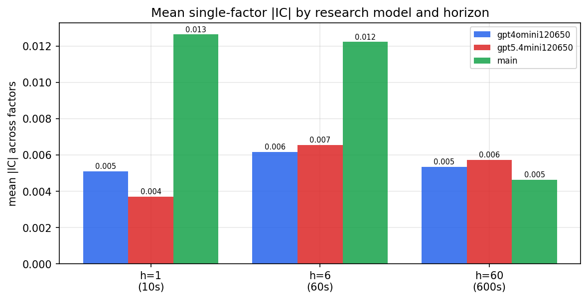

*Mean |IC| by research model and horizon*

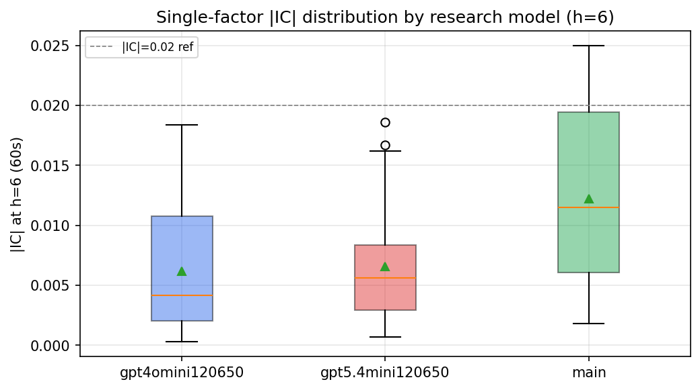

*Per-factor |IC| distribution by research model*

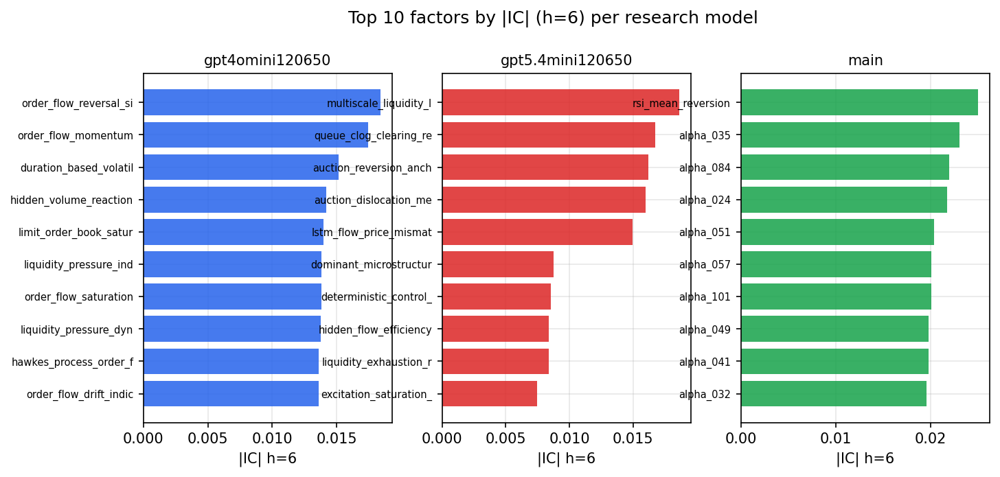

*Top factors by |IC| per research model*

## 2. Factor diversity & redundancy

Pairwise correlation of each zoo's *signals*. `eff_n_factors` is the effective number of independent factors (participation ratio of the correlation eigenvalues); `eff_ratio` and `redundancy` summarise how much unique information the zoo holds vs. how much is duplicated; `n_clusters` groups factors at |corr| ≥ 0.7.

| prerun | n_factors | eff_n_factors | eff_ratio | mean_abs_corr | n_clusters | redundancy |
| --- | --- | --- | --- | --- | --- | --- |
| gpt4omini120650 | 66 | 27.664 | 0.4192 | 0.0511 | 52 | 0.5808 |
| gpt5.4mini120650 | 69 | 53.4887 | 0.7752 | 0.0109 | 64 | 0.2248 |
| main | 78 | 43.1097 | 0.5527 | 0.028 | 69 | 0.4473 |

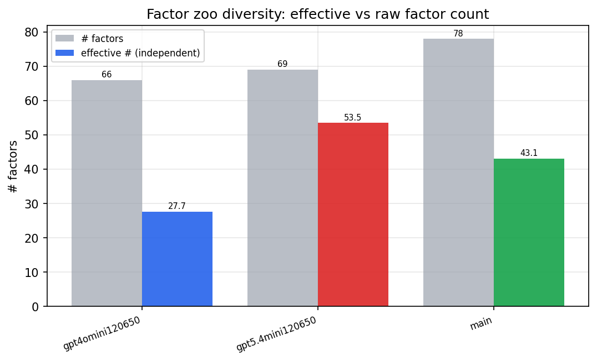

*Effective vs raw factor count per research model*

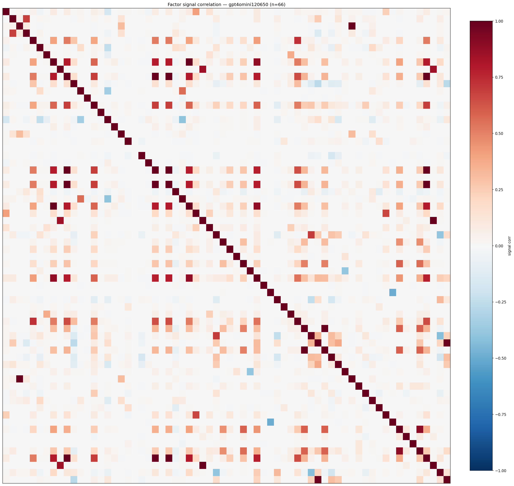

*Signal correlation matrix — gpt4omini120650*

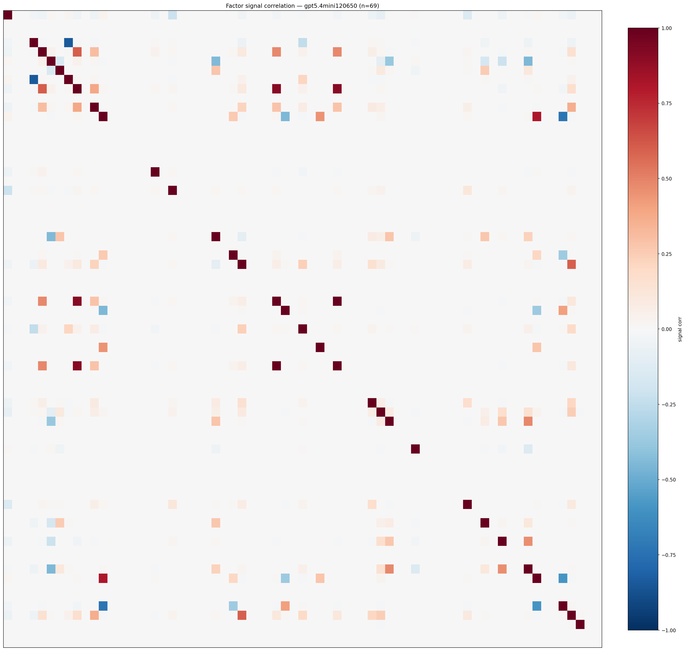

*Signal correlation matrix — gpt5.4mini120650*

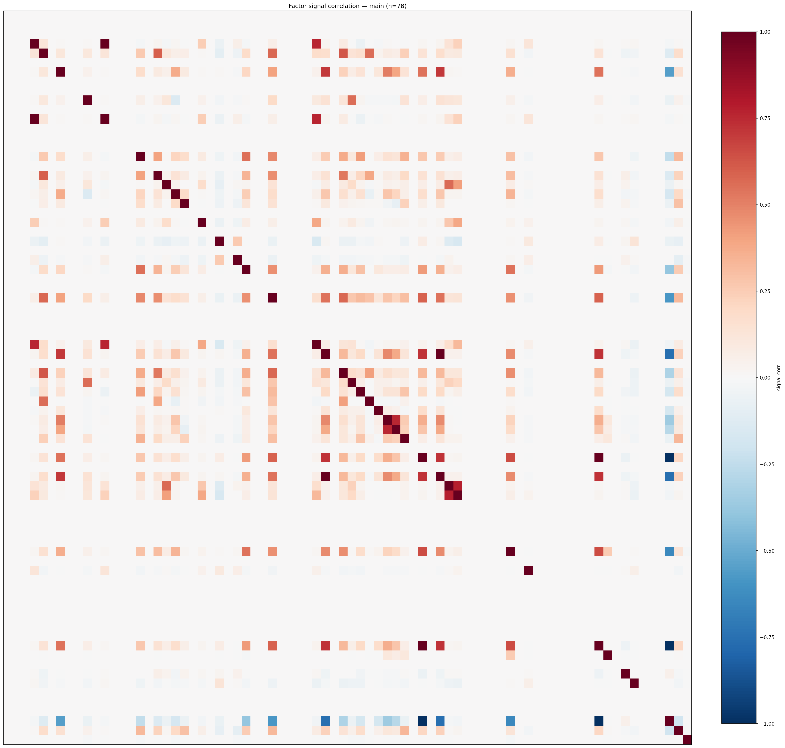

*Signal correlation matrix — main*

## 3. Deflation & model-based importance

`deflated_best_ic` haircuts each zoo's best |IC| for the number of factors tried (`ic_n_tested`) — a bigger zoo's best factor is more likely to be lucky. `lasso_n_nonzero` / `lasso_sparsity` show how many factors a sparse linear model actually keeps (model-view redundancy).

| prerun | best_ic | deflated_best_ic | deflated_best_t | ic_n_tested | ic_n_obs | lasso_n_nonzero | lasso_sparsity |
| --- | --- | --- | --- | --- | --- | --- | --- |
| gpt4omini120650 | 0.0184 | 0.0108 | 4.0979 | 64 | 143998 | 0 | 1.0 |
| gpt5.4mini120650 | 0.0186 | 0.0117 | 4.4479 | 31 | 143998 | 0 | 1.0 |
| main | 0.025 | 0.0179 | 6.7788 | 38 | 143998 | 0 | 1.0 |

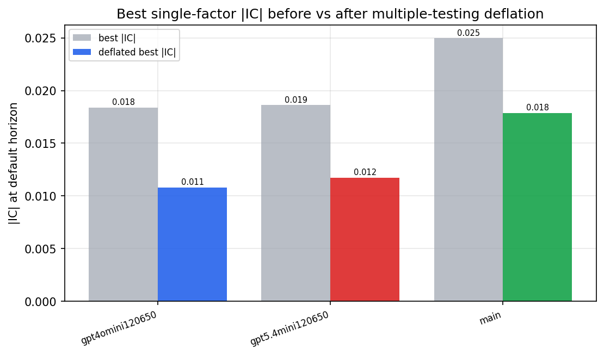

*Best |IC| before vs after multiple-testing deflation*

*Top factors by lasso importance per zoo*

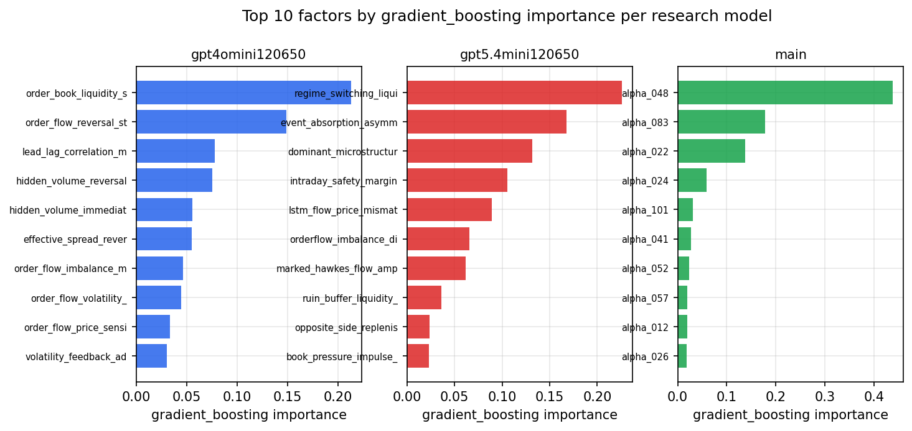

*Top factors by gradient_boosting importance per zoo*

## 4. ML-combined signal — per-underlying vectorised backtest

Each model combines a prerun's factors into ONE signal (fit `factors → forward return` on IS, predict per (bar, underlying)), then that combined signal is run through a simple vectorised backtest — `position(signal) × the underlying's own forward return` — on the held-out OOS tail (+ an equal-weight ensemble). No cross-sectional ranking.

> Config: position=**threshold** (t=1.0, z-score `expanding`), aggregation=**portfolio**, fit-standardise=**per_underlying**, horizon=6.

| prerun | model | n_factors_used | oos_ic | oos_sharpe | is_sharpe | oos_ann_return | oos_max_drawdown |
| --- | --- | --- | --- | --- | --- | --- | --- |
| gpt4omini120650 | linear_regression | 66 | -0.0109 | 2.7594 | 6.8588 | 0.1429 | -0.0054 |
| gpt4omini120650 | ridge | 66 | -0.0073 | 2.7891 | 6.8435 | 0.1454 | -0.0056 |
| gpt4omini120650 | lasso | 66 | nan | nan | nan | nan | nan |
| gpt4omini120650 | elastic_net | 66 | nan | nan | nan | nan | nan |
| gpt4omini120650 | random_forest | 66 | 0.0003 | -2.9822 | 9.9004 | -0.3084 | -0.0334 |
| gpt4omini120650 | gradient_boosting | 66 | 0.0021 | -1.4699 | 10.0767 | -0.0593 | -0.0087 |
| gpt4omini120650 | xgboost | 66 | -0.0098 | 2.3083 | 12.6648 | 0.2234 | -0.0193 |
| gpt4omini120650 | lightgbm | 66 | 0.0056 | 0.5862 | 16.6958 | 0.0628 | -0.024 |
| gpt4omini120650 | ensemble | 66 | -0.0049 | 1.9664 | 12.5981 | 0.2232 | -0.0221 |
| gpt5.4mini120650 | linear_regression | 69 | 0.0032 | -2.0267 | 5.6316 | -0.1078 | -0.0171 |
| gpt5.4mini120650 | ridge | 69 | 0.0031 | -2.6294 | 5.6596 | -0.1363 | -0.0157 |
| gpt5.4mini120650 | lasso | 69 | nan | nan | nan | nan | nan |
| gpt5.4mini120650 | elastic_net | 69 | nan | nan | nan | nan | nan |
| gpt5.4mini120650 | random_forest | 69 | -0.0014 | -3.8518 | 9.2825 | -0.3692 | -0.0347 |
| gpt5.4mini120650 | gradient_boosting | 69 | -0.0009 | -3.5205 | 9.521 | -0.2397 | -0.024 |
| gpt5.4mini120650 | xgboost | 69 | -0.0014 | -6.78 | 11.1203 | -0.8195 | -0.0706 |
| gpt5.4mini120650 | lightgbm | 69 | -0.0063 | -6.3619 | 16.4035 | -0.6606 | -0.0527 |
| gpt5.4mini120650 | ensemble | 69 | -0.0006 | 0.8879 | 6.477 | 0.0118 | -0.0017 |
| main | linear_regression | 78 | 0.0112 | 3.2844 | 5.6936 | 0.2217 | -0.0142 |
| main | ridge | 78 | 0.0123 | 3.9435 | 6.6688 | 0.2204 | -0.0127 |
| main | lasso | 78 | nan | nan | nan | nan | nan |
| main | elastic_net | 78 | nan | nan | nan | nan | nan |
| main | random_forest | 78 | 0.0012 | 3.4355 | 10.7842 | 0.4252 | -0.026 |
| main | gradient_boosting | 78 | -0.0133 | 0.1672 | 7.0416 | 0.0026 | -0.0042 |
| main | xgboost | 78 | -0.0021 | 4.4511 | 7.8213 | 0.3318 | -0.0062 |
| main | lightgbm | 78 | 0.0079 | 7.5138 | 15.925 | 0.4614 | -0.0059 |
| main | ensemble | 78 | 0.0017 | 5.1654 | 9.0403 | 0.4503 | -0.0055 |

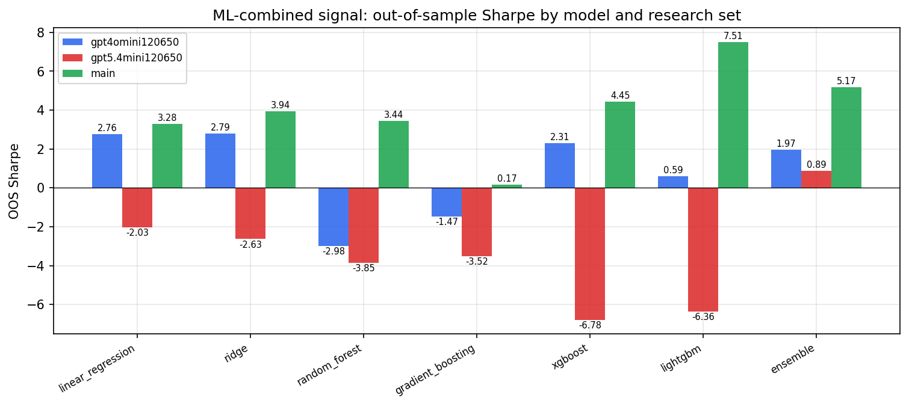

*ML-combined OOS Sharpe by model and research set*

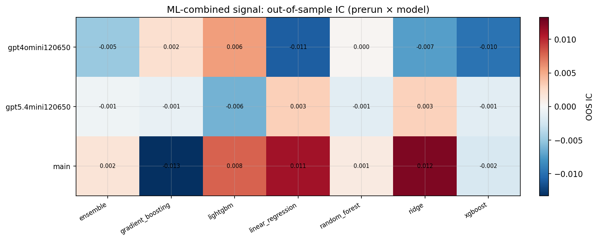

*ML-combined OOS IC (prerun × model)*

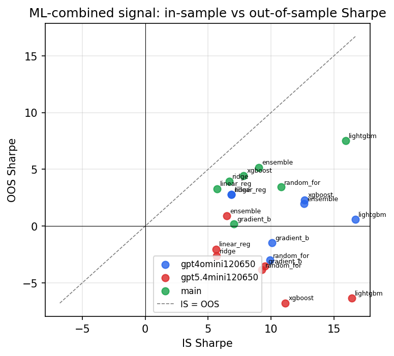

*IS vs OOS Sharpe (overfitting diagnostic)*

---
*Generated by `run_model_comparison.py`. Tables: `*.csv`; interactive: `comparison.ipynb`.*
