# Research-LLM factor comparison — `2024-12`

Comparing the **factor output of different research LLMs** on three axes (raw factor quality → factors as ML features → factors through the full agentic fund). The panel, IS/OOS split, horizon and model hyper-parameters are held identical across preruns — the *only* variable is the factor set.

## Preruns compared

| prerun | research_model | usable_factors | dropped_factors |
| --- | --- | --- | --- |
| gpt4omini120650 | gpt-4o-mini | 66 | 0 |
| gpt5.4mini120650 | gpt-5.4-mini | 69 | 0 |
| main | seed library | 78 | 10 |

> Dropped factors declare fields the current data doesn't have yet (e.g. fundamentals); they light up unchanged once that data is downloaded.

*Usable vs awaiting-data factors per research model*

## Key findings

- **Best ML-combined OOS Sharpe:** `main` with `ensemble` (OOS Sharpe = 2.983).
- **Mean OOS Sharpe across models, by research set:** `main` = -0.015, `gpt4omini120650` = -3.635, `gpt5.4mini120650` = -4.010.
- **Highest mean single-factor |IC| (h=6):** `main` (mean |IC| = 0.0122).
- **Most diverse zoo (highest effective/raw factor ratio):** `gpt5.4mini120650` (eff 54.3 of 69, ratio 0.79).
- **Best selection-deflated single-factor |IC|:** `main` (deflated |IC| = 0.0159 from 38 factors tried).

## 1. Single-factor IC (raw factor quality)

Per-underlying time-series Spearman rank-IC of every researched factor, recomputed on the shared panel at horizons h=1, h=6, h=60. The per-underlying IC correlates each factor's value vector with the underlying's own forward-return vector (pooled across underlyings); the cross-sectional IC ranks across underlyings per timestamp.

| prerun | n_factors | mean_abs_ic_1 | mean_abs_ic_6 | mean_abs_ic_60 | mean_abs_icir_6 | best_factor_h6 | best_abs_ic_h6 |
| --- | --- | --- | --- | --- | --- | --- | --- |
| gpt4omini120650 | 66 | 0.0057 | 0.0058 | 0.0043 | 0.3359 | liquidity_provisioning_fee_chasing | 0.0157 |
| gpt5.4mini120650 | 69 | 0.0043 | 0.0062 | 0.0084 | 0.3405 | multiscale_liquidity_leadlag_reversal | 0.0226 |
| main | 78 | 0.0151 | 0.0122 | 0.006 | 0.7752 | rsi_mean_reversion | 0.0229 |

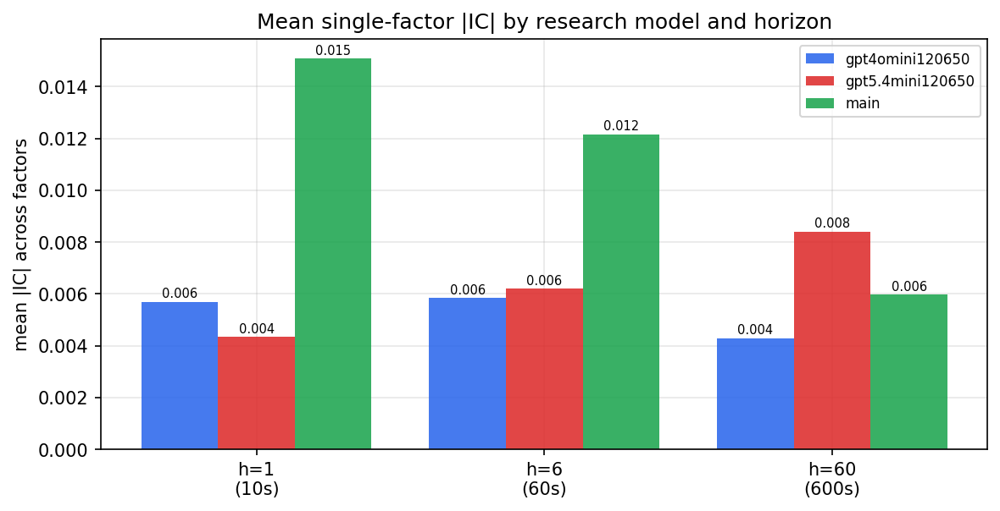

*Mean |IC| by research model and horizon*

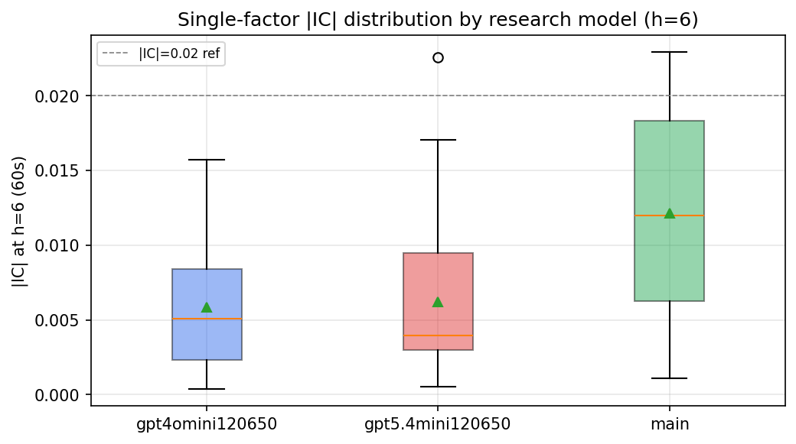

*Per-factor |IC| distribution by research model*

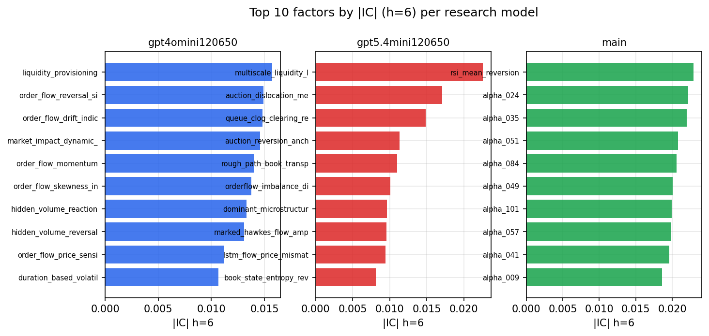

*Top factors by |IC| per research model*

## 2. Factor diversity & redundancy

Pairwise correlation of each zoo's *signals*. `eff_n_factors` is the effective number of independent factors (participation ratio of the correlation eigenvalues); `eff_ratio` and `redundancy` summarise how much unique information the zoo holds vs. how much is duplicated; `n_clusters` groups factors at |corr| ≥ 0.7.

| prerun | n_factors | eff_n_factors | eff_ratio | mean_abs_corr | n_clusters | redundancy |
| --- | --- | --- | --- | --- | --- | --- |
| gpt4omini120650 | 66 | 28.4027 | 0.4303 | 0.0485 | 52 | 0.5697 |
| gpt5.4mini120650 | 69 | 54.2779 | 0.7866 | 0.0114 | 64 | 0.2134 |
| main | 78 | 43.0733 | 0.5522 | 0.0282 | 70 | 0.4478 |

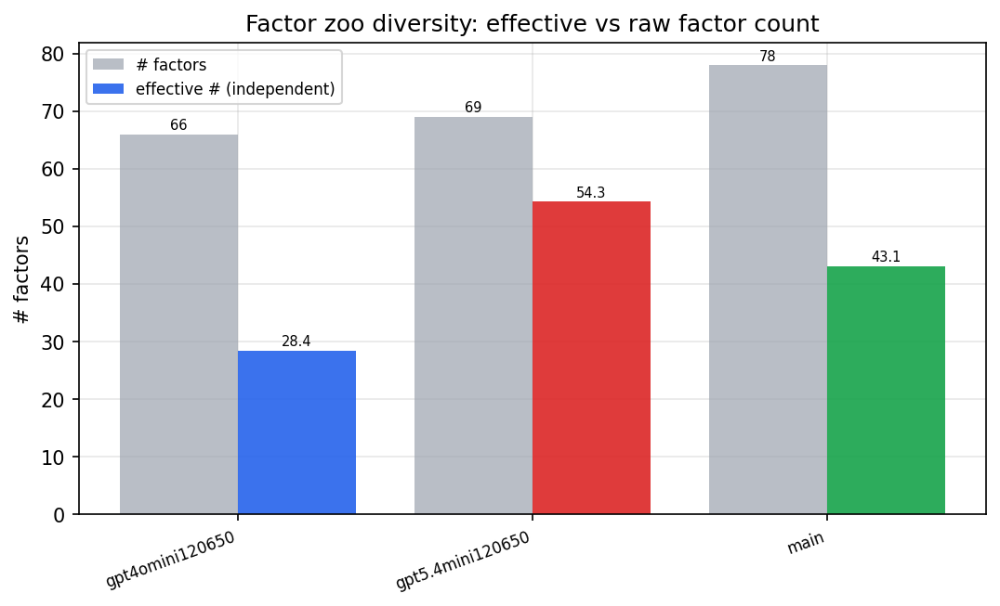

*Effective vs raw factor count per research model*

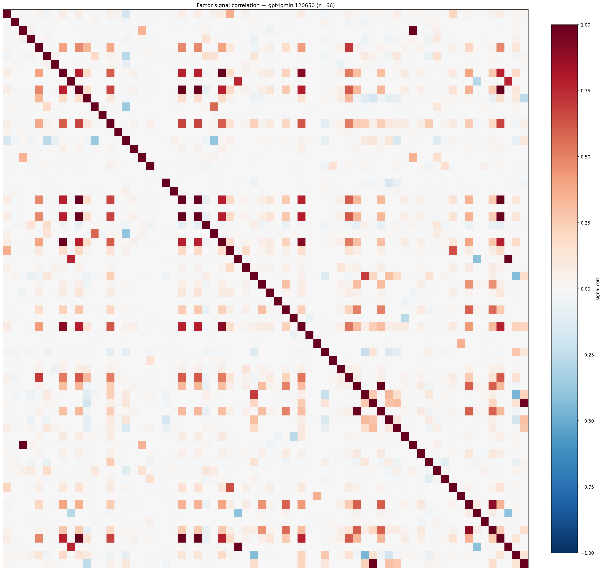

*Signal correlation matrix — gpt4omini120650*

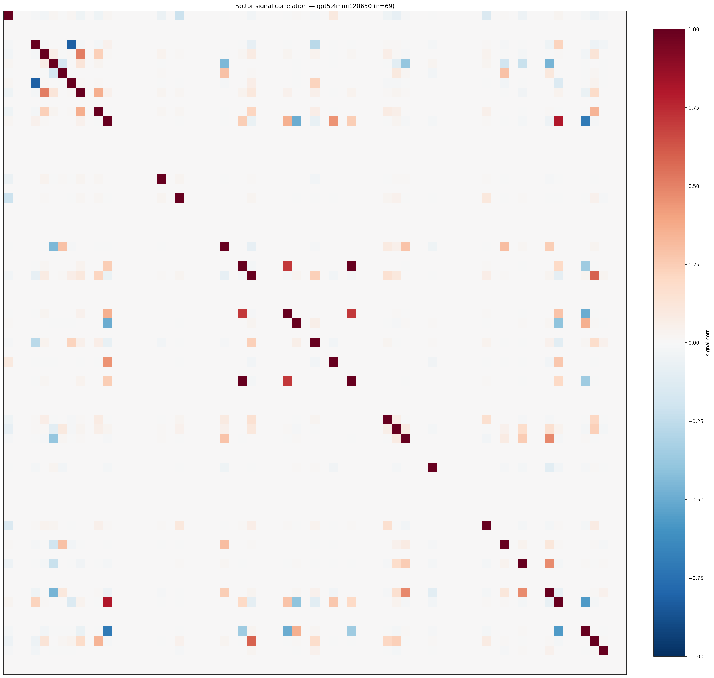

*Signal correlation matrix — gpt5.4mini120650*

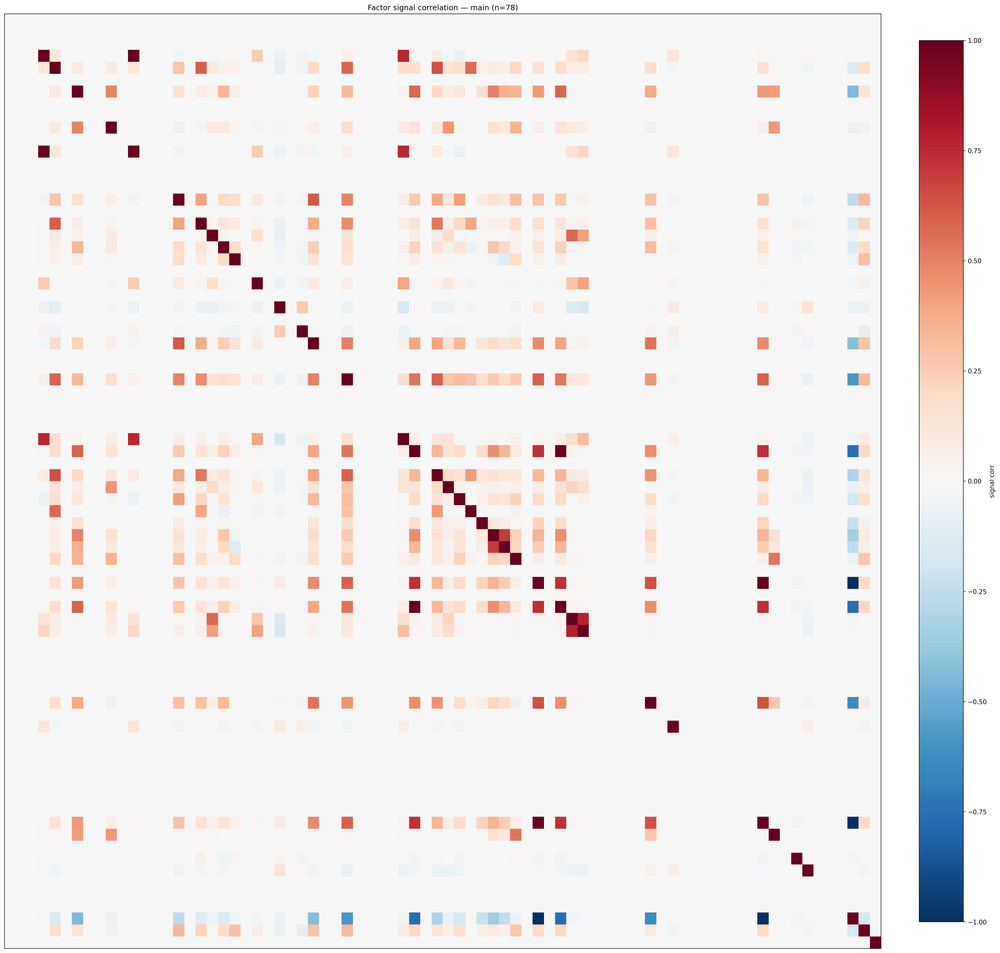

*Signal correlation matrix — main*

## 3. Deflation & model-based importance

`deflated_best_ic` haircuts each zoo's best |IC| for the number of factors tried (`ic_n_tested`) — a bigger zoo's best factor is more likely to be lucky. `lasso_n_nonzero` / `lasso_sparsity` show how many factors a sparse linear model actually keeps (model-view redundancy).

| prerun | best_ic | deflated_best_ic | deflated_best_t | ic_n_tested | ic_n_obs | lasso_n_nonzero | lasso_sparsity |
| --- | --- | --- | --- | --- | --- | --- | --- |
| gpt4omini120650 | 0.0157 | 0.0082 | 3.1574 | 64 | 147599 | 0 | 1.0 |
| gpt5.4mini120650 | 0.0226 | 0.0158 | 6.054 | 31 | 147599 | 2 | 0.971 |
| main | 0.0229 | 0.0159 | 6.1069 | 38 | 147599 | 0 | 1.0 |

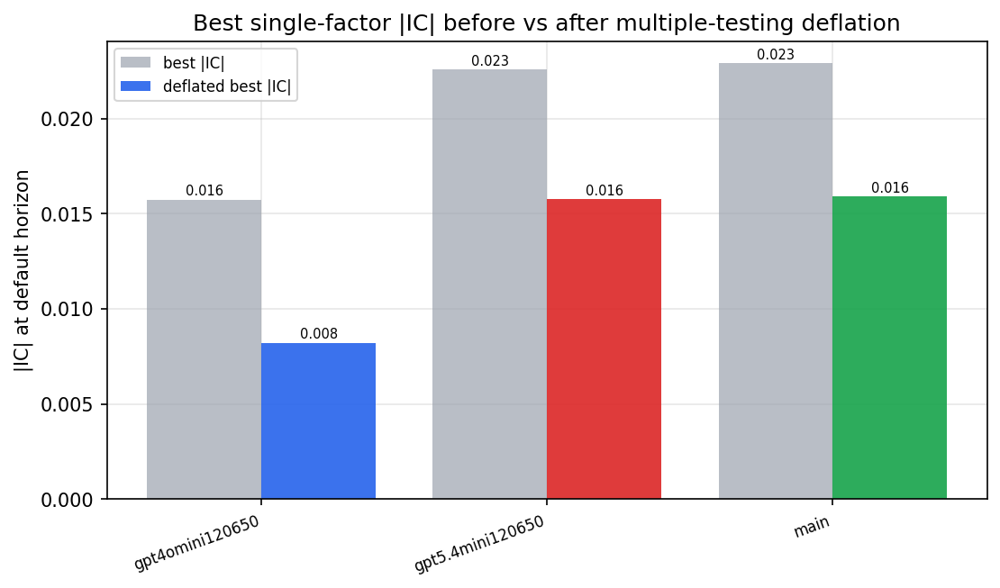

*Best |IC| before vs after multiple-testing deflation*

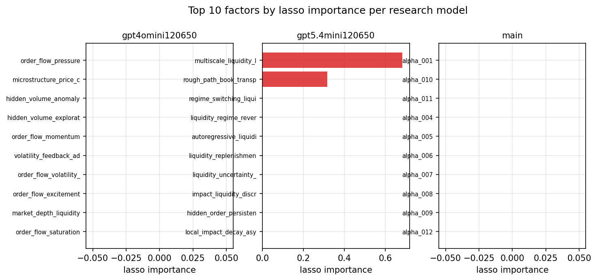

*Top factors by lasso importance per zoo*

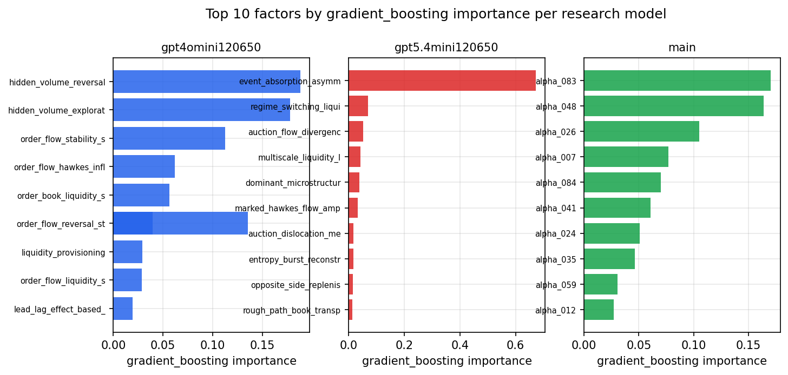

*Top factors by gradient_boosting importance per zoo*

## 4. ML-combined signal — per-underlying vectorised backtest

Each model combines a prerun's factors into ONE signal (fit `factors → forward return` on IS, predict per (bar, underlying)), then that combined signal is run through a simple vectorised backtest — `position(signal) × the underlying's own forward return` — on the held-out OOS tail (+ an equal-weight ensemble). No cross-sectional ranking.

> Config: position=**threshold** (t=1.0, z-score `expanding`), aggregation=**portfolio**, fit-standardise=**per_underlying**, horizon=6.

| prerun | model | n_factors_used | oos_ic | oos_sharpe | is_sharpe | oos_ann_return | oos_max_drawdown |
| --- | --- | --- | --- | --- | --- | --- | --- |
| gpt4omini120650 | linear_regression | 66 | 0.0059 | -2.095 | 4.3276 | -0.2256 | -0.0309 |
| gpt4omini120650 | ridge | 66 | 0.0061 | -2.5514 | 4.4495 | -0.2879 | -0.0305 |
| gpt4omini120650 | lasso | 66 | nan | nan | nan | nan | nan |
| gpt4omini120650 | elastic_net | 66 | nan | nan | nan | nan | nan |
| gpt4omini120650 | random_forest | 66 | -0.0115 | -4.8575 | 6.882 | -0.3128 | -0.0291 |
| gpt4omini120650 | gradient_boosting | 66 | 0.0128 | -5.393 | 7.5259 | -0.1335 | -0.0122 |
| gpt4omini120650 | xgboost | 66 | -0.0098 | -4.545 | 8.7346 | -0.2652 | -0.022 |
| gpt4omini120650 | lightgbm | 66 | -0.0042 | -3.0403 | 12.9129 | -0.13 | -0.0119 |
| gpt4omini120650 | ensemble | 66 | 0.0062 | -2.9604 | 9.7727 | -0.2537 | -0.0241 |
| gpt5.4mini120650 | linear_regression | 69 | 0.0004 | -6.5605 | 2.2824 | -0.3097 | -0.0254 |
| gpt5.4mini120650 | ridge | 69 | 0.0004 | -6.9918 | 2.416 | -0.3299 | -0.0268 |
| gpt5.4mini120650 | lasso | 69 | nan | nan | -0.1693 | nan | nan |
| gpt5.4mini120650 | elastic_net | 69 | nan | nan | -0.1693 | nan | nan |
| gpt5.4mini120650 | random_forest | 69 | 0.0072 | -5.0312 | 6.3047 | -0.2381 | -0.0201 |
| gpt5.4mini120650 | gradient_boosting | 69 | -0.0059 | -3.606 | 6.8354 | -0.0822 | -0.0078 |
| gpt5.4mini120650 | xgboost | 69 | 0.0039 | -3.3429 | 6.9773 | -0.1426 | -0.0181 |
| gpt5.4mini120650 | lightgbm | 69 | 0.0005 | 0.8287 | 12.2497 | 0.024 | -0.0068 |
| gpt5.4mini120650 | ensemble | 69 | 0.0029 | -3.3631 | 7.6443 | -0.1547 | -0.0158 |
| main | linear_regression | 78 | 0.0036 | -0.0798 | 9.4068 | -0.0061 | -0.0209 |
| main | ridge | 78 | 0.0046 | -0.0614 | 9.0139 | -0.0049 | -0.0242 |
| main | lasso | 78 | nan | nan | nan | nan | nan |
| main | elastic_net | 78 | nan | nan | nan | nan | nan |
| main | random_forest | 78 | -0.0001 | 2.1081 | 8.2483 | 0.1135 | -0.0113 |
| main | gradient_boosting | 78 | -0.0016 | -5.3687 | 6.6135 | -0.0702 | -0.0064 |
| main | xgboost | 78 | -0.0005 | 1.3886 | 9.2152 | 0.0381 | -0.0068 |
| main | lightgbm | 78 | 0.0001 | -1.073 | 12.8835 | -0.0293 | -0.007 |
| main | ensemble | 78 | 0.0029 | 2.9834 | 11.3449 | 0.1704 | -0.0138 |

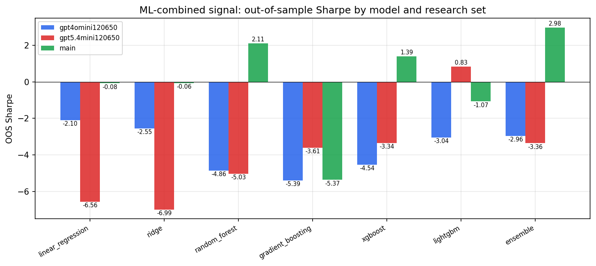

*ML-combined OOS Sharpe by model and research set*

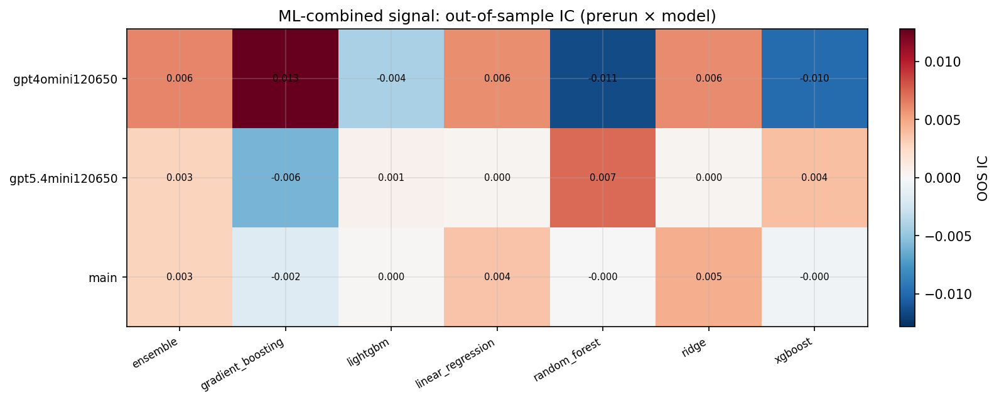

*ML-combined OOS IC (prerun × model)*

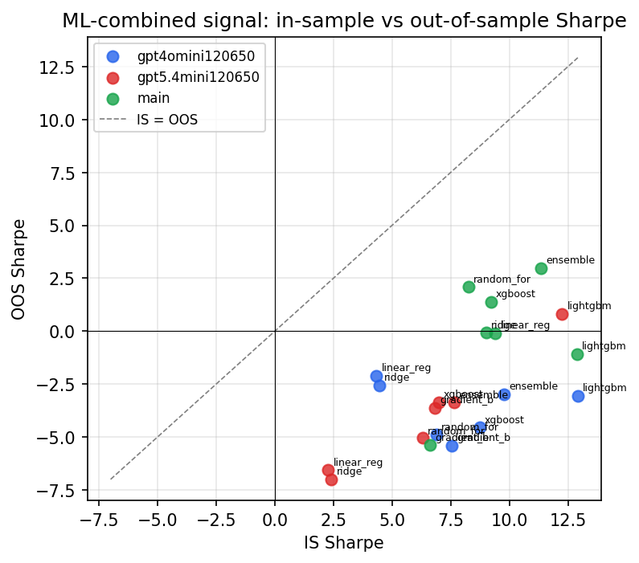

*IS vs OOS Sharpe (overfitting diagnostic)*

---
*Generated by `run_model_comparison.py`. Tables: `*.csv`; interactive: `comparison.ipynb`.*
