# Research-LLM factor comparison — `2025-01`

Comparing the **factor output of different research LLMs** on three axes (raw factor quality → factors as ML features → factors through the full agentic fund). The panel, IS/OOS split, horizon and model hyper-parameters are held identical across preruns — the *only* variable is the factor set.

## Preruns compared

| prerun | research_model | usable_factors | dropped_factors |
| --- | --- | --- | --- |
| gpt4omini120650 | gpt-4o-mini | 66 | 0 |
| gpt5.4mini120650 | gpt-5.4-mini | 69 | 0 |
| main | seed library | 78 | 10 |

> Dropped factors declare fields the current data doesn't have yet (e.g. fundamentals); they light up unchanged once that data is downloaded.

*Usable vs awaiting-data factors per research model*

## Key findings

- **Best ML-combined OOS Sharpe:** `main` with `linear_regression` (OOS Sharpe = 8.505).
- **Mean OOS Sharpe across models, by research set:** `main` = 5.315, `gpt4omini120650` = 3.322, `gpt5.4mini120650` = -3.619.
- **Highest mean single-factor |IC| (h=6):** `main` (mean |IC| = 0.0078).
- **Most diverse zoo (highest effective/raw factor ratio):** `gpt5.4mini120650` (eff 53.8 of 69, ratio 0.78).
- **Best selection-deflated single-factor |IC|:** `main` (deflated |IC| = 0.0103 from 38 factors tried).

## 1. Single-factor IC (raw factor quality)

Per-underlying time-series Spearman rank-IC of every researched factor, recomputed on the shared panel at horizons h=1, h=6, h=60. The per-underlying IC correlates each factor's value vector with the underlying's own forward-return vector (pooled across underlyings); the cross-sectional IC ranks across underlyings per timestamp.

| prerun | n_factors | mean_abs_ic_1 | mean_abs_ic_6 | mean_abs_ic_60 | mean_abs_icir_6 | best_factor_h6 | best_abs_ic_h6 |
| --- | --- | --- | --- | --- | --- | --- | --- |
| gpt4omini120650 | 66 | 0.0036 | 0.0045 | 0.0058 | 0.3201 | limit_order_book_imbalance_surge | 0.0135 |
| gpt5.4mini120650 | 69 | 0.0036 | 0.0049 | 0.0082 | 0.3431 | orderflow_imbalance_divergence | 0.0134 |
| main | 78 | 0.0108 | 0.0078 | 0.0033 | 0.5231 | alpha_024 | 0.0175 |

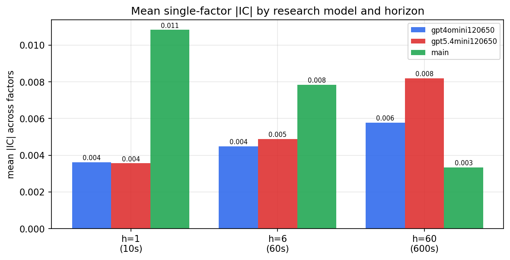

*Mean |IC| by research model and horizon*

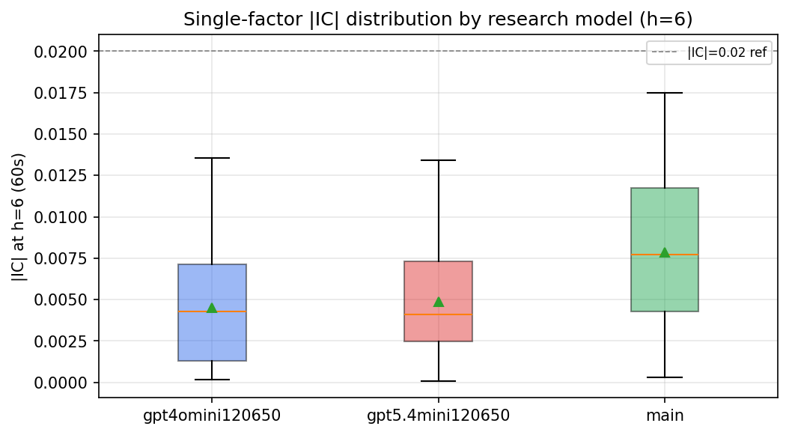

*Per-factor |IC| distribution by research model*

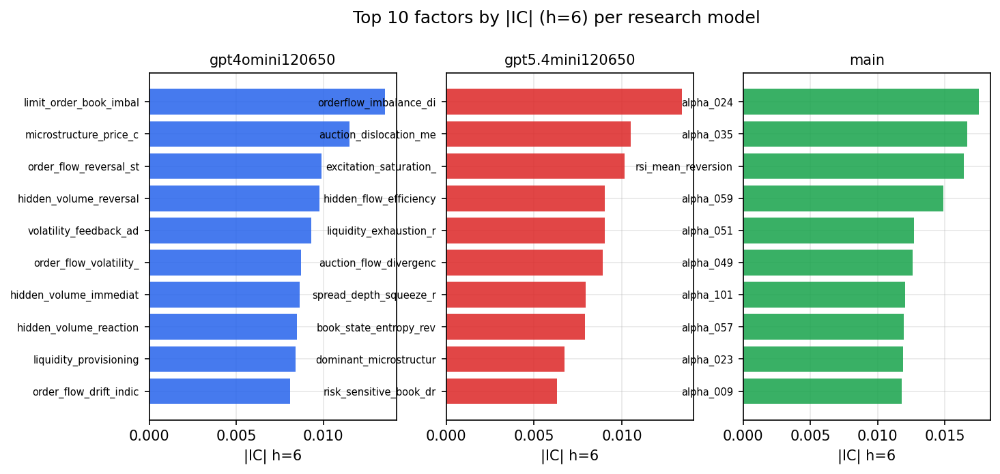

*Top factors by |IC| per research model*

## 2. Factor diversity & redundancy

Pairwise correlation of each zoo's *signals*. `eff_n_factors` is the effective number of independent factors (participation ratio of the correlation eigenvalues); `eff_ratio` and `redundancy` summarise how much unique information the zoo holds vs. how much is duplicated; `n_clusters` groups factors at |corr| ≥ 0.7.

| prerun | n_factors | eff_n_factors | eff_ratio | mean_abs_corr | n_clusters | redundancy |
| --- | --- | --- | --- | --- | --- | --- |
| gpt4omini120650 | 66 | 27.488 | 0.4165 | 0.0505 | 51 | 0.5835 |
| gpt5.4mini120650 | 69 | 53.7914 | 0.7796 | 0.0109 | 64 | 0.2204 |
| main | 78 | 43.4148 | 0.5566 | 0.0277 | 71 | 0.4434 |

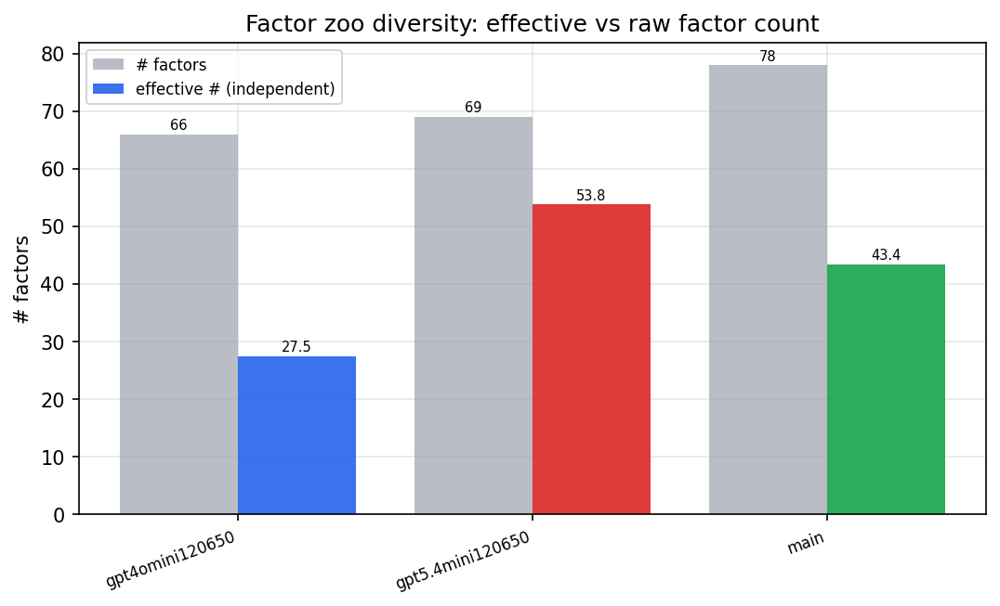

*Effective vs raw factor count per research model*

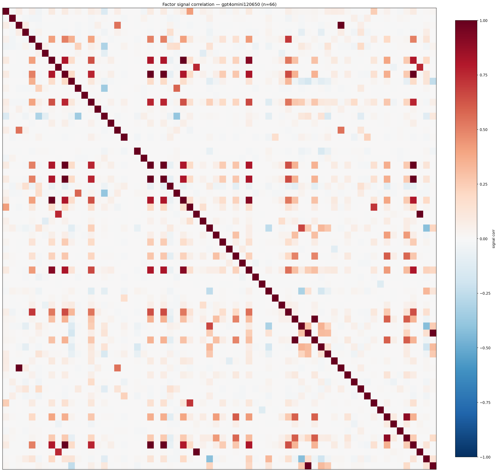

*Signal correlation matrix — gpt4omini120650*

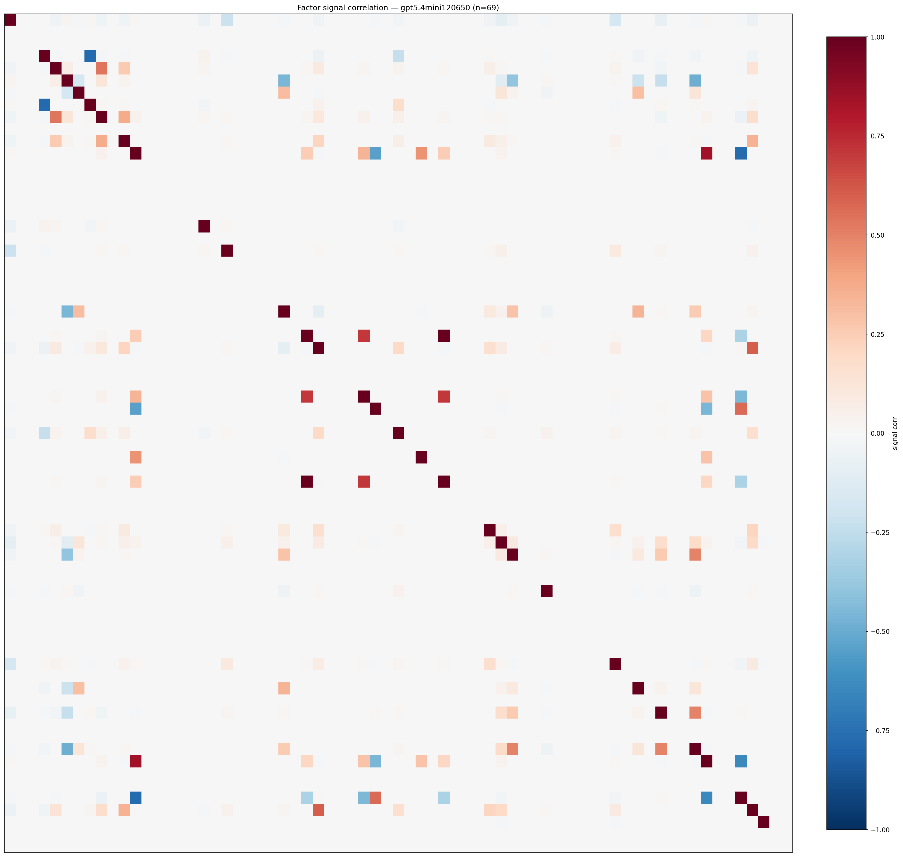

*Signal correlation matrix — gpt5.4mini120650*

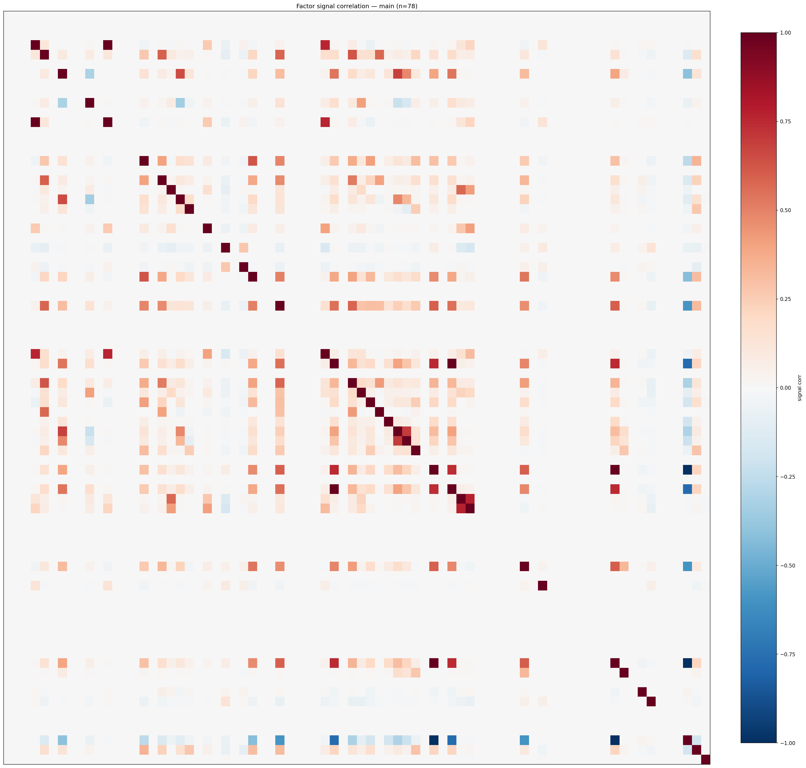

*Signal correlation matrix — main*

## 3. Deflation & model-based importance

`deflated_best_ic` haircuts each zoo's best |IC| for the number of factors tried (`ic_n_tested`) — a bigger zoo's best factor is more likely to be lucky. `lasso_n_nonzero` / `lasso_sparsity` show how many factors a sparse linear model actually keeps (model-view redundancy).

| prerun | best_ic | deflated_best_ic | deflated_best_t | ic_n_tested | ic_n_obs | lasso_n_nonzero | lasso_sparsity |
| --- | --- | --- | --- | --- | --- | --- | --- |
| gpt4omini120650 | 0.0135 | 0.0058 | 2.1889 | 64 | 140579 | 0 | 1.0 |
| gpt5.4mini120650 | 0.0134 | 0.0064 | 2.4057 | 31 | 140579 | 0 | 1.0 |
| main | 0.0175 | 0.0103 | 3.8622 | 38 | 140579 | 7 | 0.9103 |

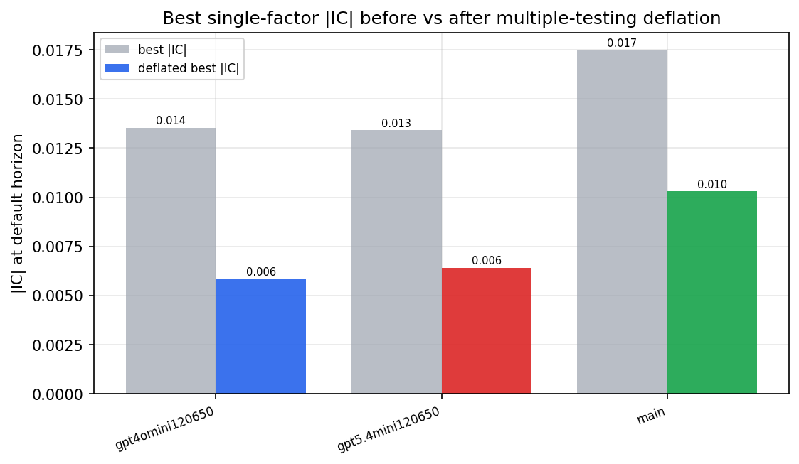

*Best |IC| before vs after multiple-testing deflation*

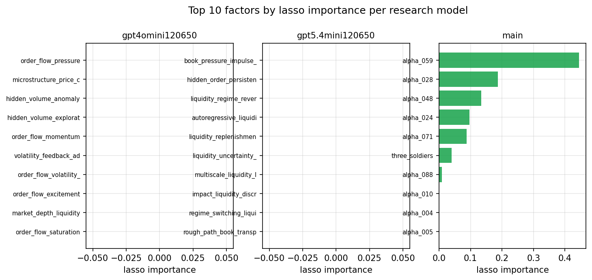

*Top factors by lasso importance per zoo*

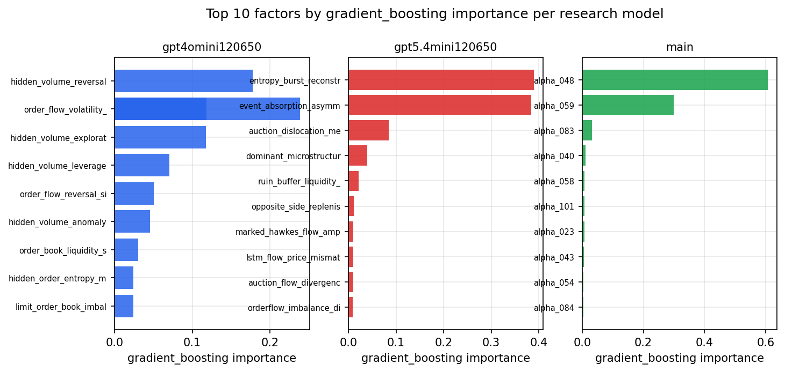

*Top factors by gradient_boosting importance per zoo*

## 4. ML-combined signal — per-underlying vectorised backtest

Each model combines a prerun's factors into ONE signal (fit `factors → forward return` on IS, predict per (bar, underlying)), then that combined signal is run through a simple vectorised backtest — `position(signal) × the underlying's own forward return` — on the held-out OOS tail (+ an equal-weight ensemble). No cross-sectional ranking.

> Config: position=**threshold** (t=1.0, z-score `expanding`), aggregation=**portfolio**, fit-standardise=**per_underlying**, horizon=6.

| prerun | model | n_factors_used | oos_ic | oos_sharpe | is_sharpe | oos_ann_return | oos_max_drawdown |
| --- | --- | --- | --- | --- | --- | --- | --- |
| gpt4omini120650 | linear_regression | 66 | 0.0158 | 5.3832 | 9.3328 | 1.0394 | -0.0167 |
| gpt4omini120650 | ridge | 66 | 0.0162 | 5.6138 | 8.8382 | 1.0815 | -0.0161 |
| gpt4omini120650 | lasso | 66 | nan | nan | nan | nan | nan |
| gpt4omini120650 | elastic_net | 66 | nan | nan | nan | nan | nan |
| gpt4omini120650 | random_forest | 66 | 0.0154 | 4.7034 | 12.6005 | 1.0713 | -0.0299 |
| gpt4omini120650 | gradient_boosting | 66 | 0.0122 | -4.4648 | 10.9586 | -0.3937 | -0.0476 |
| gpt4omini120650 | xgboost | 66 | 0.0137 | 6.0456 | 12.5579 | 0.9141 | -0.0184 |
| gpt4omini120650 | lightgbm | 66 | 0.0098 | 1.092 | 15.7987 | 0.0818 | -0.0264 |
| gpt4omini120650 | ensemble | 66 | 0.0157 | 4.8831 | 14.6354 | 0.912 | -0.0235 |
| gpt5.4mini120650 | linear_regression | 69 | 0.006 | -2.2431 | 4.1265 | -0.2429 | -0.0505 |
| gpt5.4mini120650 | ridge | 69 | 0.0062 | -1.8111 | 4.3393 | -0.1956 | -0.0468 |
| gpt5.4mini120650 | lasso | 69 | nan | nan | nan | nan | nan |
| gpt5.4mini120650 | elastic_net | 69 | nan | nan | nan | nan | nan |
| gpt5.4mini120650 | random_forest | 69 | 0.0086 | -2.4078 | 11.6223 | -0.1718 | -0.0275 |
| gpt5.4mini120650 | gradient_boosting | 69 | -0.0008 | -0.9385 | 9.5952 | -0.0298 | -0.009 |
| gpt5.4mini120650 | xgboost | 69 | 0.0106 | -6.9315 | 9.6835 | -0.4813 | -0.0426 |
| gpt5.4mini120650 | lightgbm | 69 | 0.0106 | -5.5054 | 14.6971 | -0.3228 | -0.0295 |
| gpt5.4mini120650 | ensemble | 69 | 0.0046 | -5.4989 | 10.5652 | -0.4295 | -0.0398 |
| main | linear_regression | 78 | 0.0054 | 8.5055 | 9.8216 | 0.9378 | -0.0128 |
| main | ridge | 78 | 0.0065 | 6.7503 | 9.3421 | 0.7181 | -0.0143 |
| main | lasso | 78 | 0.0067 | 5.1807 | 7.0322 | 0.394 | -0.0104 |
| main | elastic_net | 78 | 0.0067 | 5.1186 | 6.8863 | 0.3892 | -0.0111 |
| main | random_forest | 78 | 0.0122 | 3.7635 | 14.1984 | 0.6824 | -0.0183 |
| main | gradient_boosting | 78 | 0.0086 | 4.1931 | 13.0656 | 0.6189 | -0.0198 |
| main | xgboost | 78 | 0.0152 | 4.8402 | 15.2742 | 0.5352 | -0.0099 |
| main | lightgbm | 78 | 0.0181 | 2.7124 | 18.095 | 0.3237 | -0.0196 |
| main | ensemble | 78 | 0.0114 | 6.7681 | 14.572 | 0.8622 | -0.0146 |

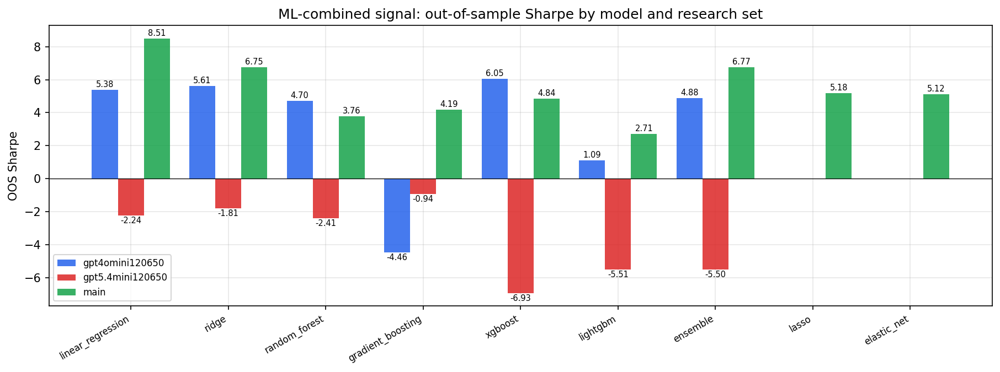

*ML-combined OOS Sharpe by model and research set*

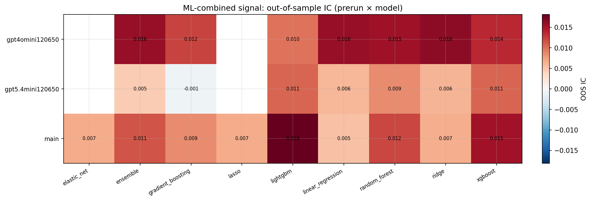

*ML-combined OOS IC (prerun × model)*

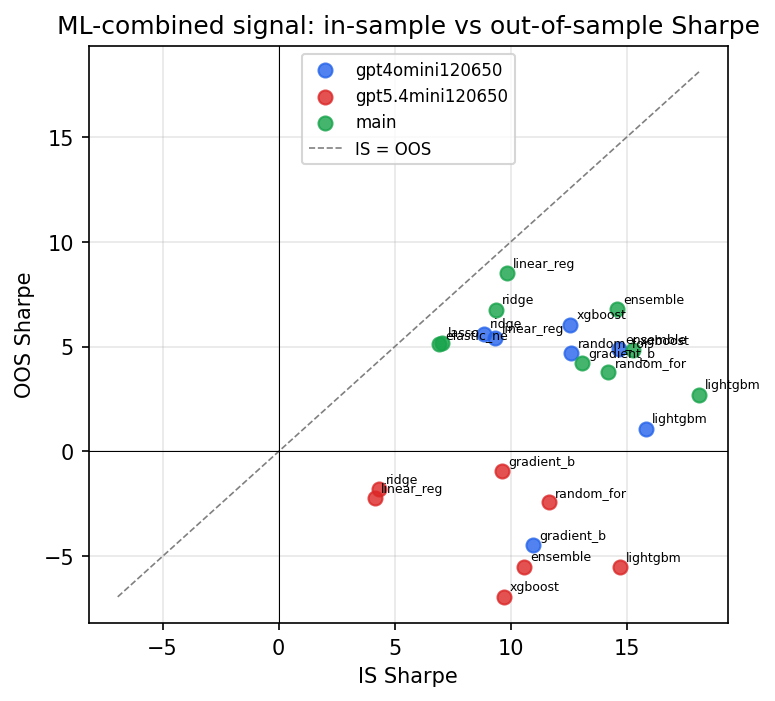

*IS vs OOS Sharpe (overfitting diagnostic)*

---
*Generated by `run_model_comparison.py`. Tables: `*.csv`; interactive: `comparison.ipynb`.*
