# Research-LLM factor comparison — `2025-03`

Comparing the **factor output of different research LLMs** on three axes (raw factor quality → factors as ML features → factors through the full agentic fund). The panel, IS/OOS split, horizon and model hyper-parameters are held identical across preruns — the *only* variable is the factor set.

## Preruns compared

| prerun | research_model | usable_factors | dropped_factors |
| --- | --- | --- | --- |
| gpt4omini120650 | gpt-4o-mini | 66 | 0 |
| gpt5.4mini120650 | gpt-5.4-mini | 69 | 0 |
| main | seed library | 78 | 10 |

> Dropped factors declare fields the current data doesn't have yet (e.g. fundamentals); they light up unchanged once that data is downloaded.

*Usable vs awaiting-data factors per research model*

## Key findings

- **Best ML-combined OOS Sharpe:** `gpt5.4mini120650` with `gradient_boosting` (OOS Sharpe = 10.332).
- **Mean OOS Sharpe across models, by research set:** `gpt5.4mini120650` = 5.062, `gpt4omini120650` = 4.511, `main` = 0.777.
- **Highest mean single-factor |IC| (h=6):** `main` (mean |IC| = 0.0093).
- **Most diverse zoo (highest effective/raw factor ratio):** `gpt5.4mini120650` (eff 53.6 of 69, ratio 0.78).
- **Best selection-deflated single-factor |IC|:** `main` (deflated |IC| = 0.0195 from 38 factors tried).

## 1. Single-factor IC (raw factor quality)

Per-underlying time-series Spearman rank-IC of every researched factor, recomputed on the shared panel at horizons h=1, h=6, h=60. The per-underlying IC correlates each factor's value vector with the underlying's own forward-return vector (pooled across underlyings); the cross-sectional IC ranks across underlyings per timestamp.

| prerun | n_factors | mean_abs_ic_1 | mean_abs_ic_6 | mean_abs_ic_60 | mean_abs_icir_6 | best_factor_h6 | best_abs_ic_h6 |
| --- | --- | --- | --- | --- | --- | --- | --- |
| gpt4omini120650 | 66 | 0.0045 | 0.006 | 0.0062 | 0.3589 | order_flow_momentum | 0.0261 |
| gpt5.4mini120650 | 69 | 0.0049 | 0.0048 | 0.0046 | 0.3544 | orderflow_imbalance_divergence | 0.0136 |
| main | 78 | 0.0111 | 0.0093 | 0.0048 | 0.481 | alpha_066 | 0.0267 |

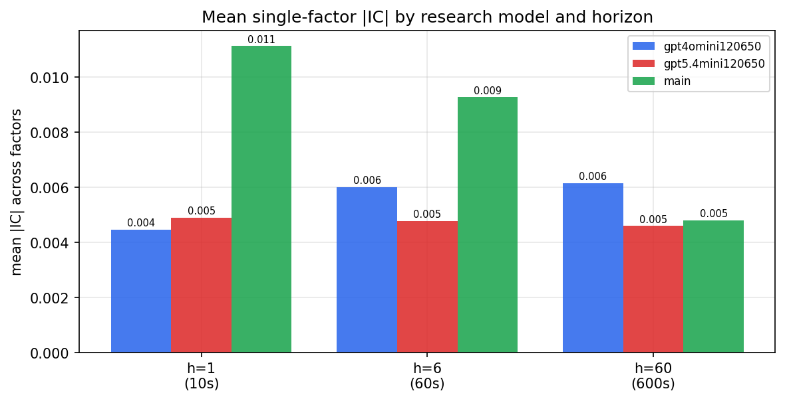

*Mean |IC| by research model and horizon*

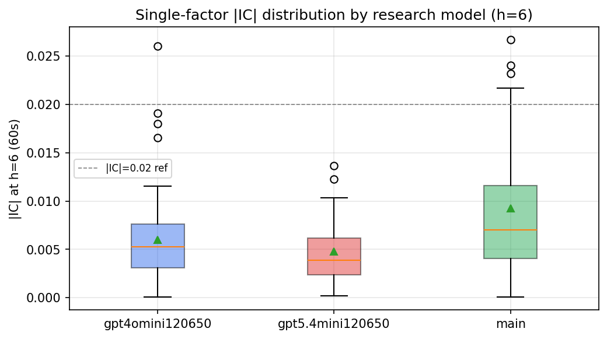

*Per-factor |IC| distribution by research model*

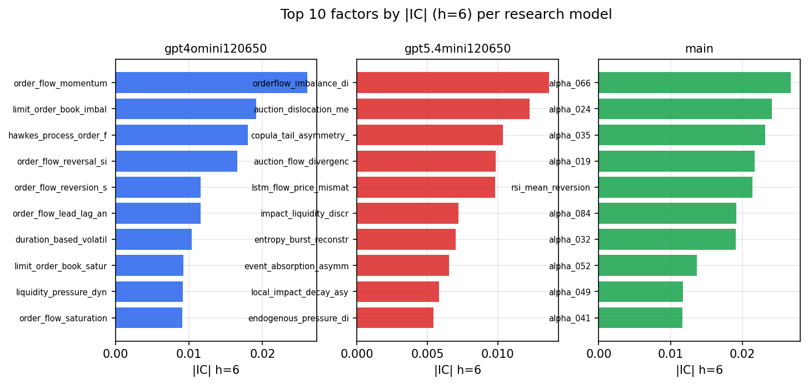

*Top factors by |IC| per research model*

## 2. Factor diversity & redundancy

Pairwise correlation of each zoo's *signals*. `eff_n_factors` is the effective number of independent factors (participation ratio of the correlation eigenvalues); `eff_ratio` and `redundancy` summarise how much unique information the zoo holds vs. how much is duplicated; `n_clusters` groups factors at |corr| ≥ 0.7.

| prerun | n_factors | eff_n_factors | eff_ratio | mean_abs_corr | n_clusters | redundancy |
| --- | --- | --- | --- | --- | --- | --- |
| gpt4omini120650 | 66 | 27.65 | 0.4189 | 0.0505 | 51 | 0.5811 |
| gpt5.4mini120650 | 69 | 53.5566 | 0.7762 | 0.011 | 64 | 0.2238 |
| main | 78 | 43.672 | 0.5599 | 0.028 | 71 | 0.4401 |

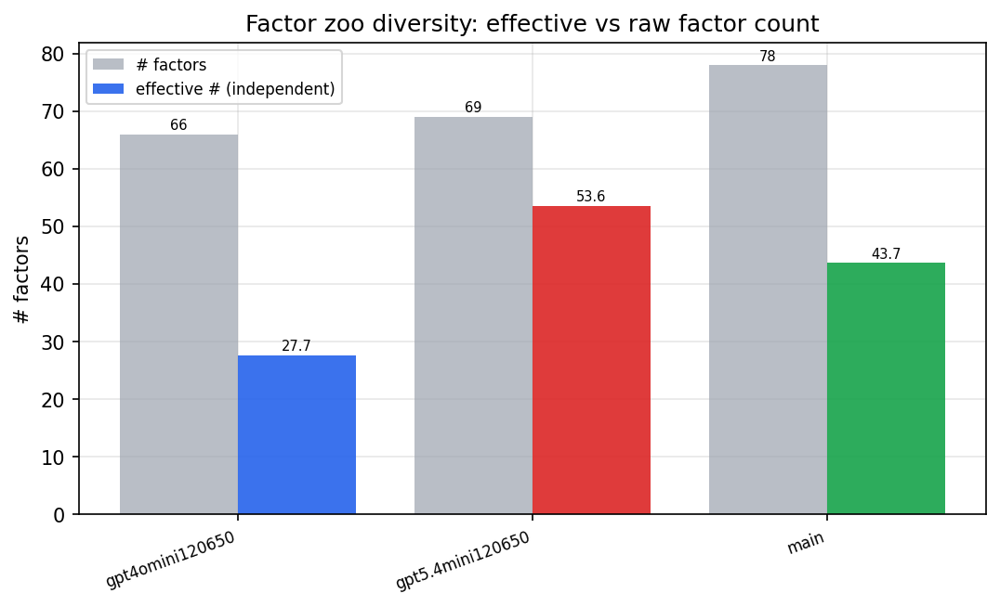

*Effective vs raw factor count per research model*

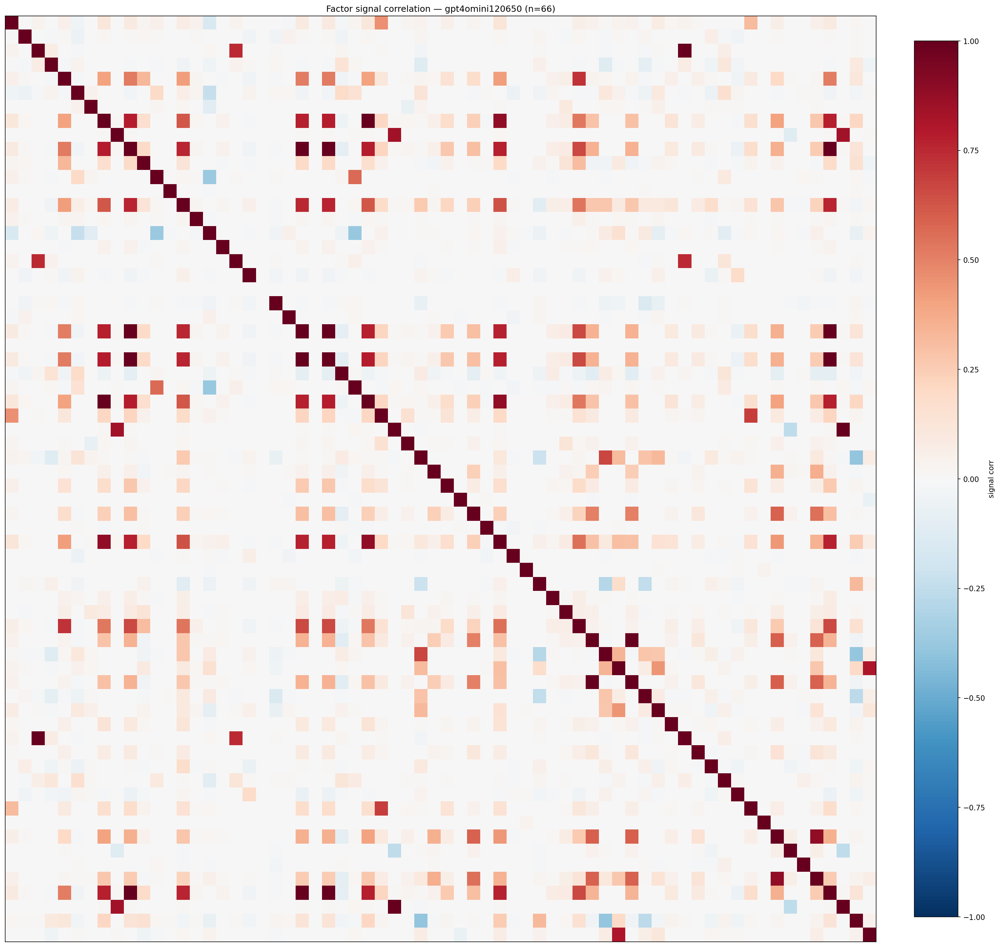

*Signal correlation matrix — gpt4omini120650*

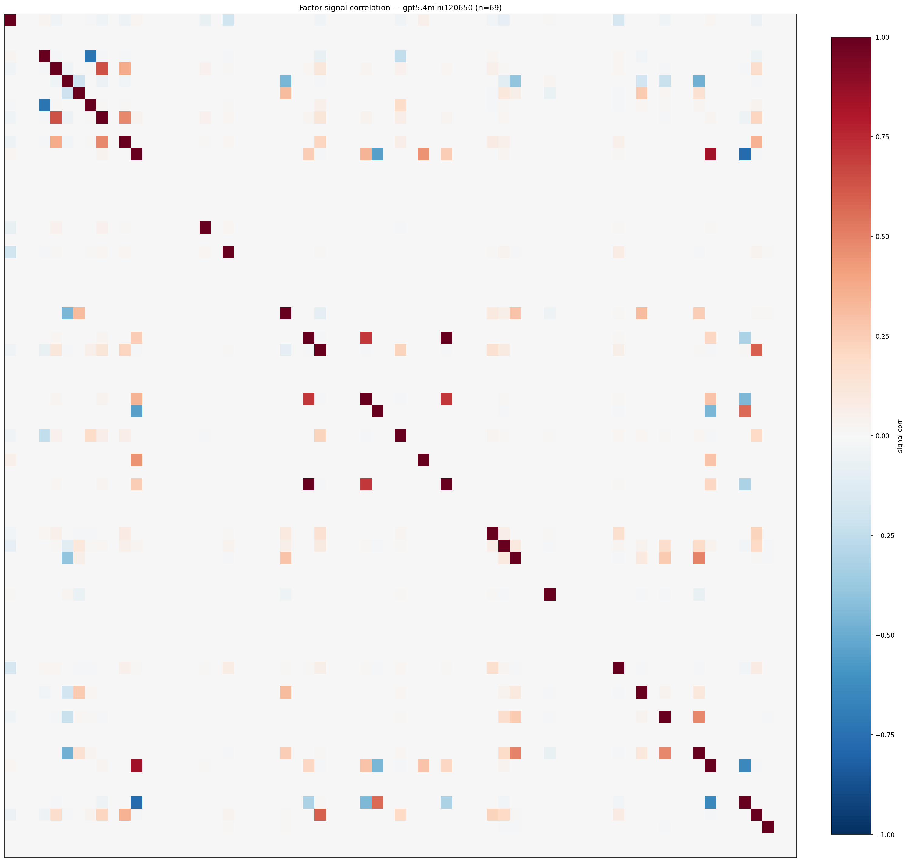

*Signal correlation matrix — gpt5.4mini120650*

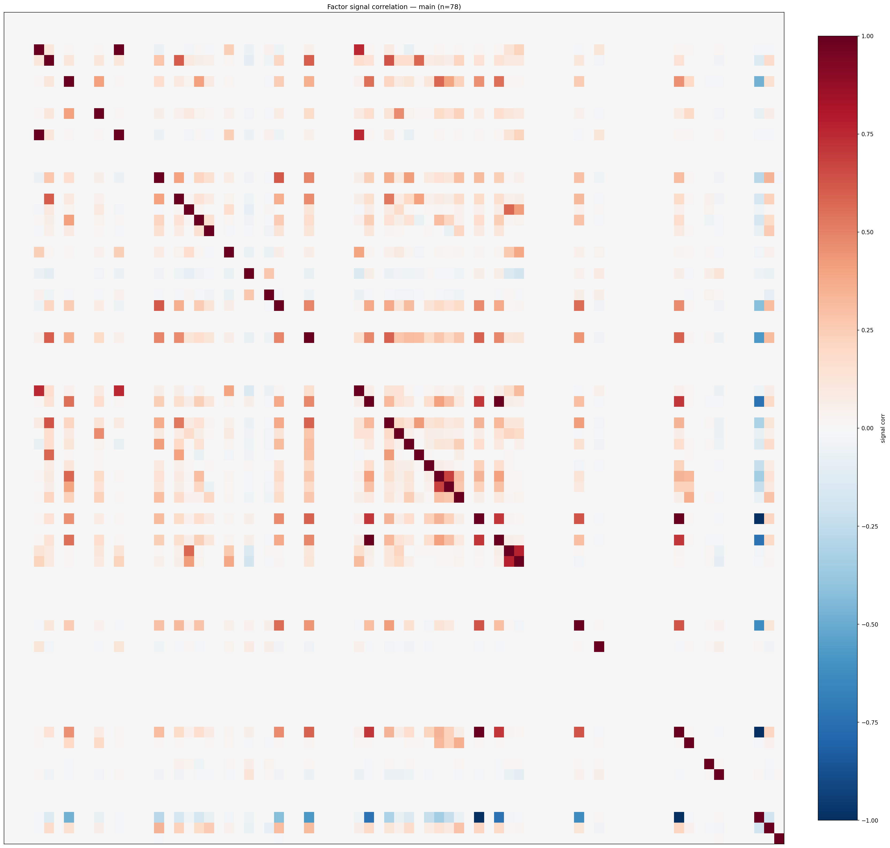

*Signal correlation matrix — main*

## 3. Deflation & model-based importance

`deflated_best_ic` haircuts each zoo's best |IC| for the number of factors tried (`ic_n_tested`) — a bigger zoo's best factor is more likely to be lucky. `lasso_n_nonzero` / `lasso_sparsity` show how many factors a sparse linear model actually keeps (model-view redundancy).

| prerun | best_ic | deflated_best_ic | deflated_best_t | ic_n_tested | ic_n_obs | lasso_n_nonzero | lasso_sparsity |
| --- | --- | --- | --- | --- | --- | --- | --- |
| gpt4omini120650 | 0.0261 | 0.0184 | 6.8831 | 64 | 140399 | 3 | 0.9545 |
| gpt5.4mini120650 | 0.0136 | 0.0066 | 2.4877 | 31 | 140399 | 0 | 1.0 |
| main | 0.0267 | 0.0195 | 7.3022 | 38 | 140399 | 0 | 1.0 |

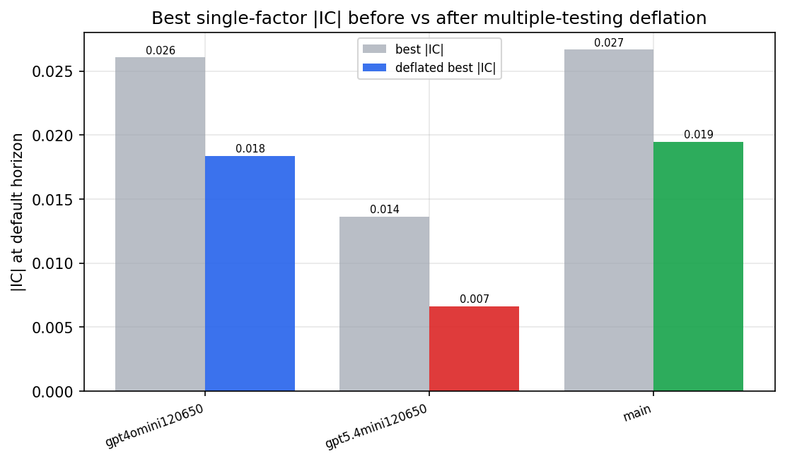

*Best |IC| before vs after multiple-testing deflation*

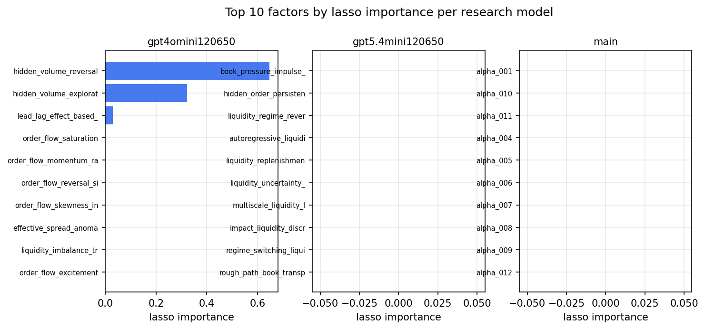

*Top factors by lasso importance per zoo*

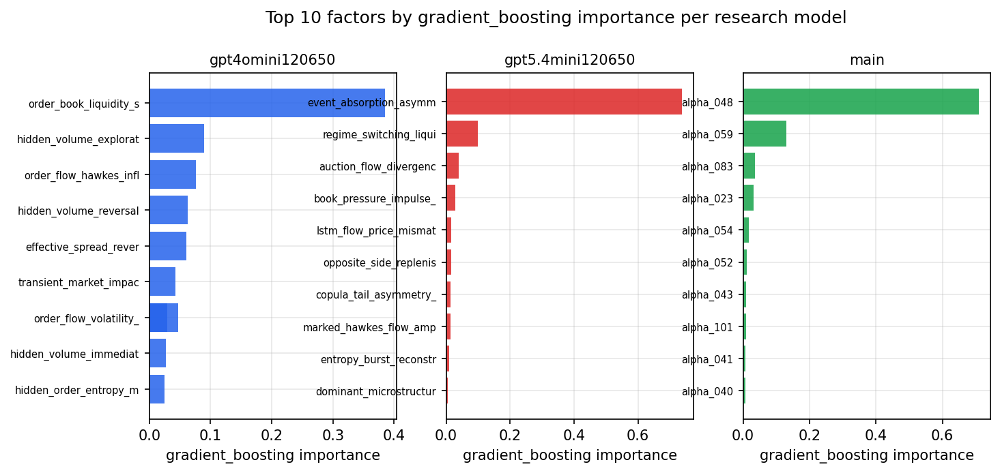

*Top factors by gradient_boosting importance per zoo*

## 4. ML-combined signal — per-underlying vectorised backtest

Each model combines a prerun's factors into ONE signal (fit `factors → forward return` on IS, predict per (bar, underlying)), then that combined signal is run through a simple vectorised backtest — `position(signal) × the underlying's own forward return` — on the held-out OOS tail (+ an equal-weight ensemble). No cross-sectional ranking.

> Config: position=**threshold** (t=1.0, z-score `expanding`), aggregation=**portfolio**, fit-standardise=**per_underlying**, horizon=6.

| prerun | model | n_factors_used | oos_ic | oos_sharpe | is_sharpe | oos_ann_return | oos_max_drawdown |
| --- | --- | --- | --- | --- | --- | --- | --- |
| gpt4omini120650 | linear_regression | 66 | 0.0054 | 3.8659 | 7.164 | 0.3308 | -0.0161 |
| gpt4omini120650 | ridge | 66 | 0.0065 | 5.0152 | 6.6307 | 0.4156 | -0.018 |
| gpt4omini120650 | lasso | 66 | nan | nan | nan | nan | nan |
| gpt4omini120650 | elastic_net | 66 | nan | nan | nan | nan | nan |
| gpt4omini120650 | random_forest | 66 | -0.0037 | 5.5239 | 7.589 | 0.4712 | -0.0103 |
| gpt4omini120650 | gradient_boosting | 66 | -0.0021 | 4.2157 | 6.8777 | 0.1665 | -0.0059 |
| gpt4omini120650 | xgboost | 66 | 0.0028 | 4.885 | 9.2321 | 0.2186 | -0.0059 |
| gpt4omini120650 | lightgbm | 66 | 0.0006 | 2.9805 | 13.5936 | 0.1114 | -0.0044 |
| gpt4omini120650 | ensemble | 66 | 0.0048 | 5.0914 | 11.506 | 0.3974 | -0.0104 |
| gpt5.4mini120650 | linear_regression | 69 | 0.0086 | 1.3655 | 4.9067 | 0.0803 | -0.0139 |
| gpt5.4mini120650 | ridge | 69 | 0.0093 | 1.7939 | 4.9735 | 0.1045 | -0.0124 |
| gpt5.4mini120650 | lasso | 69 | nan | nan | nan | nan | nan |
| gpt5.4mini120650 | elastic_net | 69 | nan | nan | nan | nan | nan |
| gpt5.4mini120650 | random_forest | 69 | 0.0061 | 8.2961 | 7.7761 | 0.3583 | -0.0049 |
| gpt5.4mini120650 | gradient_boosting | 69 | 0.0077 | 10.3322 | 8.0686 | 0.2546 | -0.0026 |
| gpt5.4mini120650 | xgboost | 69 | 0.0041 | 6.8965 | 7.7156 | 0.2156 | -0.0067 |
| gpt5.4mini120650 | lightgbm | 69 | 0.0008 | 2.4167 | 13.4657 | 0.0852 | -0.0081 |
| gpt5.4mini120650 | ensemble | 69 | 0.0115 | 4.334 | 6.8397 | 0.1073 | -0.0074 |
| main | linear_regression | 78 | 0.0199 | -1.4551 | 11.6127 | -0.1513 | -0.0331 |
| main | ridge | 78 | 0.017 | -1.4888 | 10.6823 | -0.1539 | -0.0287 |
| main | lasso | 78 | 0.0342 | 0.9769 | 4.3175 | 0.055 | -0.0278 |
| main | elastic_net | 78 | 0.0342 | 0.9769 | 4.3175 | 0.055 | -0.0278 |
| main | random_forest | 78 | 0.0125 | 1.5749 | 7.8926 | 0.0676 | -0.0087 |
| main | gradient_boosting | 78 | 0.0142 | 4.5666 | 5.8776 | 0.0614 | -0.0015 |
| main | xgboost | 78 | 0.0156 | 1.1533 | 10.262 | 0.0281 | -0.0048 |
| main | lightgbm | 78 | 0.0111 | 2.6108 | 13.3823 | 0.0681 | -0.0043 |
| main | ensemble | 78 | 0.0245 | -1.9228 | 9.9864 | -0.187 | -0.0269 |

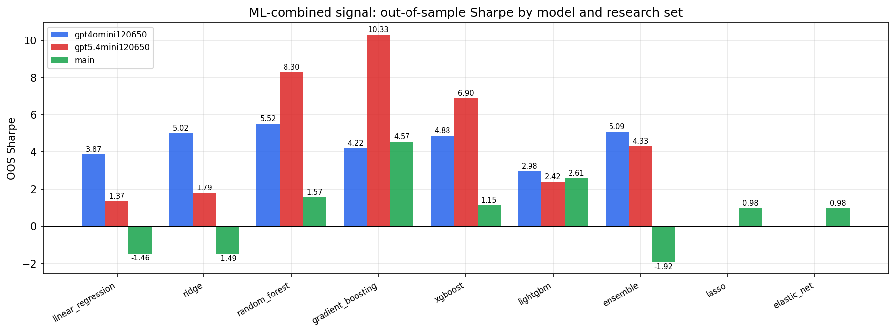

*ML-combined OOS Sharpe by model and research set*

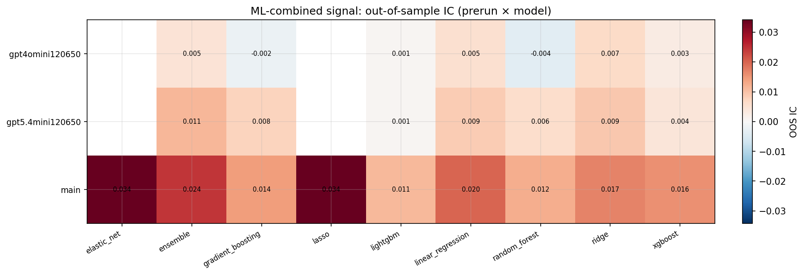

*ML-combined OOS IC (prerun × model)*

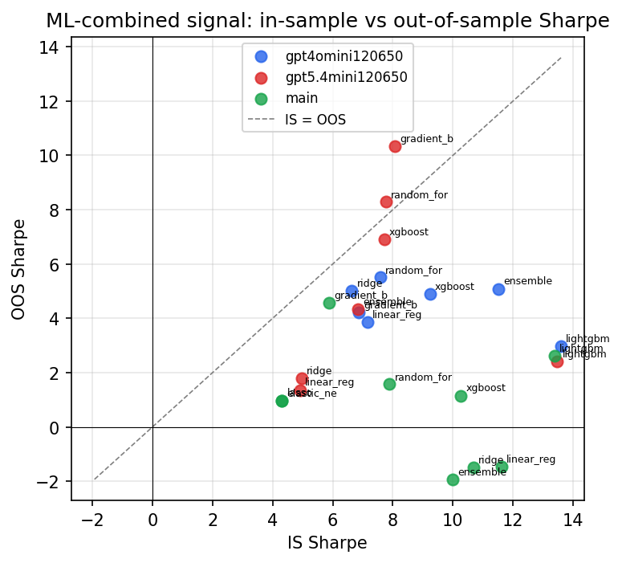

*IS vs OOS Sharpe (overfitting diagnostic)*

---
*Generated by `run_model_comparison.py`. Tables: `*.csv`; interactive: `comparison.ipynb`.*
