# Research-LLM factor comparison — `2025-04`

Comparing the **factor output of different research LLMs** on three axes (raw factor quality → factors as ML features → factors through the full agentic fund). The panel, IS/OOS split, horizon and model hyper-parameters are held identical across preruns — the *only* variable is the factor set.

## Preruns compared

| prerun | research_model | usable_factors | dropped_factors |
| --- | --- | --- | --- |
| gpt4omini120650 | gpt-4o-mini | 66 | 0 |
| gpt5.4mini120650 | gpt-5.4-mini | 69 | 0 |
| main | seed library | 78 | 10 |

> Dropped factors declare fields the current data doesn't have yet (e.g. fundamentals); they light up unchanged once that data is downloaded.

*Usable vs awaiting-data factors per research model*

## Key findings

- **Best ML-combined OOS Sharpe:** `main` with `lightgbm` (OOS Sharpe = 4.334).
- **Mean OOS Sharpe across models, by research set:** `main` = 3.107, `gpt5.4mini120650` = 1.309, `gpt4omini120650` = -6.785.
- **Highest mean single-factor |IC| (h=6):** `main` (mean |IC| = 0.0127).
- **Most diverse zoo (highest effective/raw factor ratio):** `gpt5.4mini120650` (eff 53.2 of 69, ratio 0.77).
- **Best selection-deflated single-factor |IC|:** `main` (deflated |IC| = 0.0227 from 38 factors tried).

## 1. Single-factor IC (raw factor quality)

Per-underlying time-series Spearman rank-IC of every researched factor, recomputed on the shared panel at horizons h=1, h=6, h=60. The per-underlying IC correlates each factor's value vector with the underlying's own forward-return vector (pooled across underlyings); the cross-sectional IC ranks across underlyings per timestamp.

| prerun | n_factors | mean_abs_ic_1 | mean_abs_ic_6 | mean_abs_ic_60 | mean_abs_icir_6 | best_factor_h6 | best_abs_ic_h6 |
| --- | --- | --- | --- | --- | --- | --- | --- |
| gpt4omini120650 | 66 | 0.0046 | 0.0071 | 0.0068 | 0.3963 | order_flow_momentum | 0.0288 |
| gpt5.4mini120650 | 69 | 0.0044 | 0.0058 | 0.0068 | 0.3455 | lstm_flow_price_mismatch | 0.0206 |
| main | 78 | 0.0147 | 0.0127 | 0.0078 | 0.6589 | alpha_035 | 0.0298 |

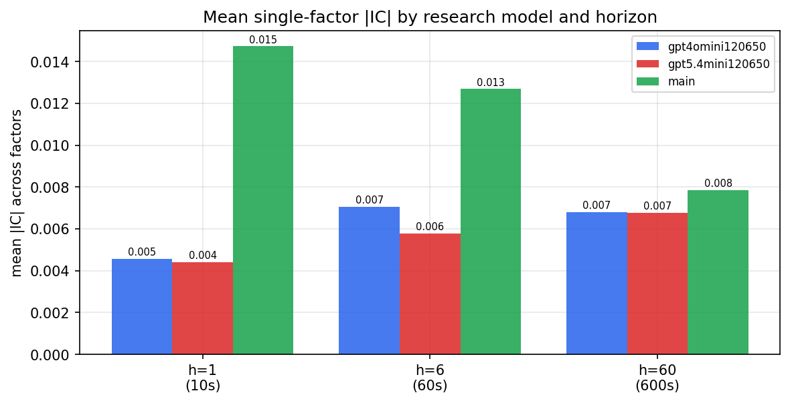

*Mean |IC| by research model and horizon*

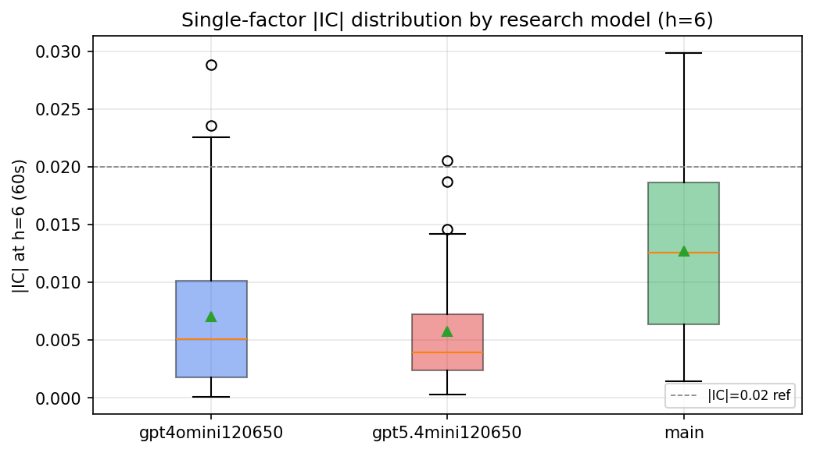

*Per-factor |IC| distribution by research model*

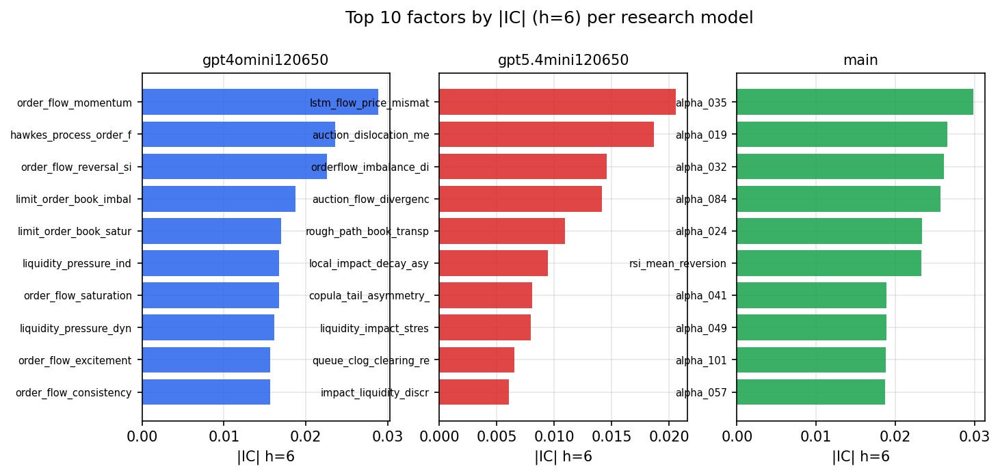

*Top factors by |IC| per research model*

## 2. Factor diversity & redundancy

Pairwise correlation of each zoo's *signals*. `eff_n_factors` is the effective number of independent factors (participation ratio of the correlation eigenvalues); `eff_ratio` and `redundancy` summarise how much unique information the zoo holds vs. how much is duplicated; `n_clusters` groups factors at |corr| ≥ 0.7.

| prerun | n_factors | eff_n_factors | eff_ratio | mean_abs_corr | n_clusters | redundancy |
| --- | --- | --- | --- | --- | --- | --- |
| gpt4omini120650 | 66 | 28.0077 | 0.4244 | 0.0522 | 53 | 0.5756 |
| gpt5.4mini120650 | 69 | 53.1776 | 0.7707 | 0.0118 | 64 | 0.2293 |
| main | 78 | 44.1955 | 0.5666 | 0.0276 | 72 | 0.4334 |

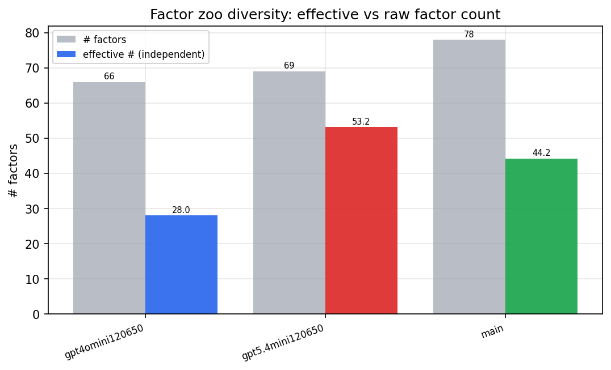

*Effective vs raw factor count per research model*

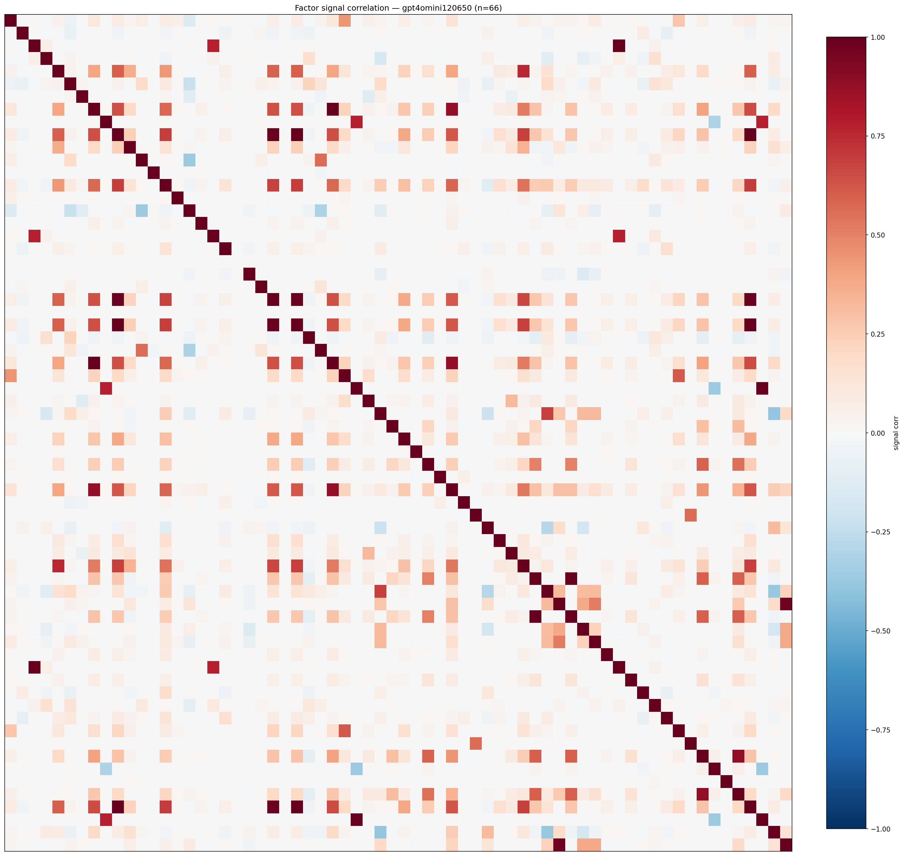

*Signal correlation matrix — gpt4omini120650*

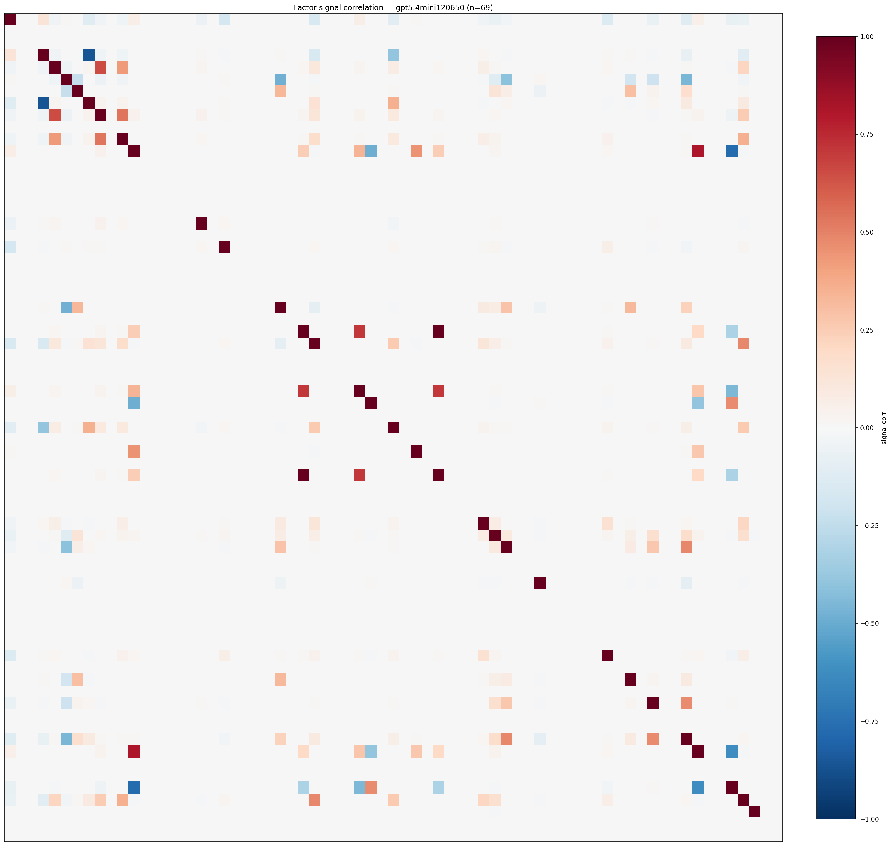

*Signal correlation matrix — gpt5.4mini120650*

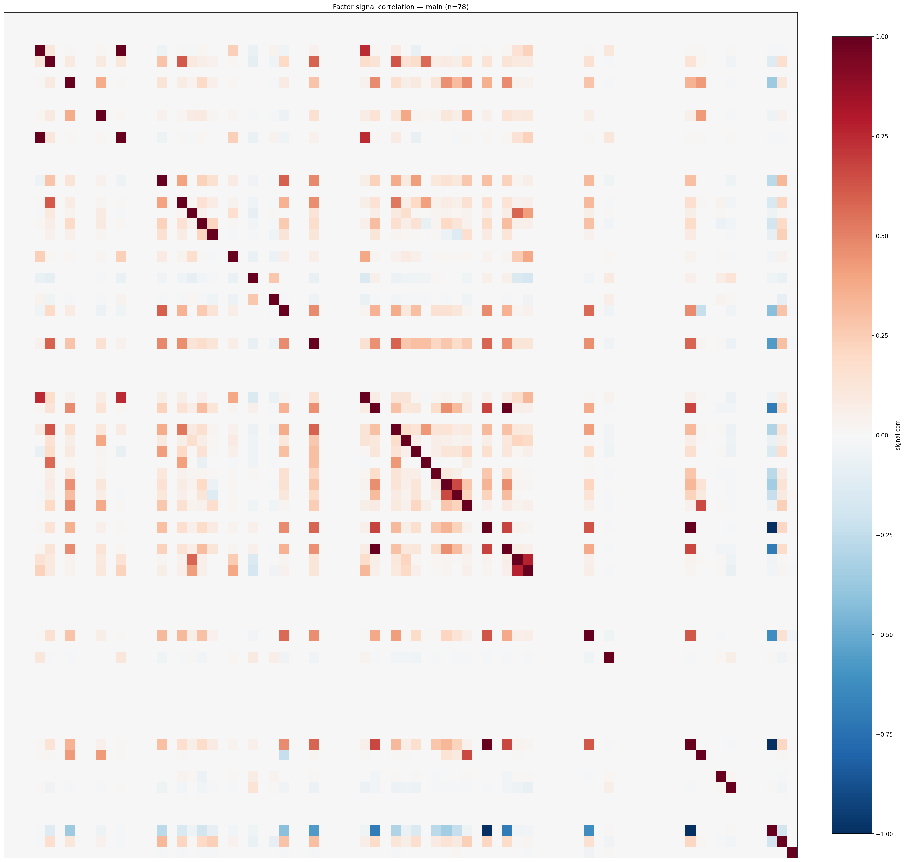

*Signal correlation matrix — main*

## 3. Deflation & model-based importance

`deflated_best_ic` haircuts each zoo's best |IC| for the number of factors tried (`ic_n_tested`) — a bigger zoo's best factor is more likely to be lucky. `lasso_n_nonzero` / `lasso_sparsity` show how many factors a sparse linear model actually keeps (model-view redundancy).

| prerun | best_ic | deflated_best_ic | deflated_best_t | ic_n_tested | ic_n_obs | lasso_n_nonzero | lasso_sparsity |
| --- | --- | --- | --- | --- | --- | --- | --- |
| gpt4omini120650 | 0.0288 | 0.0212 | 7.9989 | 64 | 142739 | 0 | 1.0 |
| gpt5.4mini120650 | 0.0206 | 0.0136 | 5.1473 | 31 | 142739 | 0 | 1.0 |
| main | 0.0298 | 0.0227 | 8.5651 | 38 | 142739 | 0 | 1.0 |

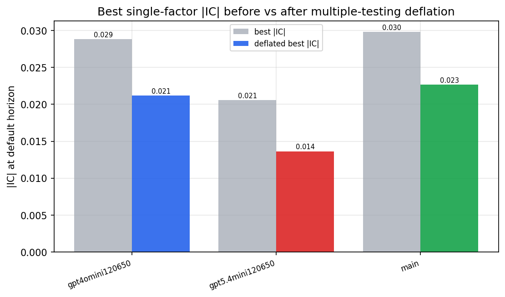

*Best |IC| before vs after multiple-testing deflation*

*Top factors by lasso importance per zoo*

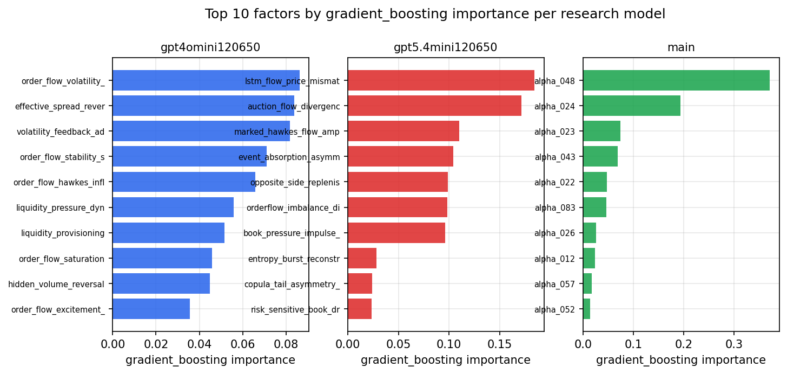

*Top factors by gradient_boosting importance per zoo*

## 4. ML-combined signal — per-underlying vectorised backtest

Each model combines a prerun's factors into ONE signal (fit `factors → forward return` on IS, predict per (bar, underlying)), then that combined signal is run through a simple vectorised backtest — `position(signal) × the underlying's own forward return` — on the held-out OOS tail (+ an equal-weight ensemble). No cross-sectional ranking.

> Config: position=**threshold** (t=1.0, z-score `expanding`), aggregation=**portfolio**, fit-standardise=**per_underlying**, horizon=6.

| prerun | model | n_factors_used | oos_ic | oos_sharpe | is_sharpe | oos_ann_return | oos_max_drawdown |
| --- | --- | --- | --- | --- | --- | --- | --- |
| gpt4omini120650 | linear_regression | 66 | 0.0067 | -6.5013 | 12.5993 | -1.8599 | -0.1716 |
| gpt4omini120650 | ridge | 66 | 0.0083 | -6.1216 | 12.4385 | -1.8373 | -0.1703 |
| gpt4omini120650 | lasso | 66 | nan | nan | nan | nan | nan |
| gpt4omini120650 | elastic_net | 66 | nan | nan | nan | nan | nan |
| gpt4omini120650 | random_forest | 66 | -0.0018 | -6.1758 | 13.6787 | -1.806 | -0.1575 |
| gpt4omini120650 | gradient_boosting | 66 | 0.0045 | -8.6445 | 16.5374 | -2.1114 | -0.183 |
| gpt4omini120650 | xgboost | 66 | -0.002 | -6.3793 | 16.6567 | -1.8613 | -0.167 |
| gpt4omini120650 | lightgbm | 66 | 0.0035 | -6.5615 | 18.6164 | -1.8328 | -0.1671 |
| gpt4omini120650 | ensemble | 66 | 0.0034 | -7.1132 | 14.9035 | -1.9051 | -0.1688 |
| gpt5.4mini120650 | linear_regression | 69 | 0.0193 | 1.5908 | 6.983 | 0.5079 | -0.0639 |
| gpt5.4mini120650 | ridge | 69 | 0.0192 | 1.8868 | 6.723 | 0.6587 | -0.067 |
| gpt5.4mini120650 | lasso | 69 | nan | nan | nan | nan | nan |
| gpt5.4mini120650 | elastic_net | 69 | nan | nan | nan | nan | nan |
| gpt5.4mini120650 | random_forest | 69 | 0.0044 | 2.747 | 10.3342 | 0.4503 | -0.0353 |
| gpt5.4mini120650 | gradient_boosting | 69 | 0.0028 | 3.7611 | 9.3954 | 0.5461 | -0.0221 |
| gpt5.4mini120650 | xgboost | 69 | 0.0043 | -0.659 | 10.0904 | -0.1424 | -0.0603 |
| gpt5.4mini120650 | lightgbm | 69 | -0.0008 | 0.1069 | 14.8981 | 0.0219 | -0.0623 |
| gpt5.4mini120650 | ensemble | 69 | 0.0201 | -0.2704 | 8.0385 | -0.0521 | -0.0649 |
| main | linear_regression | 78 | 0.0021 | 3.7922 | 10.636 | 0.3206 | -0.0045 |
| main | ridge | 78 | 0.005 | 3.7315 | 10.6737 | 0.3159 | -0.0047 |
| main | lasso | 78 | nan | nan | nan | nan | nan |
| main | elastic_net | 78 | nan | nan | nan | nan | nan |
| main | random_forest | 78 | 0.0109 | 3.4842 | 16.2847 | 0.7202 | -0.0219 |
| main | gradient_boosting | 78 | 0.0108 | 0.4506 | 13.1067 | 0.0593 | -0.0334 |
| main | xgboost | 78 | 0.0113 | 2.589 | 15.3169 | 0.4154 | -0.0263 |
| main | lightgbm | 78 | 0.0093 | 4.3339 | 18.1935 | 0.539 | -0.0262 |
| main | ensemble | 78 | 0.011 | 3.3672 | 15.2006 | 0.551 | -0.0175 |

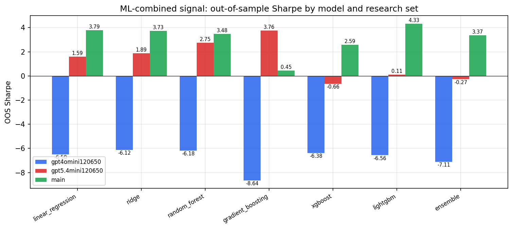

*ML-combined OOS Sharpe by model and research set*

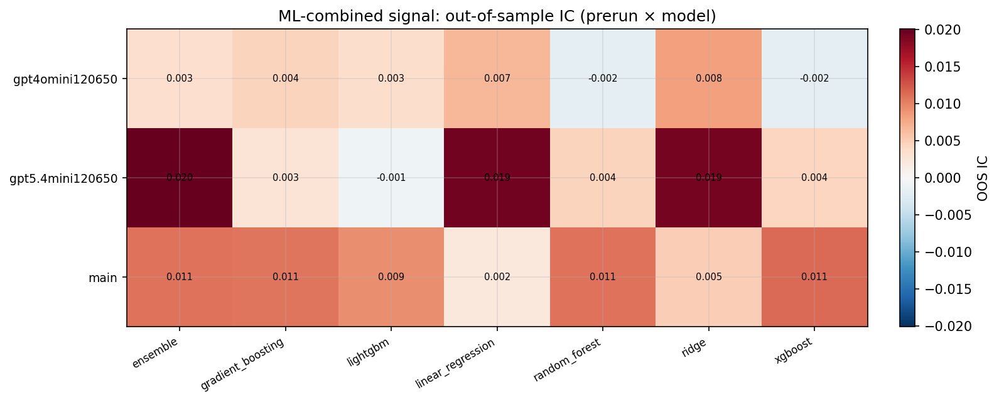

*ML-combined OOS IC (prerun × model)*

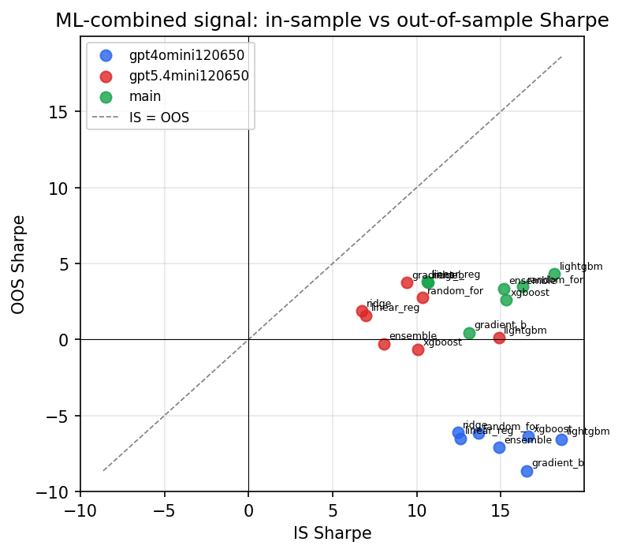

*IS vs OOS Sharpe (overfitting diagnostic)*

---
*Generated by `run_model_comparison.py`. Tables: `*.csv`; interactive: `comparison.ipynb`.*
