# Research-LLM factor comparison — `2025-05`

Comparing the **factor output of different research LLMs** on three axes (raw factor quality → factors as ML features → factors through the full agentic fund). The panel, IS/OOS split, horizon and model hyper-parameters are held identical across preruns — the *only* variable is the factor set.

## Preruns compared

| prerun | research_model | usable_factors | dropped_factors |
| --- | --- | --- | --- |
| gpt4omini120650 | gpt-4o-mini | 66 | 0 |
| gpt5.4mini120650 | gpt-5.4-mini | 69 | 0 |
| main | seed library | 78 | 10 |

> Dropped factors declare fields the current data doesn't have yet (e.g. fundamentals); they light up unchanged once that data is downloaded.

*Usable vs awaiting-data factors per research model*

## Key findings

- **Best ML-combined OOS Sharpe:** `main` with `random_forest` (OOS Sharpe = 4.482).
- **Mean OOS Sharpe across models, by research set:** `main` = -0.476, `gpt4omini120650` = -2.832, `gpt5.4mini120650` = -4.512.
- **Highest mean single-factor |IC| (h=6):** `main` (mean |IC| = 0.0119).
- **Most diverse zoo (highest effective/raw factor ratio):** `gpt5.4mini120650` (eff 52.4 of 69, ratio 0.76).
- **Best selection-deflated single-factor |IC|:** `main` (deflated |IC| = 0.0210 from 38 factors tried).

## 1. Single-factor IC (raw factor quality)

Per-underlying time-series Spearman rank-IC of every researched factor, recomputed on the shared panel at horizons h=1, h=6, h=60. The per-underlying IC correlates each factor's value vector with the underlying's own forward-return vector (pooled across underlyings); the cross-sectional IC ranks across underlyings per timestamp.

| prerun | n_factors | mean_abs_ic_1 | mean_abs_ic_6 | mean_abs_ic_60 | mean_abs_icir_6 | best_factor_h6 | best_abs_ic_h6 |
| --- | --- | --- | --- | --- | --- | --- | --- |
| gpt4omini120650 | 66 | 0.0051 | 0.007 | 0.0065 | 0.4394 | hawkes_process_order_flow_indicator | 0.0218 |
| gpt5.4mini120650 | 69 | 0.0047 | 0.0062 | 0.008 | 0.3555 | auction_dislocation_mean_reversion | 0.0201 |
| main | 78 | 0.015 | 0.0119 | 0.005 | 0.7509 | alpha_035 | 0.0281 |

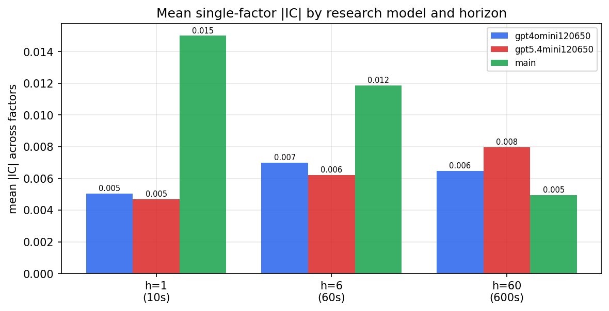

*Mean |IC| by research model and horizon*

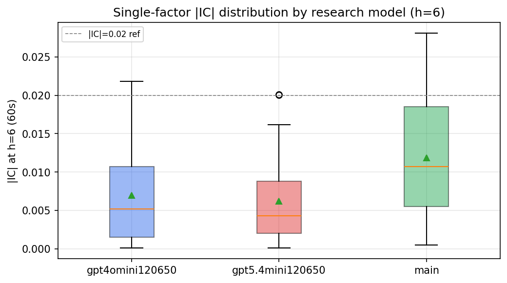

*Per-factor |IC| distribution by research model*

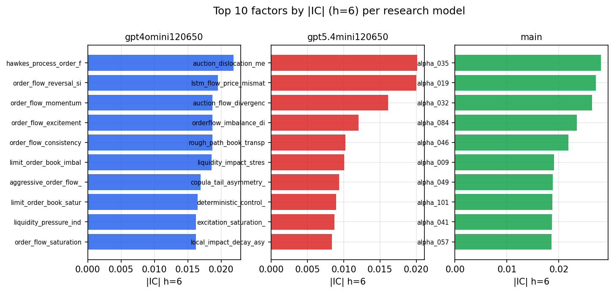

*Top factors by |IC| per research model*

## 2. Factor diversity & redundancy

Pairwise correlation of each zoo's *signals*. `eff_n_factors` is the effective number of independent factors (participation ratio of the correlation eigenvalues); `eff_ratio` and `redundancy` summarise how much unique information the zoo holds vs. how much is duplicated; `n_clusters` groups factors at |corr| ≥ 0.7.

| prerun | n_factors | eff_n_factors | eff_ratio | mean_abs_corr | n_clusters | redundancy |
| --- | --- | --- | --- | --- | --- | --- |
| gpt4omini120650 | 66 | 27.5196 | 0.417 | 0.0535 | 52 | 0.583 |
| gpt5.4mini120650 | 69 | 52.4273 | 0.7598 | 0.0121 | 64 | 0.2402 |
| main | 78 | 44.0387 | 0.5646 | 0.0278 | 71 | 0.4354 |

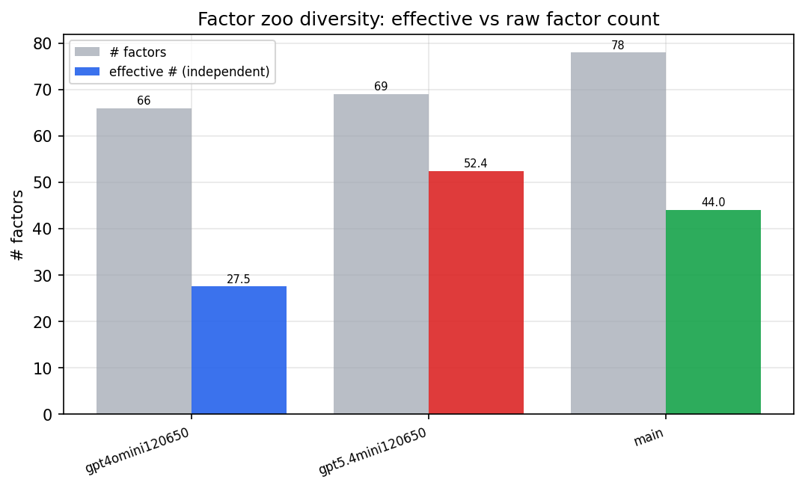

*Effective vs raw factor count per research model*

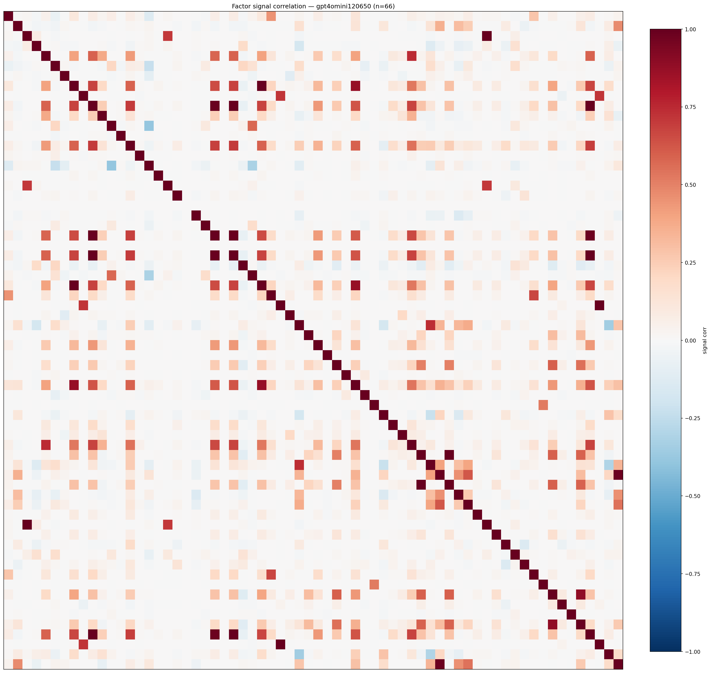

*Signal correlation matrix — gpt4omini120650*

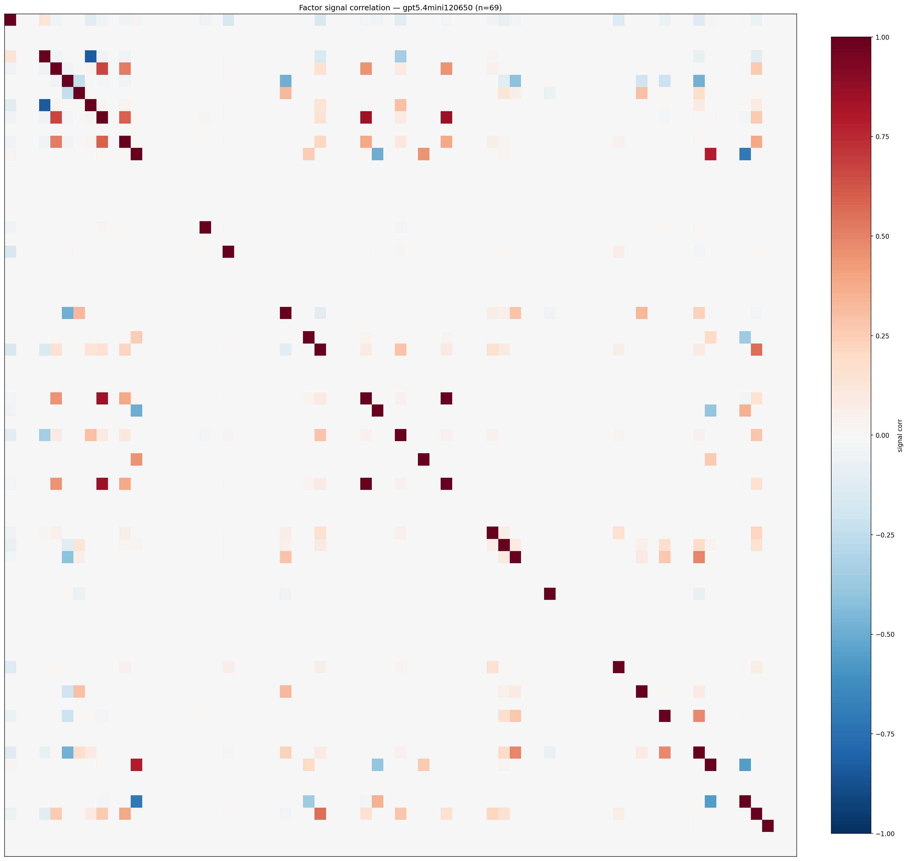

*Signal correlation matrix — gpt5.4mini120650*

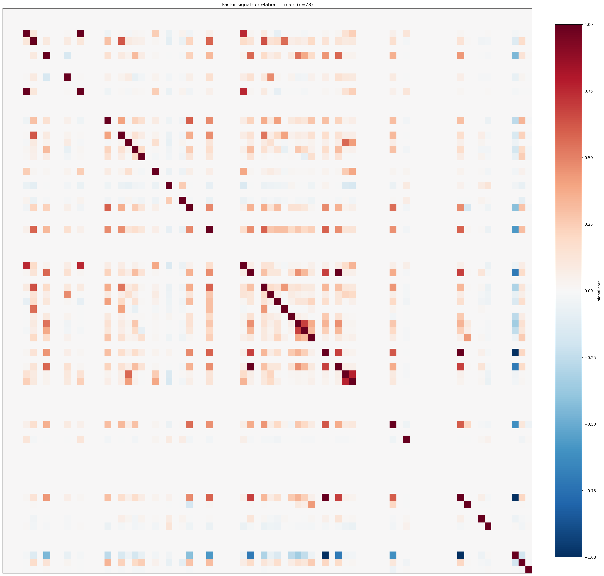

*Signal correlation matrix — main*

## 3. Deflation & model-based importance

`deflated_best_ic` haircuts each zoo's best |IC| for the number of factors tried (`ic_n_tested`) — a bigger zoo's best factor is more likely to be lucky. `lasso_n_nonzero` / `lasso_sparsity` show how many factors a sparse linear model actually keeps (model-view redundancy).

| prerun | best_ic | deflated_best_ic | deflated_best_t | ic_n_tested | ic_n_obs | lasso_n_nonzero | lasso_sparsity |
| --- | --- | --- | --- | --- | --- | --- | --- |
| gpt4omini120650 | 0.0218 | 0.0143 | 5.4352 | 64 | 145078 | 0 | 1.0 |
| gpt5.4mini120650 | 0.0201 | 0.0132 | 5.0411 | 31 | 145078 | 0 | 1.0 |
| main | 0.0281 | 0.021 | 7.9907 | 38 | 145078 | 3 | 0.9615 |

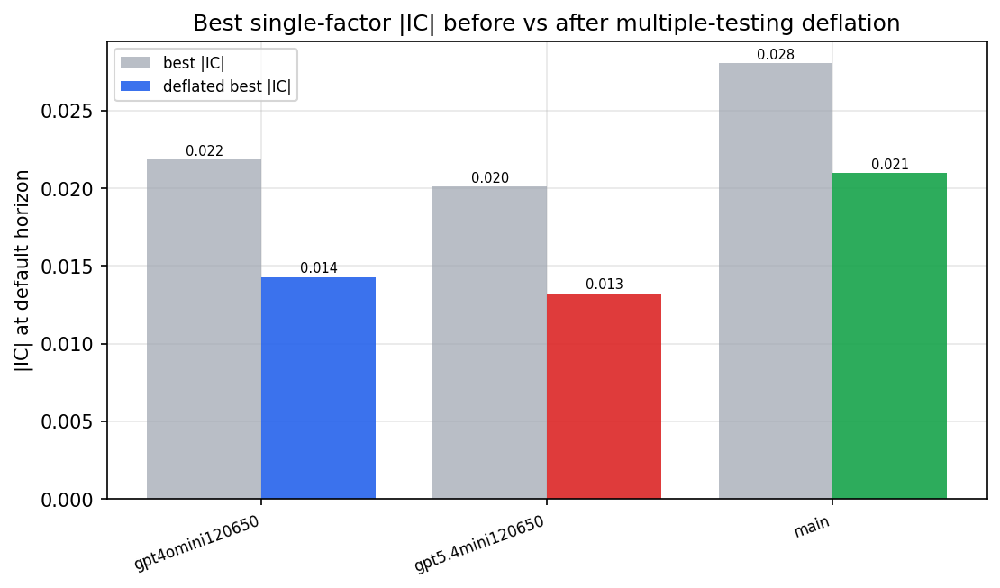

*Best |IC| before vs after multiple-testing deflation*

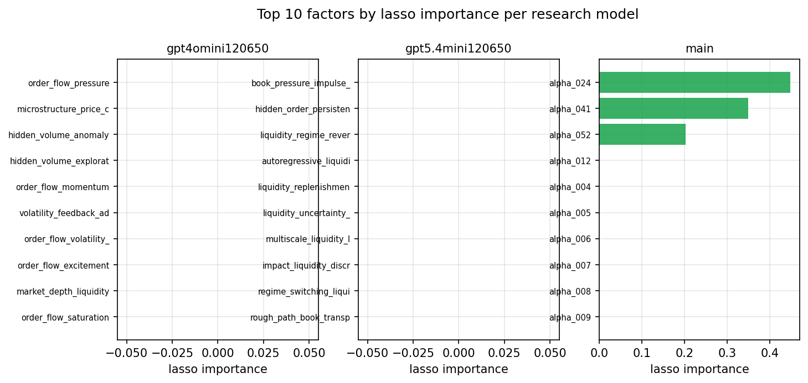

*Top factors by lasso importance per zoo*

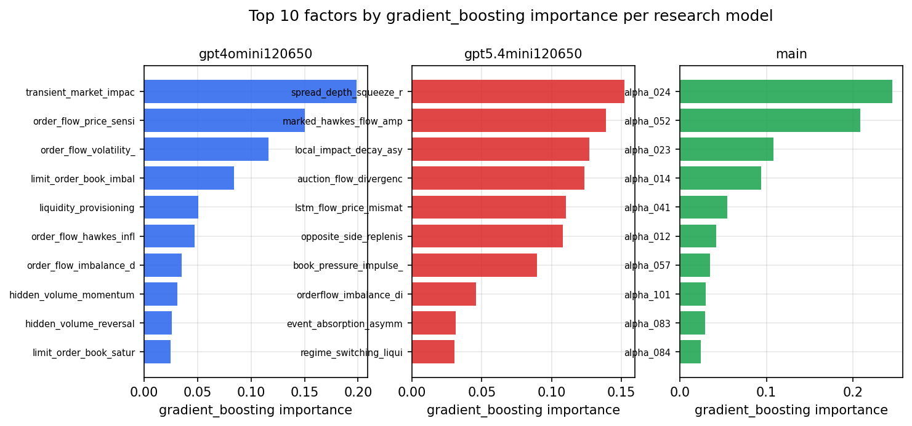

*Top factors by gradient_boosting importance per zoo*

## 4. ML-combined signal — per-underlying vectorised backtest

Each model combines a prerun's factors into ONE signal (fit `factors → forward return` on IS, predict per (bar, underlying)), then that combined signal is run through a simple vectorised backtest — `position(signal) × the underlying's own forward return` — on the held-out OOS tail (+ an equal-weight ensemble). No cross-sectional ranking.

> Config: position=**threshold** (t=1.0, z-score `expanding`), aggregation=**portfolio**, fit-standardise=**per_underlying**, horizon=6.

| prerun | model | n_factors_used | oos_ic | oos_sharpe | is_sharpe | oos_ann_return | oos_max_drawdown |
| --- | --- | --- | --- | --- | --- | --- | --- |
| gpt4omini120650 | linear_regression | 66 | 0.011 | -3.0225 | 6.9007 | -0.4823 | -0.0708 |
| gpt4omini120650 | ridge | 66 | 0.0087 | -3.5338 | 6.8452 | -0.5683 | -0.0763 |
| gpt4omini120650 | lasso | 66 | nan | nan | nan | nan | nan |
| gpt4omini120650 | elastic_net | 66 | nan | nan | nan | nan | nan |
| gpt4omini120650 | random_forest | 66 | -0.0001 | -2.958 | 9.5234 | -0.329 | -0.0526 |
| gpt4omini120650 | gradient_boosting | 66 | -0.011 | -3.0803 | 9.0668 | -0.167 | -0.0196 |
| gpt4omini120650 | xgboost | 66 | -0.0063 | -2.0001 | 12.064 | -0.1537 | -0.0354 |
| gpt4omini120650 | lightgbm | 66 | -0.0007 | -2.1199 | 16.6301 | -0.25 | -0.0572 |
| gpt4omini120650 | ensemble | 66 | 0.0055 | -3.1096 | 12.2995 | -0.4335 | -0.0627 |
| gpt5.4mini120650 | linear_regression | 69 | 0.0066 | -4.55 | 5.5553 | -0.1099 | -0.0104 |
| gpt5.4mini120650 | ridge | 69 | 0.0051 | -5.6189 | 5.489 | -0.146 | -0.0131 |
| gpt5.4mini120650 | lasso | 69 | 0.008 | -1.8936 | 4.5458 | -0.2031 | -0.0451 |
| gpt5.4mini120650 | elastic_net | 69 | 0.0079 | -1.8851 | 4.565 | -0.2024 | -0.0444 |
| gpt5.4mini120650 | random_forest | 69 | 0.0035 | -5.2339 | 9.2527 | -0.3996 | -0.0447 |
| gpt5.4mini120650 | gradient_boosting | 69 | -0.0073 | -4.4373 | 10.0423 | -0.2175 | -0.0223 |
| gpt5.4mini120650 | xgboost | 69 | 0.0037 | -7.6381 | 12.9884 | -0.5117 | -0.0489 |
| gpt5.4mini120650 | lightgbm | 69 | 0.0086 | -5.7202 | 18.5865 | -0.3048 | -0.0301 |
| gpt5.4mini120650 | ensemble | 69 | 0.0052 | -3.6306 | 12.5241 | -0.3166 | -0.0455 |
| main | linear_regression | 78 | 0.0029 | -3.0852 | 8.6955 | -0.3081 | -0.0467 |
| main | ridge | 78 | -0.0014 | -4.6356 | 9.1516 | -0.4355 | -0.049 |
| main | lasso | 78 | nan | nan | nan | nan | nan |
| main | elastic_net | 78 | nan | nan | nan | nan | nan |
| main | random_forest | 78 | -0.0064 | 4.4819 | 7.4098 | 0.1808 | -0.0077 |
| main | gradient_boosting | 78 | -0.0036 | 0.2582 | 7.9585 | 0.0025 | -0.0023 |
| main | xgboost | 78 | 0.0012 | 0.3119 | 12.1831 | 0.0081 | -0.0085 |
| main | lightgbm | 78 | -0.0038 | 3.5405 | 14.7181 | 0.0916 | -0.0059 |
| main | ensemble | 78 | 0.0003 | -4.2043 | 12.6892 | -0.2063 | -0.0203 |

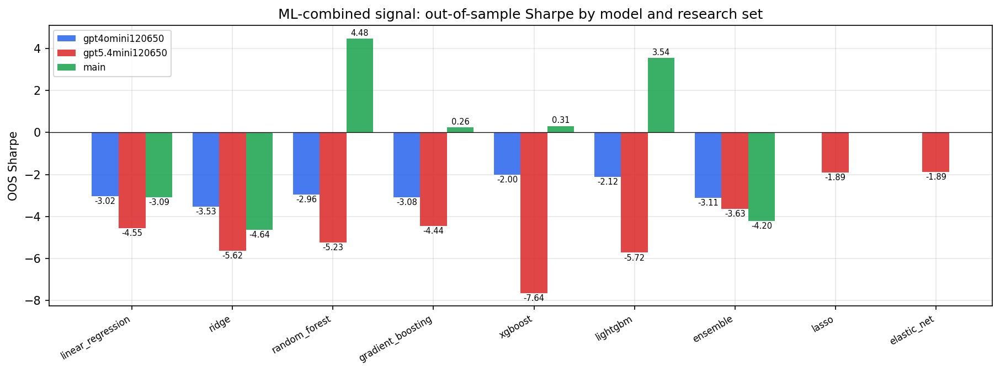

*ML-combined OOS Sharpe by model and research set*

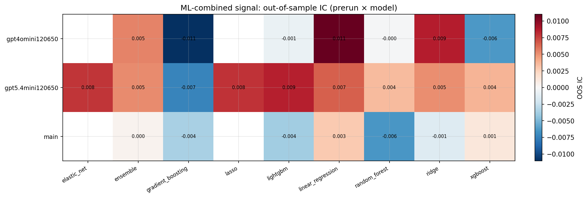

*ML-combined OOS IC (prerun × model)*

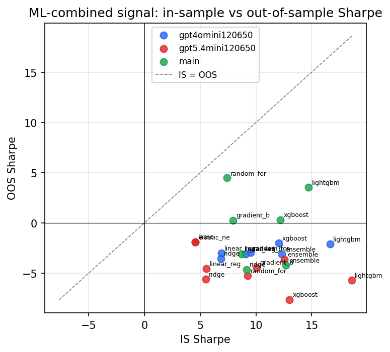

*IS vs OOS Sharpe (overfitting diagnostic)*

---
*Generated by `run_model_comparison.py`. Tables: `*.csv`; interactive: `comparison.ipynb`.*
