# Research-LLM factor comparison — `2025-06`

Comparing the **factor output of different research LLMs** on three axes (raw factor quality → factors as ML features → factors through the full agentic fund). The panel, IS/OOS split, horizon and model hyper-parameters are held identical across preruns — the *only* variable is the factor set.

## Preruns compared

| prerun | research_model | usable_factors | dropped_factors |
| --- | --- | --- | --- |
| gpt4omini120650 | gpt-4o-mini | 66 | 0 |
| gpt5.4mini120650 | gpt-5.4-mini | 69 | 0 |
| main | seed library | 78 | 10 |

> Dropped factors declare fields the current data doesn't have yet (e.g. fundamentals); they light up unchanged once that data is downloaded.

*Usable vs awaiting-data factors per research model*

## Key findings

- **Best ML-combined OOS Sharpe:** `main` with `xgboost` (OOS Sharpe = 6.811).
- **Mean OOS Sharpe across models, by research set:** `gpt5.4mini120650` = 3.042, `main` = 2.216, `gpt4omini120650` = -0.057.
- **Highest mean single-factor |IC| (h=6):** `main` (mean |IC| = 0.0136).
- **Most diverse zoo (highest effective/raw factor ratio):** `gpt5.4mini120650` (eff 51.7 of 69, ratio 0.75).
- **Best selection-deflated single-factor |IC|:** `main` (deflated |IC| = 0.0248 from 38 factors tried).

## 1. Single-factor IC (raw factor quality)

Per-underlying time-series Spearman rank-IC of every researched factor, recomputed on the shared panel at horizons h=1, h=6, h=60. The per-underlying IC correlates each factor's value vector with the underlying's own forward-return vector (pooled across underlyings); the cross-sectional IC ranks across underlyings per timestamp.

| prerun | n_factors | mean_abs_ic_1 | mean_abs_ic_6 | mean_abs_ic_60 | mean_abs_icir_6 | best_factor_h6 | best_abs_ic_h6 |
| --- | --- | --- | --- | --- | --- | --- | --- |
| gpt4omini120650 | 66 | 0.0072 | 0.0086 | 0.0044 | 0.4794 | order_flow_excitement | 0.0233 |
| gpt5.4mini120650 | 69 | 0.0053 | 0.0051 | 0.0058 | 0.4171 | lstm_flow_price_mismatch | 0.0261 |
| main | 78 | 0.0171 | 0.0136 | 0.0042 | 0.826 | alpha_032 | 0.032 |

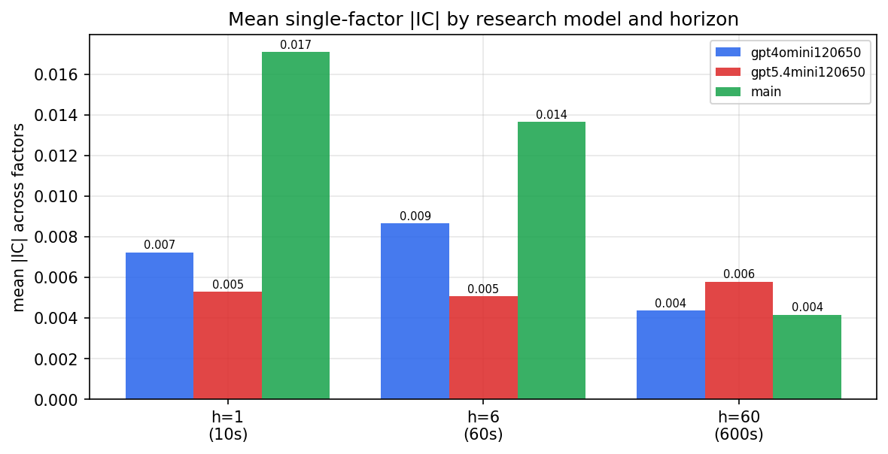

*Mean |IC| by research model and horizon*

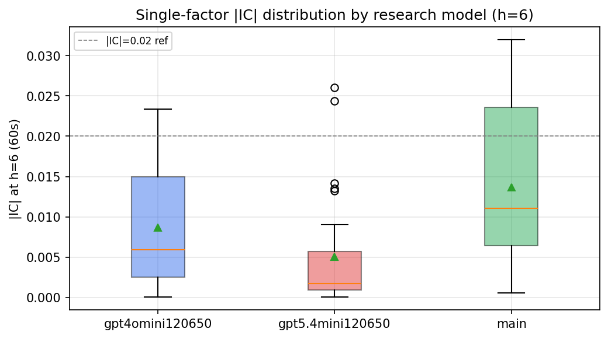

*Per-factor |IC| distribution by research model*

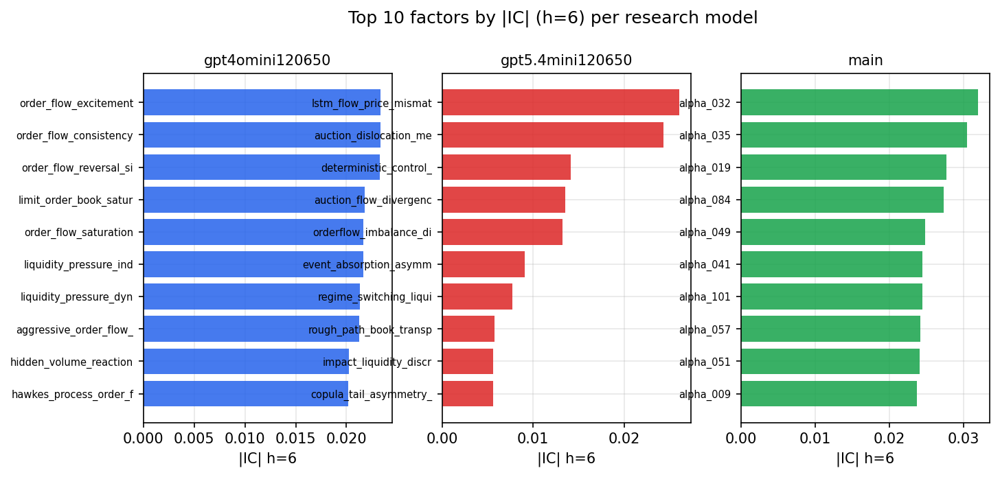

*Top factors by |IC| per research model*

## 2. Factor diversity & redundancy

Pairwise correlation of each zoo's *signals*. `eff_n_factors` is the effective number of independent factors (participation ratio of the correlation eigenvalues); `eff_ratio` and `redundancy` summarise how much unique information the zoo holds vs. how much is duplicated; `n_clusters` groups factors at |corr| ≥ 0.7.

| prerun | n_factors | eff_n_factors | eff_ratio | mean_abs_corr | n_clusters | redundancy |
| --- | --- | --- | --- | --- | --- | --- |
| gpt4omini120650 | 66 | 28.5286 | 0.4323 | 0.0513 | 54 | 0.5677 |
| gpt5.4mini120650 | 69 | 51.6976 | 0.7492 | 0.0123 | 62 | 0.2508 |
| main | 78 | 44.0983 | 0.5654 | 0.0276 | 71 | 0.4346 |

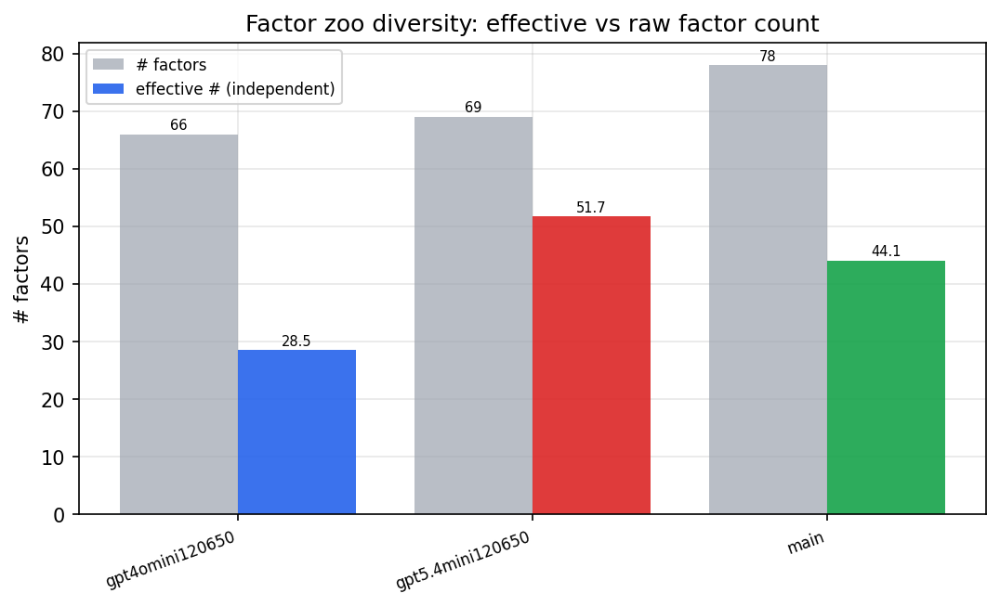

*Effective vs raw factor count per research model*

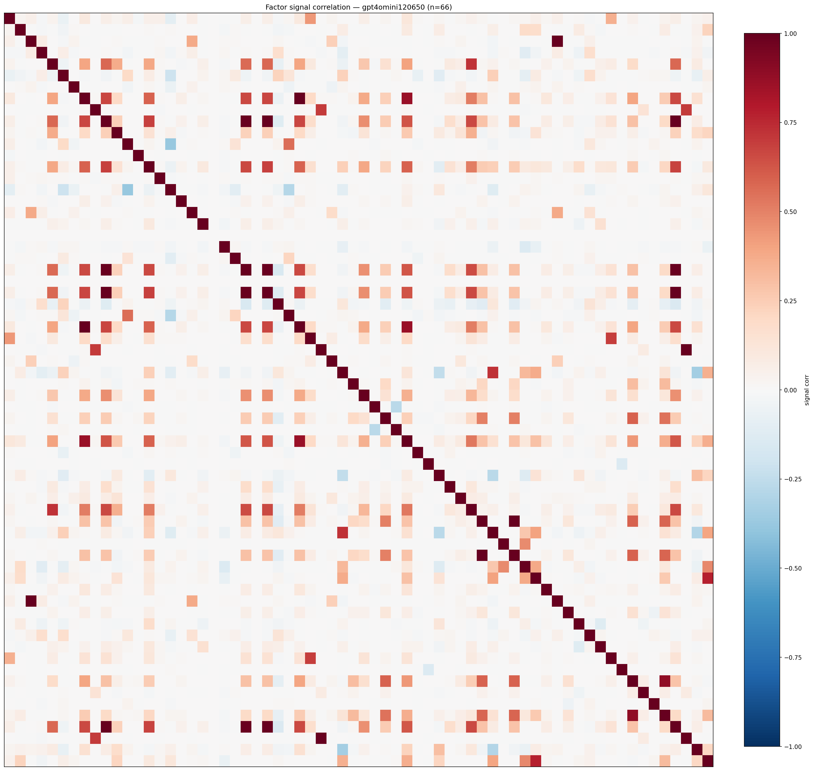

*Signal correlation matrix — gpt4omini120650*

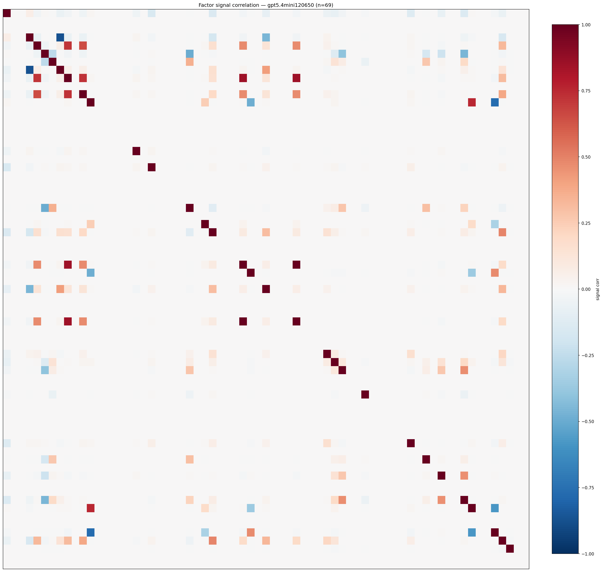

*Signal correlation matrix — gpt5.4mini120650*

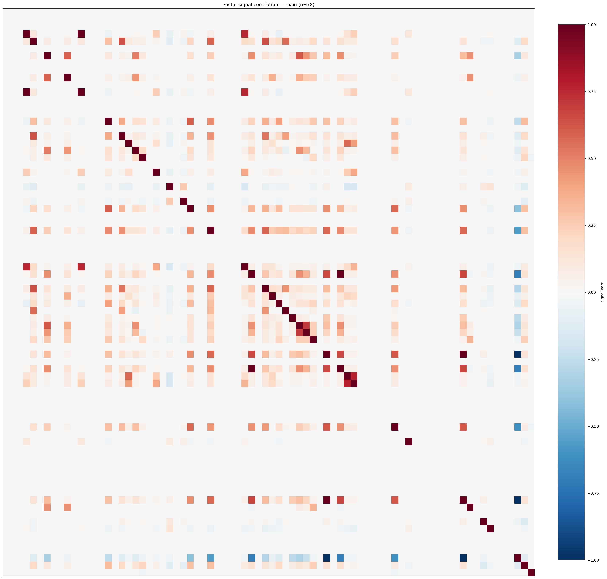

*Signal correlation matrix — main*

## 3. Deflation & model-based importance

`deflated_best_ic` haircuts each zoo's best |IC| for the number of factors tried (`ic_n_tested`) — a bigger zoo's best factor is more likely to be lucky. `lasso_n_nonzero` / `lasso_sparsity` show how many factors a sparse linear model actually keeps (model-view redundancy).

| prerun | best_ic | deflated_best_ic | deflated_best_t | ic_n_tested | ic_n_obs | lasso_n_nonzero | lasso_sparsity |
| --- | --- | --- | --- | --- | --- | --- | --- |
| gpt4omini120650 | 0.0233 | 0.0157 | 5.9379 | 64 | 142738 | 0 | 1.0 |
| gpt5.4mini120650 | 0.0261 | 0.0191 | 7.2287 | 31 | 142738 | 0 | 1.0 |
| main | 0.032 | 0.0248 | 9.3778 | 38 | 142738 | 0 | 1.0 |

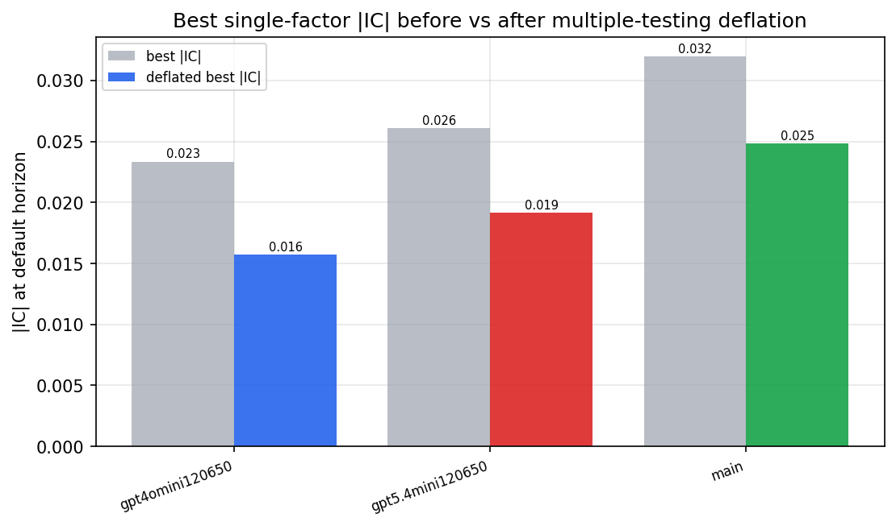

*Best |IC| before vs after multiple-testing deflation*

*Top factors by lasso importance per zoo*

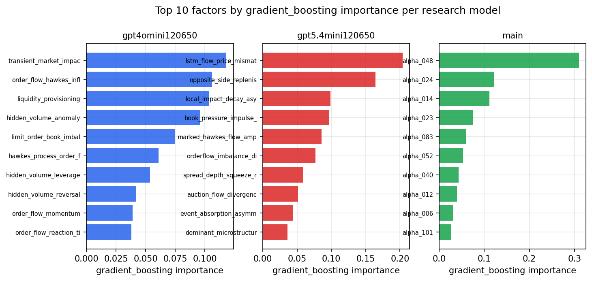

*Top factors by gradient_boosting importance per zoo*

## 4. ML-combined signal — per-underlying vectorised backtest

Each model combines a prerun's factors into ONE signal (fit `factors → forward return` on IS, predict per (bar, underlying)), then that combined signal is run through a simple vectorised backtest — `position(signal) × the underlying's own forward return` — on the held-out OOS tail (+ an equal-weight ensemble). No cross-sectional ranking.

> Config: position=**threshold** (t=1.0, z-score `expanding`), aggregation=**portfolio**, fit-standardise=**per_underlying**, horizon=6.

| prerun | model | n_factors_used | oos_ic | oos_sharpe | is_sharpe | oos_ann_return | oos_max_drawdown |
| --- | --- | --- | --- | --- | --- | --- | --- |
| gpt4omini120650 | linear_regression | 66 | 0.0011 | -0.0739 | 6.244 | -0.0162 | -0.0669 |
| gpt4omini120650 | ridge | 66 | -0.0003 | -0.6473 | 5.8263 | -0.1544 | -0.0749 |
| gpt4omini120650 | lasso | 66 | nan | nan | nan | nan | nan |
| gpt4omini120650 | elastic_net | 66 | nan | nan | nan | nan | nan |
| gpt4omini120650 | random_forest | 66 | -0.0141 | 1.2069 | 9.6852 | 0.2754 | -0.0894 |
| gpt4omini120650 | gradient_boosting | 66 | -0.0008 | 2.0771 | 9.043 | 0.2236 | -0.0226 |
| gpt4omini120650 | xgboost | 66 | -0.0074 | -0.8088 | 10.9158 | -0.0924 | -0.0376 |
| gpt4omini120650 | lightgbm | 66 | -0.0052 | -1.7451 | 12.894 | -0.1956 | -0.0474 |
| gpt4omini120650 | ensemble | 66 | -0.0032 | -0.4105 | 12.4325 | -0.0809 | -0.0759 |
| gpt5.4mini120650 | linear_regression | 69 | 0.0028 | 2.5808 | 5.6154 | 0.3679 | -0.0418 |
| gpt5.4mini120650 | ridge | 69 | 0.0027 | 3.0072 | 5.5772 | 0.4874 | -0.0454 |
| gpt5.4mini120650 | lasso | 69 | nan | nan | nan | nan | nan |
| gpt5.4mini120650 | elastic_net | 69 | nan | nan | nan | nan | nan |
| gpt5.4mini120650 | random_forest | 69 | -0.0037 | 3.4418 | 10.0653 | 0.3998 | -0.0278 |
| gpt5.4mini120650 | gradient_boosting | 69 | -0.0027 | 3.6656 | 10.2984 | 0.2155 | -0.0171 |
| gpt5.4mini120650 | xgboost | 69 | 0.002 | 2.1132 | 11.4283 | 0.2264 | -0.0213 |
| gpt5.4mini120650 | lightgbm | 69 | 0.0086 | 3.5109 | 17.586 | 0.3658 | -0.0285 |
| gpt5.4mini120650 | ensemble | 69 | 0.0012 | 2.9761 | 12.9241 | 0.4008 | -0.0328 |
| main | linear_regression | 78 | -0.0199 | -2.8073 | 6.2737 | -0.461 | -0.0776 |
| main | ridge | 78 | -0.0042 | -4.3425 | 6.8092 | -0.6372 | -0.0695 |
| main | lasso | 78 | nan | nan | nan | nan | nan |
| main | elastic_net | 78 | nan | nan | nan | nan | nan |
| main | random_forest | 78 | -0.0112 | 2.4646 | 7.2266 | 0.4488 | -0.0466 |
| main | gradient_boosting | 78 | -0.0145 | 3.0639 | 8.7975 | 0.4692 | -0.041 |
| main | xgboost | 78 | -0.0039 | 6.8115 | 9.7917 | 0.7226 | -0.0219 |
| main | lightgbm | 78 | -0.001 | 6.809 | 12.4825 | 0.6642 | -0.0202 |
| main | ensemble | 78 | -0.0176 | 3.5095 | 10.1522 | 0.4846 | -0.0349 |

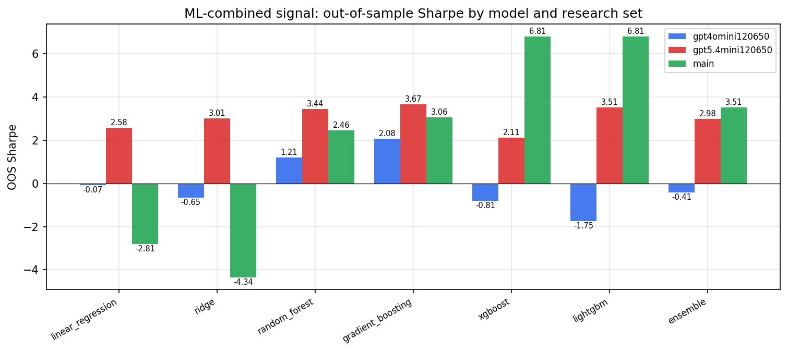

*ML-combined OOS Sharpe by model and research set*

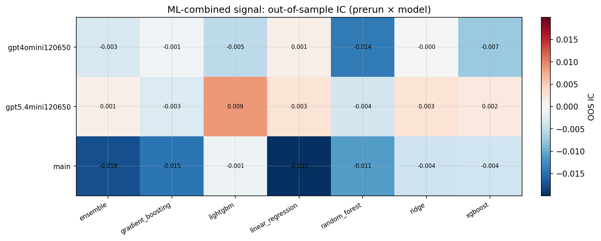

*ML-combined OOS IC (prerun × model)*

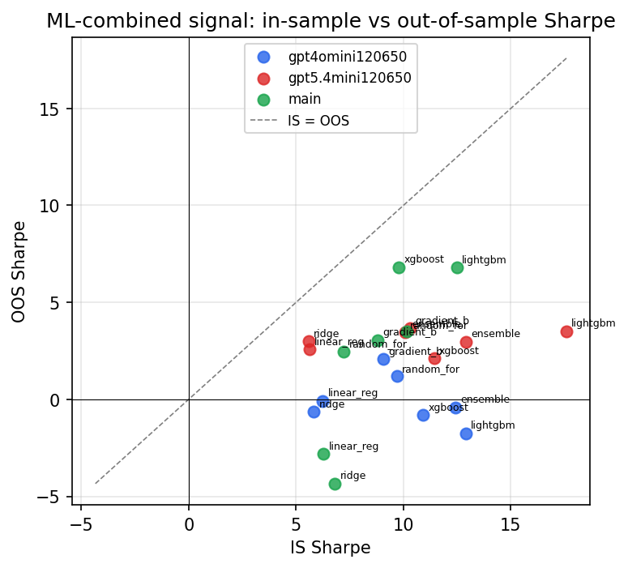

*IS vs OOS Sharpe (overfitting diagnostic)*

---
*Generated by `run_model_comparison.py`. Tables: `*.csv`; interactive: `comparison.ipynb`.*
