# Research-LLM factor comparison — `2025-07`

Comparing the **factor output of different research LLMs** on three axes (raw factor quality → factors as ML features → factors through the full agentic fund). The panel, IS/OOS split, horizon and model hyper-parameters are held identical across preruns — the *only* variable is the factor set.

## Preruns compared

| prerun | research_model | usable_factors | dropped_factors |
| --- | --- | --- | --- |
| gpt4omini120650 | gpt-4o-mini | 66 | 0 |
| gpt5.4mini120650 | gpt-5.4-mini | 69 | 0 |
| main | seed library | 78 | 10 |

> Dropped factors declare fields the current data doesn't have yet (e.g. fundamentals); they light up unchanged once that data is downloaded.

*Usable vs awaiting-data factors per research model*

## Key findings

- **Best ML-combined OOS Sharpe:** `main` with `linear_regression` (OOS Sharpe = 6.982).
- **Mean OOS Sharpe across models, by research set:** `main` = 3.469, `gpt5.4mini120650` = 1.000, `gpt4omini120650` = -0.506.
- **Highest mean single-factor |IC| (h=6):** `main` (mean |IC| = 0.0131).
- **Most diverse zoo (highest effective/raw factor ratio):** `gpt5.4mini120650` (eff 51.3 of 69, ratio 0.74).
- **Best selection-deflated single-factor |IC|:** `main` (deflated |IC| = 0.0228 from 38 factors tried).

## 1. Single-factor IC (raw factor quality)

Per-underlying time-series Spearman rank-IC of every researched factor, recomputed on the shared panel at horizons h=1, h=6, h=60. The per-underlying IC correlates each factor's value vector with the underlying's own forward-return vector (pooled across underlyings); the cross-sectional IC ranks across underlyings per timestamp.

| prerun | n_factors | mean_abs_ic_1 | mean_abs_ic_6 | mean_abs_ic_60 | mean_abs_icir_6 | best_factor_h6 | best_abs_ic_h6 |
| --- | --- | --- | --- | --- | --- | --- | --- |
| gpt4omini120650 | 66 | 0.007 | 0.0082 | 0.0062 | 0.4115 | order_flow_reversal_signal | 0.0212 |
| gpt5.4mini120650 | 69 | 0.006 | 0.0064 | 0.0072 | 0.3784 | auction_dislocation_mean_reversion | 0.0247 |
| main | 78 | 0.019 | 0.0131 | 0.0042 | 0.8698 | alpha_032 | 0.0299 |

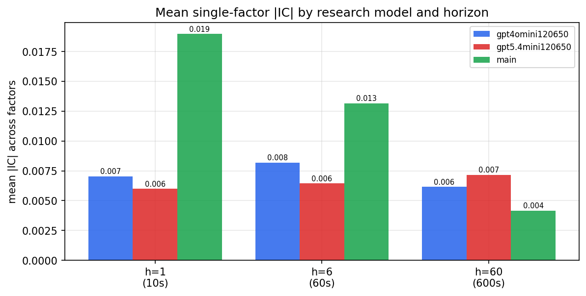

*Mean |IC| by research model and horizon*

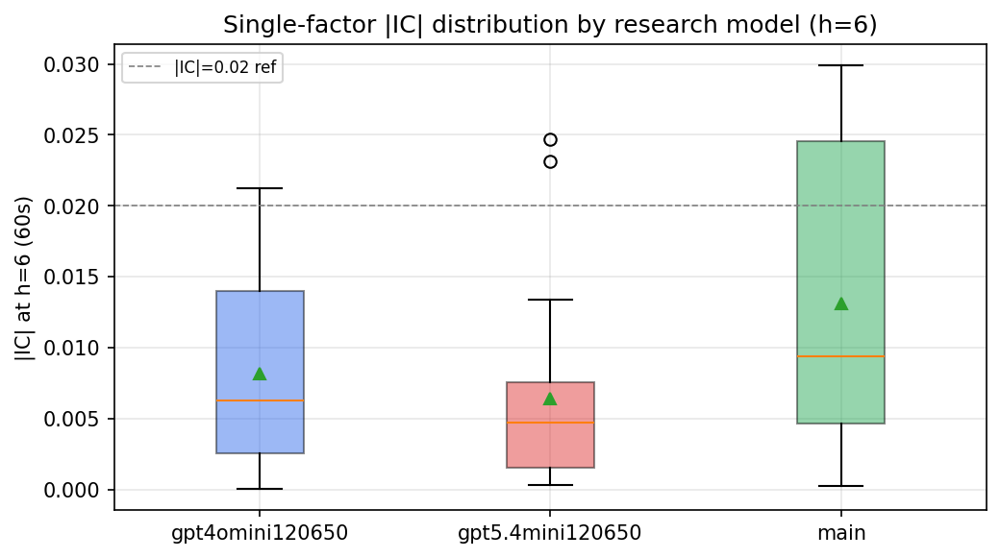

*Per-factor |IC| distribution by research model*

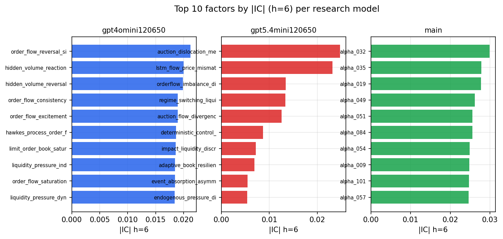

*Top factors by |IC| per research model*

## 2. Factor diversity & redundancy

Pairwise correlation of each zoo's *signals*. `eff_n_factors` is the effective number of independent factors (participation ratio of the correlation eigenvalues); `eff_ratio` and `redundancy` summarise how much unique information the zoo holds vs. how much is duplicated; `n_clusters` groups factors at |corr| ≥ 0.7.

| prerun | n_factors | eff_n_factors | eff_ratio | mean_abs_corr | n_clusters | redundancy |
| --- | --- | --- | --- | --- | --- | --- |
| gpt4omini120650 | 66 | 27.9152 | 0.423 | 0.0509 | 51 | 0.577 |
| gpt5.4mini120650 | 69 | 51.3471 | 0.7442 | 0.0131 | 64 | 0.2558 |
| main | 78 | 42.6544 | 0.5469 | 0.0294 | 70 | 0.4531 |

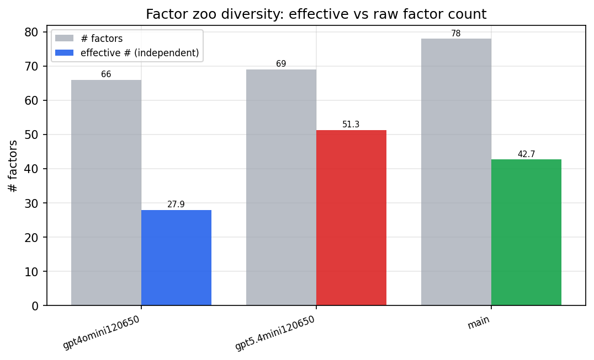

*Effective vs raw factor count per research model*

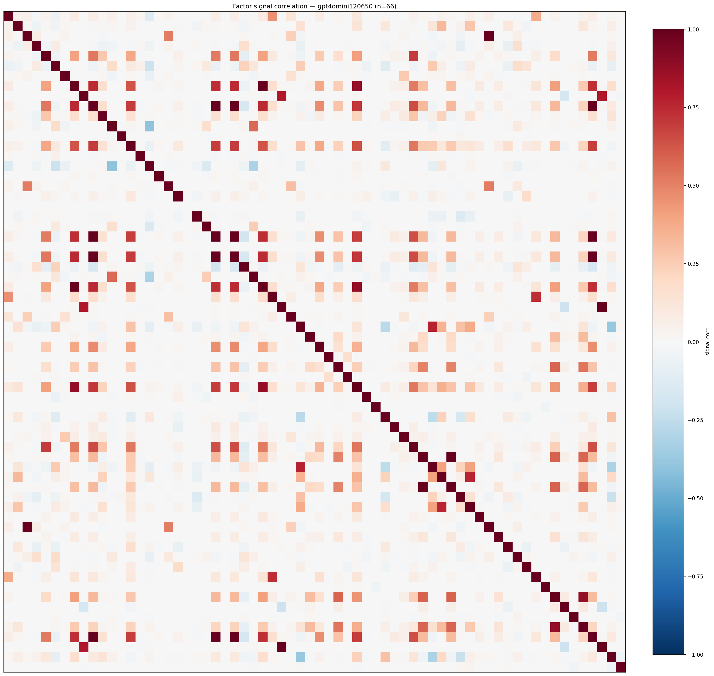

*Signal correlation matrix — gpt4omini120650*

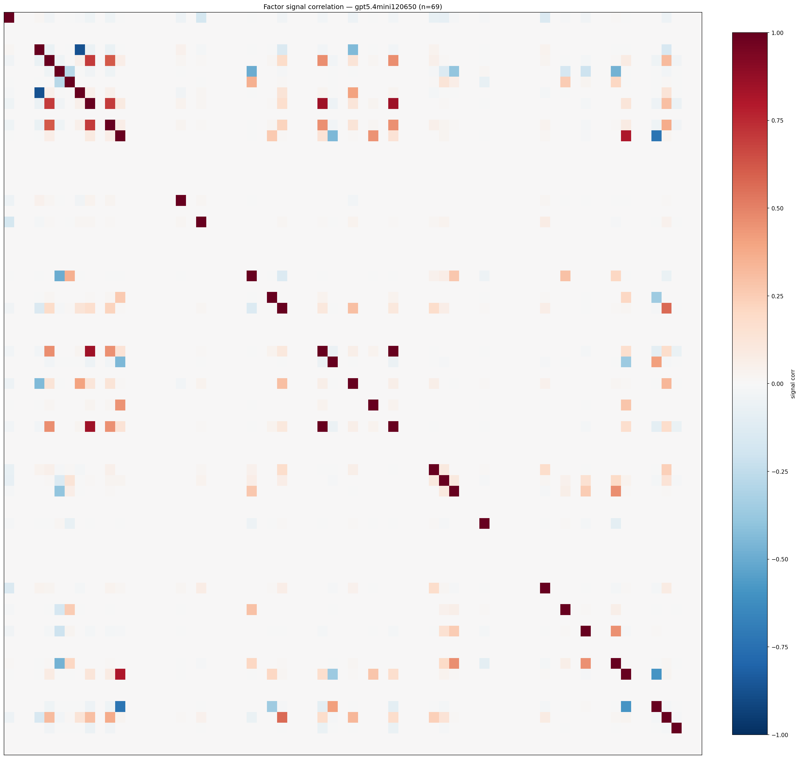

*Signal correlation matrix — gpt5.4mini120650*

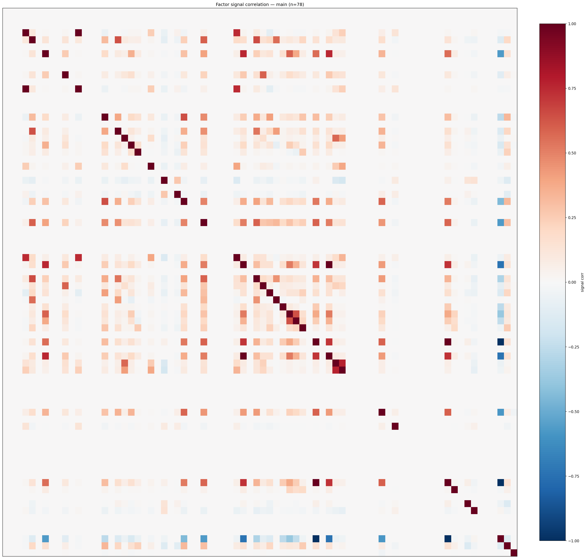

*Signal correlation matrix — main*

## 3. Deflation & model-based importance

`deflated_best_ic` haircuts each zoo's best |IC| for the number of factors tried (`ic_n_tested`) — a bigger zoo's best factor is more likely to be lucky. `lasso_n_nonzero` / `lasso_sparsity` show how many factors a sparse linear model actually keeps (model-view redundancy).

| prerun | best_ic | deflated_best_ic | deflated_best_t | ic_n_tested | ic_n_obs | lasso_n_nonzero | lasso_sparsity |
| --- | --- | --- | --- | --- | --- | --- | --- |
| gpt4omini120650 | 0.0212 | 0.0136 | 5.1743 | 64 | 143999 | 0 | 1.0 |
| gpt5.4mini120650 | 0.0247 | 0.0181 | 6.8565 | 24 | 143999 | 0 | 1.0 |
| main | 0.0299 | 0.0228 | 8.6412 | 38 | 143999 | 0 | 1.0 |

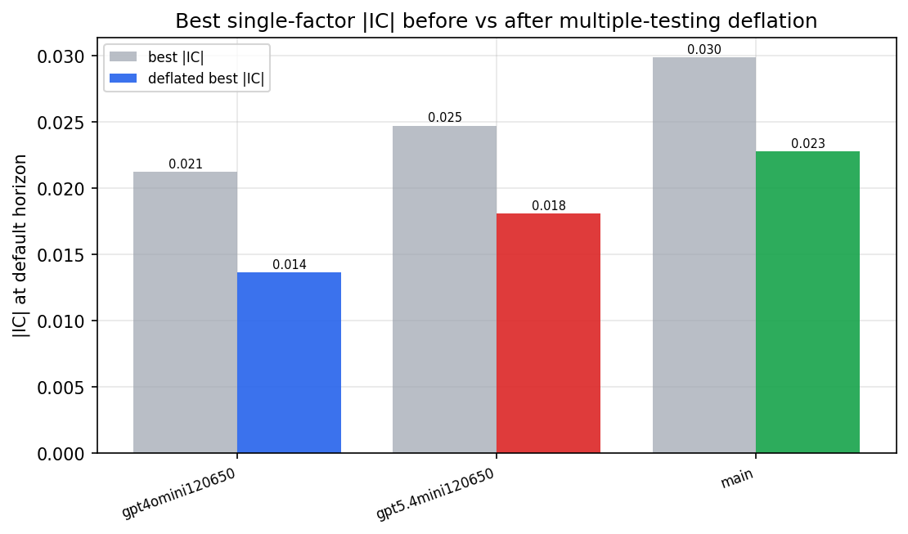

*Best |IC| before vs after multiple-testing deflation*

*Top factors by lasso importance per zoo*

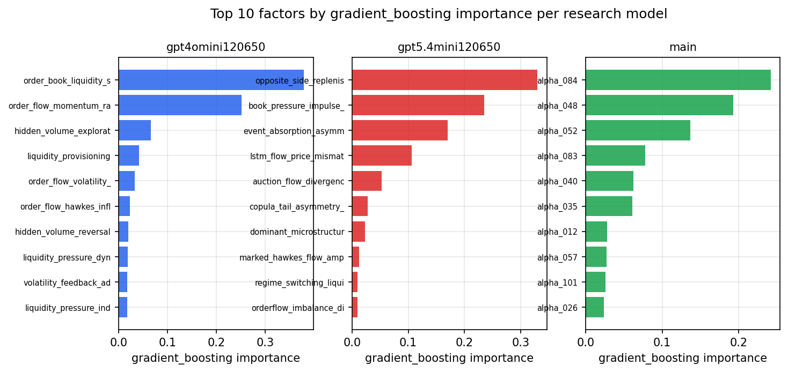

*Top factors by gradient_boosting importance per zoo*

## 4. ML-combined signal — per-underlying vectorised backtest

Each model combines a prerun's factors into ONE signal (fit `factors → forward return` on IS, predict per (bar, underlying)), then that combined signal is run through a simple vectorised backtest — `position(signal) × the underlying's own forward return` — on the held-out OOS tail (+ an equal-weight ensemble). No cross-sectional ranking.

> Config: position=**threshold** (t=1.0, z-score `expanding`), aggregation=**portfolio**, fit-standardise=**per_underlying**, horizon=6.

| prerun | model | n_factors_used | oos_ic | oos_sharpe | is_sharpe | oos_ann_return | oos_max_drawdown |
| --- | --- | --- | --- | --- | --- | --- | --- |
| gpt4omini120650 | linear_regression | 66 | -0.009 | -0.7513 | 6.726 | -0.1037 | -0.0386 |
| gpt4omini120650 | ridge | 66 | -0.01 | -0.6783 | 6.6298 | -0.0927 | -0.0431 |
| gpt4omini120650 | lasso | 66 | nan | nan | nan | nan | nan |
| gpt4omini120650 | elastic_net | 66 | nan | nan | nan | nan | nan |
| gpt4omini120650 | random_forest | 66 | -0.0043 | -1.6845 | 9.3814 | -0.1875 | -0.0482 |
| gpt4omini120650 | gradient_boosting | 66 | -0.0106 | 2.5465 | 10.0363 | 0.1066 | -0.0113 |
| gpt4omini120650 | xgboost | 66 | -0.009 | 0.1029 | 12.0298 | 0.006 | -0.0174 |
| gpt4omini120650 | lightgbm | 66 | 0.0007 | -3.3206 | 16.1541 | -0.2341 | -0.0319 |
| gpt4omini120650 | ensemble | 66 | -0.0076 | 0.2407 | 12.0302 | 0.0268 | -0.0308 |
| gpt5.4mini120650 | linear_regression | 69 | 0.0093 | 2.2784 | 4.3568 | 0.0669 | -0.0065 |
| gpt5.4mini120650 | ridge | 69 | 0.0081 | 1.8011 | 4.7405 | 0.0544 | -0.0078 |
| gpt5.4mini120650 | lasso | 69 | -0.005 | 1.5768 | 5.5343 | 0.079 | -0.0181 |
| gpt5.4mini120650 | elastic_net | 69 | -0.005 | 1.5768 | 5.5343 | 0.079 | -0.0181 |
| gpt5.4mini120650 | random_forest | 69 | 0.0084 | 1.2494 | 10.2704 | 0.0513 | -0.0153 |
| gpt5.4mini120650 | gradient_boosting | 69 | 0.012 | -0.5533 | 11.6963 | -0.0174 | -0.011 |
| gpt5.4mini120650 | xgboost | 69 | 0.0048 | -0.5673 | 13.2173 | -0.02 | -0.0118 |
| gpt5.4mini120650 | lightgbm | 69 | 0.0033 | -0.8874 | 18.5224 | -0.0223 | -0.0078 |
| gpt5.4mini120650 | ensemble | 69 | 0.0022 | 2.5286 | 10.6578 | 0.114 | -0.0176 |
| main | linear_regression | 78 | 0.0115 | 6.982 | 8.0311 | 0.5927 | -0.0098 |
| main | ridge | 78 | 0.0134 | 6.9772 | 8.2191 | 0.6072 | -0.0126 |
| main | lasso | 78 | 0.0102 | 6.1333 | 7.7139 | 0.5556 | -0.0162 |
| main | elastic_net | 78 | 0.0102 | 6.0794 | 7.7913 | 0.551 | -0.0162 |
| main | random_forest | 78 | -0.0087 | -1.2242 | 9.7954 | -0.0792 | -0.0271 |
| main | gradient_boosting | 78 | -0.0019 | 3.4948 | 12.7369 | 0.0853 | -0.007 |
| main | xgboost | 78 | -0.0104 | -1.2741 | 11.9805 | -0.0731 | -0.0221 |
| main | lightgbm | 78 | -0.0149 | -0.5433 | 16.2562 | -0.0289 | -0.0177 |
| main | ensemble | 78 | 0.005 | 4.5929 | 12.0932 | 0.3219 | -0.0182 |

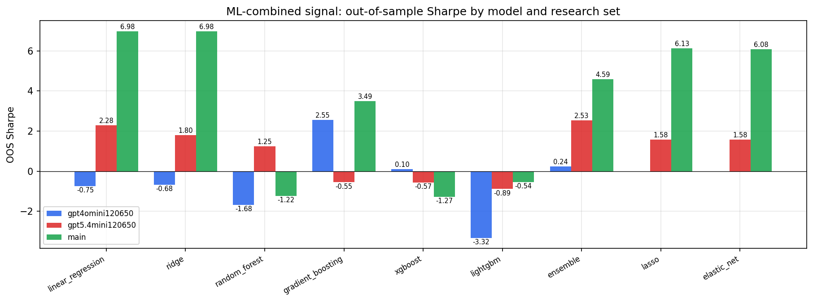

*ML-combined OOS Sharpe by model and research set*

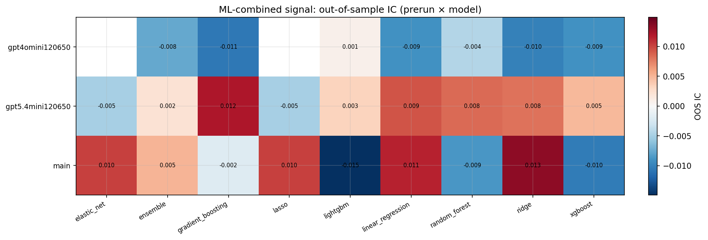

*ML-combined OOS IC (prerun × model)*

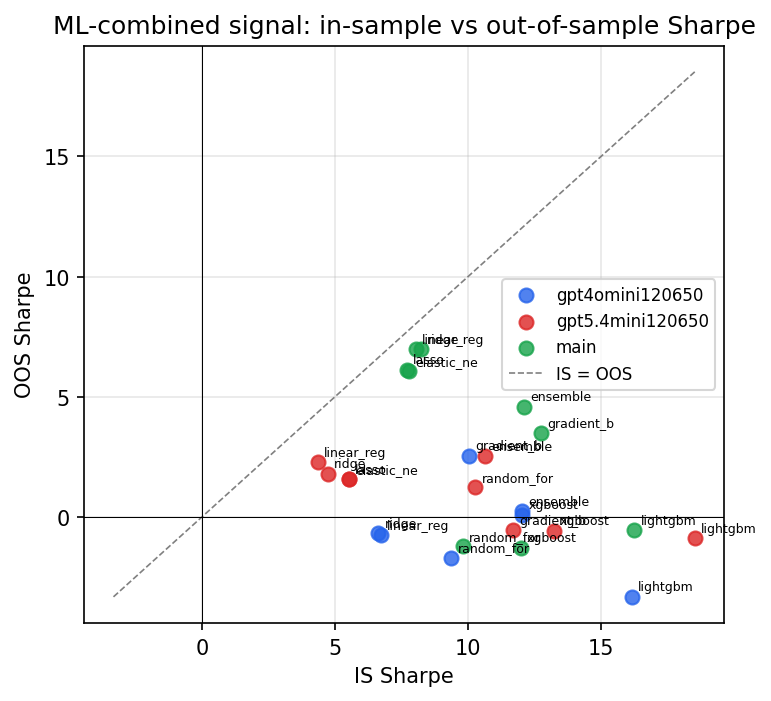

*IS vs OOS Sharpe (overfitting diagnostic)*

---
*Generated by `run_model_comparison.py`. Tables: `*.csv`; interactive: `comparison.ipynb`.*
