# Research-LLM factor comparison — `2025-09`

Comparing the **factor output of different research LLMs** on three axes (raw factor quality → factors as ML features → factors through the full agentic fund). The panel, IS/OOS split, horizon and model hyper-parameters are held identical across preruns — the *only* variable is the factor set.

## Preruns compared

| prerun | research_model | usable_factors | dropped_factors |
| --- | --- | --- | --- |
| gpt4omini120650 | gpt-4o-mini | 66 | 0 |
| gpt5.4mini120650 | gpt-5.4-mini | 69 | 0 |
| main | seed library | 78 | 10 |

> Dropped factors declare fields the current data doesn't have yet (e.g. fundamentals); they light up unchanged once that data is downloaded.

*Usable vs awaiting-data factors per research model*

## Key findings

- **Best ML-combined OOS Sharpe:** `gpt5.4mini120650` with `gradient_boosting` (OOS Sharpe = 6.455).
- **Mean OOS Sharpe across models, by research set:** `gpt4omini120650` = -0.731, `gpt5.4mini120650` = -0.836, `main` = -1.959.
- **Highest mean single-factor |IC| (h=6):** `main` (mean |IC| = 0.0132).
- **Most diverse zoo (highest effective/raw factor ratio):** `gpt5.4mini120650` (eff 56.7 of 69, ratio 0.82).
- **Best selection-deflated single-factor |IC|:** `main` (deflated |IC| = 0.0417 from 38 factors tried).

## 1. Single-factor IC (raw factor quality)

Per-underlying time-series Spearman rank-IC of every researched factor, recomputed on the shared panel at horizons h=1, h=6, h=60. The per-underlying IC correlates each factor's value vector with the underlying's own forward-return vector (pooled across underlyings); the cross-sectional IC ranks across underlyings per timestamp.

| prerun | n_factors | mean_abs_ic_1 | mean_abs_ic_6 | mean_abs_ic_60 | mean_abs_icir_6 | best_factor_h6 | best_abs_ic_h6 |
| --- | --- | --- | --- | --- | --- | --- | --- |
| gpt4omini120650 | 66 | 0.0056 | 0.006 | 0.0057 | 0.3618 | order_flow_momentum | 0.0225 |
| gpt5.4mini120650 | 69 | 0.0054 | 0.0047 | 0.0045 | 0.3069 | auction_dislocation_mean_reversion | 0.0199 |
| main | 78 | 0.0208 | 0.0132 | 0.0082 | 0.7607 | alpha_066 | 0.0487 |

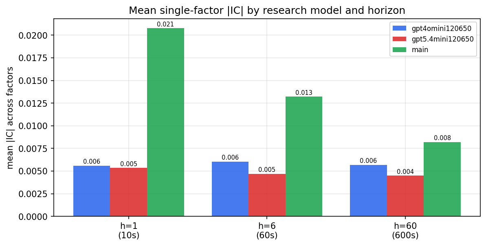

*Mean |IC| by research model and horizon*

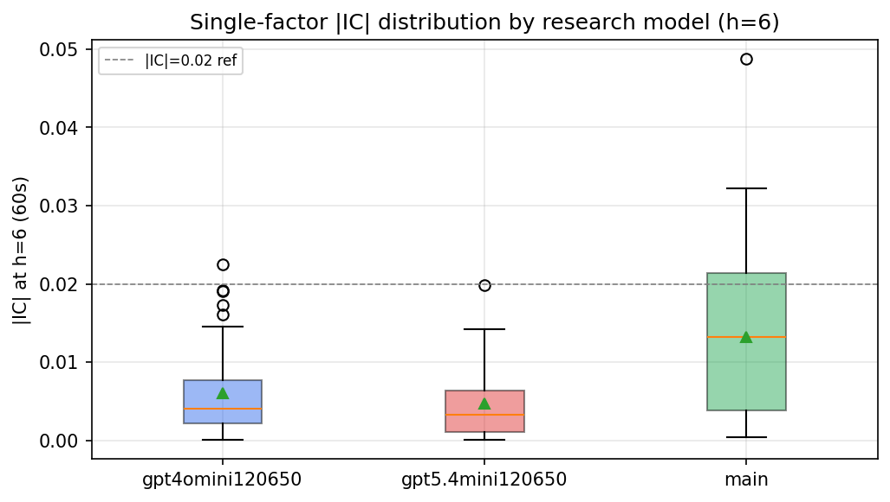

*Per-factor |IC| distribution by research model*

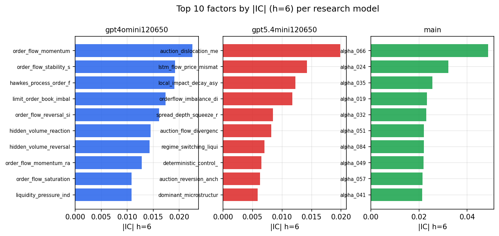

*Top factors by |IC| per research model*

## 2. Factor diversity & redundancy

Pairwise correlation of each zoo's *signals*. `eff_n_factors` is the effective number of independent factors (participation ratio of the correlation eigenvalues); `eff_ratio` and `redundancy` summarise how much unique information the zoo holds vs. how much is duplicated; `n_clusters` groups factors at |corr| ≥ 0.7.

| prerun | n_factors | eff_n_factors | eff_ratio | mean_abs_corr | n_clusters | redundancy |
| --- | --- | --- | --- | --- | --- | --- |
| gpt4omini120650 | 66 | 27.8012 | 0.4212 | 0.0479 | 51 | 0.5788 |
| gpt5.4mini120650 | 69 | 56.6882 | 0.8216 | 0.0094 | 66 | 0.1784 |
| main | 78 | 41.5912 | 0.5332 | 0.0308 | 70 | 0.4668 |

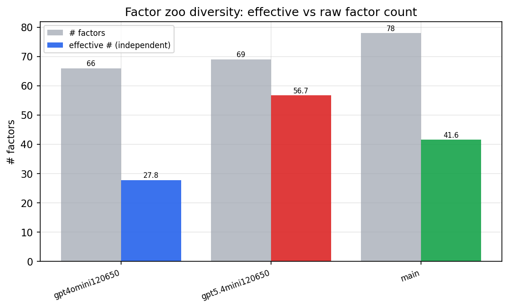

*Effective vs raw factor count per research model*

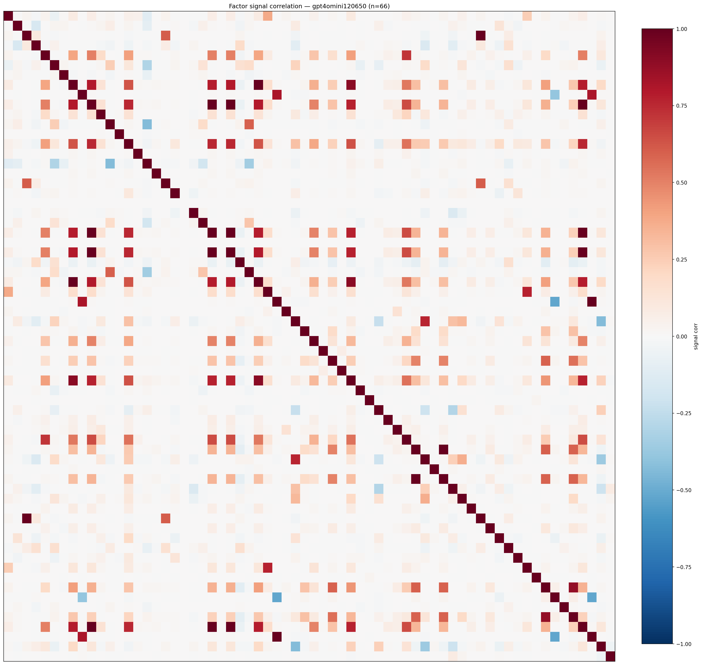

*Signal correlation matrix — gpt4omini120650*

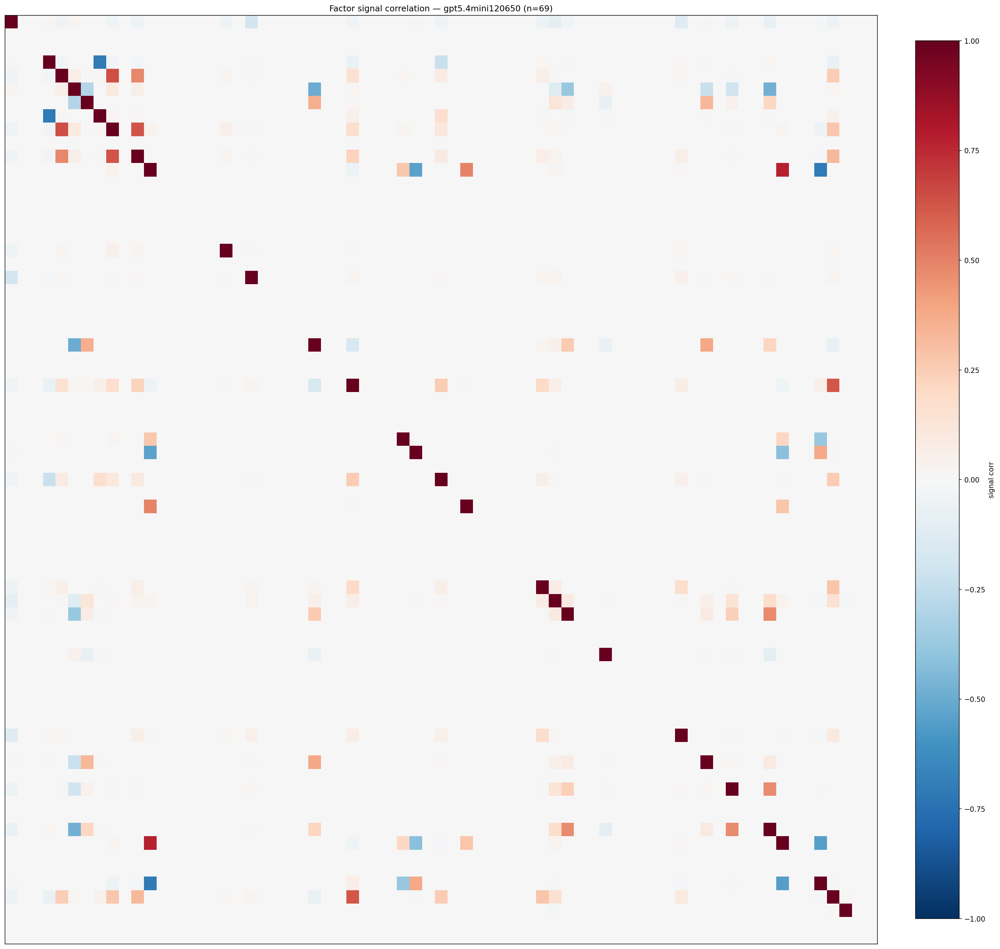

*Signal correlation matrix — gpt5.4mini120650*

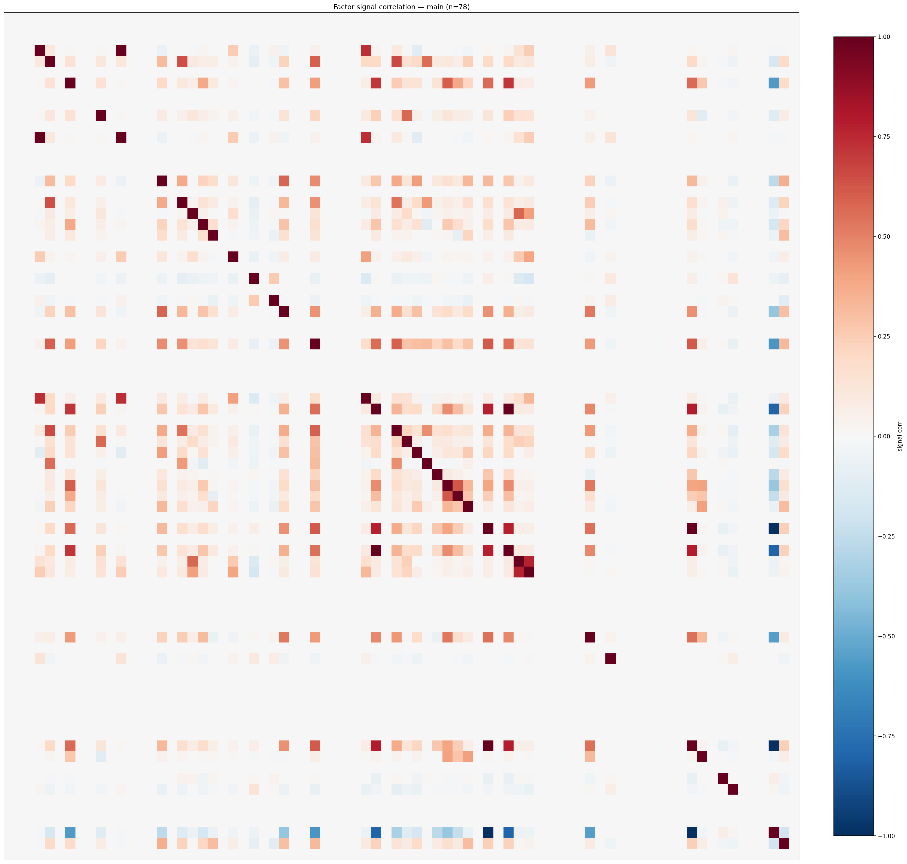

*Signal correlation matrix — main*

## 3. Deflation & model-based importance

`deflated_best_ic` haircuts each zoo's best |IC| for the number of factors tried (`ic_n_tested`) — a bigger zoo's best factor is more likely to be lucky. `lasso_n_nonzero` / `lasso_sparsity` show how many factors a sparse linear model actually keeps (model-view redundancy).

| prerun | best_ic | deflated_best_ic | deflated_best_t | ic_n_tested | ic_n_obs | lasso_n_nonzero | lasso_sparsity |
| --- | --- | --- | --- | --- | --- | --- | --- |
| gpt4omini120650 | 0.0225 | 0.0151 | 5.8066 | 64 | 148679 | 0 | 1.0 |
| gpt5.4mini120650 | 0.0199 | 0.0131 | 5.0459 | 31 | 148679 | 6 | 0.913 |
| main | 0.0487 | 0.0417 | 16.093 | 38 | 148679 | 0 | 1.0 |

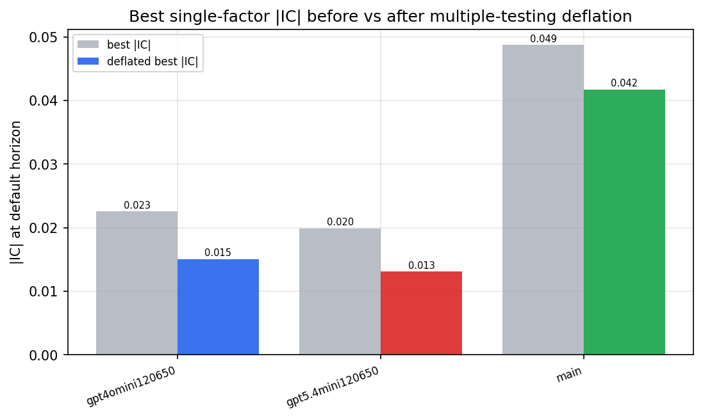

*Best |IC| before vs after multiple-testing deflation*

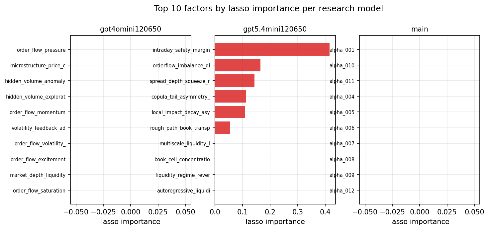

*Top factors by lasso importance per zoo*

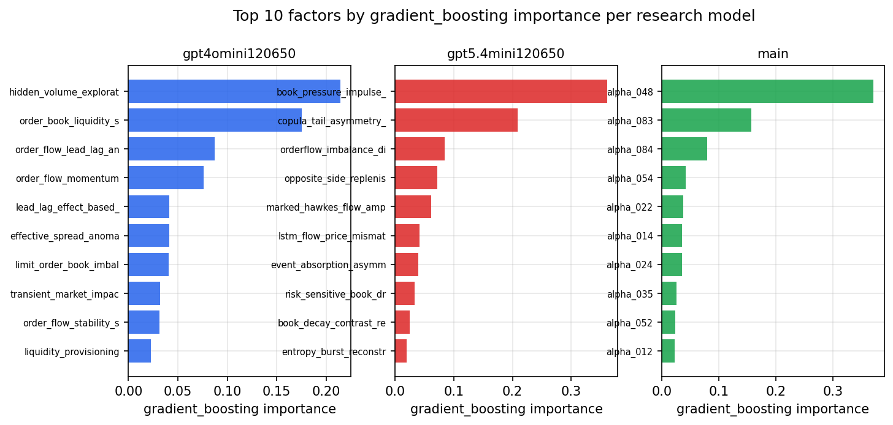

*Top factors by gradient_boosting importance per zoo*

## 4. ML-combined signal — per-underlying vectorised backtest

Each model combines a prerun's factors into ONE signal (fit `factors → forward return` on IS, predict per (bar, underlying)), then that combined signal is run through a simple vectorised backtest — `position(signal) × the underlying's own forward return` — on the held-out OOS tail (+ an equal-weight ensemble). No cross-sectional ranking.

> Config: position=**threshold** (t=1.0, z-score `expanding`), aggregation=**portfolio**, fit-standardise=**per_underlying**, horizon=6.

| prerun | model | n_factors_used | oos_ic | oos_sharpe | is_sharpe | oos_ann_return | oos_max_drawdown |
| --- | --- | --- | --- | --- | --- | --- | --- |
| gpt4omini120650 | linear_regression | 66 | -0.0178 | -1.7361 | 10.3623 | -0.2078 | -0.0324 |
| gpt4omini120650 | ridge | 66 | -0.0234 | -2.4183 | 11.0344 | -0.2992 | -0.0378 |
| gpt4omini120650 | lasso | 66 | -0.0341 | -4.0866 | 10.0909 | -0.386 | -0.0387 |
| gpt4omini120650 | elastic_net | 66 | -0.0343 | -4.2111 | 10.1488 | -0.4087 | -0.0397 |
| gpt4omini120650 | random_forest | 66 | -0.0013 | 4.2558 | 9.8043 | 0.4802 | -0.0134 |
| gpt4omini120650 | gradient_boosting | 66 | 0.0151 | -1.3136 | 9.8929 | -0.1128 | -0.0163 |
| gpt4omini120650 | xgboost | 66 | -0.0006 | 3.1375 | 14.6908 | 0.2752 | -0.0127 |
| gpt4omini120650 | lightgbm | 66 | -0.0065 | 0.1227 | 19.3575 | 0.0108 | -0.0248 |
| gpt4omini120650 | ensemble | 66 | -0.0266 | -0.3309 | 16.1535 | -0.039 | -0.0372 |
| gpt5.4mini120650 | linear_regression | 69 | -0.003 | -1.593 | 11.4854 | -0.1047 | -0.0214 |
| gpt5.4mini120650 | ridge | 69 | -0.0054 | -2.6827 | 10.1798 | -0.1748 | -0.0258 |
| gpt5.4mini120650 | lasso | 69 | -0.0087 | 0.7736 | 5.4762 | 0.0301 | -0.0083 |
| gpt5.4mini120650 | elastic_net | 69 | -0.0155 | -0.432 | 3.5819 | -0.0186 | -0.014 |
| gpt5.4mini120650 | random_forest | 69 | -0.0016 | 1.1053 | 12.9678 | 0.0574 | -0.0138 |
| gpt5.4mini120650 | gradient_boosting | 69 | -0.0073 | 6.4545 | 13.0877 | 0.1445 | -0.0018 |
| gpt5.4mini120650 | xgboost | 69 | 0.0059 | -1.4049 | 20.9386 | -0.0749 | -0.0183 |
| gpt5.4mini120650 | lightgbm | 69 | 0.011 | -4.9723 | 25.5662 | -0.1639 | -0.022 |
| gpt5.4mini120650 | ensemble | 69 | -0.0046 | -4.7681 | 18.2449 | -0.2616 | -0.0291 |
| main | linear_regression | 78 | -0.0028 | -2.3359 | 11.5778 | -0.1659 | -0.0201 |
| main | ridge | 78 | -0.0078 | -1.2087 | 10.344 | -0.0862 | -0.0189 |
| main | lasso | 78 | -0.0408 | -5.9814 | 4.8713 | -0.2243 | -0.0191 |
| main | elastic_net | 78 | -0.0408 | -5.9814 | 4.8713 | -0.2243 | -0.0191 |
| main | random_forest | 78 | 0.019 | 2.0567 | 11.9937 | 0.1202 | -0.01 |
| main | gradient_boosting | 78 | 0.0136 | -6.2266 | 12.6494 | -0.1699 | -0.0146 |
| main | xgboost | 78 | 0.0081 | 2.0478 | 16.4448 | 0.0654 | -0.007 |
| main | lightgbm | 78 | 0.0138 | 1.5096 | 23.1719 | 0.058 | -0.0094 |
| main | ensemble | 78 | -0.0086 | -1.5114 | 17.1451 | -0.067 | -0.0107 |

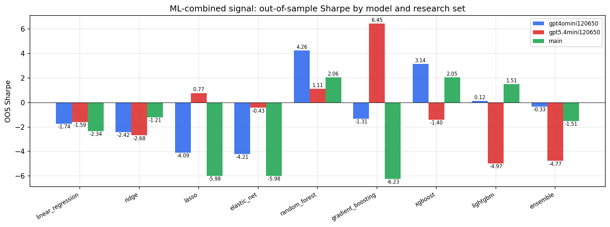

*ML-combined OOS Sharpe by model and research set*

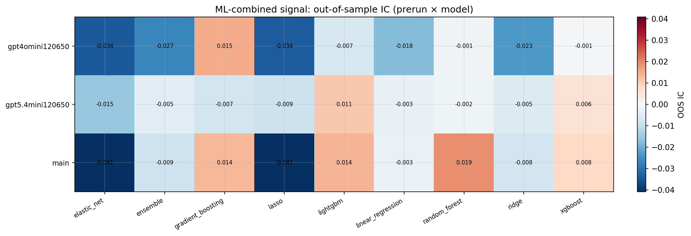

*ML-combined OOS IC (prerun × model)*

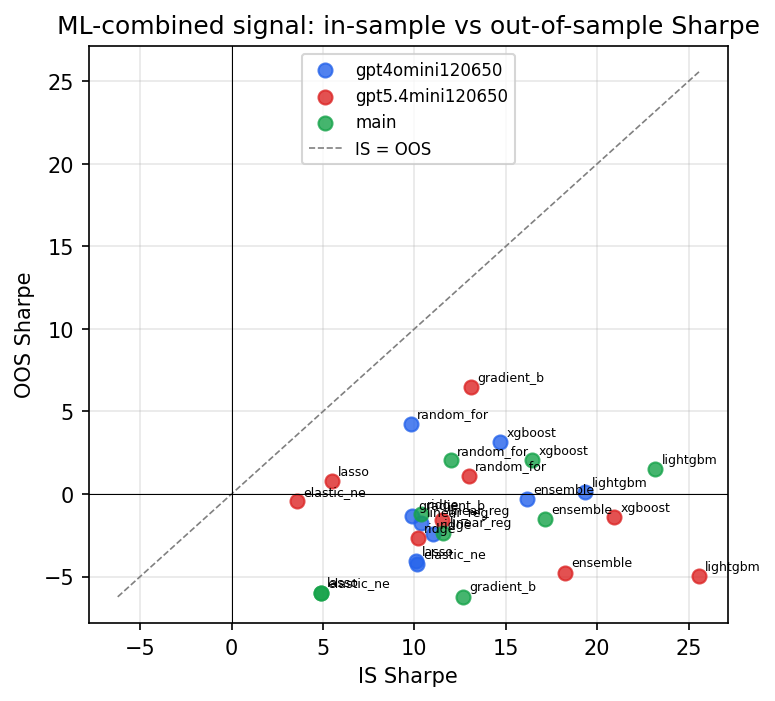

*IS vs OOS Sharpe (overfitting diagnostic)*

---
*Generated by `run_model_comparison.py`. Tables: `*.csv`; interactive: `comparison.ipynb`.*
