# Research-LLM factor comparison — `2025-10`

Comparing the **factor output of different research LLMs** on three axes (raw factor quality → factors as ML features → factors through the full agentic fund). The panel, IS/OOS split, horizon and model hyper-parameters are held identical across preruns — the *only* variable is the factor set.

## Preruns compared

| prerun | research_model | usable_factors | dropped_factors |
| --- | --- | --- | --- |
| gpt4omini120650 | gpt-4o-mini | 66 | 0 |
| gpt5.4mini120650 | gpt-5.4-mini | 69 | 0 |
| main | seed library | 78 | 10 |

> Dropped factors declare fields the current data doesn't have yet (e.g. fundamentals); they light up unchanged once that data is downloaded.

*Usable vs awaiting-data factors per research model*

## Key findings

- **Best ML-combined OOS Sharpe:** `main` with `gradient_boosting` (OOS Sharpe = 5.069).
- **Mean OOS Sharpe across models, by research set:** `main` = 2.572, `gpt4omini120650` = -0.513, `gpt5.4mini120650` = -4.436.
- **Highest mean single-factor |IC| (h=6):** `main` (mean |IC| = 0.0139).
- **Most diverse zoo (highest effective/raw factor ratio):** `gpt5.4mini120650` (eff 56.0 of 69, ratio 0.81).
- **Best selection-deflated single-factor |IC|:** `main` (deflated |IC| = 0.0286 from 37 factors tried).

## 1. Single-factor IC (raw factor quality)

Per-underlying time-series Spearman rank-IC of every researched factor, recomputed on the shared panel at horizons h=1, h=6, h=60. The per-underlying IC correlates each factor's value vector with the underlying's own forward-return vector (pooled across underlyings); the cross-sectional IC ranks across underlyings per timestamp.

| prerun | n_factors | mean_abs_ic_1 | mean_abs_ic_6 | mean_abs_ic_60 | mean_abs_icir_6 | best_factor_h6 | best_abs_ic_h6 |
| --- | --- | --- | --- | --- | --- | --- | --- |
| gpt4omini120650 | 66 | 0.0054 | 0.0071 | 0.0076 | 0.4096 | order_flow_momentum | 0.0245 |
| gpt5.4mini120650 | 69 | 0.0053 | 0.0064 | 0.0077 | 0.3074 | auction_dislocation_mean_reversion | 0.0229 |
| main | 78 | 0.02 | 0.0139 | 0.0081 | 0.7712 | alpha_066 | 0.0355 |

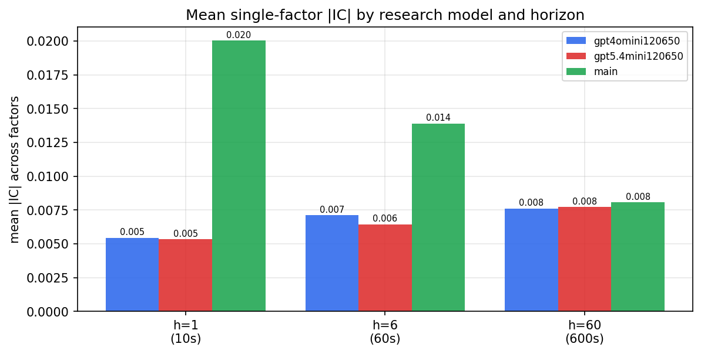

*Mean |IC| by research model and horizon*

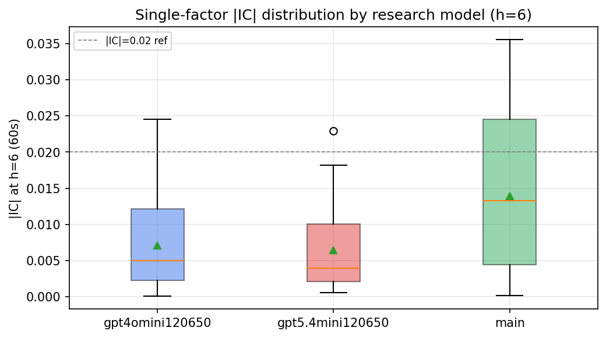

*Per-factor |IC| distribution by research model*

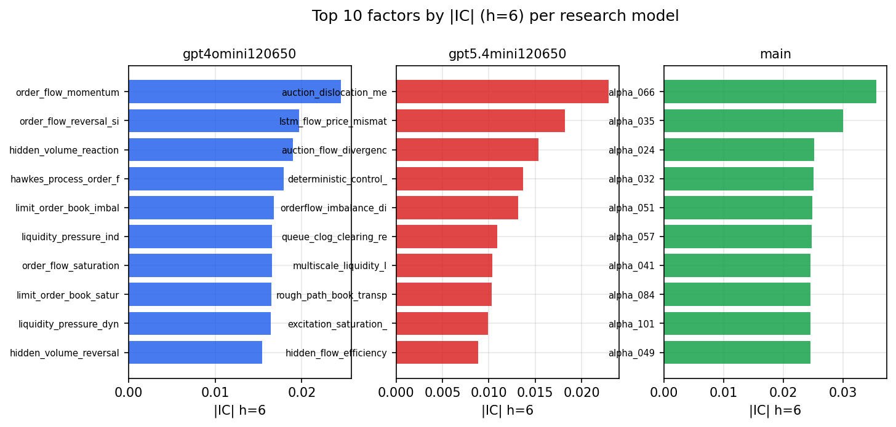

*Top factors by |IC| per research model*

## 2. Factor diversity & redundancy

Pairwise correlation of each zoo's *signals*. `eff_n_factors` is the effective number of independent factors (participation ratio of the correlation eigenvalues); `eff_ratio` and `redundancy` summarise how much unique information the zoo holds vs. how much is duplicated; `n_clusters` groups factors at |corr| ≥ 0.7.

| prerun | n_factors | eff_n_factors | eff_ratio | mean_abs_corr | n_clusters | redundancy |
| --- | --- | --- | --- | --- | --- | --- |
| gpt4omini120650 | 66 | 28.0635 | 0.4252 | 0.0481 | 51 | 0.5748 |
| gpt5.4mini120650 | 69 | 56.0363 | 0.8121 | 0.0096 | 65 | 0.1879 |
| main | 78 | 42.2609 | 0.5418 | 0.0302 | 71 | 0.4582 |

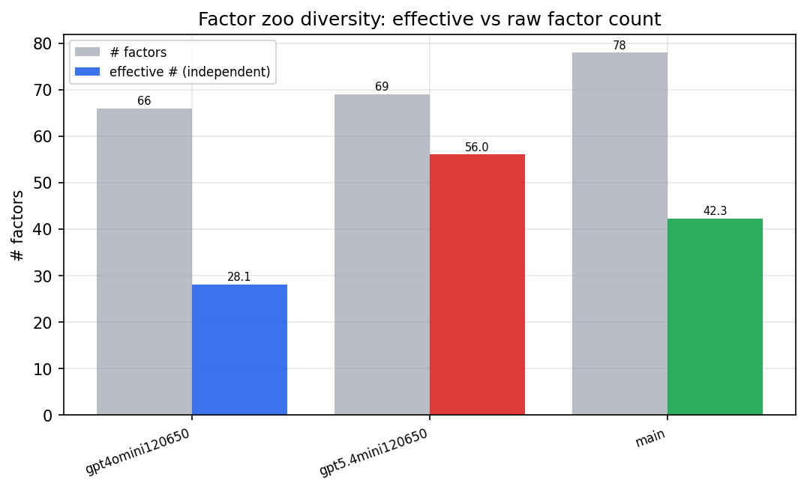

*Effective vs raw factor count per research model*

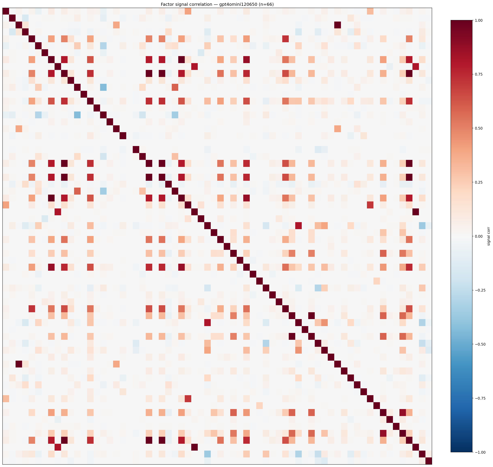

*Signal correlation matrix — gpt4omini120650*

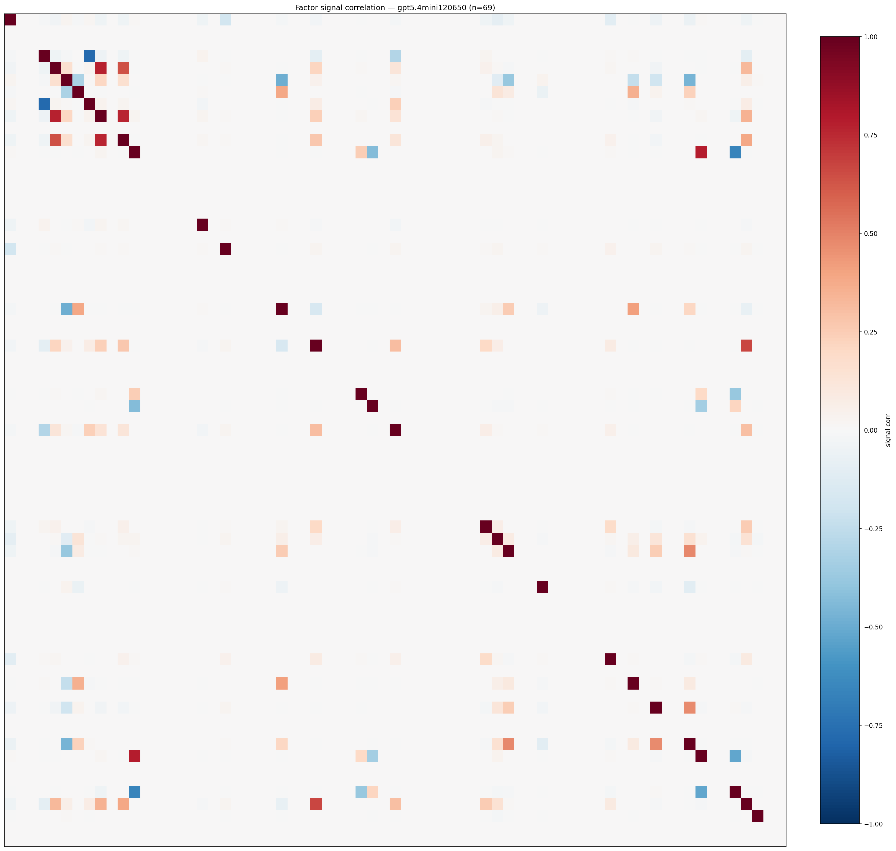

*Signal correlation matrix — gpt5.4mini120650*

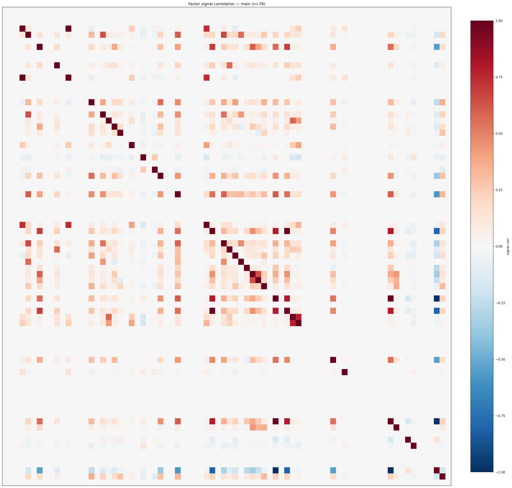

*Signal correlation matrix — main*

## 3. Deflation & model-based importance

`deflated_best_ic` haircuts each zoo's best |IC| for the number of factors tried (`ic_n_tested`) — a bigger zoo's best factor is more likely to be lucky. `lasso_n_nonzero` / `lasso_sparsity` show how many factors a sparse linear model actually keeps (model-view redundancy).

| prerun | best_ic | deflated_best_ic | deflated_best_t | ic_n_tested | ic_n_obs | lasso_n_nonzero | lasso_sparsity |
| --- | --- | --- | --- | --- | --- | --- | --- |
| gpt4omini120650 | 0.0245 | 0.0171 | 6.675 | 64 | 152099 | 0 | 1.0 |
| gpt5.4mini120650 | 0.0229 | 0.0162 | 6.3146 | 31 | 152099 | 0 | 1.0 |
| main | 0.0355 | 0.0286 | 11.1721 | 37 | 152099 | 0 | 1.0 |

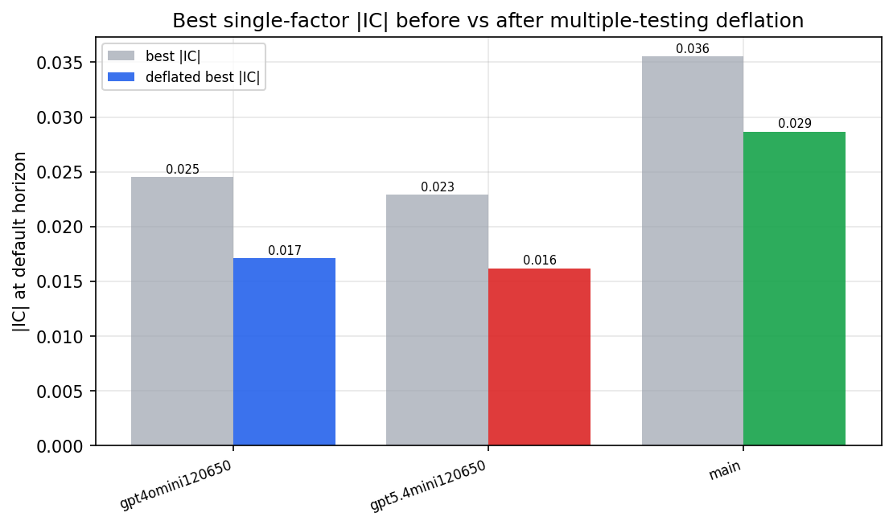

*Best |IC| before vs after multiple-testing deflation*

*Top factors by lasso importance per zoo*

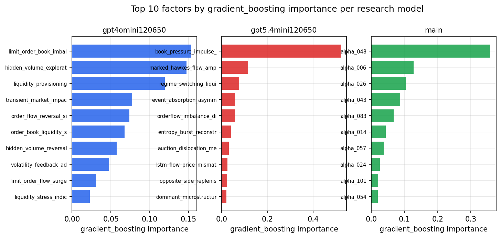

*Top factors by gradient_boosting importance per zoo*

## 4. ML-combined signal — per-underlying vectorised backtest

Each model combines a prerun's factors into ONE signal (fit `factors → forward return` on IS, predict per (bar, underlying)), then that combined signal is run through a simple vectorised backtest — `position(signal) × the underlying's own forward return` — on the held-out OOS tail (+ an equal-weight ensemble). No cross-sectional ranking.

> Config: position=**threshold** (t=1.0, z-score `expanding`), aggregation=**portfolio**, fit-standardise=**per_underlying**, horizon=6.

| prerun | model | n_factors_used | oos_ic | oos_sharpe | is_sharpe | oos_ann_return | oos_max_drawdown |
| --- | --- | --- | --- | --- | --- | --- | --- |
| gpt4omini120650 | linear_regression | 66 | -0.0028 | 0.4126 | 9.205 | 0.0436 | -0.0369 |
| gpt4omini120650 | ridge | 66 | -0.0043 | -0.3488 | 9.1451 | -0.0456 | -0.0474 |
| gpt4omini120650 | lasso | 66 | nan | nan | nan | nan | nan |
| gpt4omini120650 | elastic_net | 66 | nan | nan | nan | nan | nan |
| gpt4omini120650 | random_forest | 66 | -0.0171 | -1.9117 | 10.6919 | -0.2314 | -0.0464 |
| gpt4omini120650 | gradient_boosting | 66 | -0.0224 | 0.4825 | 9.4237 | 0.0255 | -0.0136 |
| gpt4omini120650 | xgboost | 66 | -0.0085 | -0.3637 | 12.3124 | -0.0297 | -0.0138 |
| gpt4omini120650 | lightgbm | 66 | -0.0114 | -1.457 | 16.1264 | -0.1245 | -0.0211 |
| gpt4omini120650 | ensemble | 66 | -0.0052 | -0.4045 | 13.5883 | -0.0541 | -0.0356 |
| gpt5.4mini120650 | linear_regression | 69 | -0.0044 | -4.6154 | 5.1406 | -0.4325 | -0.0527 |
| gpt5.4mini120650 | ridge | 69 | -0.0062 | -4.0976 | 4.5255 | -0.3858 | -0.0512 |
| gpt5.4mini120650 | lasso | 69 | -0.0044 | -4.506 | 3.8307 | -0.4868 | -0.0666 |
| gpt5.4mini120650 | elastic_net | 69 | -0.0047 | -4.635 | 3.852 | -0.4994 | -0.0664 |
| gpt5.4mini120650 | random_forest | 69 | -0.0113 | -3.808 | 11.1149 | -0.3798 | -0.0597 |
| gpt5.4mini120650 | gradient_boosting | 69 | -0.0175 | -1.8253 | 9.9011 | -0.0892 | -0.0227 |
| gpt5.4mini120650 | xgboost | 69 | -0.012 | -6.2544 | 14.6889 | -0.545 | -0.061 |
| gpt5.4mini120650 | lightgbm | 69 | -0.007 | -5.229 | 19.2181 | -0.3434 | -0.04 |
| gpt5.4mini120650 | ensemble | 69 | -0.0059 | -4.9502 | 12.7793 | -0.5255 | -0.0646 |
| main | linear_regression | 78 | 0.0075 | 4.3457 | 7.363 | 0.3918 | -0.0153 |
| main | ridge | 78 | 0.0103 | 3.9715 | 6.577 | 0.3427 | -0.0193 |
| main | lasso | 78 | nan | nan | nan | nan | nan |
| main | elastic_net | 78 | nan | nan | nan | nan | nan |
| main | random_forest | 78 | 0.0171 | -0.5766 | 11.2907 | -0.0245 | -0.0135 |
| main | gradient_boosting | 78 | 0.0184 | 5.0685 | 10.7371 | 0.176 | -0.0065 |
| main | xgboost | 78 | 0.0187 | 1.7902 | 12.7862 | 0.0675 | -0.0097 |
| main | lightgbm | 78 | 0.0205 | 3.4081 | 17.2935 | 0.1028 | -0.0062 |
| main | ensemble | 78 | 0.0106 | -0.0066 | 4.6622 | -0.0 | -0.0003 |

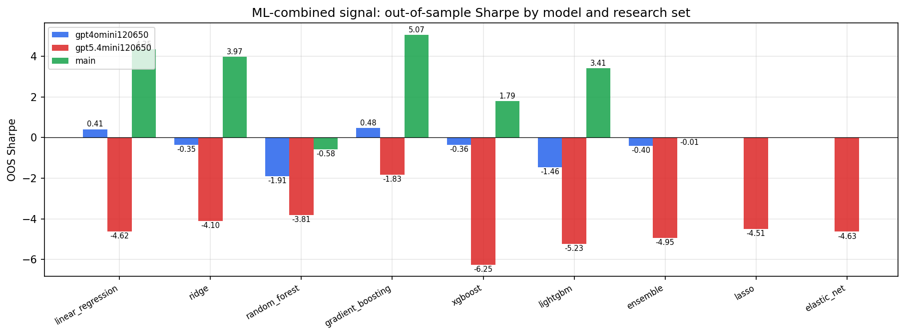

*ML-combined OOS Sharpe by model and research set*

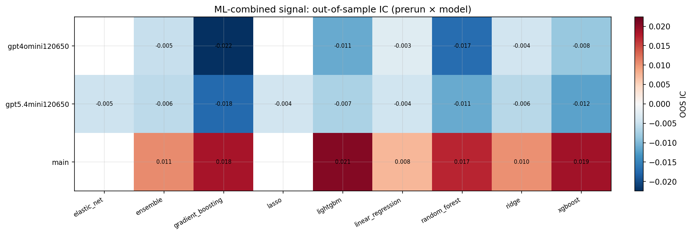

*ML-combined OOS IC (prerun × model)*

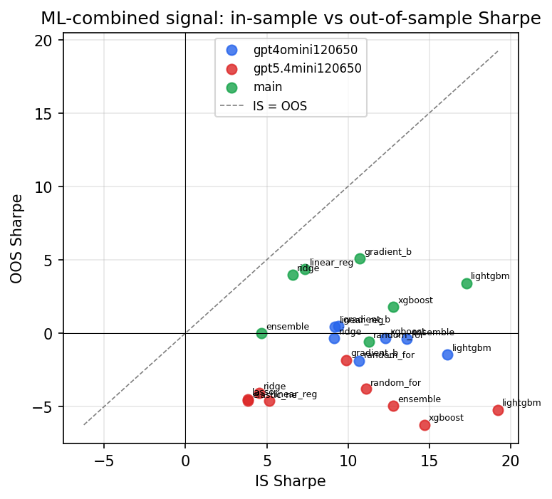

*IS vs OOS Sharpe (overfitting diagnostic)*

---
*Generated by `run_model_comparison.py`. Tables: `*.csv`; interactive: `comparison.ipynb`.*
