# Research-LLM factor comparison — `2025-11`

Comparing the **factor output of different research LLMs** on three axes (raw factor quality → factors as ML features → factors through the full agentic fund). The panel, IS/OOS split, horizon and model hyper-parameters are held identical across preruns — the *only* variable is the factor set.

## Preruns compared

| prerun | research_model | usable_factors | dropped_factors |
| --- | --- | --- | --- |
| gpt4omini120650 | gpt-4o-mini | 66 | 0 |
| gpt5.4mini120650 | gpt-5.4-mini | 69 | 0 |
| main | seed library | 78 | 10 |

> Dropped factors declare fields the current data doesn't have yet (e.g. fundamentals); they light up unchanged once that data is downloaded.

*Usable vs awaiting-data factors per research model*

## Key findings

- **Best ML-combined OOS Sharpe:** `main` with `ridge` (OOS Sharpe = 11.309).
- **Mean OOS Sharpe across models, by research set:** `main` = 5.265, `gpt5.4mini120650` = 0.023, `gpt4omini120650` = -3.618.
- **Highest mean single-factor |IC| (h=6):** `main` (mean |IC| = 0.0197).
- **Most diverse zoo (highest effective/raw factor ratio):** `gpt5.4mini120650` (eff 51.8 of 69, ratio 0.75).
- **Best selection-deflated single-factor |IC|:** `main` (deflated |IC| = 0.0894 from 37 factors tried).

## 1. Single-factor IC (raw factor quality)

Per-underlying time-series Spearman rank-IC of every researched factor, recomputed on the shared panel at horizons h=1, h=6, h=60. The per-underlying IC correlates each factor's value vector with the underlying's own forward-return vector (pooled across underlyings); the cross-sectional IC ranks across underlyings per timestamp.

| prerun | n_factors | mean_abs_ic_1 | mean_abs_ic_6 | mean_abs_ic_60 | mean_abs_icir_6 | best_factor_h6 | best_abs_ic_h6 |
| --- | --- | --- | --- | --- | --- | --- | --- |
| gpt4omini120650 | 66 | 0.007 | 0.011 | 0.0074 | 0.6271 | order_flow_momentum | 0.0299 |
| gpt5.4mini120650 | 69 | 0.0059 | 0.0088 | 0.0088 | 0.5523 | lstm_flow_price_mismatch | 0.0321 |
| main | 78 | 0.0238 | 0.0197 | 0.0089 | 1.0845 | alpha_066 | 0.0964 |

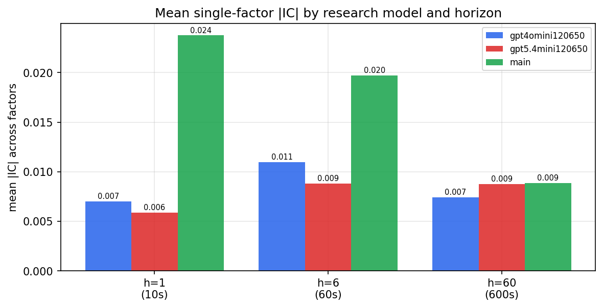

*Mean |IC| by research model and horizon*

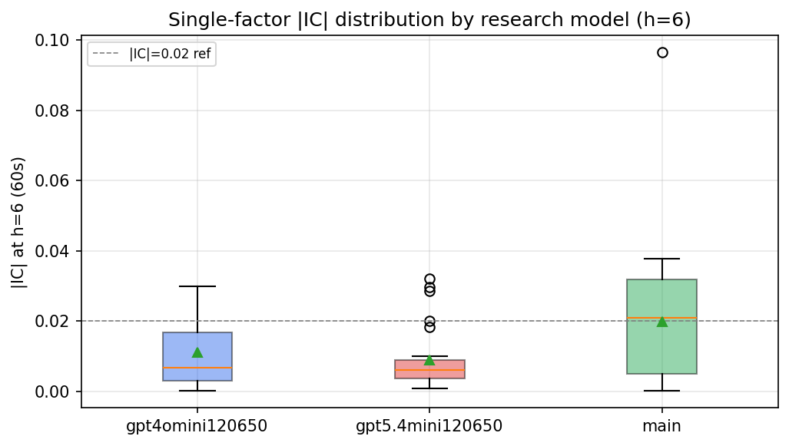

*Per-factor |IC| distribution by research model*

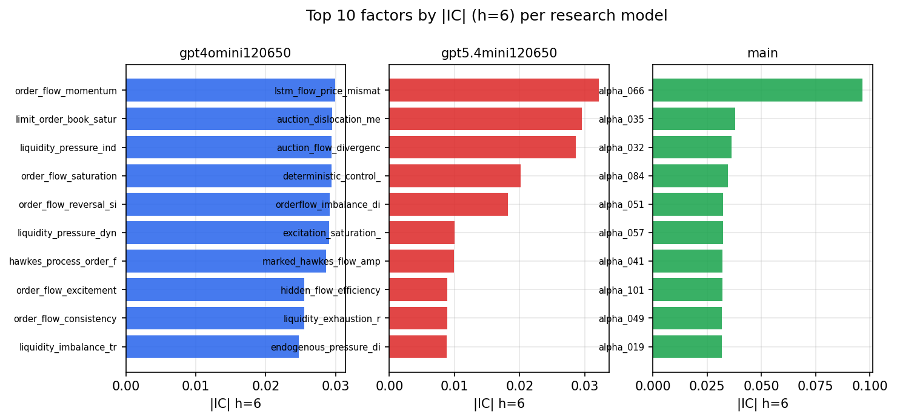

*Top factors by |IC| per research model*

## 2. Factor diversity & redundancy

Pairwise correlation of each zoo's *signals*. `eff_n_factors` is the effective number of independent factors (participation ratio of the correlation eigenvalues); `eff_ratio` and `redundancy` summarise how much unique information the zoo holds vs. how much is duplicated; `n_clusters` groups factors at |corr| ≥ 0.7.

| prerun | n_factors | eff_n_factors | eff_ratio | mean_abs_corr | n_clusters | redundancy |
| --- | --- | --- | --- | --- | --- | --- |
| gpt4omini120650 | 66 | 26.6167 | 0.4033 | 0.0517 | 50 | 0.5967 |
| gpt5.4mini120650 | 69 | 51.7547 | 0.7501 | 0.0122 | 62 | 0.2499 |
| main | 78 | 43.0302 | 0.5517 | 0.0289 | 70 | 0.4483 |

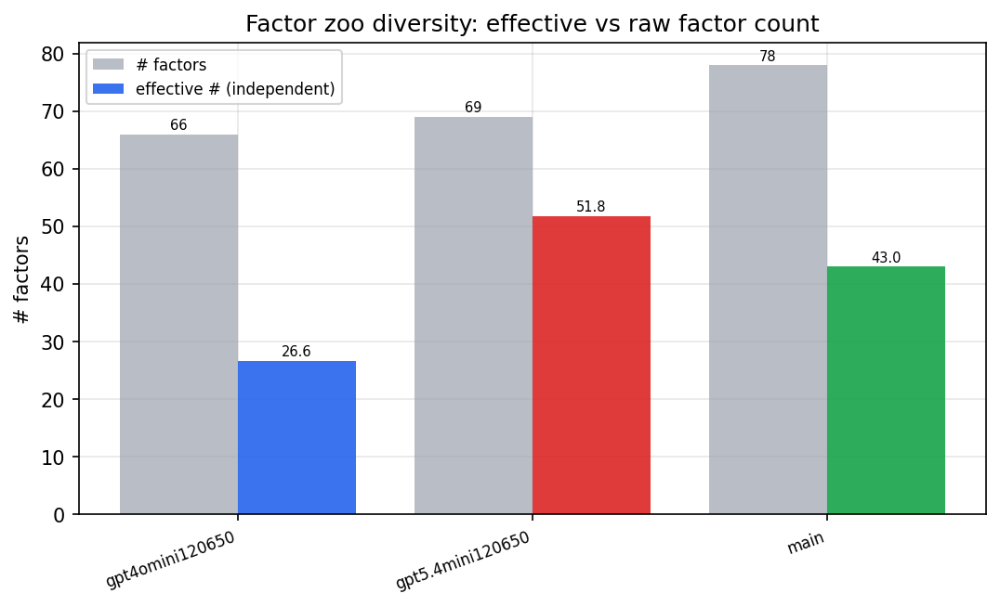

*Effective vs raw factor count per research model*

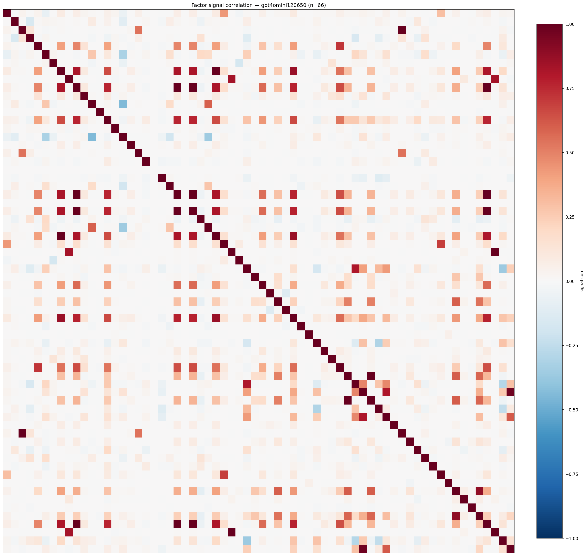

*Signal correlation matrix — gpt4omini120650*

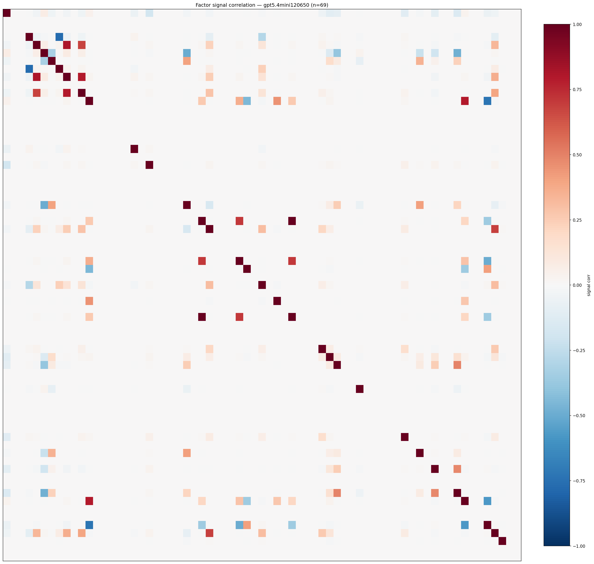

*Signal correlation matrix — gpt5.4mini120650*

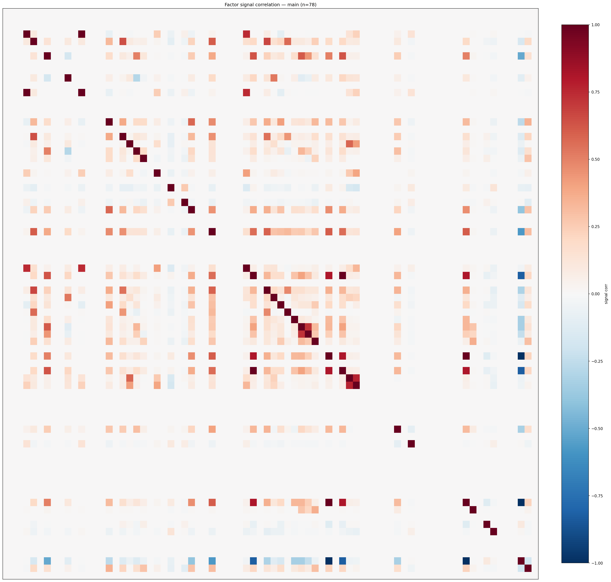

*Signal correlation matrix — main*

## 3. Deflation & model-based importance

`deflated_best_ic` haircuts each zoo's best |IC| for the number of factors tried (`ic_n_tested`) — a bigger zoo's best factor is more likely to be lucky. `lasso_n_nonzero` / `lasso_sparsity` show how many factors a sparse linear model actually keeps (model-view redundancy).

| prerun | best_ic | deflated_best_ic | deflated_best_t | ic_n_tested | ic_n_obs | lasso_n_nonzero | lasso_sparsity |
| --- | --- | --- | --- | --- | --- | --- | --- |
| gpt4omini120650 | 0.0299 | 0.0224 | 8.5575 | 64 | 146339 | 0 | 1.0 |
| gpt5.4mini120650 | 0.0321 | 0.0253 | 9.6624 | 31 | 146339 | 3 | 0.9565 |
| main | 0.0964 | 0.0894 | 34.2056 | 37 | 146339 | 9 | 0.8846 |

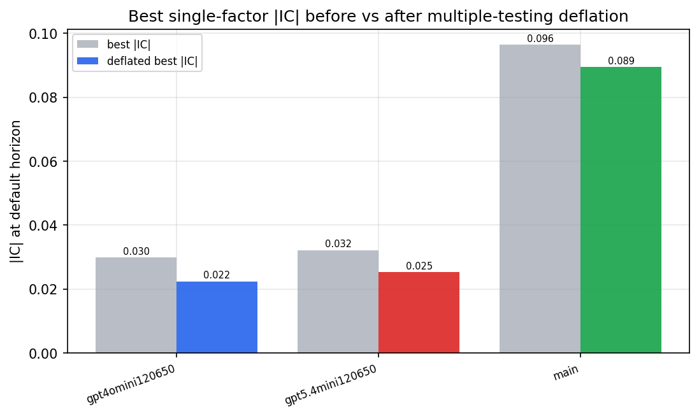

*Best |IC| before vs after multiple-testing deflation*

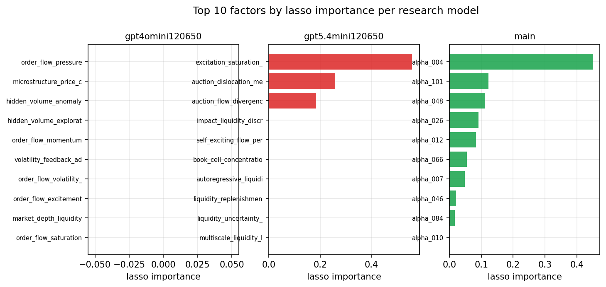

*Top factors by lasso importance per zoo*

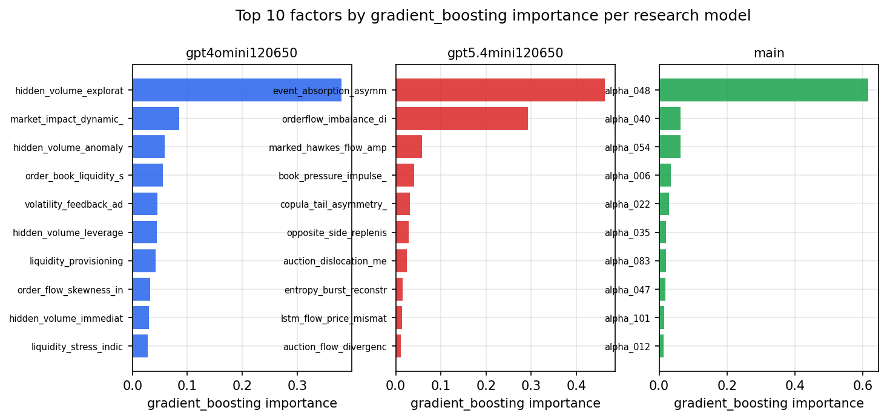

*Top factors by gradient_boosting importance per zoo*

## 4. ML-combined signal — per-underlying vectorised backtest

Each model combines a prerun's factors into ONE signal (fit `factors → forward return` on IS, predict per (bar, underlying)), then that combined signal is run through a simple vectorised backtest — `position(signal) × the underlying's own forward return` — on the held-out OOS tail (+ an equal-weight ensemble). No cross-sectional ranking.

> Config: position=**threshold** (t=1.0, z-score `expanding`), aggregation=**portfolio**, fit-standardise=**per_underlying**, horizon=6.

| prerun | model | n_factors_used | oos_ic | oos_sharpe | is_sharpe | oos_ann_return | oos_max_drawdown |
| --- | --- | --- | --- | --- | --- | --- | --- |
| gpt4omini120650 | linear_regression | 66 | 0.0296 | -2.6956 | 10.5821 | -0.0769 | -0.0077 |
| gpt4omini120650 | ridge | 66 | 0.0324 | -2.8995 | 10.4644 | -0.0825 | -0.0077 |
| gpt4omini120650 | lasso | 66 | nan | nan | nan | nan | nan |
| gpt4omini120650 | elastic_net | 66 | nan | nan | nan | nan | nan |
| gpt4omini120650 | random_forest | 66 | 0.0267 | -6.2399 | 10.9967 | -0.4879 | -0.0365 |
| gpt4omini120650 | gradient_boosting | 66 | 0.0027 | -4.3678 | 10.1812 | -0.1808 | -0.014 |
| gpt4omini120650 | xgboost | 66 | 0.0176 | -3.133 | 13.0794 | -0.2084 | -0.0263 |
| gpt4omini120650 | lightgbm | 66 | 0.0258 | -2.3837 | 13.6371 | -0.0876 | -0.013 |
| gpt4omini120650 | ensemble | 66 | 0.0192 | -3.6069 | 13.094 | -0.2034 | -0.0194 |
| gpt5.4mini120650 | linear_regression | 69 | 0.0338 | 2.4327 | 5.2812 | 0.1575 | -0.0145 |
| gpt5.4mini120650 | ridge | 69 | 0.0334 | 3.3828 | 5.2117 | 0.225 | -0.0157 |
| gpt5.4mini120650 | lasso | 69 | nan | nan | -3.8683 | nan | nan |
| gpt5.4mini120650 | elastic_net | 69 | nan | nan | -3.8683 | nan | nan |
| gpt5.4mini120650 | random_forest | 69 | 0.0295 | -2.4114 | 13.6445 | -0.1523 | -0.0155 |
| gpt5.4mini120650 | gradient_boosting | 69 | 0.0296 | -1.8576 | 11.0307 | -0.0422 | -0.0051 |
| gpt5.4mini120650 | xgboost | 69 | 0.0301 | 1.1751 | 15.9921 | 0.0621 | -0.0121 |
| gpt5.4mini120650 | lightgbm | 69 | 0.0316 | -4.0462 | 19.7624 | -0.1576 | -0.0171 |
| gpt5.4mini120650 | ensemble | 69 | 0.0354 | 1.4861 | 13.171 | 0.0549 | -0.0065 |
| main | linear_regression | 78 | 0.0394 | 10.8464 | 8.9208 | 0.5255 | -0.0051 |
| main | ridge | 78 | 0.0382 | 11.3091 | 7.6504 | 0.4911 | -0.0057 |
| main | lasso | 78 | nan | nan | nan | nan | nan |
| main | elastic_net | 78 | nan | nan | nan | nan | nan |
| main | random_forest | 78 | 0.0337 | 6.1865 | 16.2768 | 0.4365 | -0.0113 |
| main | gradient_boosting | 78 | 0.0335 | 1.8765 | 11.4368 | 0.048 | -0.0052 |
| main | xgboost | 78 | 0.0318 | 2.9976 | 14.5466 | 0.1565 | -0.0094 |
| main | lightgbm | 78 | 0.025 | -1.5011 | 17.7571 | -0.0937 | -0.0189 |
| main | ensemble | 78 | 0.0373 | 5.1368 | 15.3659 | 0.3204 | -0.0104 |

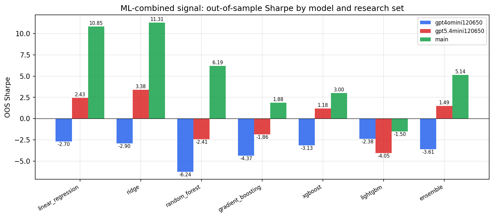

*ML-combined OOS Sharpe by model and research set*

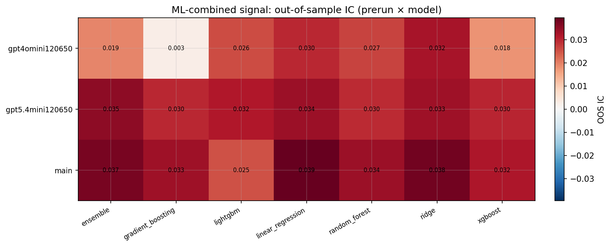

*ML-combined OOS IC (prerun × model)*

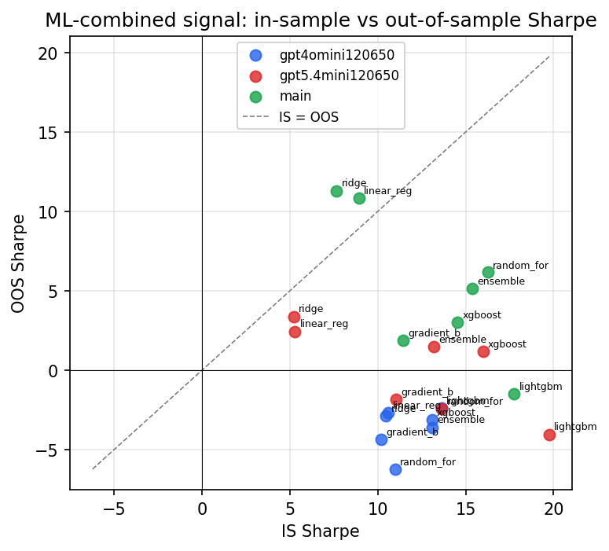

*IS vs OOS Sharpe (overfitting diagnostic)*

---
*Generated by `run_model_comparison.py`. Tables: `*.csv`; interactive: `comparison.ipynb`.*
