# Research-LLM factor comparison — `2025-12`

Comparing the **factor output of different research LLMs** on three axes (raw factor quality → factors as ML features → factors through the full agentic fund). The panel, IS/OOS split, horizon and model hyper-parameters are held identical across preruns — the *only* variable is the factor set.

## Preruns compared

| prerun | research_model | usable_factors | dropped_factors |
| --- | --- | --- | --- |
| gpt4omini120650 | gpt-4o-mini | 66 | 0 |
| gpt5.4mini120650 | gpt-5.4-mini | 69 | 0 |
| main | seed library | 78 | 10 |

> Dropped factors declare fields the current data doesn't have yet (e.g. fundamentals); they light up unchanged once that data is downloaded.

*Usable vs awaiting-data factors per research model*

## Key findings

- **Best ML-combined OOS Sharpe:** `main` with `xgboost` (OOS Sharpe = 9.976).
- **Mean OOS Sharpe across models, by research set:** `main` = 4.500, `gpt4omini120650` = 0.934, `gpt5.4mini120650` = -2.975.
- **Highest mean single-factor |IC| (h=6):** `main` (mean |IC| = 0.0192).
- **Most diverse zoo (highest effective/raw factor ratio):** `gpt5.4mini120650` (eff 51.9 of 69, ratio 0.75).
- **Best selection-deflated single-factor |IC|:** `main` (deflated |IC| = 0.0888 from 37 factors tried).

## 1. Single-factor IC (raw factor quality)

Per-underlying time-series Spearman rank-IC of every researched factor, recomputed on the shared panel at horizons h=1, h=6, h=60. The per-underlying IC correlates each factor's value vector with the underlying's own forward-return vector (pooled across underlyings); the cross-sectional IC ranks across underlyings per timestamp.

| prerun | n_factors | mean_abs_ic_1 | mean_abs_ic_6 | mean_abs_ic_60 | mean_abs_icir_6 | best_factor_h6 | best_abs_ic_h6 |
| --- | --- | --- | --- | --- | --- | --- | --- |
| gpt4omini120650 | 66 | 0.0071 | 0.0093 | 0.0082 | 0.458 | order_flow_reversal_signal | 0.028 |
| gpt5.4mini120650 | 69 | 0.0061 | 0.0072 | 0.0082 | 0.537 | auction_dislocation_mean_reversion | 0.0291 |
| main | 78 | 0.0256 | 0.0192 | 0.0094 | 0.9574 | alpha_066 | 0.0958 |

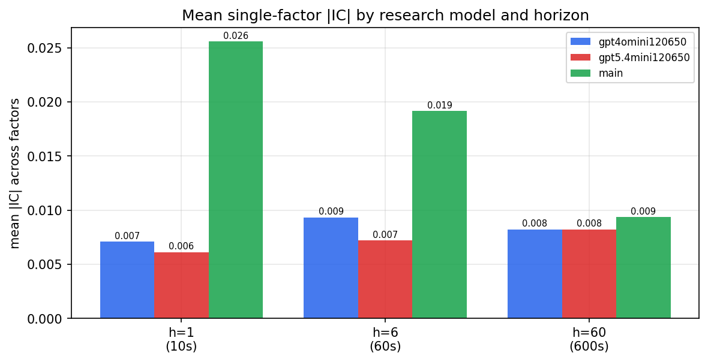

*Mean |IC| by research model and horizon*

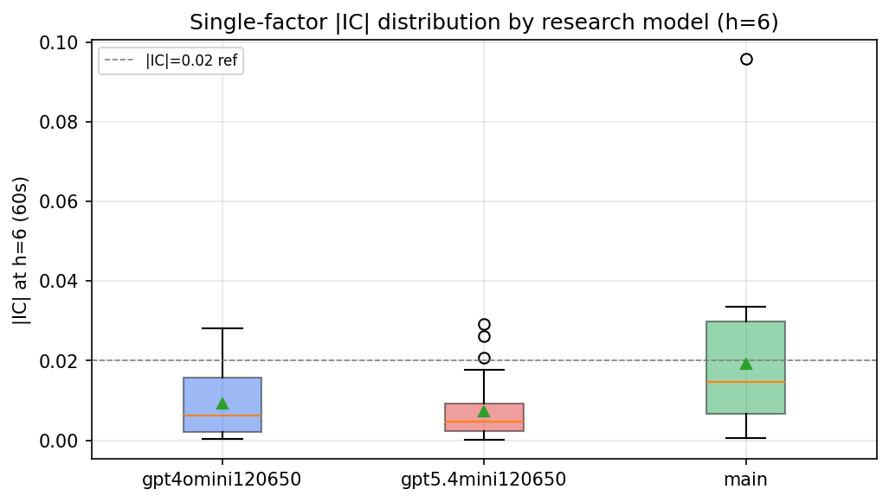

*Per-factor |IC| distribution by research model*

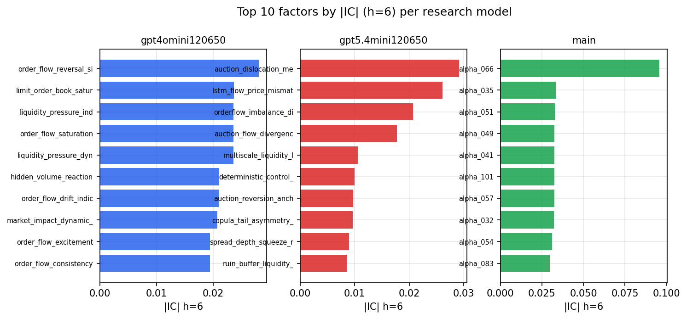

*Top factors by |IC| per research model*

## 2. Factor diversity & redundancy

Pairwise correlation of each zoo's *signals*. `eff_n_factors` is the effective number of independent factors (participation ratio of the correlation eigenvalues); `eff_ratio` and `redundancy` summarise how much unique information the zoo holds vs. how much is duplicated; `n_clusters` groups factors at |corr| ≥ 0.7.

| prerun | n_factors | eff_n_factors | eff_ratio | mean_abs_corr | n_clusters | redundancy |
| --- | --- | --- | --- | --- | --- | --- |
| gpt4omini120650 | 66 | 26.0737 | 0.3951 | 0.0522 | 48 | 0.6049 |
| gpt5.4mini120650 | 69 | 51.92 | 0.7525 | 0.0124 | 62 | 0.2475 |
| main | 78 | 41.7263 | 0.535 | 0.0307 | 70 | 0.465 |

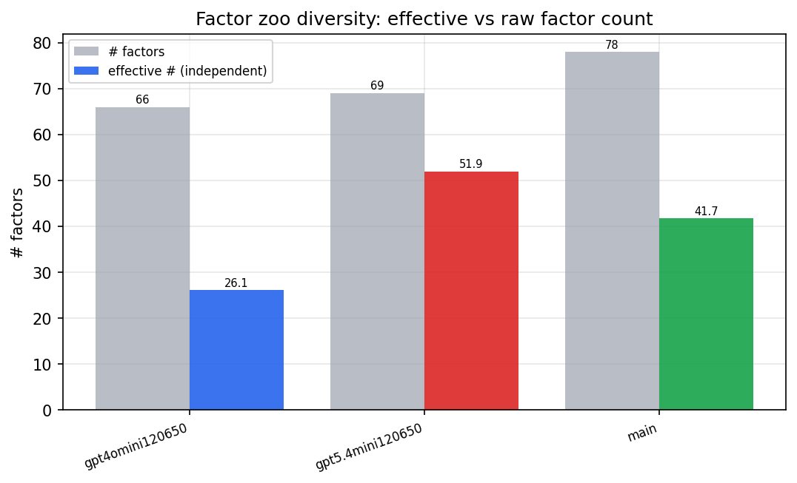

*Effective vs raw factor count per research model*

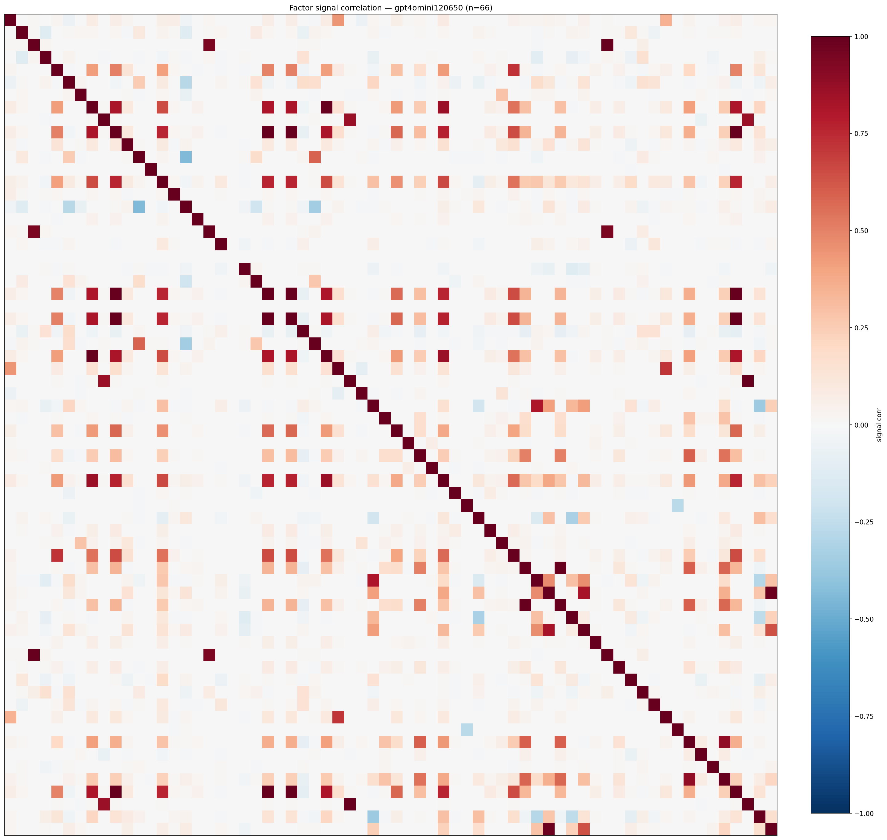

*Signal correlation matrix — gpt4omini120650*

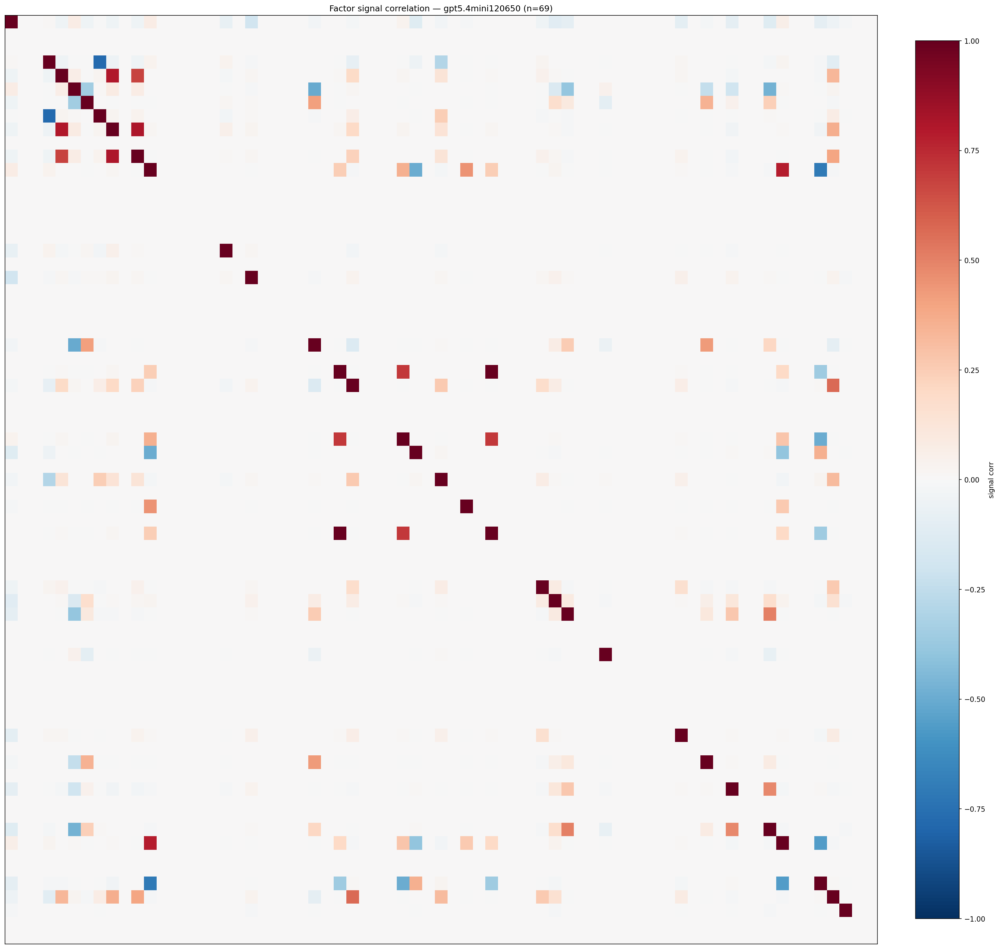

*Signal correlation matrix — gpt5.4mini120650*

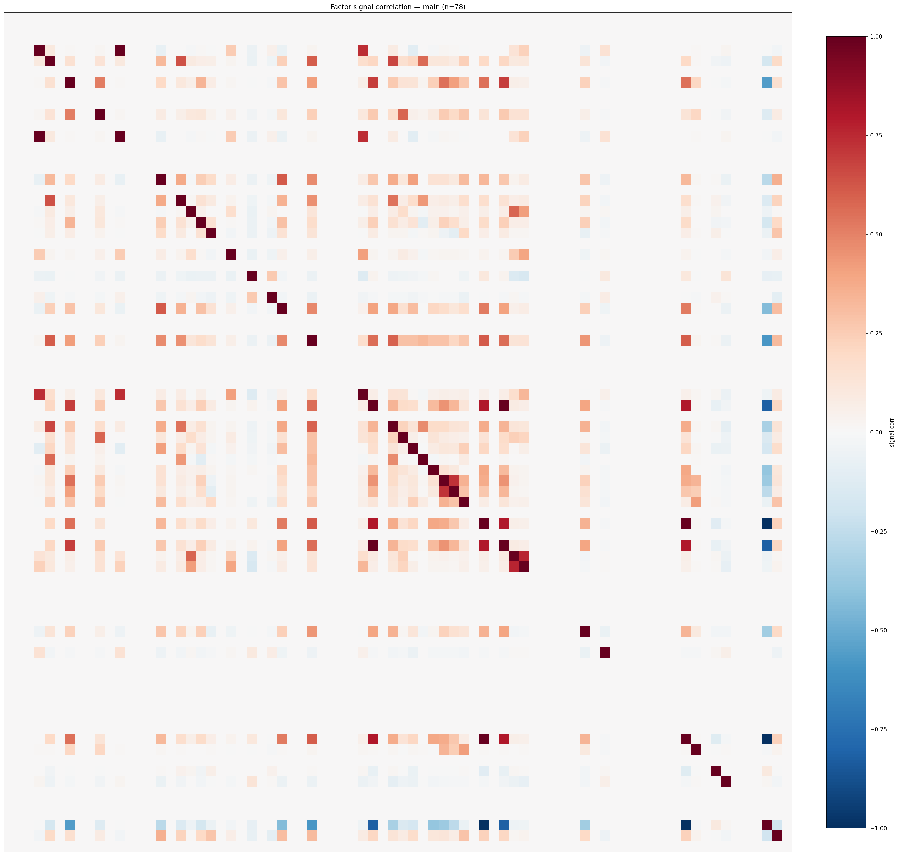

*Signal correlation matrix — main*

## 3. Deflation & model-based importance

`deflated_best_ic` haircuts each zoo's best |IC| for the number of factors tried (`ic_n_tested`) — a bigger zoo's best factor is more likely to be lucky. `lasso_n_nonzero` / `lasso_sparsity` show how many factors a sparse linear model actually keeps (model-view redundancy).

| prerun | best_ic | deflated_best_ic | deflated_best_t | ic_n_tested | ic_n_obs | lasso_n_nonzero | lasso_sparsity |
| --- | --- | --- | --- | --- | --- | --- | --- |
| gpt4omini120650 | 0.028 | 0.0205 | 7.8832 | 64 | 147599 | 0 | 1.0 |
| gpt5.4mini120650 | 0.0291 | 0.0223 | 8.5777 | 31 | 147599 | 0 | 1.0 |
| main | 0.0958 | 0.0888 | 34.1001 | 37 | 147599 | 3 | 0.9615 |

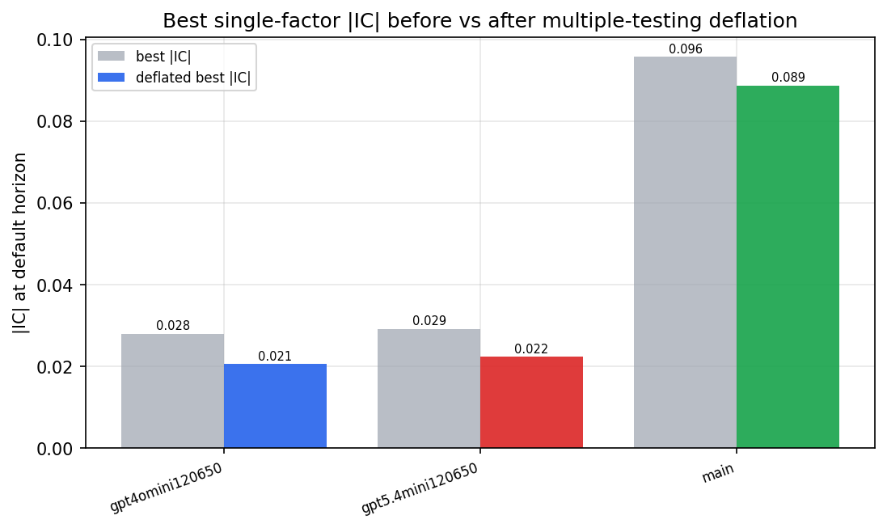

*Best |IC| before vs after multiple-testing deflation*

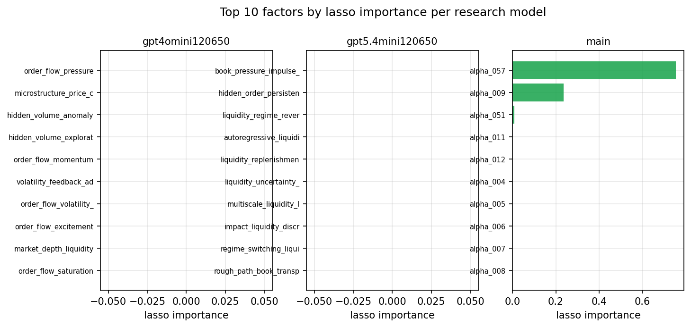

*Top factors by lasso importance per zoo*

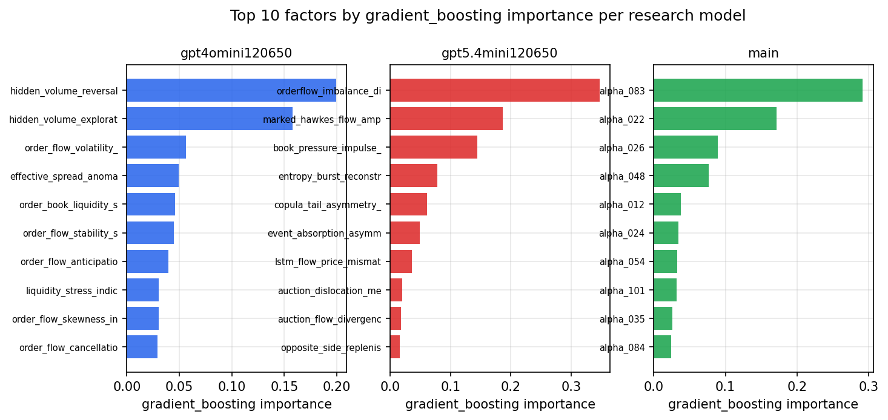

*Top factors by gradient_boosting importance per zoo*

## 4. ML-combined signal — per-underlying vectorised backtest

Each model combines a prerun's factors into ONE signal (fit `factors → forward return` on IS, predict per (bar, underlying)), then that combined signal is run through a simple vectorised backtest — `position(signal) × the underlying's own forward return` — on the held-out OOS tail (+ an equal-weight ensemble). No cross-sectional ranking.

> Config: position=**threshold** (t=1.0, z-score `expanding`), aggregation=**portfolio**, fit-standardise=**per_underlying**, horizon=6.

| prerun | model | n_factors_used | oos_ic | oos_sharpe | is_sharpe | oos_ann_return | oos_max_drawdown |
| --- | --- | --- | --- | --- | --- | --- | --- |
| gpt4omini120650 | linear_regression | 66 | 0.0111 | -0.1009 | 7.2067 | -0.01 | -0.0212 |
| gpt4omini120650 | ridge | 66 | 0.0167 | 1.8728 | 7.6455 | 0.1679 | -0.0164 |
| gpt4omini120650 | lasso | 66 | nan | nan | nan | nan | nan |
| gpt4omini120650 | elastic_net | 66 | nan | nan | nan | nan | nan |
| gpt4omini120650 | random_forest | 66 | 0.0092 | 3.8761 | 9.7143 | 0.536 | -0.0215 |
| gpt4omini120650 | gradient_boosting | 66 | 0.0044 | 0.9556 | 10.9611 | 0.0974 | -0.0179 |
| gpt4omini120650 | xgboost | 66 | 0.0071 | 1.0496 | 11.6201 | 0.0721 | -0.0129 |
| gpt4omini120650 | lightgbm | 66 | 0.011 | -2.268 | 13.2627 | -0.1886 | -0.0268 |
| gpt4omini120650 | ensemble | 66 | 0.0095 | 1.1513 | 12.5928 | 0.0948 | -0.0181 |
| gpt5.4mini120650 | linear_regression | 69 | 0.0162 | -4.877 | 10.0134 | -0.4325 | -0.039 |
| gpt5.4mini120650 | ridge | 69 | 0.0163 | -4.7888 | 11.3467 | -0.443 | -0.0397 |
| gpt5.4mini120650 | lasso | 69 | 0.0145 | -1.2836 | 7.8688 | -0.1358 | -0.0374 |
| gpt5.4mini120650 | elastic_net | 69 | 0.0145 | -1.2836 | 7.8688 | -0.1358 | -0.0374 |
| gpt5.4mini120650 | random_forest | 69 | 0.0024 | -3.6605 | 14.0531 | -0.4569 | -0.0476 |
| gpt5.4mini120650 | gradient_boosting | 69 | 0.0006 | -1.207 | 10.3075 | -0.0532 | -0.014 |
| gpt5.4mini120650 | xgboost | 69 | 0.0037 | -2.4976 | 14.3215 | -0.1783 | -0.025 |
| gpt5.4mini120650 | lightgbm | 69 | 0.0071 | -4.3776 | 18.2356 | -0.3296 | -0.0324 |
| gpt5.4mini120650 | ensemble | 69 | 0.0107 | -2.8029 | 16.9669 | -0.331 | -0.0415 |
| main | linear_regression | 78 | 0.0094 | 1.7242 | 10.9625 | 0.1137 | -0.0221 |
| main | ridge | 78 | 0.0094 | 1.6691 | 11.2322 | 0.1119 | -0.0197 |
| main | lasso | 78 | nan | nan | nan | nan | nan |
| main | elastic_net | 78 | nan | nan | nan | nan | nan |
| main | random_forest | 78 | 0.0188 | 1.8396 | 15.0472 | 0.0967 | -0.0097 |
| main | gradient_boosting | 78 | 0.0211 | 8.1928 | 9.3446 | 0.1207 | -0.0032 |
| main | xgboost | 78 | 0.0181 | 9.9765 | 13.6136 | 0.2722 | -0.003 |
| main | lightgbm | 78 | 0.0193 | 4.6306 | 16.8038 | 0.1172 | -0.0048 |
| main | ensemble | 78 | 0.017 | 3.4666 | 16.2602 | 0.1859 | -0.0121 |

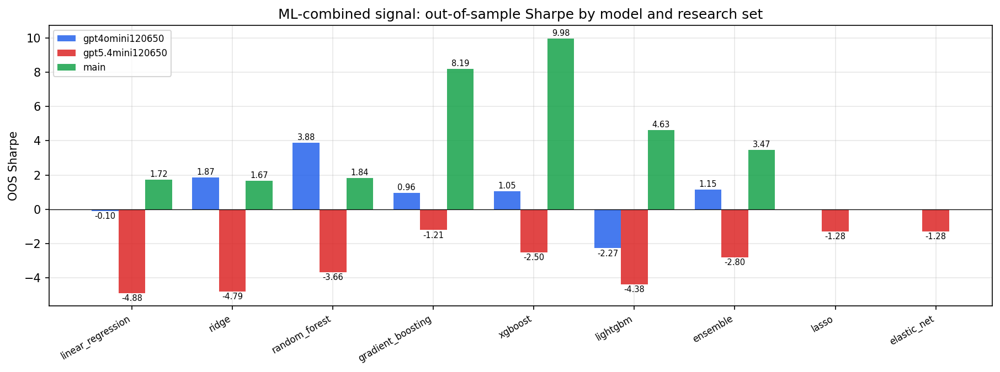

*ML-combined OOS Sharpe by model and research set*

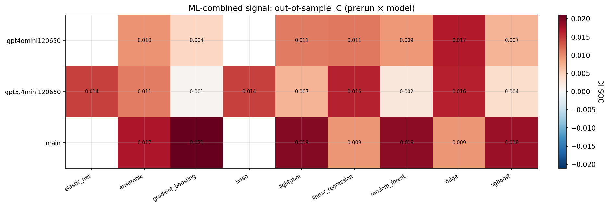

*ML-combined OOS IC (prerun × model)*

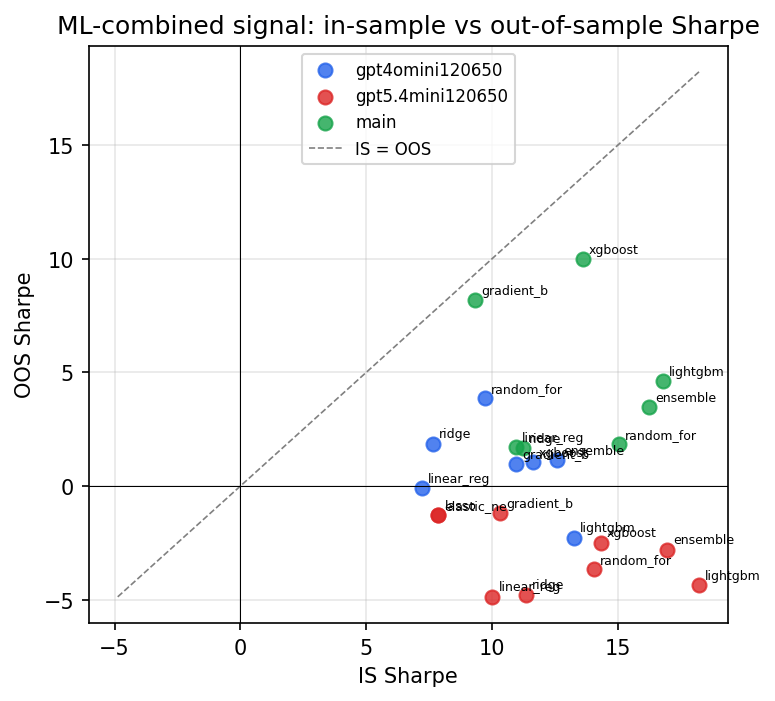

*IS vs OOS Sharpe (overfitting diagnostic)*

---
*Generated by `run_model_comparison.py`. Tables: `*.csv`; interactive: `comparison.ipynb`.*
