# Research-LLM factor comparison — `2026-01`

Comparing the **factor output of different research LLMs** on three axes (raw factor quality → factors as ML features → factors through the full agentic fund). The panel, IS/OOS split, horizon and model hyper-parameters are held identical across preruns — the *only* variable is the factor set.

## Preruns compared

| prerun | research_model | usable_factors | dropped_factors |
| --- | --- | --- | --- |
| gpt4omini120650 | gpt-4o-mini | 66 | 0 |
| gpt5.4mini120650 | gpt-5.4-mini | 69 | 0 |
| main | seed library | 78 | 10 |

> Dropped factors declare fields the current data doesn't have yet (e.g. fundamentals); they light up unchanged once that data is downloaded.

*Usable vs awaiting-data factors per research model*

## Key findings

- **Best ML-combined OOS Sharpe:** `gpt5.4mini120650` with `lightgbm` (OOS Sharpe = 5.243).
- **Mean OOS Sharpe across models, by research set:** `gpt5.4mini120650` = 1.340, `main` = 0.329, `gpt4omini120650` = -6.268.
- **Highest mean single-factor |IC| (h=6):** `main` (mean |IC| = 0.0159).
- **Most diverse zoo (highest effective/raw factor ratio):** `gpt5.4mini120650` (eff 51.7 of 69, ratio 0.75).
- **Best selection-deflated single-factor |IC|:** `main` (deflated |IC| = 0.0237 from 37 factors tried).

## 1. Single-factor IC (raw factor quality)

Per-underlying time-series Spearman rank-IC of every researched factor, recomputed on the shared panel at horizons h=1, h=6, h=60. The per-underlying IC correlates each factor's value vector with the underlying's own forward-return vector (pooled across underlyings); the cross-sectional IC ranks across underlyings per timestamp.

| prerun | n_factors | mean_abs_ic_1 | mean_abs_ic_6 | mean_abs_ic_60 | mean_abs_icir_6 | best_factor_h6 | best_abs_ic_h6 |
| --- | --- | --- | --- | --- | --- | --- | --- |
| gpt4omini120650 | 66 | 0.0071 | 0.0081 | 0.0059 | 0.4211 | order_flow_reversal_signal | 0.0221 |
| gpt5.4mini120650 | 69 | 0.0064 | 0.0072 | 0.0062 | 0.4069 | auction_dislocation_mean_reversion | 0.0273 |
| main | 78 | 0.0255 | 0.0159 | 0.0062 | 0.8609 | alpha_051 | 0.0308 |

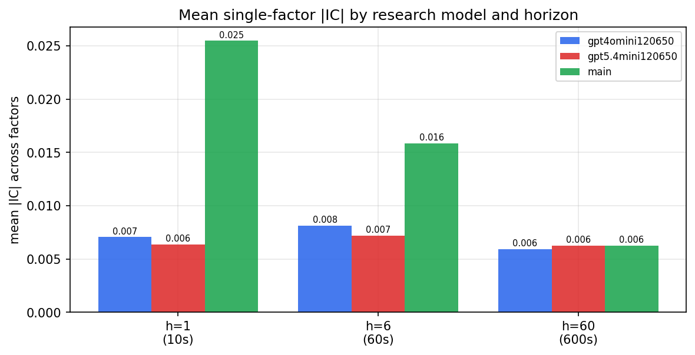

*Mean |IC| by research model and horizon*

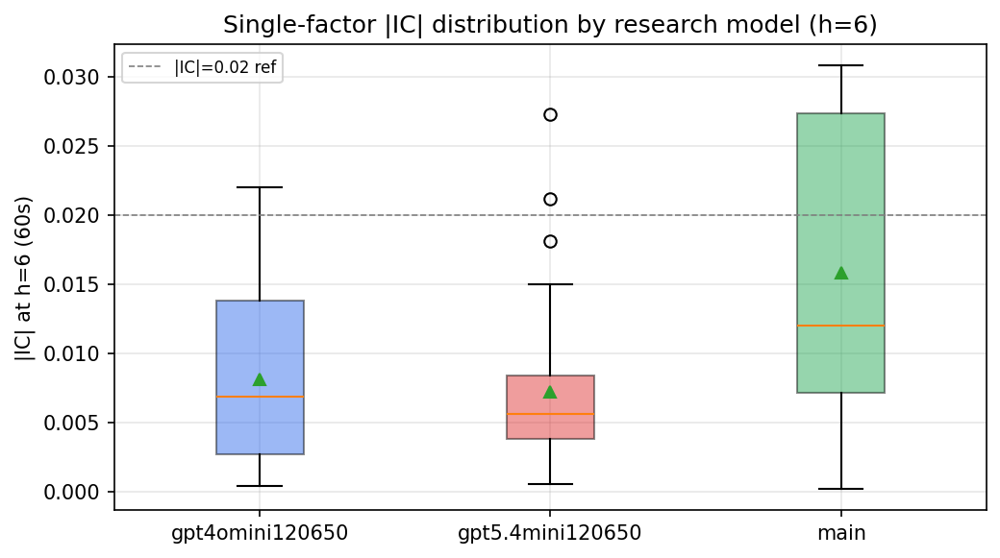

*Per-factor |IC| distribution by research model*

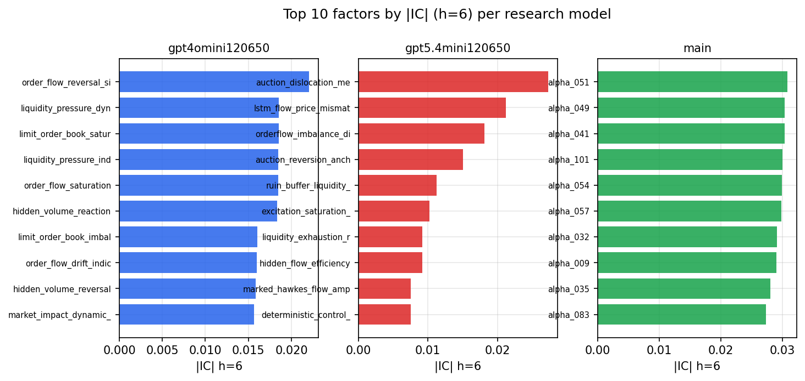

*Top factors by |IC| per research model*

## 2. Factor diversity & redundancy

Pairwise correlation of each zoo's *signals*. `eff_n_factors` is the effective number of independent factors (participation ratio of the correlation eigenvalues); `eff_ratio` and `redundancy` summarise how much unique information the zoo holds vs. how much is duplicated; `n_clusters` groups factors at |corr| ≥ 0.7.

| prerun | n_factors | eff_n_factors | eff_ratio | mean_abs_corr | n_clusters | redundancy |
| --- | --- | --- | --- | --- | --- | --- |
| gpt4omini120650 | 66 | 27.3757 | 0.4148 | 0.0502 | 50 | 0.5852 |
| gpt5.4mini120650 | 69 | 51.7175 | 0.7495 | 0.0124 | 62 | 0.2505 |
| main | 78 | 42.1736 | 0.5407 | 0.0297 | 70 | 0.4593 |

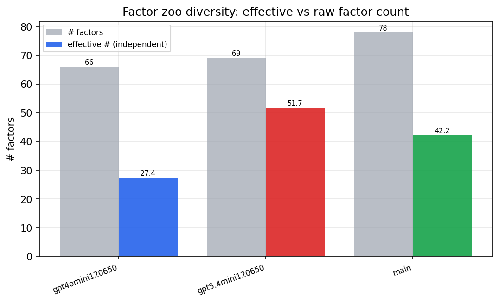

*Effective vs raw factor count per research model*

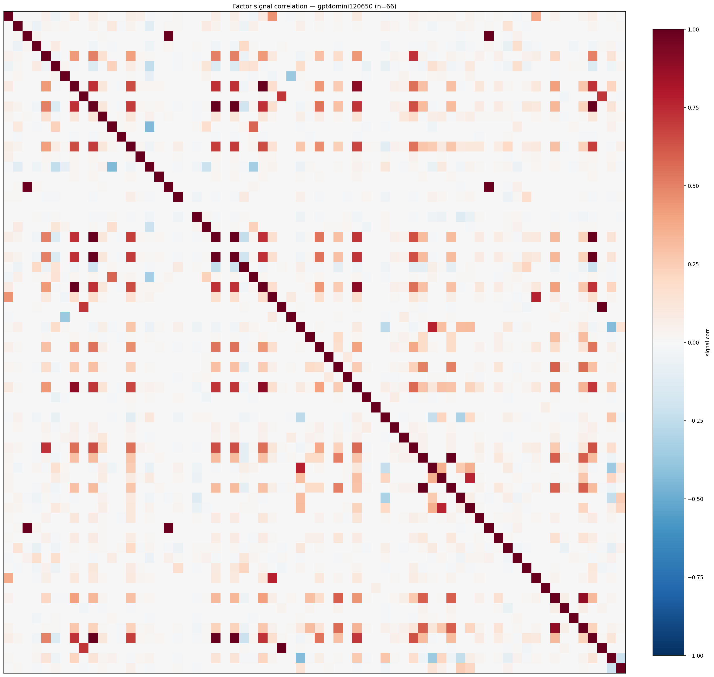

*Signal correlation matrix — gpt4omini120650*

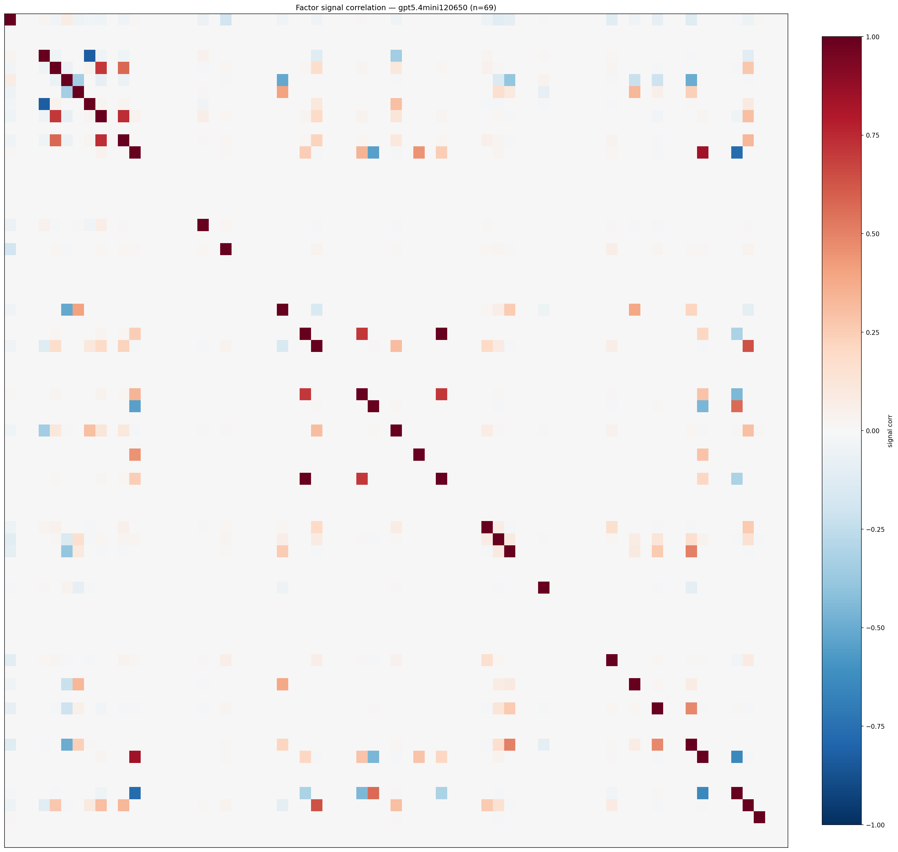

*Signal correlation matrix — gpt5.4mini120650*

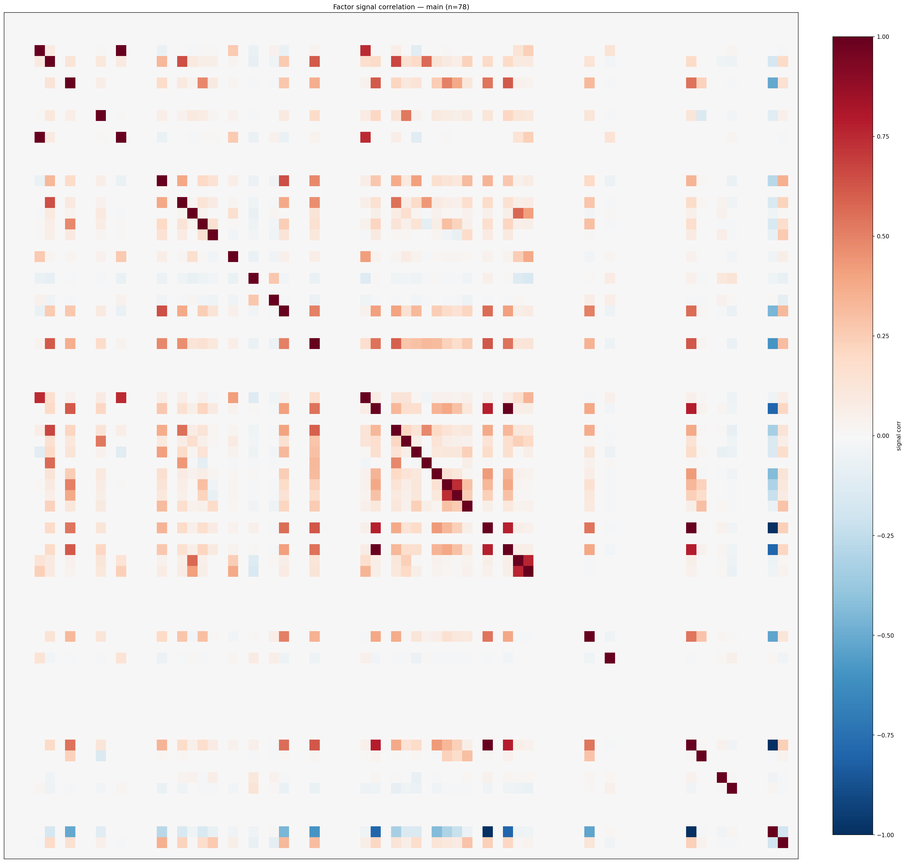

*Signal correlation matrix — main*

## 3. Deflation & model-based importance

`deflated_best_ic` haircuts each zoo's best |IC| for the number of factors tried (`ic_n_tested`) — a bigger zoo's best factor is more likely to be lucky. `lasso_n_nonzero` / `lasso_sparsity` show how many factors a sparse linear model actually keeps (model-view redundancy).

| prerun | best_ic | deflated_best_ic | deflated_best_t | ic_n_tested | ic_n_obs | lasso_n_nonzero | lasso_sparsity |
| --- | --- | --- | --- | --- | --- | --- | --- |
| gpt4omini120650 | 0.0221 | 0.0144 | 5.3834 | 64 | 140579 | 0 | 1.0 |
| gpt5.4mini120650 | 0.0273 | 0.0203 | 7.6246 | 31 | 140579 | 12 | 0.8261 |
| main | 0.0308 | 0.0237 | 8.8704 | 37 | 140579 | 0 | 1.0 |

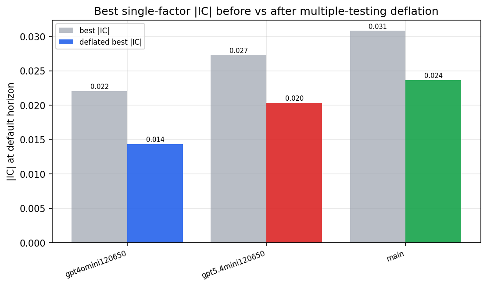

*Best |IC| before vs after multiple-testing deflation*

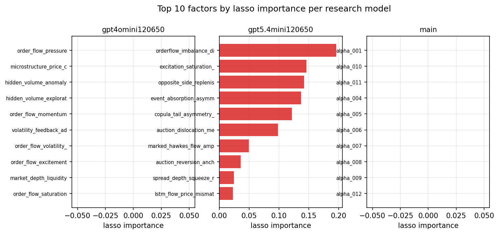

*Top factors by lasso importance per zoo*

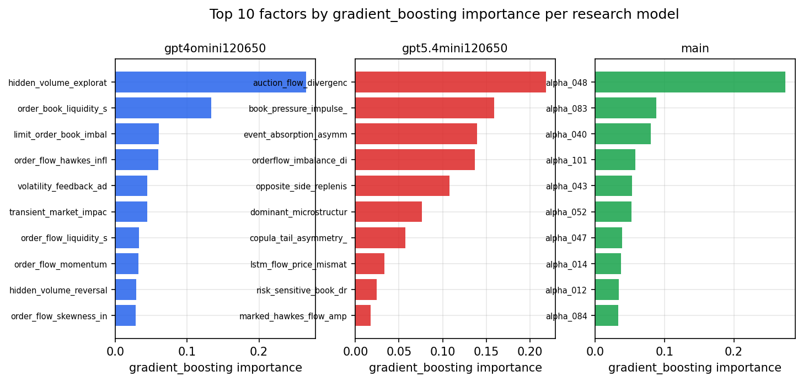

*Top factors by gradient_boosting importance per zoo*

## 4. ML-combined signal — per-underlying vectorised backtest

Each model combines a prerun's factors into ONE signal (fit `factors → forward return` on IS, predict per (bar, underlying)), then that combined signal is run through a simple vectorised backtest — `position(signal) × the underlying's own forward return` — on the held-out OOS tail (+ an equal-weight ensemble). No cross-sectional ranking.

> Config: position=**threshold** (t=1.0, z-score `expanding`), aggregation=**portfolio**, fit-standardise=**per_underlying**, horizon=6.

| prerun | model | n_factors_used | oos_ic | oos_sharpe | is_sharpe | oos_ann_return | oos_max_drawdown |
| --- | --- | --- | --- | --- | --- | --- | --- |
| gpt4omini120650 | linear_regression | 66 | -0.0022 | -8.2252 | 7.0722 | -1.5181 | -0.1232 |
| gpt4omini120650 | ridge | 66 | -0.0021 | -8.3743 | 6.281 | -1.5369 | -0.1239 |
| gpt4omini120650 | lasso | 66 | nan | nan | nan | nan | nan |
| gpt4omini120650 | elastic_net | 66 | nan | nan | nan | nan | nan |
| gpt4omini120650 | random_forest | 66 | -0.0057 | -5.7108 | 8.8154 | -1.3137 | -0.1077 |
| gpt4omini120650 | gradient_boosting | 66 | -0.0029 | -3.8991 | 9.395 | -0.5674 | -0.0622 |
| gpt4omini120650 | xgboost | 66 | -0.0051 | -5.2276 | 11.1085 | -1.05 | -0.1006 |
| gpt4omini120650 | lightgbm | 66 | 0.0009 | -5.5484 | 13.4096 | -0.9337 | -0.086 |
| gpt4omini120650 | ensemble | 66 | -0.0003 | -6.8872 | 11.5411 | -1.5845 | -0.1298 |
| gpt5.4mini120650 | linear_regression | 69 | 0.0154 | -0.9311 | 5.2936 | -0.0832 | -0.0252 |
| gpt5.4mini120650 | ridge | 69 | 0.0152 | -0.5218 | 5.1658 | -0.0462 | -0.0251 |
| gpt5.4mini120650 | lasso | 69 | 0.01 | 4.644 | 3.5863 | 0.2294 | -0.0105 |
| gpt5.4mini120650 | elastic_net | 69 | 0.01 | 4.644 | 3.5863 | 0.2294 | -0.0105 |
| gpt5.4mini120650 | random_forest | 69 | 0.006 | -0.612 | 9.9894 | -0.0462 | -0.0259 |
| gpt5.4mini120650 | gradient_boosting | 69 | -0.0114 | -3.695 | 7.1701 | -0.1243 | -0.0137 |
| gpt5.4mini120650 | xgboost | 69 | 0.0078 | 2.459 | 11.2837 | 0.1332 | -0.021 |
| gpt5.4mini120650 | lightgbm | 69 | 0.0085 | 5.2431 | 14.405 | 0.3299 | -0.0164 |
| gpt5.4mini120650 | ensemble | 69 | 0.0173 | 0.833 | 10.1788 | 0.0629 | -0.0199 |
| main | linear_regression | 78 | 0.0075 | -3.268 | 10.3678 | -0.382 | -0.0405 |
| main | ridge | 78 | 0.0099 | -2.7505 | 10.17 | -0.3162 | -0.0439 |
| main | lasso | 78 | 0.017 | 1.2194 | 5.7554 | 0.09 | -0.0215 |
| main | elastic_net | 78 | 0.017 | 1.2194 | 5.7554 | 0.09 | -0.0215 |
| main | random_forest | 78 | -0.0013 | 0.1932 | 11.1717 | 0.0288 | -0.0387 |
| main | gradient_boosting | 78 | 0.0007 | 3.7924 | 8.3996 | 0.3103 | -0.0269 |
| main | xgboost | 78 | 0.0023 | 1.2584 | 11.6807 | 0.109 | -0.0312 |
| main | lightgbm | 78 | 0.0024 | 0.4684 | 15.1806 | 0.0258 | -0.0213 |
| main | ensemble | 78 | 0.009 | 0.8246 | 13.3337 | 0.0706 | -0.0187 |

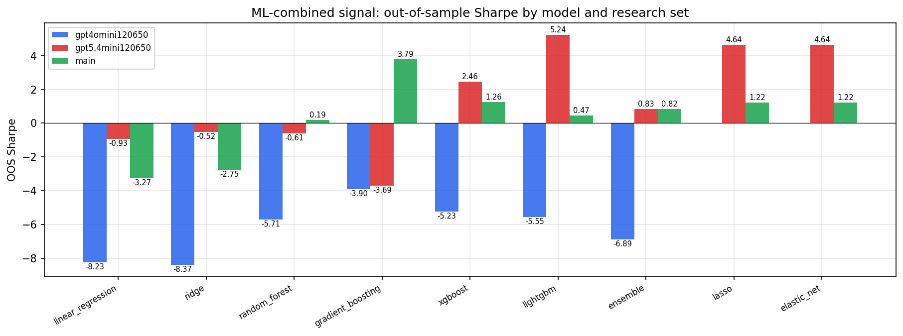

*ML-combined OOS Sharpe by model and research set*

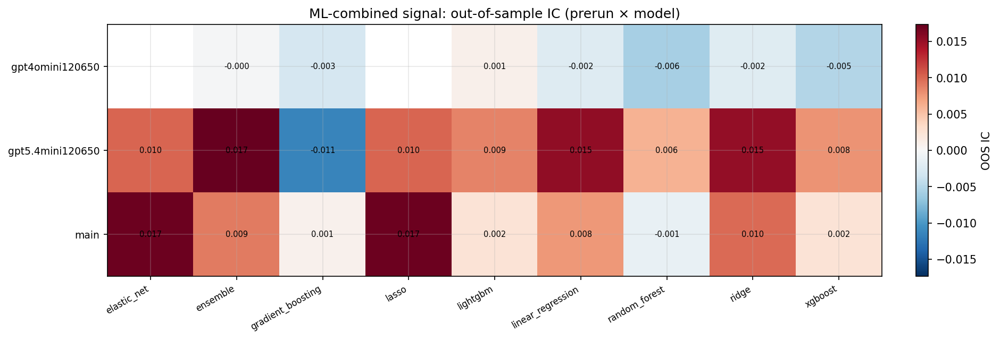

*ML-combined OOS IC (prerun × model)*

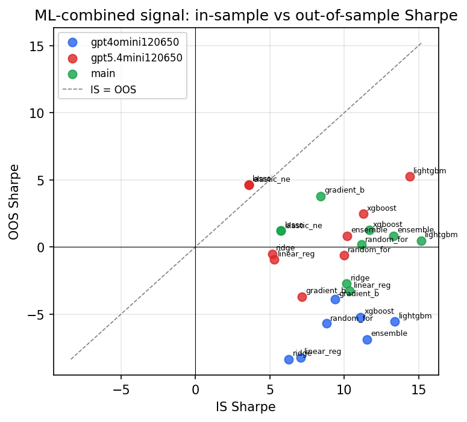

*IS vs OOS Sharpe (overfitting diagnostic)*

---
*Generated by `run_model_comparison.py`. Tables: `*.csv`; interactive: `comparison.ipynb`.*
