# Research-LLM factor comparison — `2026-02`

Comparing the **factor output of different research LLMs** on three axes (raw factor quality → factors as ML features → factors through the full agentic fund). The panel, IS/OOS split, horizon and model hyper-parameters are held identical across preruns — the *only* variable is the factor set.

## Preruns compared

| prerun | research_model | usable_factors | dropped_factors |
| --- | --- | --- | --- |
| gpt4omini120650 | gpt-4o-mini | 66 | 0 |
| gpt5.4mini120650 | gpt-5.4-mini | 69 | 0 |
| main | seed library | 78 | 10 |

> Dropped factors declare fields the current data doesn't have yet (e.g. fundamentals); they light up unchanged once that data is downloaded.

*Usable vs awaiting-data factors per research model*

## Key findings

- **Best ML-combined OOS Sharpe:** `gpt4omini120650` with `xgboost` (OOS Sharpe = 9.321).
- **Mean OOS Sharpe across models, by research set:** `gpt4omini120650` = 5.981, `gpt5.4mini120650` = 2.684, `main` = -1.788.
- **Highest mean single-factor |IC| (h=6):** `main` (mean |IC| = 0.0106).
- **Most diverse zoo (highest effective/raw factor ratio):** `gpt5.4mini120650` (eff 53.6 of 69, ratio 0.78).
- **Best selection-deflated single-factor |IC|:** `main` (deflated |IC| = 0.0351 from 37 factors tried).

## 1. Single-factor IC (raw factor quality)

Per-underlying time-series Spearman rank-IC of every researched factor, recomputed on the shared panel at horizons h=1, h=6, h=60. The per-underlying IC correlates each factor's value vector with the underlying's own forward-return vector (pooled across underlyings); the cross-sectional IC ranks across underlyings per timestamp.

| prerun | n_factors | mean_abs_ic_1 | mean_abs_ic_6 | mean_abs_ic_60 | mean_abs_icir_6 | best_factor_h6 | best_abs_ic_h6 |
| --- | --- | --- | --- | --- | --- | --- | --- |
| gpt4omini120650 | 66 | 0.0075 | 0.0061 | 0.0049 | 0.3196 | order_flow_volatility_spread | 0.0162 |
| gpt5.4mini120650 | 69 | 0.0077 | 0.0072 | 0.0059 | 0.3619 | auction_dislocation_mean_reversion | 0.0211 |
| main | 78 | 0.0221 | 0.0106 | 0.0034 | 0.5879 | alpha_066 | 0.0422 |

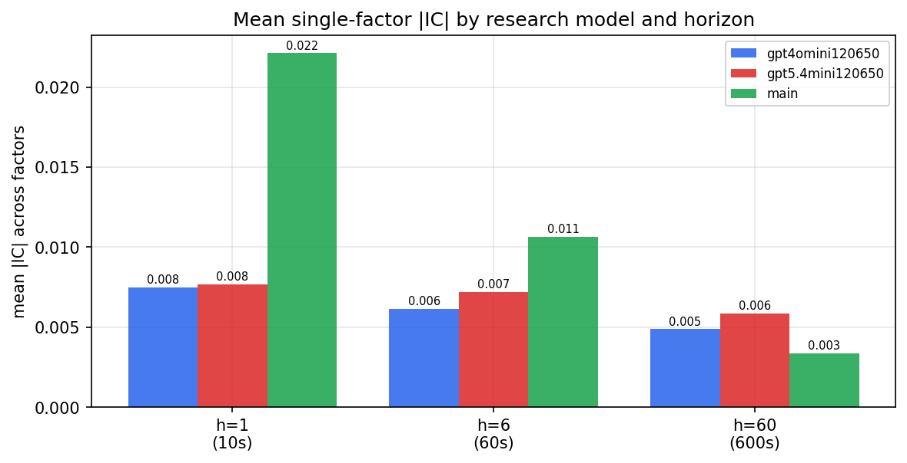

*Mean |IC| by research model and horizon*

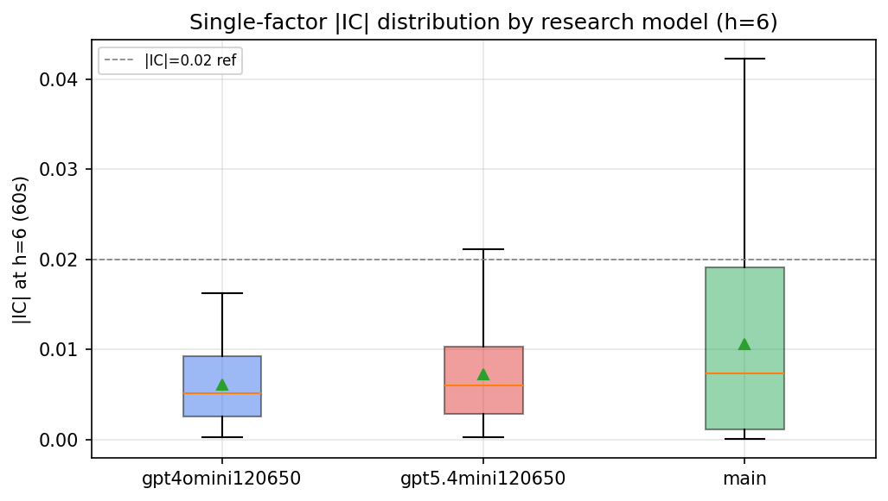

*Per-factor |IC| distribution by research model*

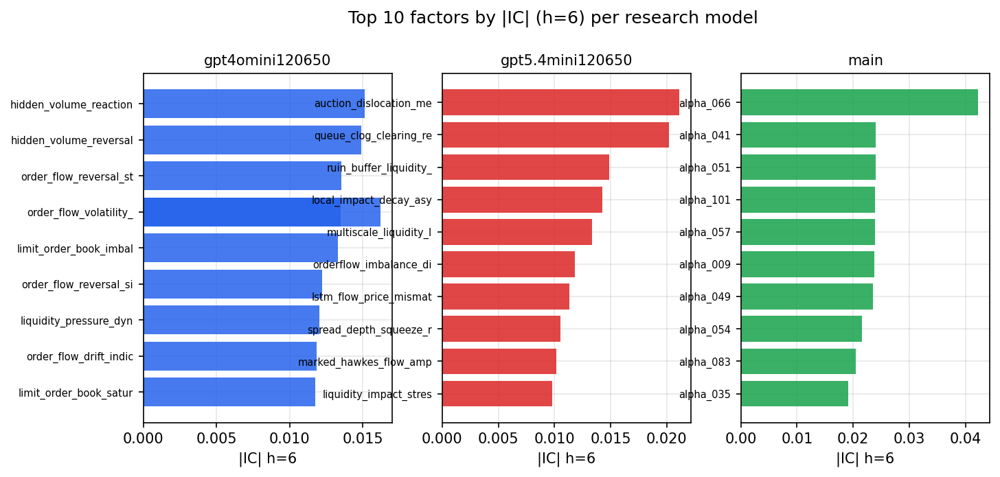

*Top factors by |IC| per research model*

## 2. Factor diversity & redundancy

Pairwise correlation of each zoo's *signals*. `eff_n_factors` is the effective number of independent factors (participation ratio of the correlation eigenvalues); `eff_ratio` and `redundancy` summarise how much unique information the zoo holds vs. how much is duplicated; `n_clusters` groups factors at |corr| ≥ 0.7.

| prerun | n_factors | eff_n_factors | eff_ratio | mean_abs_corr | n_clusters | redundancy |
| --- | --- | --- | --- | --- | --- | --- |
| gpt4omini120650 | 66 | 27.6225 | 0.4185 | 0.0488 | 52 | 0.5815 |
| gpt5.4mini120650 | 69 | 53.6051 | 0.7769 | 0.0116 | 64 | 0.2231 |
| main | 78 | 42.0246 | 0.5388 | 0.0295 | 69 | 0.4612 |

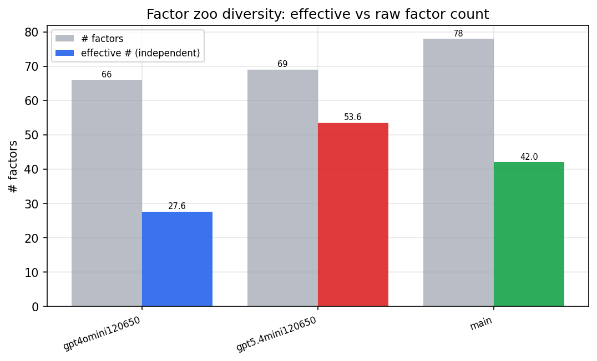

*Effective vs raw factor count per research model*

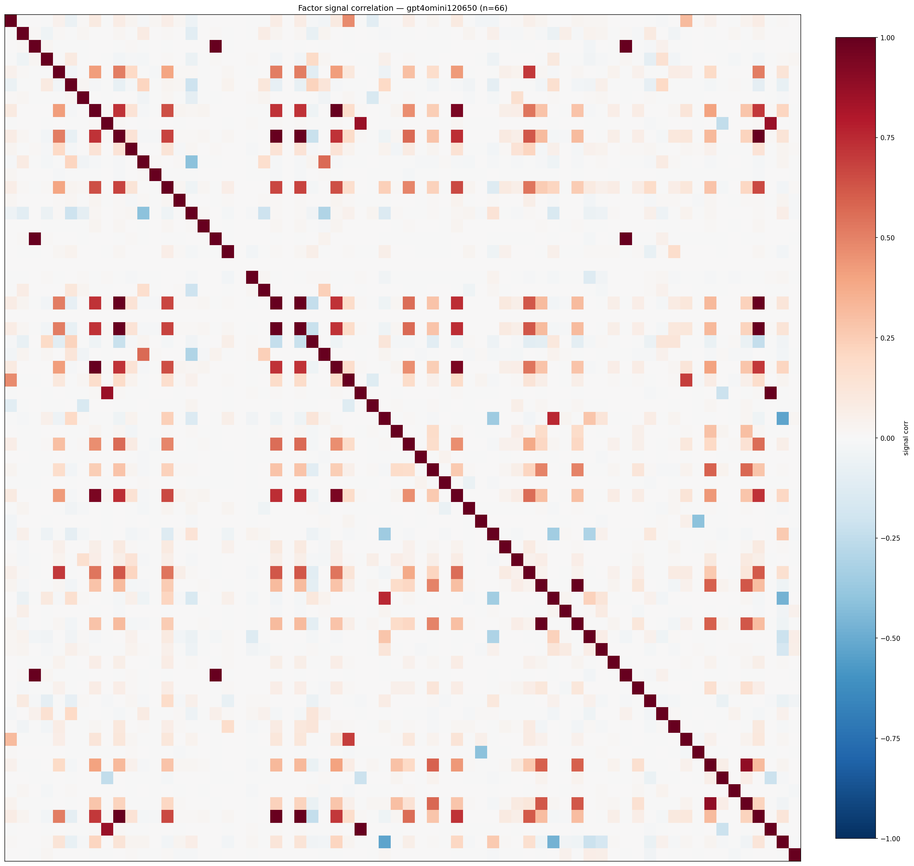

*Signal correlation matrix — gpt4omini120650*

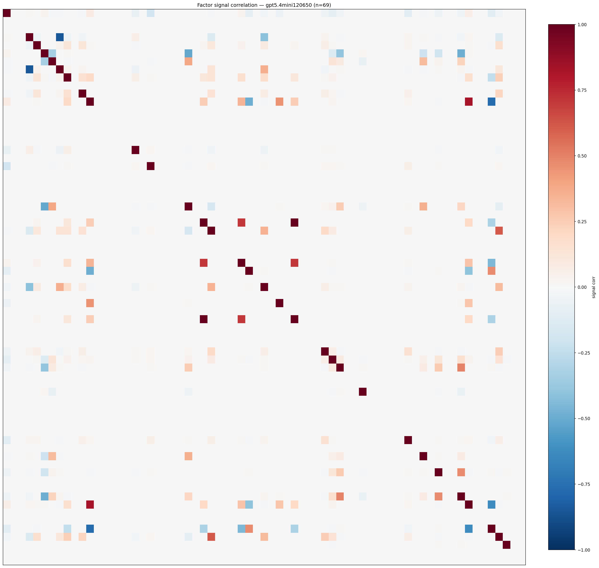

*Signal correlation matrix — gpt5.4mini120650*

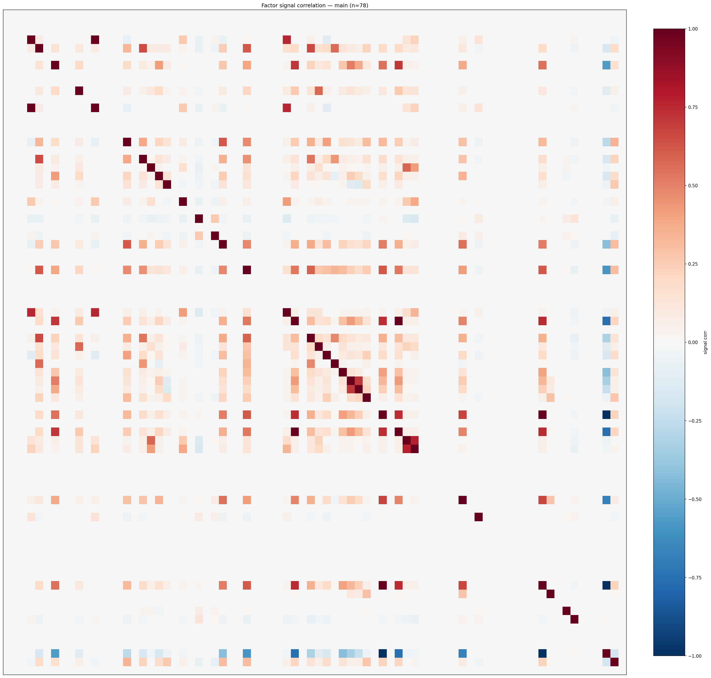

*Signal correlation matrix — main*

## 3. Deflation & model-based importance

`deflated_best_ic` haircuts each zoo's best |IC| for the number of factors tried (`ic_n_tested`) — a bigger zoo's best factor is more likely to be lucky. `lasso_n_nonzero` / `lasso_sparsity` show how many factors a sparse linear model actually keeps (model-view redundancy).

| prerun | best_ic | deflated_best_ic | deflated_best_t | ic_n_tested | ic_n_obs | lasso_n_nonzero | lasso_sparsity |
| --- | --- | --- | --- | --- | --- | --- | --- |
| gpt4omini120650 | 0.0162 | 0.0085 | 3.2133 | 64 | 141659 | 0 | 1.0 |
| gpt5.4mini120650 | 0.0211 | 0.0141 | 5.3239 | 31 | 141659 | 0 | 1.0 |
| main | 0.0422 | 0.0351 | 13.202 | 37 | 141659 | 0 | 1.0 |

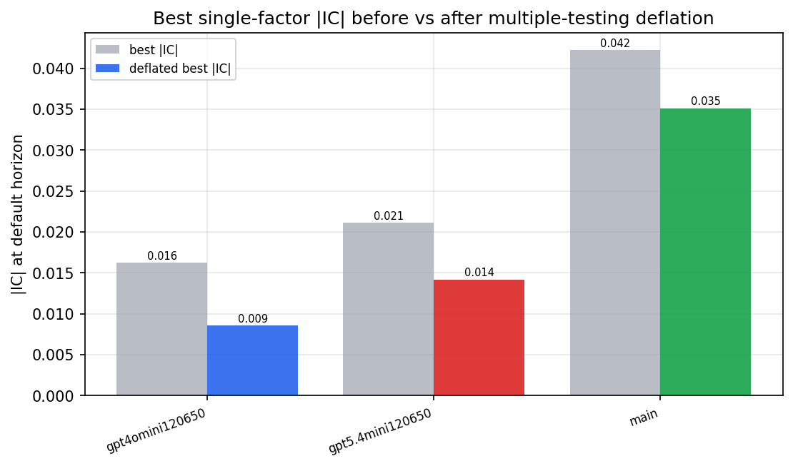

*Best |IC| before vs after multiple-testing deflation*

*Top factors by lasso importance per zoo*

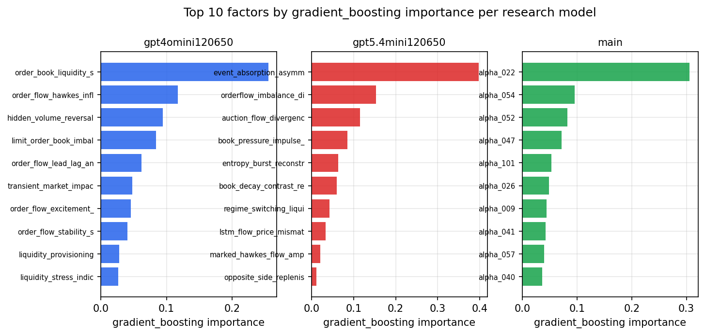

*Top factors by gradient_boosting importance per zoo*

## 4. ML-combined signal — per-underlying vectorised backtest

Each model combines a prerun's factors into ONE signal (fit `factors → forward return` on IS, predict per (bar, underlying)), then that combined signal is run through a simple vectorised backtest — `position(signal) × the underlying's own forward return` — on the held-out OOS tail (+ an equal-weight ensemble). No cross-sectional ranking.

> Config: position=**threshold** (t=1.0, z-score `expanding`), aggregation=**portfolio**, fit-standardise=**per_underlying**, horizon=6.

| prerun | model | n_factors_used | oos_ic | oos_sharpe | is_sharpe | oos_ann_return | oos_max_drawdown |
| --- | --- | --- | --- | --- | --- | --- | --- |
| gpt4omini120650 | linear_regression | 66 | 0.0053 | -0.5962 | 6.2407 | -0.078 | -0.0416 |
| gpt4omini120650 | ridge | 66 | 0.0039 | 0.885 | 5.6506 | 0.11 | -0.0253 |
| gpt4omini120650 | lasso | 66 | nan | nan | nan | nan | nan |
| gpt4omini120650 | elastic_net | 66 | nan | nan | nan | nan | nan |
| gpt4omini120650 | random_forest | 66 | 0.0004 | 7.0786 | 11.2298 | 1.2612 | -0.0237 |
| gpt4omini120650 | gradient_boosting | 66 | 0.0087 | 8.4933 | 11.1261 | 0.66 | -0.0062 |
| gpt4omini120650 | xgboost | 66 | -0.001 | 9.3206 | 12.4457 | 0.8494 | -0.0073 |
| gpt4omini120650 | lightgbm | 66 | 0.0116 | 8.5676 | 15.4092 | 1.0027 | -0.0205 |
| gpt4omini120650 | ensemble | 66 | 0.0117 | 8.1168 | 10.1044 | 0.8378 | -0.0077 |
| gpt5.4mini120650 | linear_regression | 69 | 0.005 | 0.2954 | 8.1244 | 0.0282 | -0.0229 |
| gpt5.4mini120650 | ridge | 69 | 0.0044 | 0.1836 | 8.8216 | 0.0175 | -0.0248 |
| gpt5.4mini120650 | lasso | 69 | -0.0025 | 4.1928 | 5.0564 | 0.3003 | -0.0117 |
| gpt5.4mini120650 | elastic_net | 69 | -0.0023 | 4.7282 | 5.0982 | 0.3433 | -0.0117 |
| gpt5.4mini120650 | random_forest | 69 | 0.0026 | 3.8622 | 9.6244 | 0.3792 | -0.0149 |
| gpt5.4mini120650 | gradient_boosting | 69 | -0.0021 | 4.4538 | 8.3709 | 0.1925 | -0.0072 |
| gpt5.4mini120650 | xgboost | 69 | 0.0077 | 2.2848 | 10.0164 | 0.1569 | -0.0143 |
| gpt5.4mini120650 | lightgbm | 69 | 0.0077 | 2.4562 | 14.2671 | 0.1479 | -0.0109 |
| gpt5.4mini120650 | ensemble | 69 | 0.0009 | 1.695 | 9.8081 | 0.1585 | -0.0169 |
| main | linear_regression | 78 | -0.0011 | -6.0522 | 6.8973 | -0.0259 | -0.0019 |
| main | ridge | 78 | -0.0019 | -6.0522 | 6.7642 | -0.0259 | -0.0019 |
| main | lasso | 78 | nan | nan | nan | nan | nan |
| main | elastic_net | 78 | nan | nan | nan | nan | nan |
| main | random_forest | 78 | -0.002 | -0.1414 | 8.2662 | -0.0237 | -0.0268 |
| main | gradient_boosting | 78 | -0.0038 | 0.0975 | 9.2144 | 0.0158 | -0.0236 |
| main | xgboost | 78 | -0.0002 | 1.5277 | 10.4883 | 0.1795 | -0.0159 |
| main | lightgbm | 78 | -0.0003 | -0.8391 | 15.2374 | -0.0967 | -0.0226 |
| main | ensemble | 78 | 0.0015 | -1.0581 | 8.3834 | -0.147 | -0.0222 |

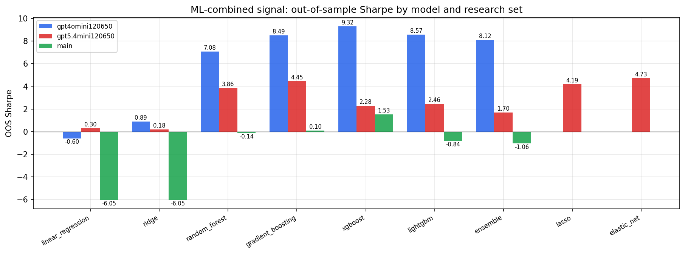

*ML-combined OOS Sharpe by model and research set*

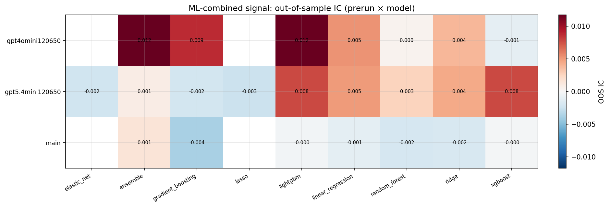

*ML-combined OOS IC (prerun × model)*

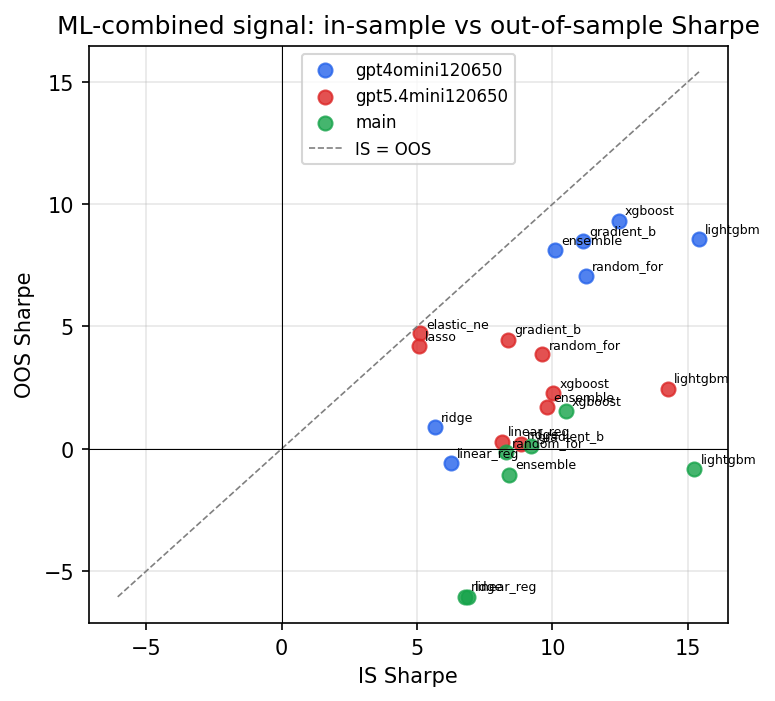

*IS vs OOS Sharpe (overfitting diagnostic)*

---
*Generated by `run_model_comparison.py`. Tables: `*.csv`; interactive: `comparison.ipynb`.*
