# Research-LLM factor comparison — `2026-03`

Comparing the **factor output of different research LLMs** on three axes (raw factor quality → factors as ML features → factors through the full agentic fund). The panel, IS/OOS split, horizon and model hyper-parameters are held identical across preruns — the *only* variable is the factor set.

## Preruns compared

| prerun | research_model | usable_factors | dropped_factors |
| --- | --- | --- | --- |
| gpt4omini120650 | gpt-4o-mini | 66 | 0 |
| gpt5.4mini120650 | gpt-5.4-mini | 69 | 0 |
| main | seed library | 78 | 10 |

> Dropped factors declare fields the current data doesn't have yet (e.g. fundamentals); they light up unchanged once that data is downloaded.

*Usable vs awaiting-data factors per research model*

## Key findings

- **Best ML-combined OOS Sharpe:** `gpt5.4mini120650` with `linear_regression` (OOS Sharpe = 4.970).
- **Mean OOS Sharpe across models, by research set:** `gpt4omini120650` = 3.157, `gpt5.4mini120650` = 2.048, `main` = 0.828.
- **Highest mean single-factor |IC| (h=6):** `gpt4omini120650` (mean |IC| = 0.0058).
- **Most diverse zoo (highest effective/raw factor ratio):** `gpt5.4mini120650` (eff 53.1 of 69, ratio 0.77).
- **Best selection-deflated single-factor |IC|:** `gpt5.4mini120650` (deflated |IC| = 0.0124 from 31 factors tried).

## 1. Single-factor IC (raw factor quality)

Per-underlying time-series Spearman rank-IC of every researched factor, recomputed on the shared panel at horizons h=1, h=6, h=60. The per-underlying IC correlates each factor's value vector with the underlying's own forward-return vector (pooled across underlyings); the cross-sectional IC ranks across underlyings per timestamp.

| prerun | n_factors | mean_abs_ic_1 | mean_abs_ic_6 | mean_abs_ic_60 | mean_abs_icir_6 | best_factor_h6 | best_abs_ic_h6 |
| --- | --- | --- | --- | --- | --- | --- | --- |
| gpt4omini120650 | 66 | 0.0086 | 0.0058 | 0.0084 | 0.2755 | hidden_volume_exploration | 0.0185 |
| gpt5.4mini120650 | 69 | 0.0061 | 0.0055 | 0.0081 | 0.3259 | ruin_buffer_liquidity_tilt | 0.0193 |
| main | 78 | 0.0136 | 0.0052 | 0.0032 | 0.3464 | alpha_049 | 0.0113 |

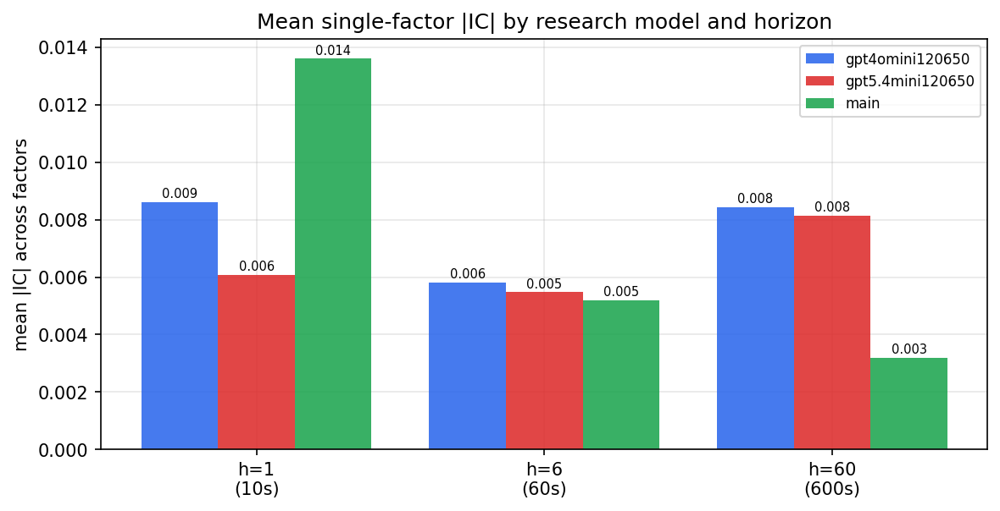

*Mean |IC| by research model and horizon*

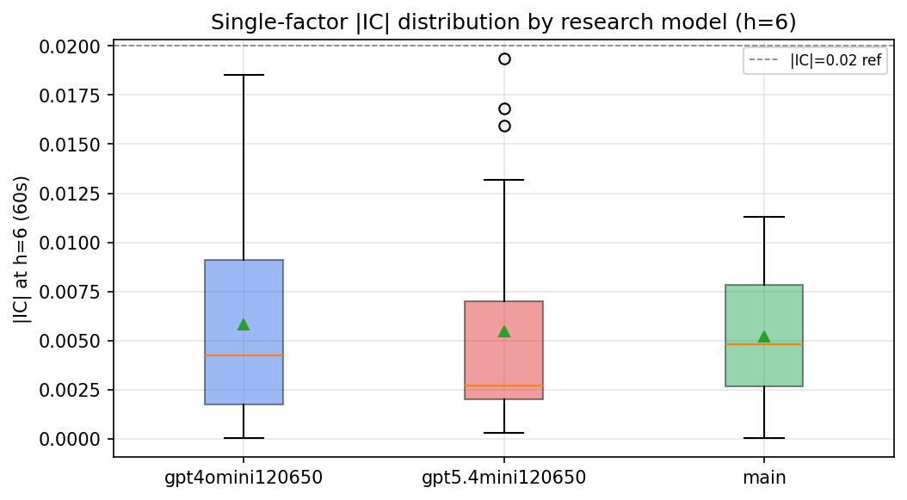

*Per-factor |IC| distribution by research model*

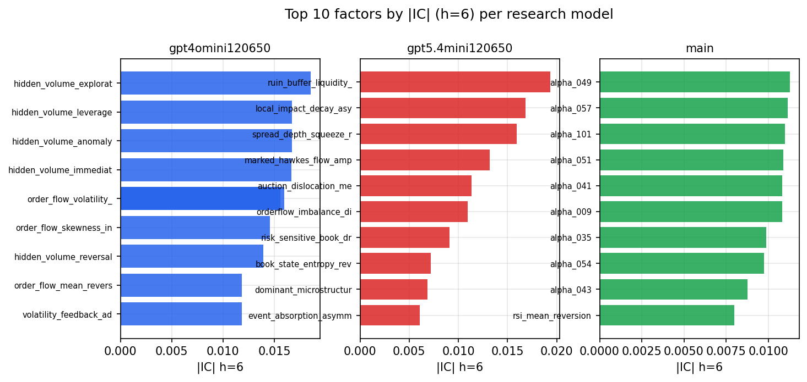

*Top factors by |IC| per research model*

## 2. Factor diversity & redundancy

Pairwise correlation of each zoo's *signals*. `eff_n_factors` is the effective number of independent factors (participation ratio of the correlation eigenvalues); `eff_ratio` and `redundancy` summarise how much unique information the zoo holds vs. how much is duplicated; `n_clusters` groups factors at |corr| ≥ 0.7.

| prerun | n_factors | eff_n_factors | eff_ratio | mean_abs_corr | n_clusters | redundancy |
| --- | --- | --- | --- | --- | --- | --- |
| gpt4omini120650 | 66 | 29.239 | 0.443 | 0.0491 | 55 | 0.557 |
| gpt5.4mini120650 | 69 | 53.0711 | 0.7691 | 0.0117 | 64 | 0.2309 |
| main | 78 | 44.7744 | 0.574 | 0.0269 | 72 | 0.426 |

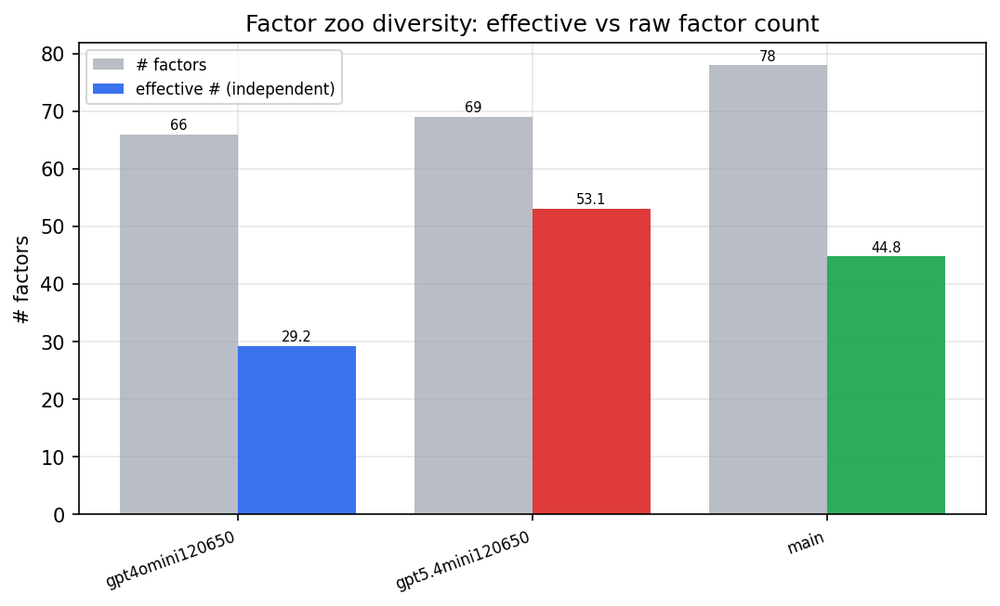

*Effective vs raw factor count per research model*

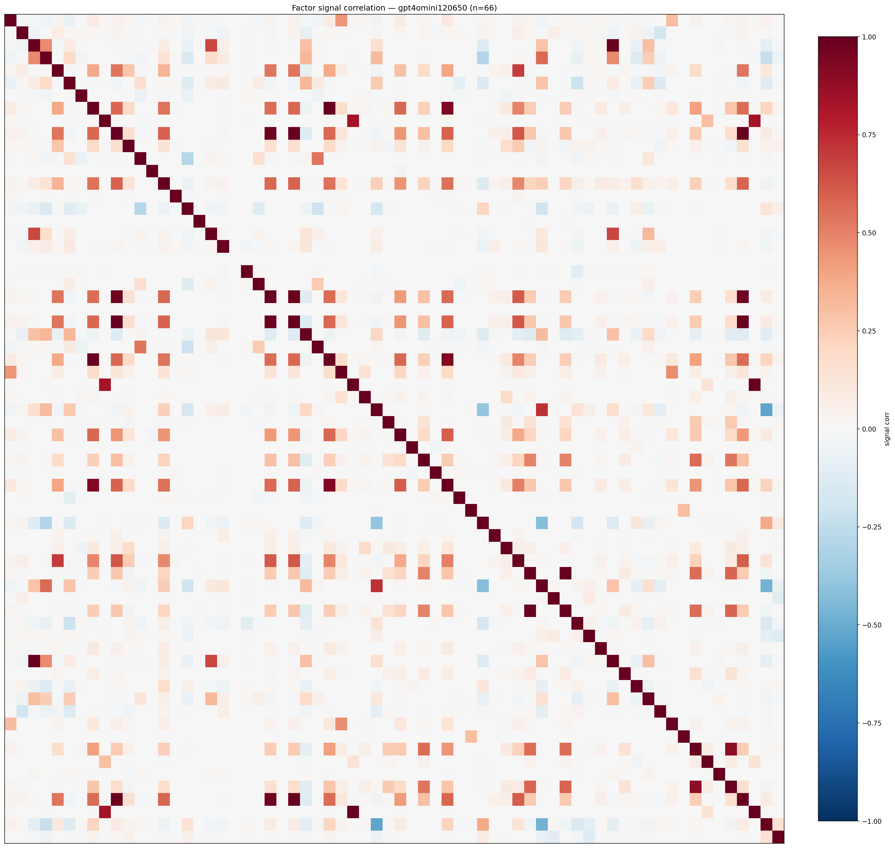

*Signal correlation matrix — gpt4omini120650*

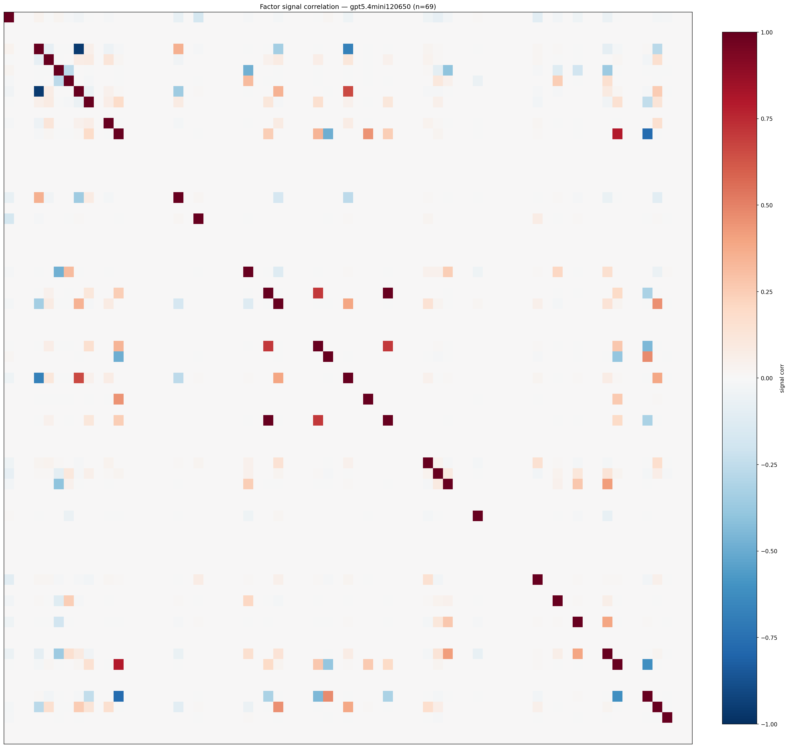

*Signal correlation matrix — gpt5.4mini120650*

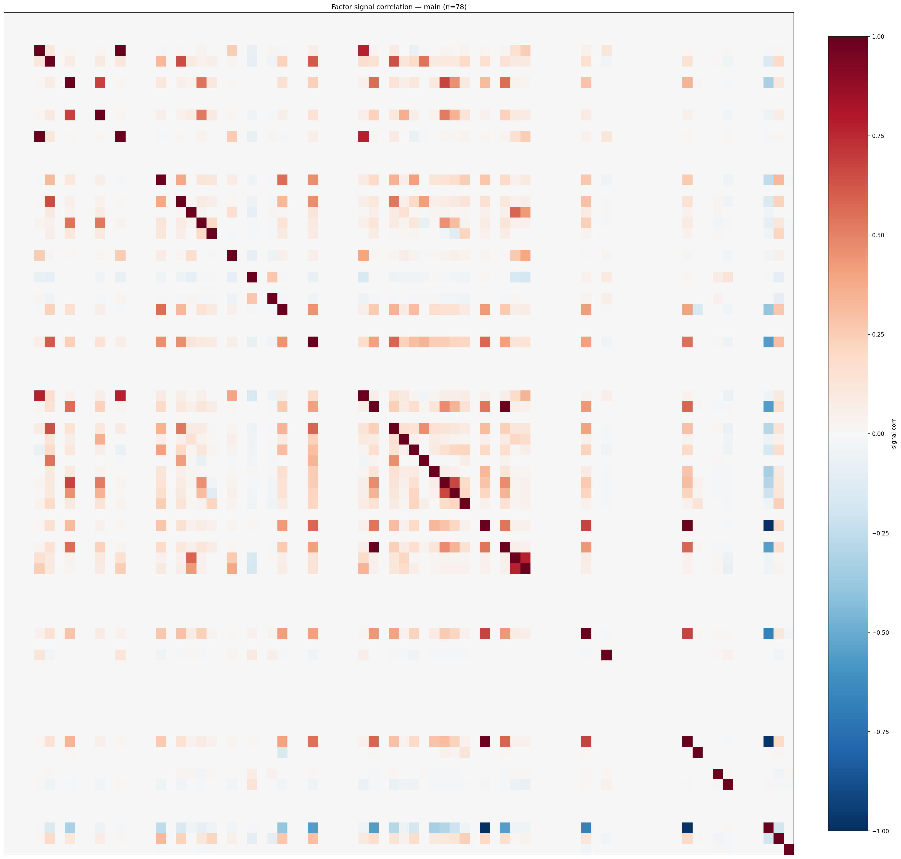

*Signal correlation matrix — main*

## 3. Deflation & model-based importance

`deflated_best_ic` haircuts each zoo's best |IC| for the number of factors tried (`ic_n_tested`) — a bigger zoo's best factor is more likely to be lucky. `lasso_n_nonzero` / `lasso_sparsity` show how many factors a sparse linear model actually keeps (model-view redundancy).

| prerun | best_ic | deflated_best_ic | deflated_best_t | ic_n_tested | ic_n_obs | lasso_n_nonzero | lasso_sparsity |
| --- | --- | --- | --- | --- | --- | --- | --- |
| gpt4omini120650 | 0.0185 | 0.0109 | 4.1199 | 64 | 142739 | 0 | 1.0 |
| gpt5.4mini120650 | 0.0193 | 0.0124 | 4.687 | 31 | 142739 | 0 | 1.0 |
| main | 0.0113 | 0.0041 | 1.5637 | 38 | 142739 | 0 | 1.0 |

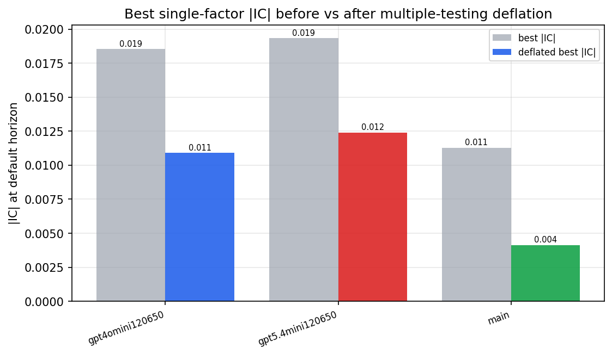

*Best |IC| before vs after multiple-testing deflation*

*Top factors by lasso importance per zoo*

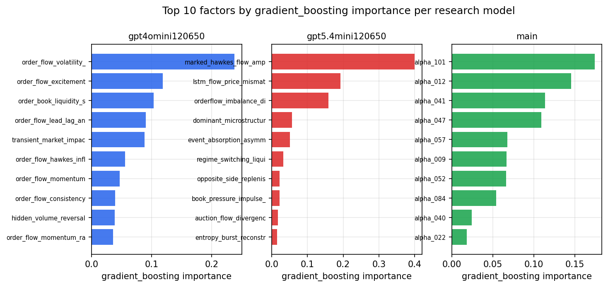

*Top factors by gradient_boosting importance per zoo*

## 4. ML-combined signal — per-underlying vectorised backtest

Each model combines a prerun's factors into ONE signal (fit `factors → forward return` on IS, predict per (bar, underlying)), then that combined signal is run through a simple vectorised backtest — `position(signal) × the underlying's own forward return` — on the held-out OOS tail (+ an equal-weight ensemble). No cross-sectional ranking.

> Config: position=**threshold** (t=1.0, z-score `expanding`), aggregation=**portfolio**, fit-standardise=**per_underlying**, horizon=6.

| prerun | model | n_factors_used | oos_ic | oos_sharpe | is_sharpe | oos_ann_return | oos_max_drawdown |
| --- | --- | --- | --- | --- | --- | --- | --- |
| gpt4omini120650 | linear_regression | 66 | 0.0127 | 4.1636 | 6.7242 | 2.3346 | -0.0899 |
| gpt4omini120650 | ridge | 66 | 0.012 | 4.6157 | 6.9924 | 2.5351 | -0.1041 |
| gpt4omini120650 | lasso | 66 | nan | nan | nan | nan | nan |
| gpt4omini120650 | elastic_net | 66 | nan | nan | nan | nan | nan |
| gpt4omini120650 | random_forest | 66 | 0.0091 | 3.1702 | 9.7869 | 2.1719 | -0.1703 |
| gpt4omini120650 | gradient_boosting | 66 | 0.007 | 4.2173 | 10.864 | 1.186 | -0.0619 |
| gpt4omini120650 | xgboost | 66 | 0.0032 | 2.1006 | 12.4994 | 0.7153 | -0.0769 |
| gpt4omini120650 | lightgbm | 66 | 0.0063 | 0.237 | 15.2195 | 0.1081 | -0.1627 |
| gpt4omini120650 | ensemble | 66 | 0.0104 | 3.5942 | 12.2264 | 2.1423 | -0.1318 |
| gpt5.4mini120650 | linear_regression | 69 | 0.0033 | 4.9702 | 7.2057 | 3.713 | -0.129 |
| gpt5.4mini120650 | ridge | 69 | 0.004 | 4.9326 | 7.0191 | 3.6948 | -0.1329 |
| gpt5.4mini120650 | lasso | 69 | nan | nan | nan | nan | nan |
| gpt5.4mini120650 | elastic_net | 69 | nan | nan | nan | nan | nan |
| gpt5.4mini120650 | random_forest | 69 | 0.0056 | 1.7493 | 7.5888 | 1.0166 | -0.1429 |
| gpt5.4mini120650 | gradient_boosting | 69 | 0.0017 | -1.2627 | 7.5916 | -0.3825 | -0.0899 |
| gpt5.4mini120650 | xgboost | 69 | -0.0023 | 0.5312 | 9.2691 | 0.2562 | -0.1453 |
| gpt5.4mini120650 | lightgbm | 69 | -0.0034 | 1.0553 | 13.776 | 0.396 | -0.1162 |
| gpt5.4mini120650 | ensemble | 69 | 0.0012 | 2.3599 | 10.5417 | 1.4798 | -0.1242 |
| main | linear_regression | 78 | -0.0029 | 1.1692 | 7.5766 | 0.3866 | -0.0597 |
| main | ridge | 78 | -0.0012 | 1.7121 | 7.068 | 0.5898 | -0.0533 |
| main | lasso | 78 | -0.0042 | 0.3019 | 6.0006 | 0.1131 | -0.0816 |
| main | elastic_net | 78 | -0.0042 | 0.5178 | 6.1641 | 0.1944 | -0.0769 |
| main | random_forest | 78 | -0.0017 | 3.5541 | 8.8393 | 2.1719 | -0.1241 |
| main | gradient_boosting | 78 | -0.0037 | -1.8355 | 6.1846 | -0.7572 | -0.151 |
| main | xgboost | 78 | 0.0016 | -0.4259 | 10.3543 | -0.1311 | -0.1272 |
| main | lightgbm | 78 | -0.0031 | 1.899 | 13.8758 | 0.8037 | -0.1031 |
| main | ensemble | 78 | -0.0037 | 0.5628 | 8.8428 | 0.2341 | -0.0773 |

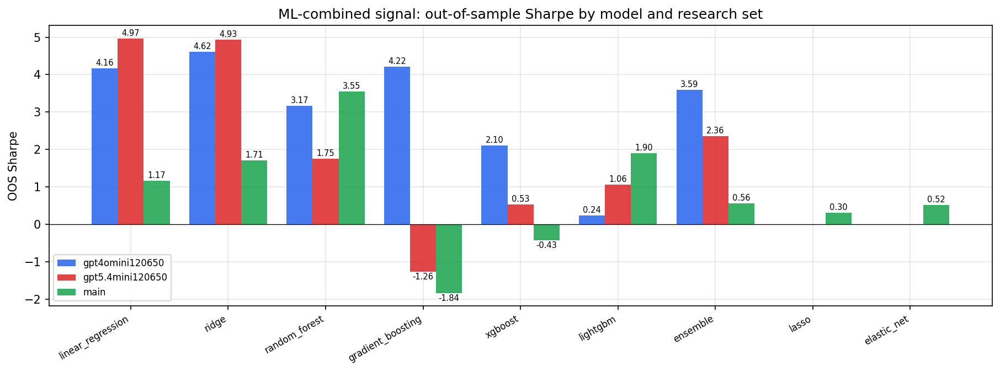

*ML-combined OOS Sharpe by model and research set*

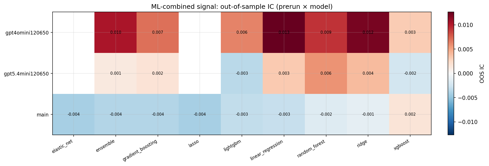

*ML-combined OOS IC (prerun × model)*

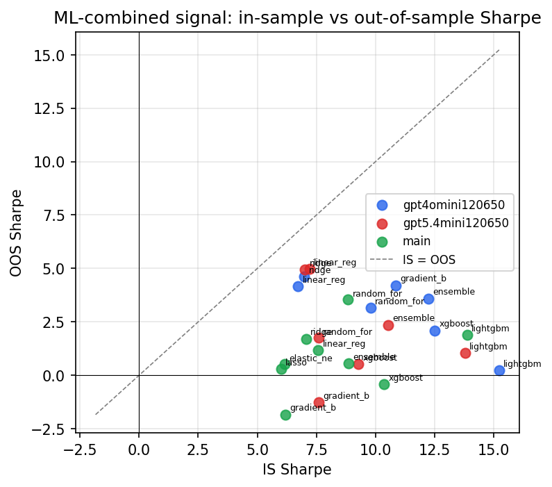

*IS vs OOS Sharpe (overfitting diagnostic)*

---
*Generated by `run_model_comparison.py`. Tables: `*.csv`; interactive: `comparison.ipynb`.*
