# Research-LLM factor comparison — `2026-04`

Comparing the **factor output of different research LLMs** on three axes (raw factor quality → factors as ML features → factors through the full agentic fund). The panel, IS/OOS split, horizon and model hyper-parameters are held identical across preruns — the *only* variable is the factor set.

## Preruns compared

| prerun | research_model | usable_factors | dropped_factors |
| --- | --- | --- | --- |
| gpt4omini120650 | gpt-4o-mini | 66 | 0 |
| gpt5.4mini120650 | gpt-5.4-mini | 69 | 0 |
| main | seed library | 78 | 10 |

> Dropped factors declare fields the current data doesn't have yet (e.g. fundamentals); they light up unchanged once that data is downloaded.

*Usable vs awaiting-data factors per research model*

## Key findings

- **Best ML-combined OOS Sharpe:** `gpt5.4mini120650` with `gradient_boosting` (OOS Sharpe = 4.333).
- **Mean OOS Sharpe across models, by research set:** `gpt5.4mini120650` = 2.556, `main` = 0.849, `gpt4omini120650` = 0.124.
- **Highest mean single-factor |IC| (h=6):** `main` (mean |IC| = 0.0060).
- **Most diverse zoo (highest effective/raw factor ratio):** `gpt5.4mini120650` (eff 54.3 of 69, ratio 0.79).
- **Best selection-deflated single-factor |IC|:** `gpt4omini120650` (deflated |IC| = 0.0104 from 64 factors tried).

## 1. Single-factor IC (raw factor quality)

Per-underlying time-series Spearman rank-IC of every researched factor, recomputed on the shared panel at horizons h=1, h=6, h=60. The per-underlying IC correlates each factor's value vector with the underlying's own forward-return vector (pooled across underlyings); the cross-sectional IC ranks across underlyings per timestamp.

| prerun | n_factors | mean_abs_ic_1 | mean_abs_ic_6 | mean_abs_ic_60 | mean_abs_icir_6 | best_factor_h6 | best_abs_ic_h6 |
| --- | --- | --- | --- | --- | --- | --- | --- |
| gpt4omini120650 | 66 | 0.0072 | 0.0059 | 0.0095 | 0.2653 | order_flow_momentum | 0.018 |
| gpt5.4mini120650 | 69 | 0.0051 | 0.0058 | 0.0071 | 0.3095 | ruin_buffer_liquidity_tilt | 0.0161 |
| main | 78 | 0.011 | 0.006 | 0.0062 | 0.3545 | alpha_052 | 0.0169 |

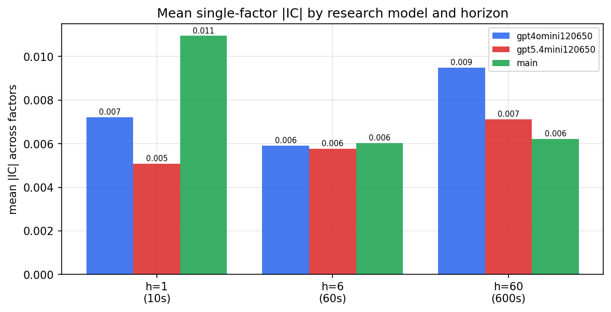

*Mean |IC| by research model and horizon*

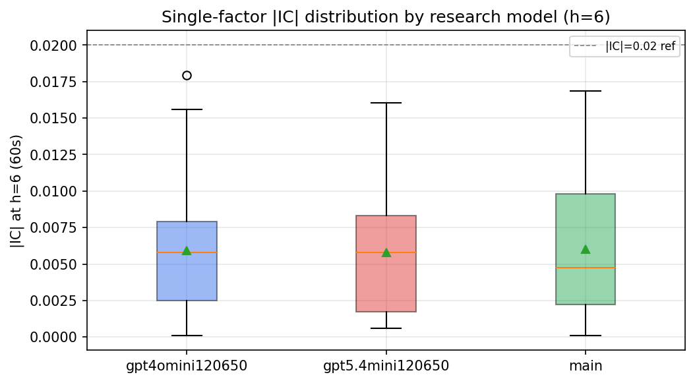

*Per-factor |IC| distribution by research model*

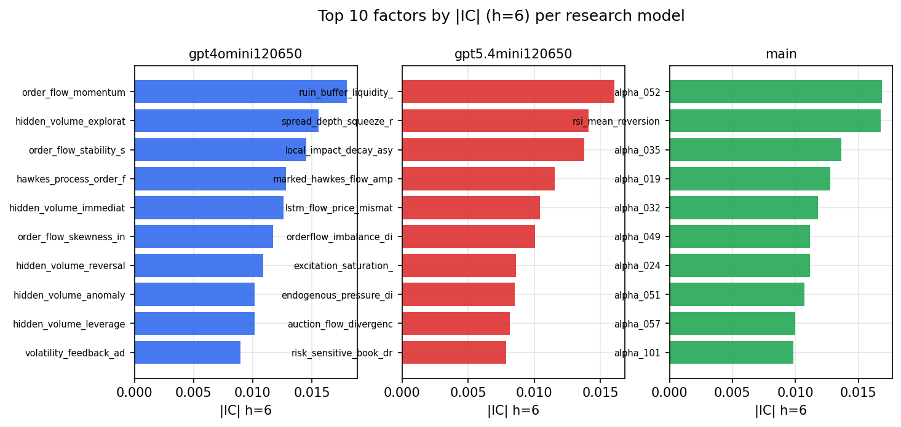

*Top factors by |IC| per research model*

## 2. Factor diversity & redundancy

Pairwise correlation of each zoo's *signals*. `eff_n_factors` is the effective number of independent factors (participation ratio of the correlation eigenvalues); `eff_ratio` and `redundancy` summarise how much unique information the zoo holds vs. how much is duplicated; `n_clusters` groups factors at |corr| ≥ 0.7.

| prerun | n_factors | eff_n_factors | eff_ratio | mean_abs_corr | n_clusters | redundancy |
| --- | --- | --- | --- | --- | --- | --- |
| gpt4omini120650 | 66 | 29.7543 | 0.4508 | 0.0458 | 55 | 0.5492 |
| gpt5.4mini120650 | 69 | 54.262 | 0.7864 | 0.0105 | 64 | 0.2136 |
| main | 78 | 44.5117 | 0.5707 | 0.0275 | 72 | 0.4293 |

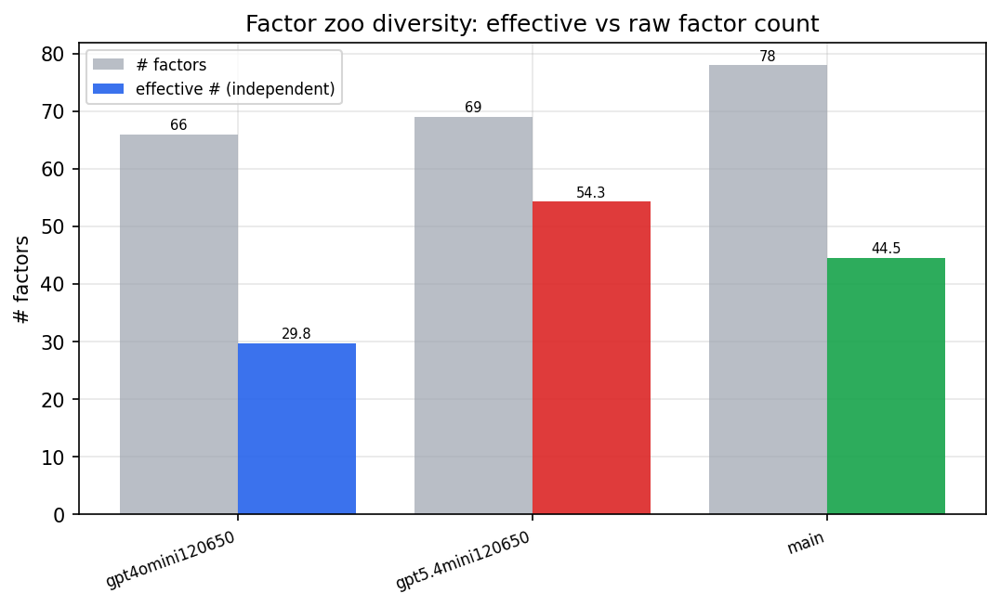

*Effective vs raw factor count per research model*

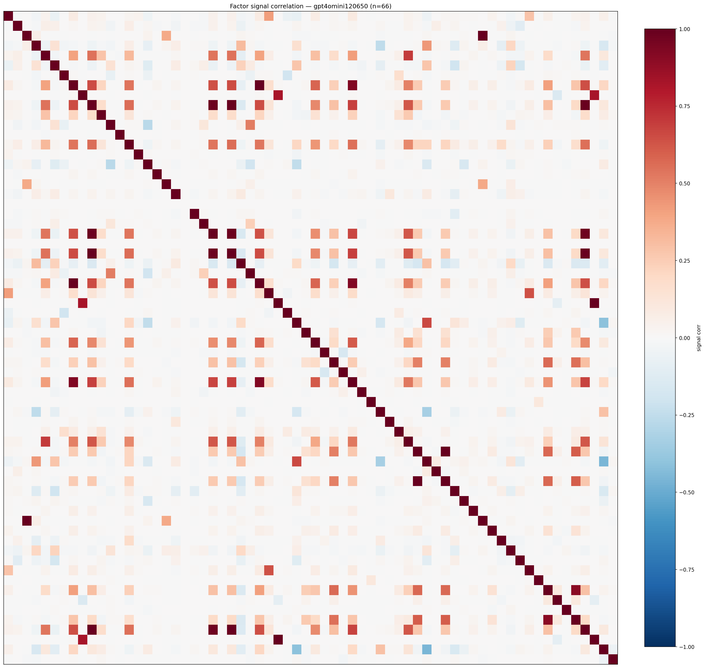

*Signal correlation matrix — gpt4omini120650*

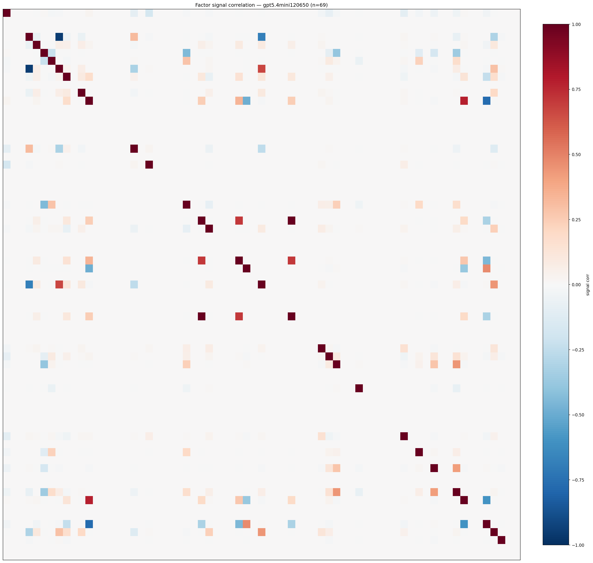

*Signal correlation matrix — gpt5.4mini120650*

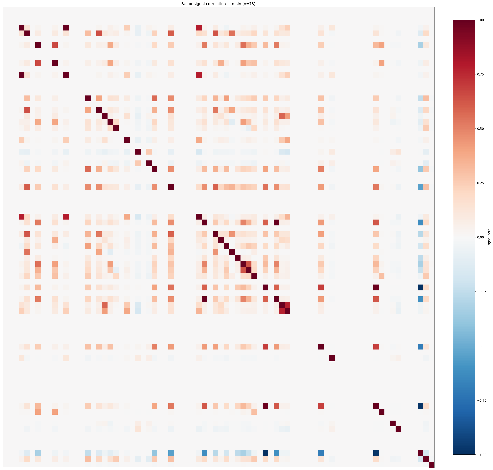

*Signal correlation matrix — main*

## 3. Deflation & model-based importance

`deflated_best_ic` haircuts each zoo's best |IC| for the number of factors tried (`ic_n_tested`) — a bigger zoo's best factor is more likely to be lucky. `lasso_n_nonzero` / `lasso_sparsity` show how many factors a sparse linear model actually keeps (model-view redundancy).

| prerun | best_ic | deflated_best_ic | deflated_best_t | ic_n_tested | ic_n_obs | lasso_n_nonzero | lasso_sparsity |
| --- | --- | --- | --- | --- | --- | --- | --- |
| gpt4omini120650 | 0.018 | 0.0104 | 3.957 | 64 | 145079 | 0 | 1.0 |
| gpt5.4mini120650 | 0.0161 | 0.0092 | 3.4943 | 31 | 145079 | 0 | 1.0 |
| main | 0.0169 | 0.0098 | 3.7226 | 38 | 145079 | 0 | 1.0 |

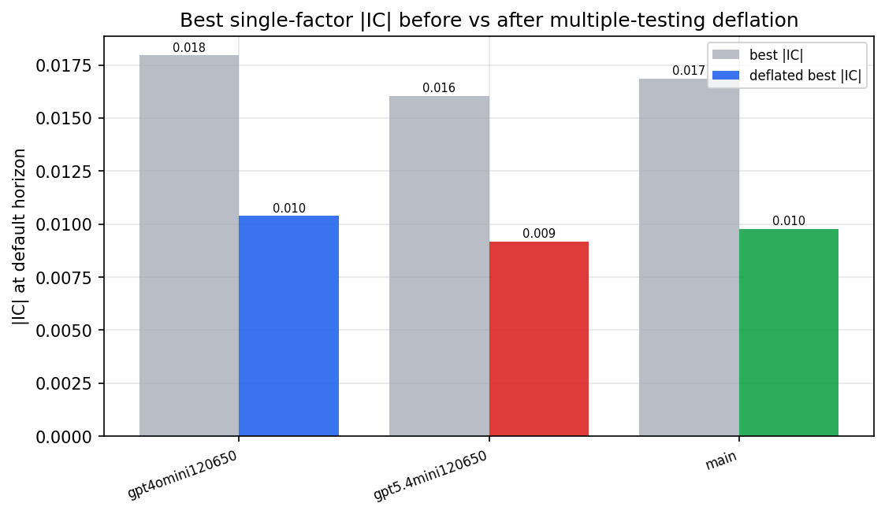

*Best |IC| before vs after multiple-testing deflation*

*Top factors by lasso importance per zoo*

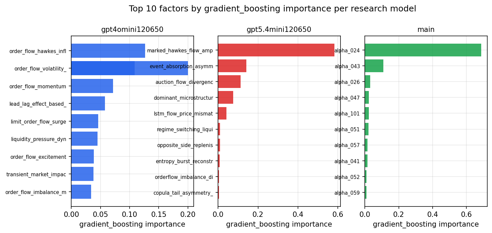

*Top factors by gradient_boosting importance per zoo*

## 4. ML-combined signal — per-underlying vectorised backtest

Each model combines a prerun's factors into ONE signal (fit `factors → forward return` on IS, predict per (bar, underlying)), then that combined signal is run through a simple vectorised backtest — `position(signal) × the underlying's own forward return` — on the held-out OOS tail (+ an equal-weight ensemble). No cross-sectional ranking.

> Config: position=**threshold** (t=1.0, z-score `expanding`), aggregation=**portfolio**, fit-standardise=**per_underlying**, horizon=6.

| prerun | model | n_factors_used | oos_ic | oos_sharpe | is_sharpe | oos_ann_return | oos_max_drawdown |
| --- | --- | --- | --- | --- | --- | --- | --- |
| gpt4omini120650 | linear_regression | 66 | -0.0225 | -2.4139 | 8.0104 | -0.6688 | -0.0912 |
| gpt4omini120650 | ridge | 66 | -0.0226 | -1.898 | 8.1851 | -0.5314 | -0.083 |
| gpt4omini120650 | lasso | 66 | -0.0057 | 1.0068 | 4.1362 | 0.2251 | -0.0609 |
| gpt4omini120650 | elastic_net | 66 | -0.0229 | 1.0047 | 4.6759 | 0.2173 | -0.045 |
| gpt4omini120650 | random_forest | 66 | -0.0051 | 0.7063 | 11.2621 | 0.3086 | -0.1038 |
| gpt4omini120650 | gradient_boosting | 66 | -0.005 | -1.0741 | 12.0548 | -0.3125 | -0.0806 |
| gpt4omini120650 | xgboost | 66 | -0.0046 | 1.513 | 14.5026 | 0.417 | -0.0806 |
| gpt4omini120650 | lightgbm | 66 | -0.0106 | 0.8151 | 20.6728 | 0.1906 | -0.0571 |
| gpt4omini120650 | ensemble | 66 | -0.0187 | 1.4584 | 12.7558 | 0.5641 | -0.0907 |
| gpt5.4mini120650 | linear_regression | 69 | 0.0086 | 2.5713 | 5.6927 | 1.9123 | -0.1256 |
| gpt5.4mini120650 | ridge | 69 | 0.0086 | 2.6315 | 5.6646 | 1.9563 | -0.1241 |
| gpt5.4mini120650 | lasso | 69 | nan | nan | nan | nan | nan |
| gpt5.4mini120650 | elastic_net | 69 | nan | nan | nan | nan | nan |
| gpt5.4mini120650 | random_forest | 69 | 0.0005 | 2.7452 | 12.7716 | 1.6174 | -0.1283 |
| gpt5.4mini120650 | gradient_boosting | 69 | -0.0033 | 4.3333 | 13.3157 | 0.6833 | -0.0256 |
| gpt5.4mini120650 | xgboost | 69 | -0.0036 | 1.5078 | 16.1367 | 0.6065 | -0.0872 |
| gpt5.4mini120650 | lightgbm | 69 | -0.0054 | 2.0839 | 19.8462 | 0.4965 | -0.0542 |
| gpt5.4mini120650 | ensemble | 69 | 0.002 | 2.0181 | 14.8834 | 1.2904 | -0.1242 |
| main | linear_regression | 78 | -0.029 | 4.3033 | 8.5931 | 0.7899 | -0.0243 |
| main | ridge | 78 | -0.0286 | 3.528 | 9.6983 | 0.8081 | -0.0219 |
| main | lasso | 78 | nan | nan | nan | nan | nan |
| main | elastic_net | 78 | nan | nan | nan | nan | nan |
| main | random_forest | 78 | -0.0211 | 0.777 | 15.4467 | 0.4056 | -0.0903 |
| main | gradient_boosting | 78 | -0.0148 | -1.8607 | 19.338 | -0.1902 | -0.0404 |
| main | xgboost | 78 | -0.0251 | 0.3502 | 19.7749 | 0.1203 | -0.0645 |
| main | lightgbm | 78 | -0.016 | -2.605 | 21.0573 | -0.2614 | -0.0534 |
| main | ensemble | 78 | -0.0219 | 1.4476 | 18.4033 | 0.7195 | -0.0619 |

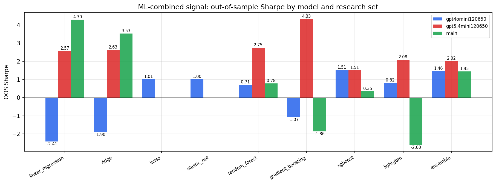

*ML-combined OOS Sharpe by model and research set*

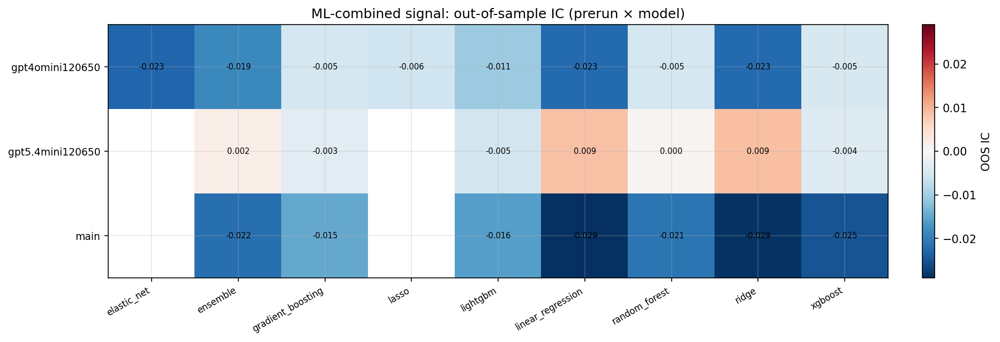

*ML-combined OOS IC (prerun × model)*

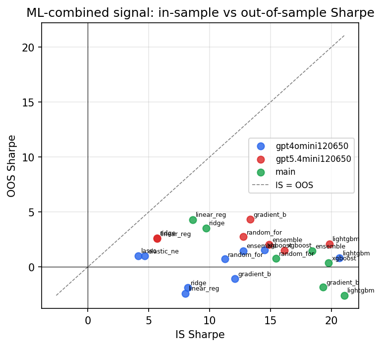

*IS vs OOS Sharpe (overfitting diagnostic)*

---
*Generated by `run_model_comparison.py`. Tables: `*.csv`; interactive: `comparison.ipynb`.*
