# Research-LLM factor comparison — `2026-05`

Comparing the **factor output of different research LLMs** on three axes (raw factor quality → factors as ML features → factors through the full agentic fund). The panel, IS/OOS split, horizon and model hyper-parameters are held identical across preruns — the *only* variable is the factor set.

## Preruns compared

| prerun | research_model | usable_factors | dropped_factors |
| --- | --- | --- | --- |
| gpt4omini120650 | gpt-4o-mini | 66 | 0 |
| gpt5.4mini120650 | gpt-5.4-mini | 69 | 0 |
| main | seed library | 78 | 10 |

> Dropped factors declare fields the current data doesn't have yet (e.g. fundamentals); they light up unchanged once that data is downloaded.

*Usable vs awaiting-data factors per research model*

## Key findings

- **Best ML-combined OOS Sharpe:** `gpt5.4mini120650` with `gradient_boosting` (OOS Sharpe = 3.301).
- **Mean OOS Sharpe across models, by research set:** `gpt5.4mini120650` = -1.130, `main` = -3.383, `gpt4omini120650` = -4.834.
- **Highest mean single-factor |IC| (h=6):** `main` (mean |IC| = 0.0088).
- **Most diverse zoo (highest effective/raw factor ratio):** `gpt5.4mini120650` (eff 51.8 of 69, ratio 0.75).
- **Best selection-deflated single-factor |IC|:** `main` (deflated |IC| = 0.0121 from 38 factors tried).

## 1. Single-factor IC (raw factor quality)

Per-underlying time-series Spearman rank-IC of every researched factor, recomputed on the shared panel at horizons h=1, h=6, h=60. The per-underlying IC correlates each factor's value vector with the underlying's own forward-return vector (pooled across underlyings); the cross-sectional IC ranks across underlyings per timestamp.

| prerun | n_factors | mean_abs_ic_1 | mean_abs_ic_6 | mean_abs_ic_60 | mean_abs_icir_6 | best_factor_h6 | best_abs_ic_h6 |
| --- | --- | --- | --- | --- | --- | --- | --- |
| gpt4omini120650 | 66 | 0.008 | 0.006 | 0.0074 | 0.2741 | order_flow_momentum | 0.0156 |
| gpt5.4mini120650 | 69 | 0.0055 | 0.006 | 0.0081 | 0.2377 | lstm_flow_price_mismatch | 0.0153 |
| main | 78 | 0.0134 | 0.0088 | 0.0065 | 0.412 | alpha_049 | 0.0192 |

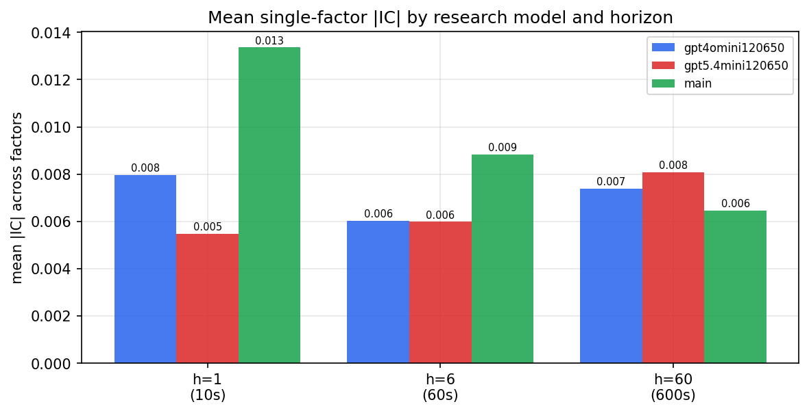

*Mean |IC| by research model and horizon*

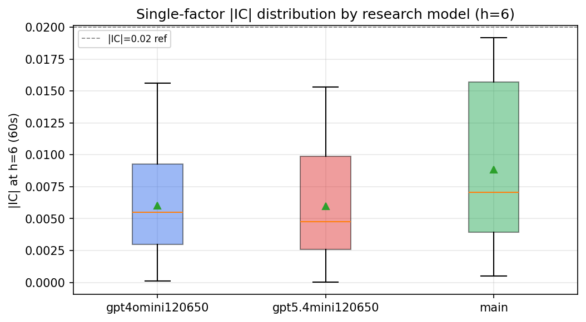

*Per-factor |IC| distribution by research model*

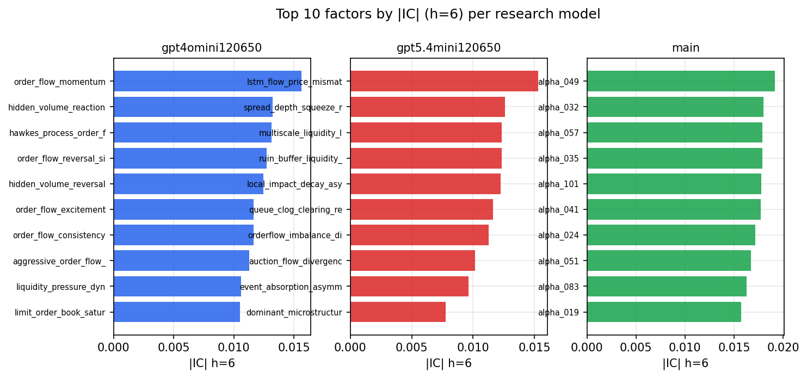

*Top factors by |IC| per research model*

## 2. Factor diversity & redundancy

Pairwise correlation of each zoo's *signals*. `eff_n_factors` is the effective number of independent factors (participation ratio of the correlation eigenvalues); `eff_ratio` and `redundancy` summarise how much unique information the zoo holds vs. how much is duplicated; `n_clusters` groups factors at |corr| ≥ 0.7.

| prerun | n_factors | eff_n_factors | eff_ratio | mean_abs_corr | n_clusters | redundancy |
| --- | --- | --- | --- | --- | --- | --- |
| gpt4omini120650 | 66 | 28.8793 | 0.4376 | 0.0484 | 53 | 0.5624 |
| gpt5.4mini120650 | 69 | 51.7643 | 0.7502 | 0.0121 | 62 | 0.2498 |
| main | 78 | 44.0675 | 0.565 | 0.0281 | 72 | 0.435 |

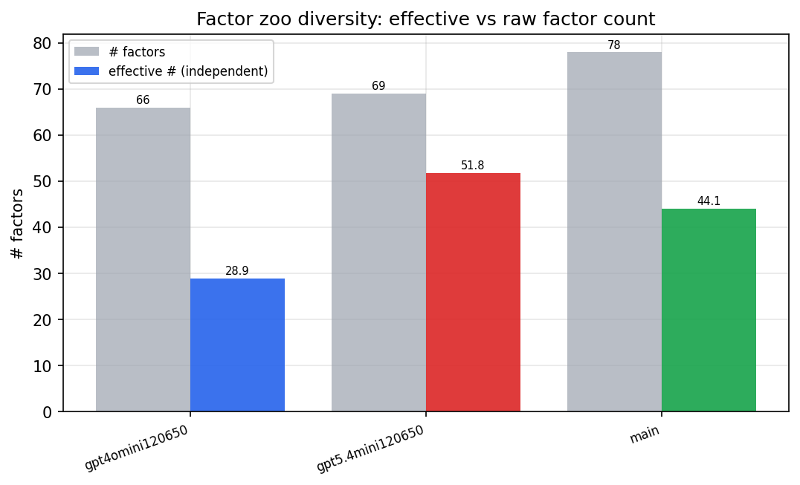

*Effective vs raw factor count per research model*

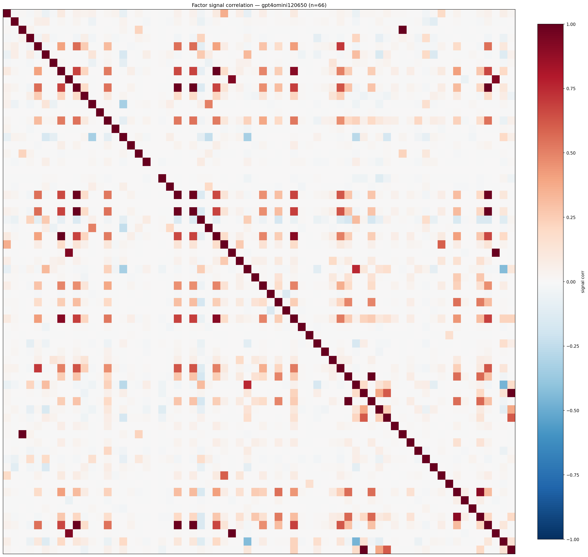

*Signal correlation matrix — gpt4omini120650*

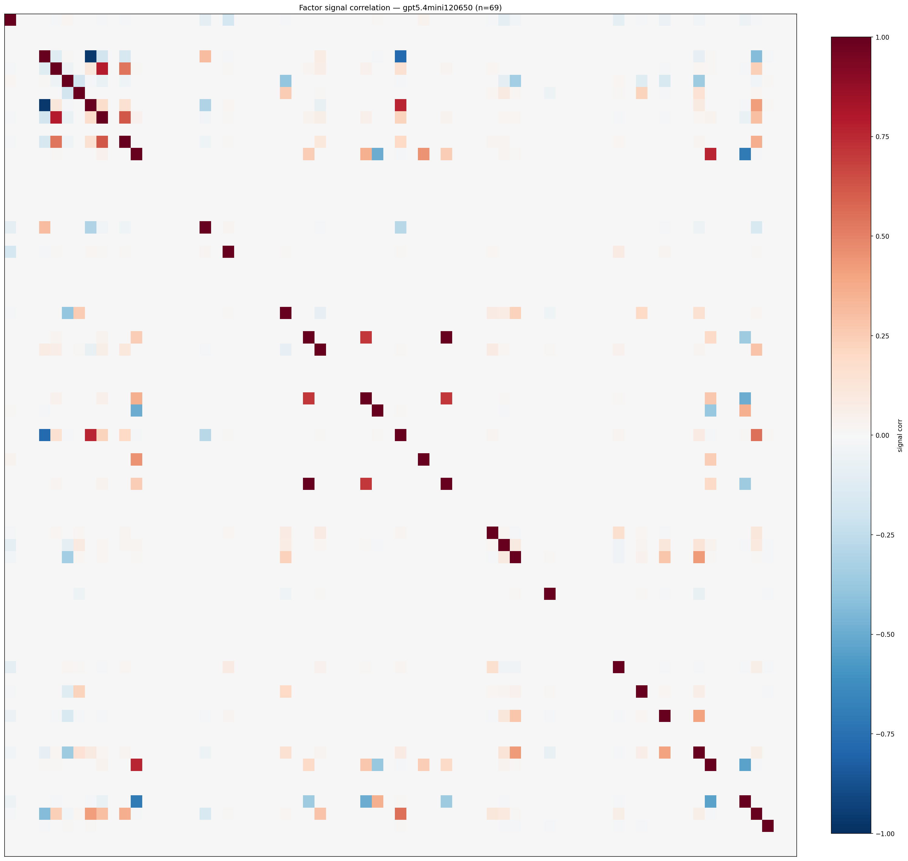

*Signal correlation matrix — gpt5.4mini120650*

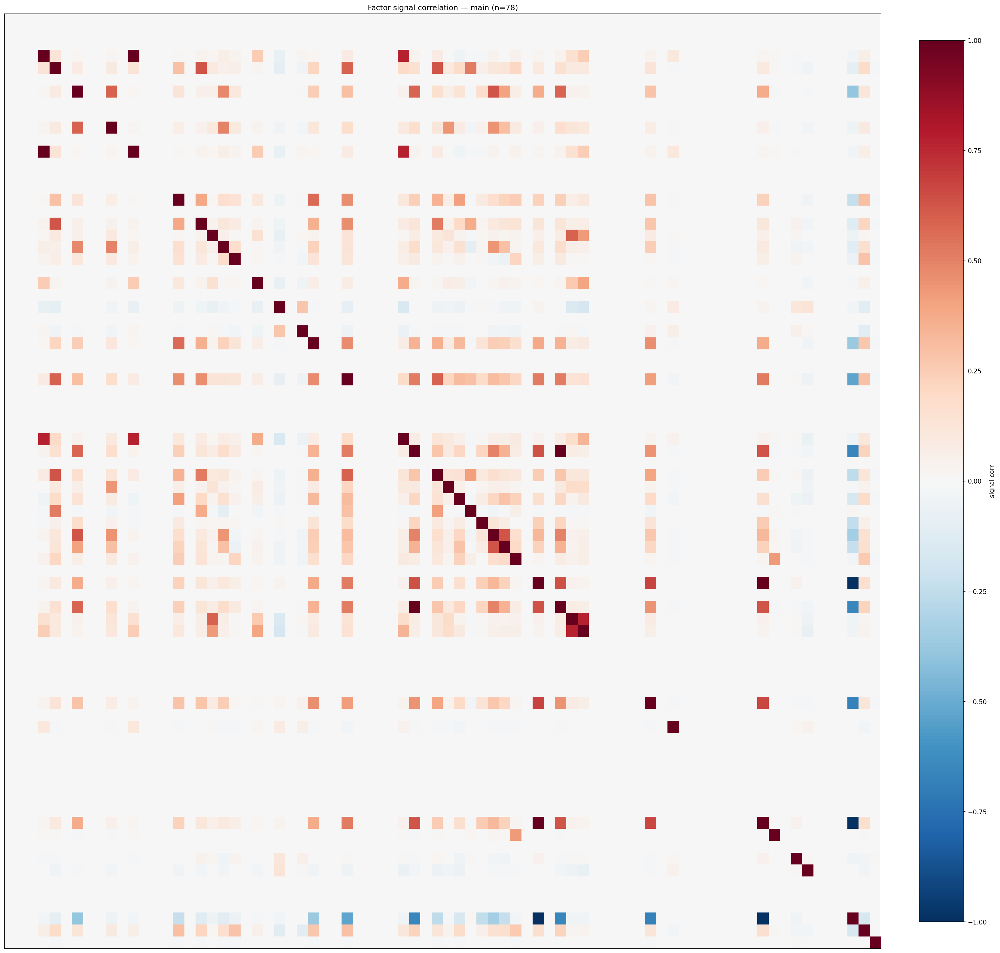

*Signal correlation matrix — main*

## 3. Deflation & model-based importance

`deflated_best_ic` haircuts each zoo's best |IC| for the number of factors tried (`ic_n_tested`) — a bigger zoo's best factor is more likely to be lucky. `lasso_n_nonzero` / `lasso_sparsity` show how many factors a sparse linear model actually keeps (model-view redundancy).

| prerun | best_ic | deflated_best_ic | deflated_best_t | ic_n_tested | ic_n_obs | lasso_n_nonzero | lasso_sparsity |
| --- | --- | --- | --- | --- | --- | --- | --- |
| gpt4omini120650 | 0.0156 | 0.0081 | 3.1147 | 64 | 147419 | 0 | 1.0 |
| gpt5.4mini120650 | 0.0153 | 0.0085 | 3.2553 | 31 | 147419 | 3 | 0.9565 |
| main | 0.0192 | 0.0121 | 4.6577 | 38 | 147419 | 0 | 1.0 |

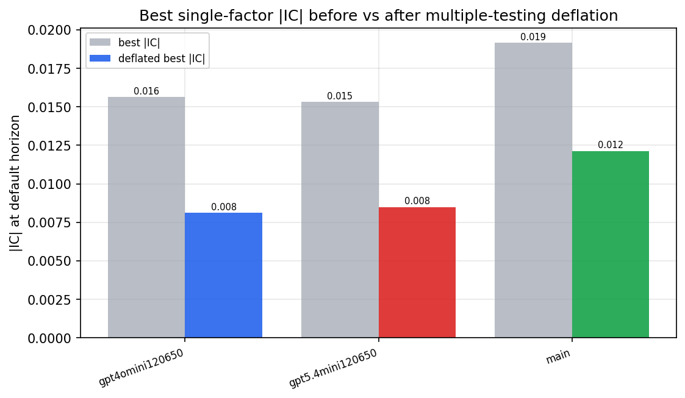

*Best |IC| before vs after multiple-testing deflation*

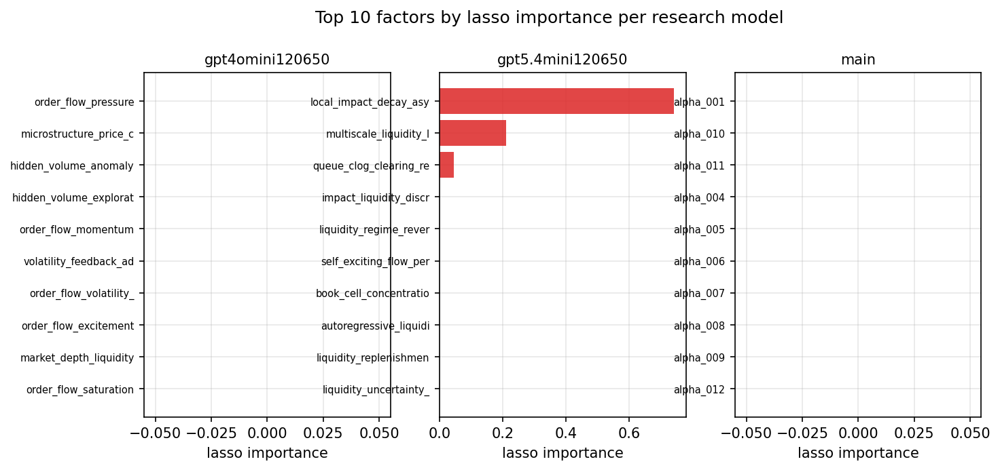

*Top factors by lasso importance per zoo*

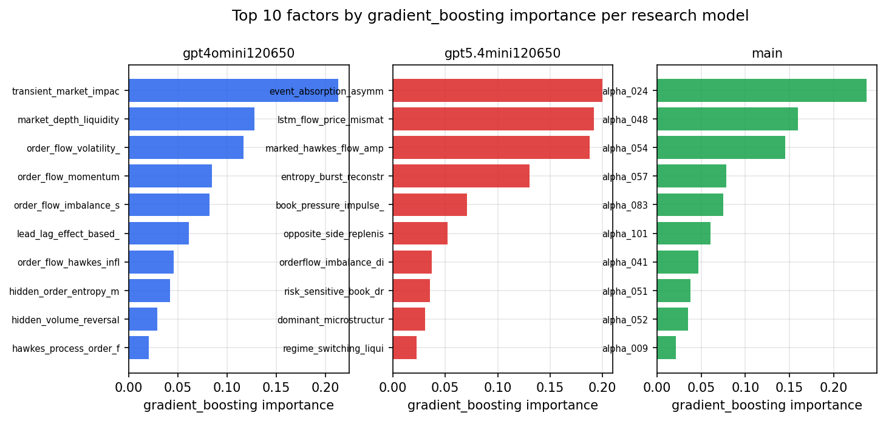

*Top factors by gradient_boosting importance per zoo*

## 4. ML-combined signal — per-underlying vectorised backtest

Each model combines a prerun's factors into ONE signal (fit `factors → forward return` on IS, predict per (bar, underlying)), then that combined signal is run through a simple vectorised backtest — `position(signal) × the underlying's own forward return` — on the held-out OOS tail (+ an equal-weight ensemble). No cross-sectional ranking.

> Config: position=**threshold** (t=1.0, z-score `expanding`), aggregation=**portfolio**, fit-standardise=**per_underlying**, horizon=6.

| prerun | model | n_factors_used | oos_ic | oos_sharpe | is_sharpe | oos_ann_return | oos_max_drawdown |
| --- | --- | --- | --- | --- | --- | --- | --- |
| gpt4omini120650 | linear_regression | 66 | 0.0034 | -4.5117 | 8.3778 | -0.5932 | -0.0604 |
| gpt4omini120650 | ridge | 66 | 0.0038 | -4.7013 | 8.4312 | -0.6188 | -0.0609 |
| gpt4omini120650 | lasso | 66 | nan | nan | nan | nan | nan |
| gpt4omini120650 | elastic_net | 66 | nan | nan | nan | nan | nan |
| gpt4omini120650 | random_forest | 66 | -0.0018 | -5.4162 | 11.8215 | -0.9821 | -0.0867 |
| gpt4omini120650 | gradient_boosting | 66 | 0.0055 | -8.182 | 12.3103 | -1.3328 | -0.1139 |
| gpt4omini120650 | xgboost | 66 | 0.0067 | -3.9322 | 13.4179 | -0.5836 | -0.0665 |
| gpt4omini120650 | lightgbm | 66 | 0.0089 | -0.7939 | 17.3779 | -0.1137 | -0.0535 |
| gpt4omini120650 | ensemble | 66 | 0.0081 | -6.3009 | 14.4331 | -1.1514 | -0.1008 |
| gpt5.4mini120650 | linear_regression | 69 | -0.007 | 0.9835 | 6.2201 | 0.2195 | -0.0449 |
| gpt5.4mini120650 | ridge | 69 | -0.0075 | 0.9423 | 5.4397 | 0.2088 | -0.0435 |
| gpt5.4mini120650 | lasso | 69 | -0.0329 | -3.7005 | 3.084 | -0.5649 | -0.0738 |
| gpt5.4mini120650 | elastic_net | 69 | -0.0326 | -3.7931 | 3.0976 | -0.5798 | -0.0733 |
| gpt5.4mini120650 | random_forest | 69 | -0.0151 | 0.8975 | 11.6123 | 0.1306 | -0.0265 |
| gpt5.4mini120650 | gradient_boosting | 69 | -0.0129 | 3.301 | 10.6058 | 0.2133 | -0.0088 |
| gpt5.4mini120650 | xgboost | 69 | -0.0149 | -0.0543 | 12.3214 | -0.0057 | -0.0268 |
| gpt5.4mini120650 | lightgbm | 69 | -0.0195 | -6.0544 | 15.0887 | -0.4505 | -0.0487 |
| gpt5.4mini120650 | ensemble | 69 | -0.0253 | -2.6894 | 11.5002 | -0.3781 | -0.0452 |
| main | linear_regression | 78 | 0.0037 | 2.4269 | 3.0425 | 0.2545 | -0.0183 |
| main | ridge | 78 | 0.0054 | 1.3241 | 3.9607 | 0.1741 | -0.0225 |
| main | lasso | 78 | nan | nan | nan | nan | nan |
| main | elastic_net | 78 | nan | nan | nan | nan | nan |
| main | random_forest | 78 | 0.0009 | -5.6798 | 8.745 | -0.5661 | -0.0473 |
| main | gradient_boosting | 78 | 0.0009 | -1.2504 | 6.303 | -0.0553 | -0.0137 |
| main | xgboost | 78 | 0.0037 | -8.3397 | 11.822 | -0.5314 | -0.0427 |
| main | lightgbm | 78 | 0.0039 | -8.5641 | 14.5781 | -0.5627 | -0.0454 |
| main | ensemble | 78 | 0.0035 | -3.5968 | 10.2389 | -0.2988 | -0.0261 |

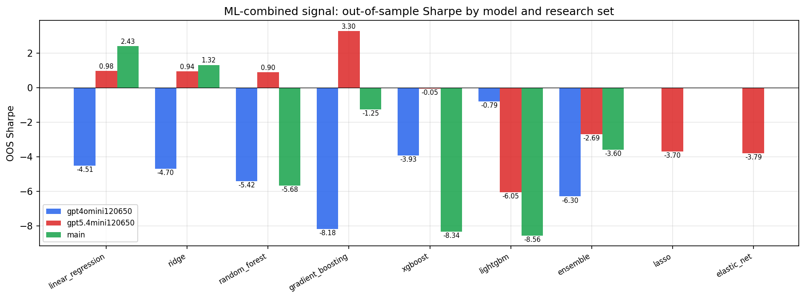

*ML-combined OOS Sharpe by model and research set*

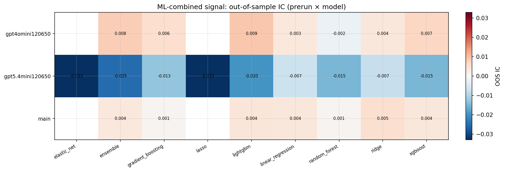

*ML-combined OOS IC (prerun × model)*

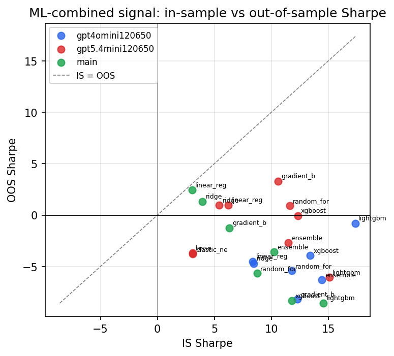

*IS vs OOS Sharpe (overfitting diagnostic)*

---
*Generated by `run_model_comparison.py`. Tables: `*.csv`; interactive: `comparison.ipynb`.*
