# Research-LLM factor comparison — `2026-06`

Comparing the **factor output of different research LLMs** on three axes (raw factor quality → factors as ML features → factors through the full agentic fund). The panel, IS/OOS split, horizon and model hyper-parameters are held identical across preruns — the *only* variable is the factor set.

## Preruns compared

| prerun | research_model | usable_factors | dropped_factors |
| --- | --- | --- | --- |
| gpt4omini120650 | gpt-4o-mini | 66 | 0 |
| gpt5.4mini120650 | gpt-5.4-mini | 69 | 0 |
| main | seed library | 78 | 10 |

> Dropped factors declare fields the current data doesn't have yet (e.g. fundamentals); they light up unchanged once that data is downloaded.

*Usable vs awaiting-data factors per research model*

## Key findings

- **Best ML-combined OOS Sharpe:** `main` with `linear_regression` (OOS Sharpe = -2.049).
- **Mean OOS Sharpe across models, by research set:** `main` = -7.392, `gpt5.4mini120650` = -8.576, `gpt4omini120650` = -16.173.
- **Highest mean single-factor |IC| (h=6):** `main` (mean |IC| = 0.0144).
- **Most diverse zoo (highest effective/raw factor ratio):** `gpt5.4mini120650` (eff 51.3 of 69, ratio 0.74).
- **Best selection-deflated single-factor |IC|:** `main` (deflated |IC| = 0.0245 from 38 factors tried).

## 1. Single-factor IC (raw factor quality)

Per-underlying time-series Spearman rank-IC of every researched factor, recomputed on the shared panel at horizons h=1, h=6, h=60. The per-underlying IC correlates each factor's value vector with the underlying's own forward-return vector (pooled across underlyings); the cross-sectional IC ranks across underlyings per timestamp.

| prerun | n_factors | mean_abs_ic_1 | mean_abs_ic_6 | mean_abs_ic_60 | mean_abs_icir_6 | best_factor_h6 | best_abs_ic_h6 |
| --- | --- | --- | --- | --- | --- | --- | --- |
| gpt4omini120650 | 66 | 0.0091 | 0.0098 | 0.008 | 0.3313 | order_flow_reversal_signal | 0.0279 |
| gpt5.4mini120650 | 69 | 0.0058 | 0.0069 | 0.0087 | 0.2865 | lstm_flow_price_mismatch | 0.0321 |
| main | 78 | 0.0155 | 0.0144 | 0.0075 | 0.5348 | alpha_032 | 0.0331 |

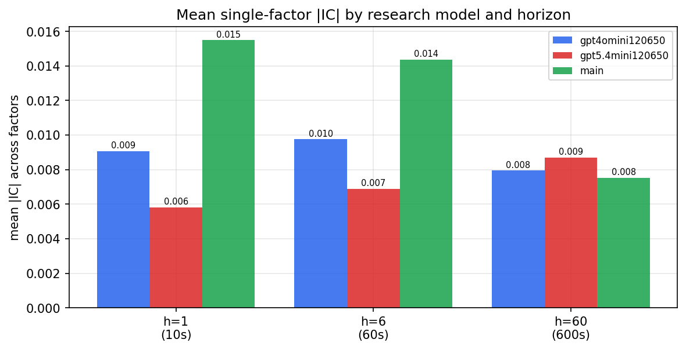

*Mean |IC| by research model and horizon*

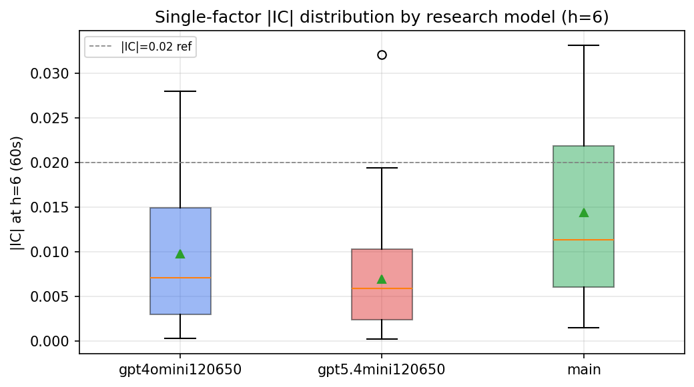

*Per-factor |IC| distribution by research model*

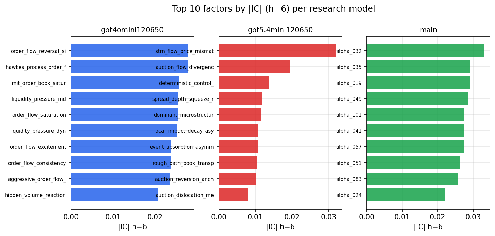

*Top factors by |IC| per research model*

## 2. Factor diversity & redundancy

Pairwise correlation of each zoo's *signals*. `eff_n_factors` is the effective number of independent factors (participation ratio of the correlation eigenvalues); `eff_ratio` and `redundancy` summarise how much unique information the zoo holds vs. how much is duplicated; `n_clusters` groups factors at |corr| ≥ 0.7.

| prerun | n_factors | eff_n_factors | eff_ratio | mean_abs_corr | n_clusters | redundancy |
| --- | --- | --- | --- | --- | --- | --- |
| gpt4omini120650 | 66 | 29.6559 | 0.4493 | 0.0476 | 54 | 0.5507 |
| gpt5.4mini120650 | 69 | 51.3043 | 0.7435 | 0.0123 | 63 | 0.2565 |
| main | 78 | 44.6912 | 0.573 | 0.0275 | 72 | 0.427 |

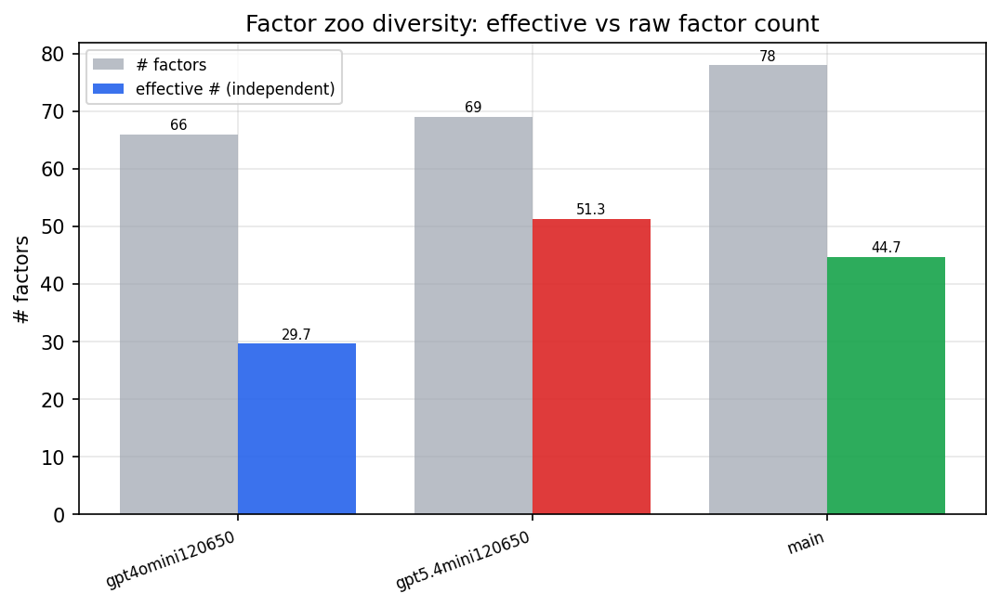

*Effective vs raw factor count per research model*

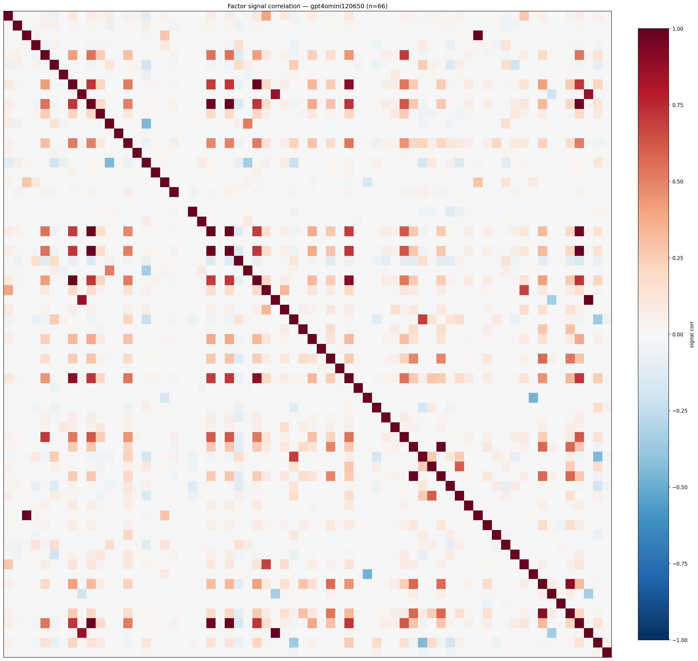

*Signal correlation matrix — gpt4omini120650*

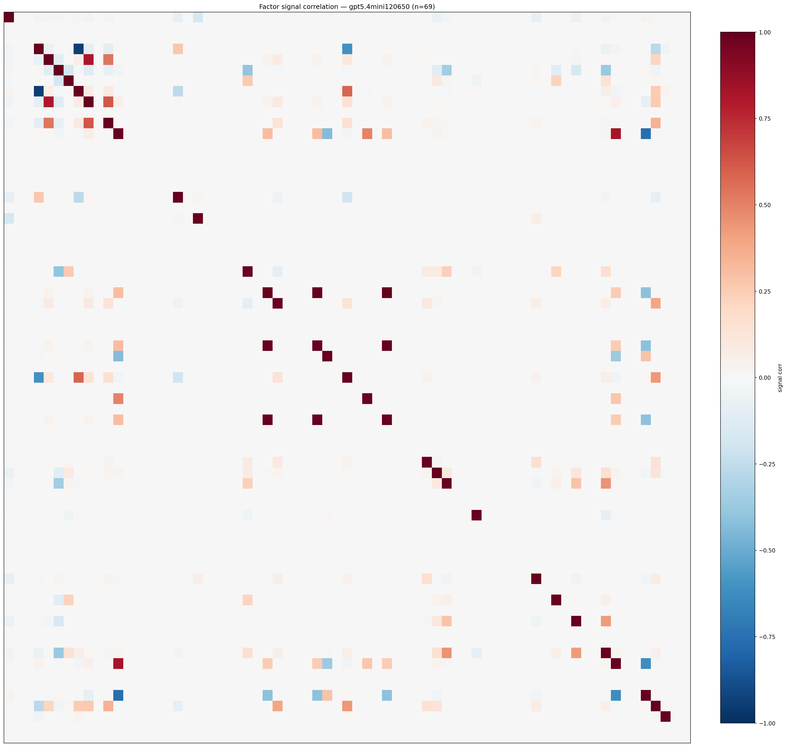

*Signal correlation matrix — gpt5.4mini120650*

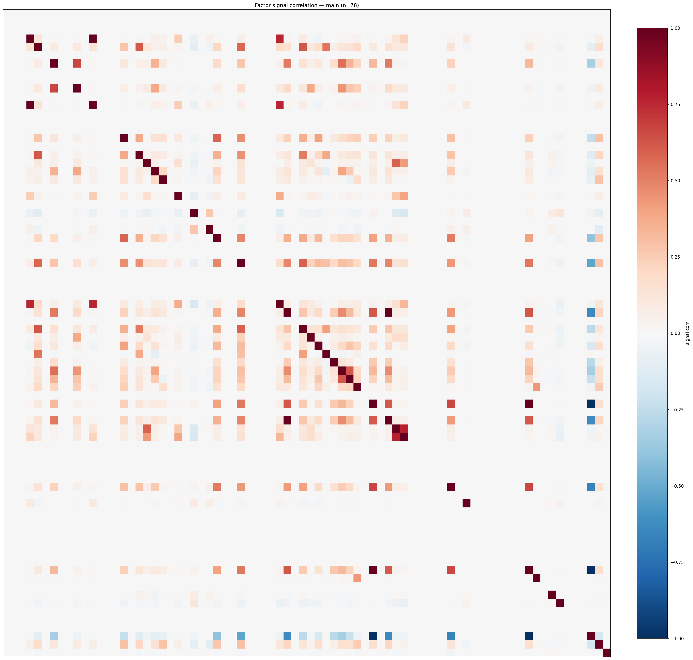

*Signal correlation matrix — main*

## 3. Deflation & model-based importance

`deflated_best_ic` haircuts each zoo's best |IC| for the number of factors tried (`ic_n_tested`) — a bigger zoo's best factor is more likely to be lucky. `lasso_n_nonzero` / `lasso_sparsity` show how many factors a sparse linear model actually keeps (model-view redundancy).

| prerun | best_ic | deflated_best_ic | deflated_best_t | ic_n_tested | ic_n_obs | lasso_n_nonzero | lasso_sparsity |
| --- | --- | --- | --- | --- | --- | --- | --- |
| gpt4omini120650 | 0.0279 | 0.0187 | 5.8767 | 64 | 98279 | 0 | 1.0 |
| gpt5.4mini120650 | 0.0321 | 0.0237 | 7.4414 | 31 | 98279 | 0 | 1.0 |
| main | 0.0331 | 0.0245 | 7.6748 | 38 | 98279 | 1 | 0.9872 |

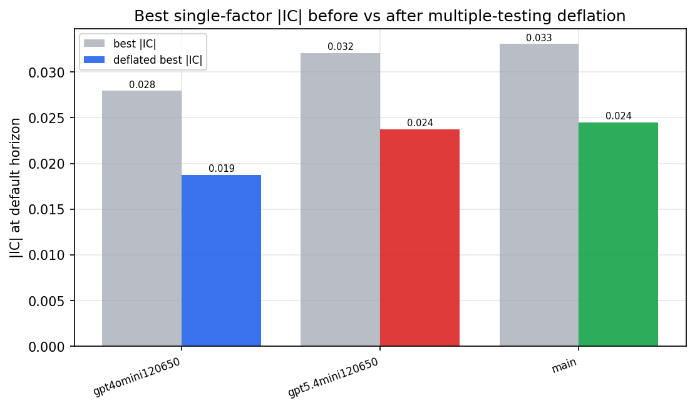

*Best |IC| before vs after multiple-testing deflation*

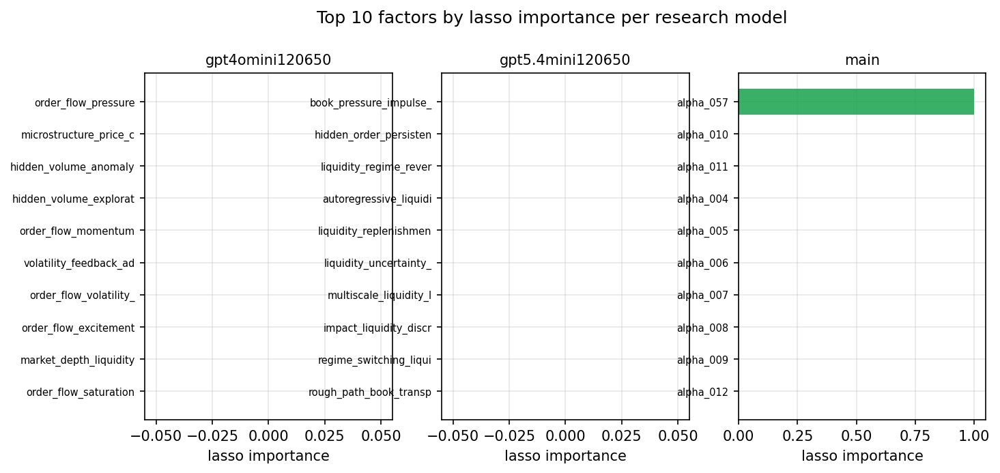

*Top factors by lasso importance per zoo*

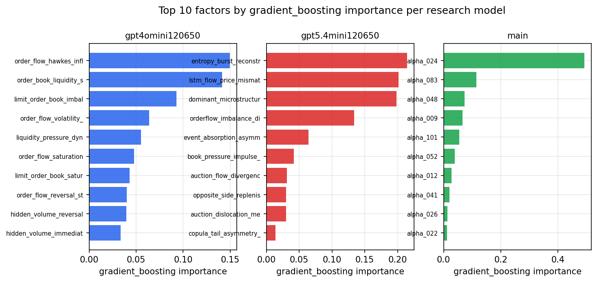

*Top factors by gradient_boosting importance per zoo*

## 4. ML-combined signal — per-underlying vectorised backtest

Each model combines a prerun's factors into ONE signal (fit `factors → forward return` on IS, predict per (bar, underlying)), then that combined signal is run through a simple vectorised backtest — `position(signal) × the underlying's own forward return` — on the held-out OOS tail (+ an equal-weight ensemble). No cross-sectional ranking.

> Config: position=**threshold** (t=1.0, z-score `expanding`), aggregation=**portfolio**, fit-standardise=**per_underlying**, horizon=6.

| prerun | model | n_factors_used | oos_ic | oos_sharpe | is_sharpe | oos_ann_return | oos_max_drawdown |
| --- | --- | --- | --- | --- | --- | --- | --- |
| gpt4omini120650 | linear_regression | 66 | -0.0733 | -21.0441 | 5.3075 | -3.392 | -0.0174 |
| gpt4omini120650 | ridge | 66 | -0.0629 | -26.4927 | 5.9981 | -4.4845 | -0.0215 |
| gpt4omini120650 | lasso | 66 | nan | nan | nan | nan | nan |
| gpt4omini120650 | elastic_net | 66 | nan | nan | nan | nan | nan |
| gpt4omini120650 | random_forest | 66 | -0.0023 | -11.65 | 10.6577 | -1.925 | -0.0134 |
| gpt4omini120650 | gradient_boosting | 66 | -0.0091 | -8.2995 | 7.4403 | -0.5183 | -0.0049 |
| gpt4omini120650 | xgboost | 66 | -0.0058 | -19.4821 | 9.9577 | -2.0969 | -0.0111 |
| gpt4omini120650 | lightgbm | 66 | -0.0208 | -10.2582 | 12.7123 | -1.3796 | -0.0102 |
| gpt4omini120650 | ensemble | 66 | -0.0663 | -15.9834 | 11.8287 | -2.223 | -0.0147 |
| gpt5.4mini120650 | linear_regression | 69 | -0.0354 | -4.9421 | 7.5007 | -0.6991 | -0.0097 |
| gpt5.4mini120650 | ridge | 69 | -0.0309 | -5.8249 | 6.6773 | -0.8155 | -0.0084 |
| gpt5.4mini120650 | lasso | 69 | nan | nan | nan | nan | nan |
| gpt5.4mini120650 | elastic_net | 69 | nan | nan | nan | nan | nan |
| gpt5.4mini120650 | random_forest | 69 | -0.0286 | -16.7963 | 8.7131 | -2.0913 | -0.0165 |
| gpt5.4mini120650 | gradient_boosting | 69 | -0.0401 | -8.0338 | 6.8953 | -0.5056 | -0.0041 |
| gpt5.4mini120650 | xgboost | 69 | -0.0361 | -5.5386 | 7.1848 | -0.4283 | -0.0055 |
| gpt5.4mini120650 | lightgbm | 69 | -0.0257 | -6.6654 | 9.646 | -0.5146 | -0.0051 |
| gpt5.4mini120650 | ensemble | 69 | -0.0453 | -12.2294 | 4.8164 | -0.0723 | -0.0004 |
| main | linear_regression | 78 | -0.0041 | -2.0485 | 6.1337 | -0.3584 | -0.016 |
| main | ridge | 78 | -0.002 | -4.3402 | 6.0355 | -0.7948 | -0.0166 |
| main | lasso | 78 | nan | nan | nan | nan | nan |
| main | elastic_net | 78 | nan | nan | nan | nan | nan |
| main | random_forest | 78 | 0.0463 | -3.6501 | 5.6432 | -0.476 | -0.0107 |
| main | gradient_boosting | 78 | 0.0227 | -5.3803 | 4.106 | -0.5639 | -0.0086 |
| main | xgboost | 78 | 0.0752 | -11.3117 | 5.4327 | -0.7197 | -0.0039 |
| main | lightgbm | 78 | 0.0434 | -22.0091 | 10.172 | -1.6947 | -0.0098 |
| main | ensemble | 78 | -0.0103 | -3.0046 | 7.4016 | -0.3805 | -0.0107 |

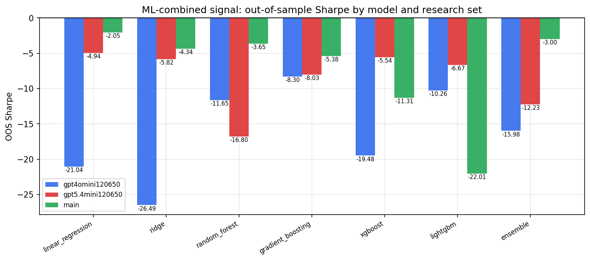

*ML-combined OOS Sharpe by model and research set*

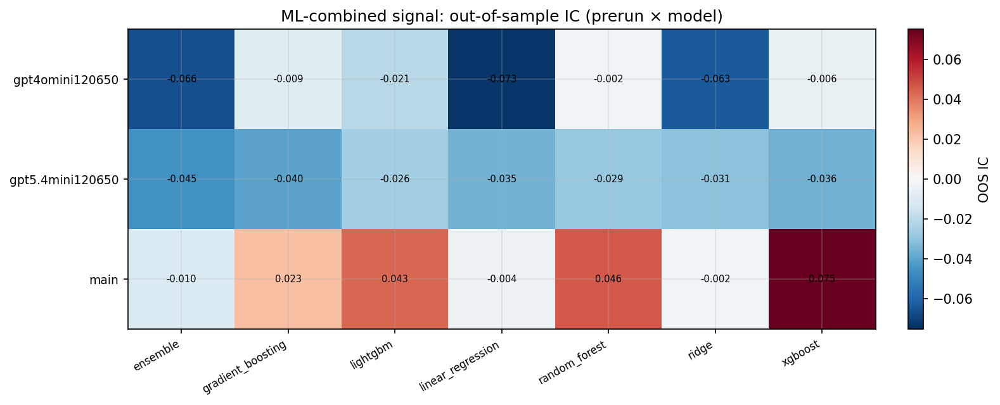

*ML-combined OOS IC (prerun × model)*

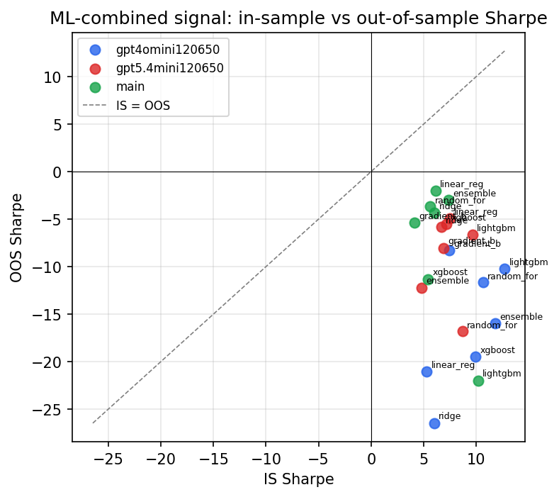

*IS vs OOS Sharpe (overfitting diagnostic)*

---
*Generated by `run_model_comparison.py`. Tables: `*.csv`; interactive: `comparison.ipynb`.*
