# Research-LLM factor comparison — `verify_analytics`

Comparing the **factor output of different research LLMs** on three axes (raw factor quality → factors as ML features → factors through the full agentic fund). The panel, IS/OOS split, horizon and model hyper-parameters are held identical across preruns — the *only* variable is the factor set.

## Preruns compared

| prerun | research_model | usable_factors | dropped_factors |
| --- | --- | --- | --- |
| gpt4omini120650 | gpt-4o-mini | 66 | 0 |
| gpt5.4mini120650 | gpt-5.4-mini | 69 | 0 |
| main | ? | 109 | 0 |

> Dropped factors declare fields the current data doesn't have yet (e.g. fundamentals); they light up unchanged once that data is downloaded.

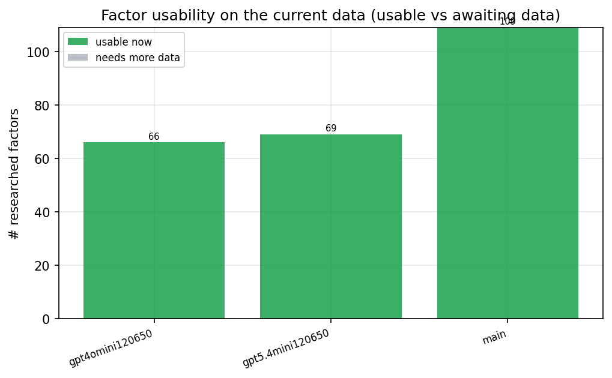

*Usable vs awaiting-data factors per research model*

## Key findings

- **Best brute-force OOS Sharpe:** `gpt4omini120650` with `ridge` (OOS Sharpe = 0.707).
- **Mean OOS Sharpe across models, by research set:** `gpt4omini120650` = 0.707, `main` = -0.365, `gpt5.4mini120650` = -0.640.
- **Highest mean single-factor |IC| (h=6):** `gpt5.4mini120650` (mean |IC| = 0.0204).
- **Most diverse zoo (highest effective/raw factor ratio):** `gpt4omini120650` (eff 24.8 of 66, ratio 0.38).
- **Best selection-deflated single-factor |IC|:** `main` (deflated |IC| = 0.3440 from 100 factors tried).

## 1. Single-factor IC (raw factor quality)

Cross-sectional Spearman rank-IC of every researched factor, recomputed on the shared panel at horizons h=1, h=6, h=60.

| prerun | n_factors | mean_abs_ic_1 | mean_abs_ic_6 | mean_abs_ic_60 | mean_abs_icir_6 | best_factor_h6 | best_abs_ic_h6 |
| --- | --- | --- | --- | --- | --- | --- | --- |
| gpt4omini120650 | 66 | 0.0086 | 0.0128 | 0.026 | 0.0347 | order_flow_momentum_ratio | 0.055 |
| gpt5.4mini120650 | 69 | 0.0111 | 0.0204 | 0.042 | 0.0574 | liquidity_quality_gap | 0.0603 |
| main | 109 | 0.0144 | 0.0204 | 0.035 | 0.0545 | hidden_volume_effective_spread_ratio | 0.3922 |

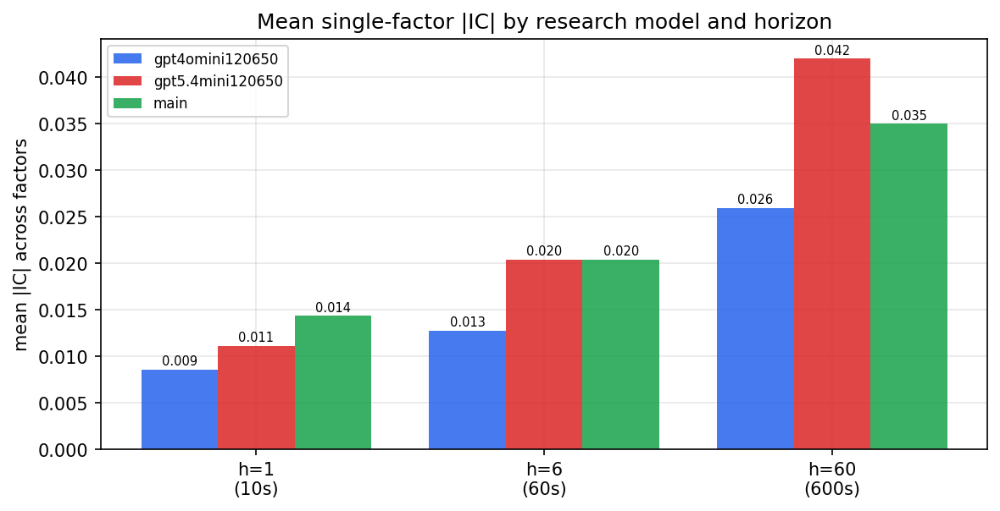

*Mean |IC| by research model and horizon*

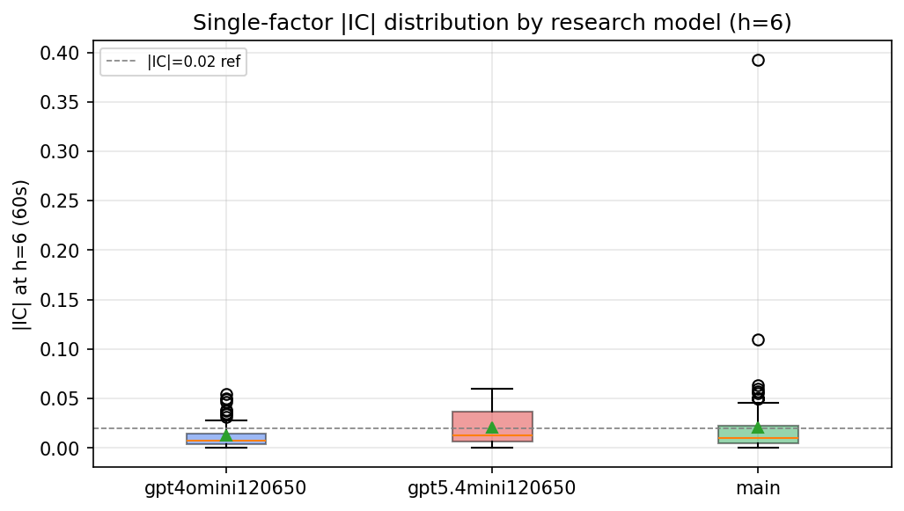

*Per-factor |IC| distribution by research model*

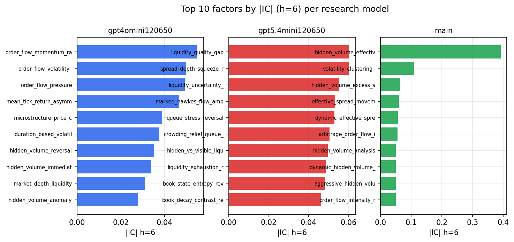

*Top factors by |IC| per research model*

## 2. Factor diversity & redundancy

Pairwise correlation of each zoo's *signals*. `eff_n_factors` is the effective number of independent factors (participation ratio of the correlation eigenvalues); `eff_ratio` and `redundancy` summarise how much unique information the zoo holds vs. how much is duplicated; `n_clusters` groups factors at |corr| ≥ 0.7.

| prerun | n_factors | eff_n_factors | eff_ratio | mean_abs_corr | n_clusters | redundancy |
| --- | --- | --- | --- | --- | --- | --- |
| gpt4omini120650 | 66 | 24.8467 | 0.3765 | 0.0703 | 54 | 0.6235 |
| gpt5.4mini120650 | 69 | 23.3912 | 0.339 | 0.0928 | 57 | 0.661 |
| main | 109 | 39.8306 | 0.3654 | 0.0526 | 88 | 0.6346 |

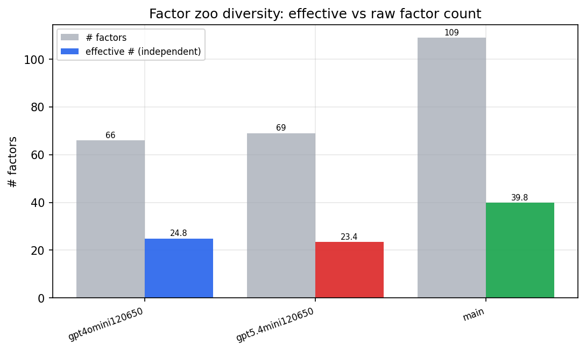

*Effective vs raw factor count per research model*

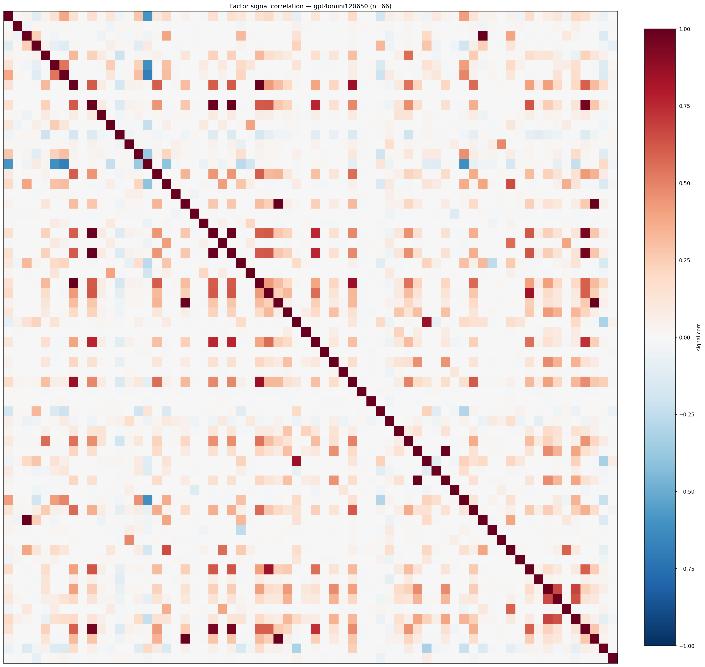

*Signal correlation matrix — gpt4omini120650*

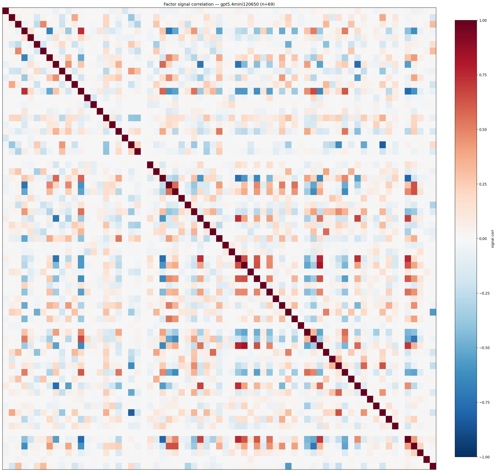

*Signal correlation matrix — gpt5.4mini120650*

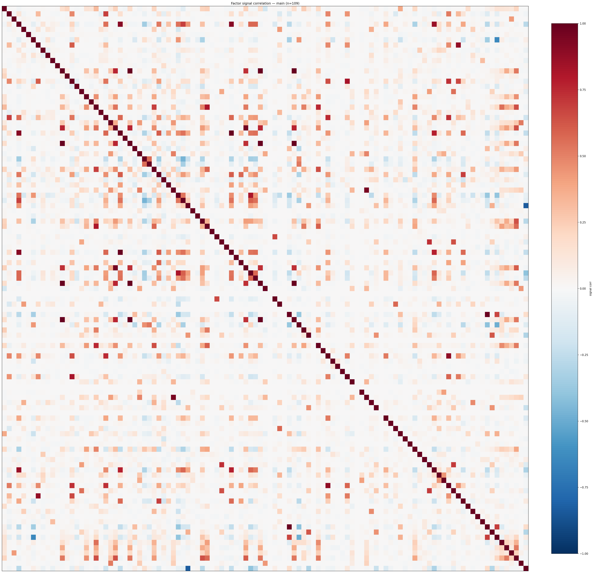

*Signal correlation matrix — main*

## 3. Deflation & model-based importance

`deflated_best_ic` haircuts each zoo's best |IC| for the number of factors tried (`ic_n_tested`) — a bigger zoo's best factor is more likely to be lucky. `lasso_n_nonzero` / `lasso_sparsity` show how many factors a sparse linear model actually keeps (model-view redundancy).

| prerun | best_ic | deflated_best_ic | deflated_best_t | ic_n_tested | ic_n_obs | lasso_n_nonzero | lasso_sparsity |
| --- | --- | --- | --- | --- | --- | --- | --- |
| gpt4omini120650 | 0.055 | 0.009 | 0.566 | 66 | 3955 | 4 | 0.9394 |
| gpt5.4mini120650 | 0.0603 | 0.0143 | 0.8979 | 66 | 3955 | 0 | 1.0 |
| main | 0.3922 | 0.344 | 21.6311 | 100 | 3955 | 0 | 1.0 |

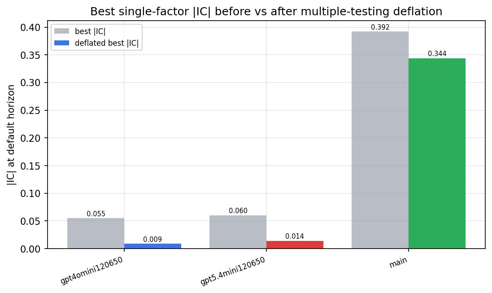

*Best |IC| before vs after multiple-testing deflation*

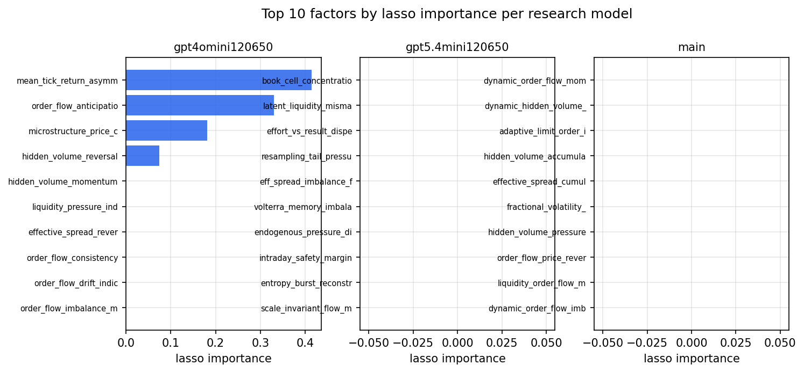

*Top factors by lasso importance per zoo*

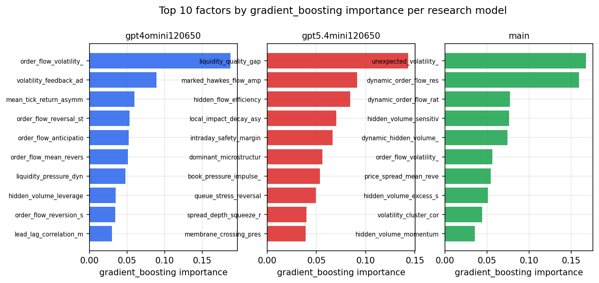

*Top factors by gradient_boosting importance per zoo*

## 4. Brute-force ML (factors as raw features, no agents)

Each prerun's factors fed straight into the model catalog + an equal-weight ensemble; fit on IS, evaluated on the held-out OOS tail.

| prerun | model | n_factors_used | oos_ic | oos_sharpe | is_sharpe | oos_ann_return | oos_max_drawdown |
| --- | --- | --- | --- | --- | --- | --- | --- |
| gpt4omini120650 | ridge | 66 | 0.0336 | 0.7067 | 1.7824 | 0.086 | -0.0789 |
| gpt5.4mini120650 | ridge | 69 | 0.0223 | -0.6401 | 0.7555 | -0.0829 | -0.1018 |
| main | ridge | 109 | 0.0097 | -0.3653 | 2.0679 | -0.0541 | -0.1014 |

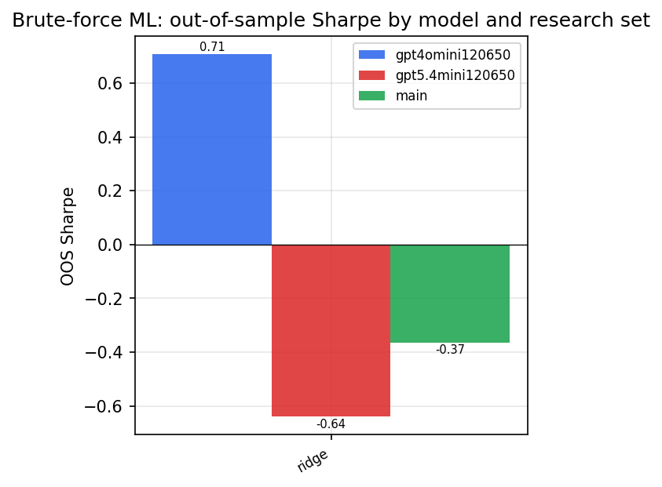

*Brute-force OOS Sharpe by model and research set*

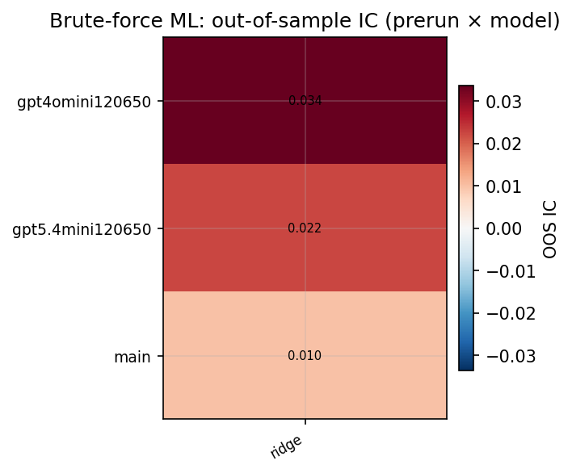

*Brute-force OOS IC (prerun × model)*

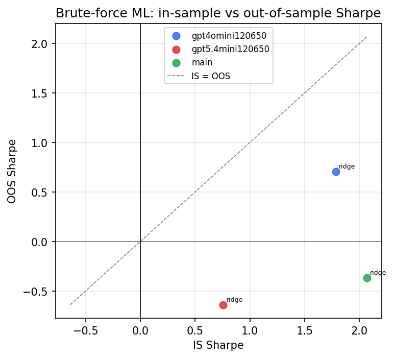

*IS vs OOS Sharpe (overfitting diagnostic)*

---
*Generated by `run_model_comparison.py`. Tables: `*.csv`; interactive: `comparison.ipynb`.*
