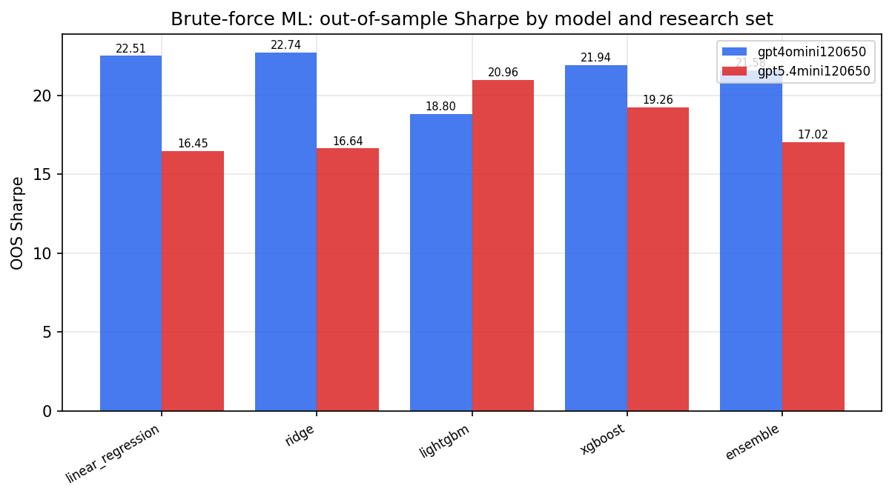
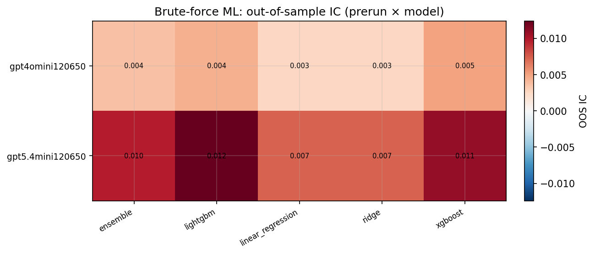
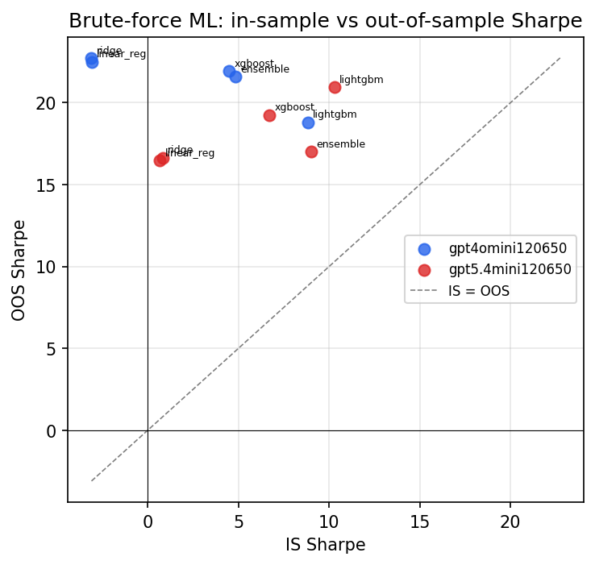

# Research-LLM factor comparison — `verify_fix`

Comparing the **factor output of different research LLMs** on three axes (raw factor quality → factors as ML features → factors through the full agentic fund). The panel, IS/OOS split, horizon and model hyper-parameters are held identical across preruns — the *only* variable is the factor set.

## Preruns compared

| prerun | research_model | usable_factors | dropped_factors |
| --- | --- | --- | --- |
| gpt4omini120650 | gpt-4o-mini | 66 | 0 |
| gpt5.4mini120650 | gpt-5.4-mini | 69 | 0 |

> Dropped factors declare fields the current data doesn't have yet (e.g. fundamentals); they light up unchanged once that data is downloaded.

*Usable vs awaiting-data factors per research model*

## Key findings

- **Best brute-force OOS Sharpe:** `gpt4omini120650` with `ridge` (OOS Sharpe = 22.739).
- **Mean OOS Sharpe across models, by research set:** `gpt4omini120650` = 21.514, `gpt5.4mini120650` = 18.065.
- **Highest mean single-factor |IC| (h=6):** `gpt4omini120650` (mean |IC| = 0.0341).

## 1. Single-factor IC (raw factor quality)

Cross-sectional Spearman rank-IC of every researched factor, recomputed on the shared panel at horizons h=1, h=6, h=60.

| prerun | n_factors | mean_abs_ic_1 | mean_abs_ic_6 | mean_abs_ic_60 | mean_abs_icir_6 | best_factor_h6 | best_abs_ic_h6 |
| --- | --- | --- | --- | --- | --- | --- | --- |
| gpt4omini120650 | 66 | 0.0802 | 0.0341 | 0.0104 | 0.1988 | order_flow_imbalance_strength | 0.1738 |
| gpt5.4mini120650 | 69 | 0.0736 | 0.0313 | 0.0104 | 0.1859 | orderflow_liquidity_elasticity | 0.1524 |

*Mean |IC| by research model and horizon*

*Per-factor |IC| distribution by research model*

*Top factors by |IC| per research model*

## 2. Brute-force ML (factors as raw features, no agents)

Each prerun's factors fed straight into the model catalog + an equal-weight ensemble; fit on IS, evaluated on the held-out OOS tail.

| prerun | model | n_factors_used | oos_ic | oos_sharpe | is_sharpe | oos_ann_return | oos_max_drawdown |
| --- | --- | --- | --- | --- | --- | --- | --- |
| gpt4omini120650 | linear_regression | 66 | 0.0026 | 22.5071 | -3.0902 | 2.1111 | -0.0059 |
| gpt4omini120650 | ridge | 66 | 0.0026 | 22.7386 | -3.1134 | 2.1329 | -0.006 |
| gpt4omini120650 | lightgbm | 66 | 0.0044 | 18.8011 | 8.8134 | 1.8577 | -0.0085 |
| gpt4omini120650 | xgboost | 66 | 0.0049 | 21.9416 | 4.4681 | 2.1021 | -0.0066 |
| gpt4omini120650 | ensemble | 66 | 0.0036 | 21.5822 | 4.8482 | 2.071 | -0.0072 |
| gpt5.4mini120650 | linear_regression | 69 | 0.0073 | 16.453 | 0.6558 | 1.309 | -0.0081 |
| gpt5.4mini120650 | ridge | 69 | 0.0073 | 16.636 | 0.8214 | 1.3208 | -0.0082 |
| gpt5.4mini120650 | lightgbm | 69 | 0.0124 | 20.96 | 10.2925 | 1.7783 | -0.0064 |
| gpt5.4mini120650 | xgboost | 69 | 0.0109 | 19.257 | 6.6996 | 1.737 | -0.0079 |
| gpt5.4mini120650 | ensemble | 69 | 0.0097 | 17.021 | 9.029 | 1.3924 | -0.0079 |

*Brute-force OOS Sharpe by model and research set*

*Brute-force OOS IC (prerun × model)*

*IS vs OOS Sharpe (overfitting diagnostic)*

---
*Generated by `run_model_comparison.py`. Tables: `*.csv`; interactive: `comparison.ipynb`.*
